# The Core Problem: Buffering Data Without Breaking the Bank

Imagine you're building a music streaming service. Audio data flows from your servers at a steady rate of 1,411 kilobits per second (CD quality), but network conditions are unpredictable. Sometimes packets arrive in bursts, sometimes there are brief interruptions. How do you smooth out these irregularities to provide uninterrupted playback without using unlimited memory?

This is the fundamental challenge that ring buffers solve: **how to buffer data between a producer and consumer when they operate at different, variable speeds using only a fixed amount of memory.**

## The Producer-Consumer Mismatch

In most real-world systems, data producers and consumers rarely operate in perfect synchronization. This creates a timing problem that can lead to system failures.


### Real-World Timing Mismatches

**Network Streaming**: Bursty network delivery vs. steady audio playback


**Sensor Data Collection**: Individual readings vs. batch processing
```
Temperature sensor: [reading] [reading] [reading] (every 100ms)
Data processor:     [processing batch of 10 readings] (every 1 second)
```

**Log Processing**: Unpredictable application activity vs. steady analysis
```
Application logs: [error burst] [quiet period] [normal activity]
Log analyzer:     [steady processing rate]
```

The mismatch creates two fundamental problems:

1. **Buffer overflow**: When the producer is faster than the consumer, data accumulates
2. **Buffer underflow**: When the consumer is faster than the producer, it starves for data

## The Naive Approach: Unlimited Buffering

The simplest solution is to use a growable buffer:

```rust
struct NaiveBuffer<T> {
    data: Vec<T>,
}

impl<T> NaiveBuffer<T> {
    fn push(&mut self, item: T) {
        self.data.push(item);  // Always succeeds, but uses more memory
    }
    
    fn pop(&mut self) -> Option<T> {
        if self.data.is_empty() {
            None
        } else {
            Some(self.data.remove(0))  // Expensive: O(n) operation
        }
    }
}
```

### Why This Fails in Practice

**Memory Explosion**: If the producer temporarily outpaces the consumer, memory usage grows without bound:


**Performance Degradation**: As the buffer grows, operations become slower:

```mermaid
graph TD
    A[Buffer Size Increases] --> B[push: Memory Reallocations]
    A --> C[pop: O(n) Array Shifting]
    B --> D[Unpredictable Latency]
    C --> D
    D --> E[System Becomes Unresponsive]
    
    style E fill:#ff6b6b
```

- `push()` may trigger expensive memory reallocations
- `pop()` requires shifting all remaining elements (O(n) complexity)

**Unpredictable Behavior**: Memory usage depends on timing patterns, making system behavior impossible to predict or test reliably.

## Real-World Examples of the Problem

### Audio Streaming Disaster
Spotify's early architecture had issues with unlimited buffering. When users had slow internet connections, the audio buffer would grow to consume hundreds of megabytes, eventually crashing mobile devices with limited RAM.

### IoT Sensor Overload
A smart city project collecting traffic data from thousands of sensors experienced memory leaks when network outages caused sensor readings to accumulate in unlimited buffers. Servers would run out of memory and crash, losing hours of valuable data.

### High-Frequency Trading Meltdown
A trading system using unlimited message buffers during market volatility saw memory usage spike from 1GB to 64GB in minutes, causing the entire trading platform to freeze during critical market hours.

## The Ring Buffer Insight

Ring buffers solve these problems with a radical insight: **Instead of growing the buffer when it's full, overwrite the oldest data.**

This transforms the problem from:
- "How do we store all the data?" (impossible with limited memory)

To:
- "How do we store the most recent data?" (solvable with fixed memory)

### The Overwriting Trade-off

Ring buffers make an explicit trade-off:
- ✅ **Predictable memory usage**: Never exceeds the buffer size
- ✅ **Consistent performance**: All operations are O(1)
- ✅ **Graceful degradation**: System stays responsive under load
- ❌ **Data loss**: Old data is discarded when the buffer fills

This trade-off is perfect for many real-world scenarios:

**Audio/Video Streaming**: Losing old frames/samples is better than stuttering or crashing
**Sensor Monitoring**: Recent readings are more valuable than historical ones
**Log Processing**: Recent log entries are more actionable than old ones
**Network Packet Handling**: Drop old packets rather than delay new ones

## The Fundamental Operations

Ring buffers support two core operations:

```
write(data): Add new data to the buffer
  - If buffer has space: store the data
  - If buffer is full: overwrite the oldest data

read(): Remove and return the oldest data from the buffer
  - If buffer has data: return the oldest item
  - If buffer is empty: return "no data available"
```

These operations maintain **FIFO (First In, First Out)** ordering while respecting the fixed memory constraint.

## Memory Layout Insight

The key innovation of ring buffers is treating linear memory as circular, eliminating expensive data movements.

### Traditional Linear Queue Problems

```mermaid
graph TD
    A[Linear Queue] --> B["[data1][data2][data3][    ][    ][    ]<br/>tail=0, head=3"]
    B --> C["After read: [data2][data3][    ][    ][    ][    ]<br/>tail=0, head=2"]
    C --> D["⚠️ Must shift all elements left<br/>O(n) operation for every read"]
    
    style D fill:#ffe066
```



### Ring Buffer Circular Approach


**Key Benefits:**
- **No data shifting**: Pointers move, data stays in place
- **O(1) operations**: Constant time for all operations
- **Memory efficiency**: Fixed allocation, no reallocations

Traditional queues:
```
Linear Queue: [data1][data2][data3][    ][    ][    ]
              ^                    ^
              tail (read)          head (write)

After read:   [data2][data3][    ][    ][    ][    ]  ← Expensive shift!
              ^                ^
              tail             head
```

Ring buffers:
```
Ring Buffer:  [data1][data2][data3][    ][    ][    ]
              ^                    ^
              tail (read)          head (write)

After wrapping: [new4][data2][data3][new5][new6][    ]  ← No shifting!
                       ^                           ^
                       tail                        head
```

## The Synchronization Challenge

Ring buffers introduce a new challenge: **How do multiple threads safely access the same circular buffer?**

Consider what happens when a producer and consumer access the buffer simultaneously:

```
Thread 1 (Producer): Writing to position 5
Thread 2 (Consumer): Reading from position 2

What if both threads modify the head/tail pointers at the same time?
```

This synchronization challenge has multiple solutions:
- **Locks**: Simple but can cause blocking
- **Atomic operations**: Lock-free but complex
- **Single producer/single consumer**: Simplified assumptions

## Performance Characteristics

Ring buffers provide exceptional performance characteristics:

| Operation | Time Complexity | Space Complexity |
|-----------|----------------|------------------|
| Write     | O(1)           | O(1)             |
| Read      | O(1)           | O(1)             |
| Peek      | O(1)           | O(1)             |
| Initialize| O(1)           | O(n)             |

This predictable performance makes ring buffers ideal for real-time systems where timing guarantees are critical.

## When Ring Buffers Are The Wrong Choice

Ring buffers aren't always the answer:

**Database Transaction Logs**: You can't lose transaction records
**Financial Audit Trails**: Regulatory requirements forbid data loss
**Scientific Data Collection**: Every measurement may be valuable
**File Transfer**: Users expect complete, uncorrupted files

In these cases, the system should either:
- Apply backpressure (slow down the producer)
- Use persistent storage (write overflow to disk)
- Reject new data (fail fast rather than lose old data)

## The Ring Buffer Promise

Ring buffers make a specific promise: **bounded memory usage with predictable performance, at the cost of potentially losing old data when producers outpace consumers.**

This promise is exactly what many high-performance systems need. By embracing the constraint of fixed memory and the reality of data loss, ring buffers enable systems that are both fast and reliable.

In the next section, we'll explore the architectural philosophy that makes this promise practical and the specific design decisions that make ring buffers so effective.