# The Guiding Philosophy: Embrace Constraints, Achieve Predictability

Ring buffers embody a powerful design philosophy: **When you can't have everything, optimize for what matters most.** Instead of trying to accommodate unlimited data, ring buffers make deliberate trade-offs that enable exceptional performance and reliability.

## The Mental Model: The Circular Conveyor Belt

Imagine a circular conveyor belt in a factory:

```mermaid
graph LR
    A["🎁 Item 1<br/>(oldest)"] --> B["📦 Item 2"]
    B --> C["📋 Item 3"]
    C --> D["⚙️ Item 4<br/>(newest)"]
    D --> E["[ empty ]"]
    E --> F["[ empty ]"]
    F --> A
    
    G["👈 tail<br/>(read here)"] -.-> A
    H["👆 head<br/>(write here)"] -.-> E
    
    style A fill:#ffeb3b
    style E fill:#4caf50
```



**Key Properties:**
- **Fixed Size**: The belt has a predetermined number of positions
- **Continuous Motion**: Items flow in one direction (FIFO - First In, First Out)
- **Overwriting**: If you place a new item when the belt is full, it pushes off the oldest item
- **No Gaps**: Items are always contiguous; there's no "shuffling" of positions

### The Conveyor Belt in Action


This physical analogy captures the essence of ring buffer philosophy: work within constraints to achieve reliability.

## Philosophical Principle 1: Bounded Resources, Unbounded Time

Traditional buffers try to accommodate any amount of data:
```
Philosophy: "We'll store everything, forever"
Reality: Eventually runs out of memory and crashes
```

Ring buffers flip this assumption:
```
Philosophy: "We'll store a fixed amount of the most recent data, forever"
Reality: Predictable memory usage, continuous operation
```

This shift from **space optimization** to **time optimization** enables systems that can run indefinitely without resource exhaustion.

### Real-World Application: Audio Processing

Consider a digital audio workstation:

**Without Ring Buffers (Disaster Scenario):**
```
Recording session starts: 100MB RAM used
After 1 hour: 2GB RAM used  
After 4 hours: 8GB RAM used
After 8 hours: System crashes, session lost
```

**With Ring Buffers (Predictable Scenario):**
```
Recording session starts: 100MB RAM used
After 1 hour: 100MB RAM used
After 4 hours: 100MB RAM used  
After 8 hours: 100MB RAM used, session continues
```

The ring buffer trades some audio history for the guarantee that the system will never crash due to memory exhaustion.

## Philosophical Principle 2: Recency Over Completeness

Ring buffers embody the insight that **recent data is typically more valuable than old data.**

### The Decay Principle

In many systems, data value decreases over time:

```
Network Packet Age vs. Value:
Age 0ms:     Value = 100% (current, actionable)
Age 100ms:   Value = 50%  (still relevant)
Age 1000ms:  Value = 10%  (mostly historical)
Age 10000ms: Value = 1%   (archaeological interest only)
```

Ring buffers optimize for high-value (recent) data at the expense of low-value (old) data.

### Application Examples

**Stock Trading System:**
- Recent stock prices: Critical for trading decisions
- Prices from 5 minutes ago: Useful for trend analysis
- Prices from 1 hour ago: Historical interest only

**Network Monitoring:**
- Current network utilization: Essential for load balancing
- Utilization from 1 minute ago: Good for trend detection
- Utilization from 1 hour ago: Only needed for long-term analysis

**Video Game Input:**
- Current controller state: Directly affects gameplay
- Input from 100ms ago: Useful for prediction algorithms
- Input from 1 second ago: Completely irrelevant

## Philosophical Principle 3: Predictability Over Optimization

Ring buffers choose **worst-case guarantees** over **best-case performance.**

### Consistent O(1) Operations

Traditional dynamic buffers have variable performance:
```
Dynamic Buffer Performance:
Best case:  O(1) - when no reallocation needed
Worst case: O(n) - when reallocation and copying required
```

Ring buffers guarantee consistent performance:
```
Ring Buffer Performance:
Best case:  O(1) - always
Worst case: O(1) - always
```

This predictability is crucial for real-time systems where timing guarantees matter more than average-case performance.

### The Jitter Problem

Consider a real-time audio system with inconsistent buffer performance:

```
Audio Frame Processing Times (Inconsistent):
Frame 1: 2ms  ← Good
Frame 2: 1ms  ← Good  
Frame 3: 50ms ← BAD! Causes audio glitch
Frame 4: 2ms  ← Good again, but too late
```

With ring buffers:
```
Audio Frame Processing Times (Consistent):
Frame 1: 2ms  ← Predictable
Frame 2: 2ms  ← Predictable
Frame 3: 2ms  ← Predictable  
Frame 4: 2ms  ← Predictable
```

The consistent timing prevents audio glitches, even if the average performance isn't optimal.

## Philosophical Principle 4: Simplicity Enables Correctness

Ring buffers embrace simplicity in their core operations:

```rust
// Simplified ring buffer logic
fn write(&mut self, item: T) {
    self.buffer[self.head] = item;
    self.head = (self.head + 1) % self.capacity;
}

fn read(&mut self) -> Option<T> {
    if self.is_empty() {
        None
    } else {
        let item = self.buffer[self.tail];
        self.tail = (self.tail + 1) % self.capacity;
        Some(item)
    }
}
```

This simplicity has profound benefits:

### Fewer Bugs
Simple code has fewer edge cases and is easier to reason about. The modulo operation (`%`) elegantly handles the wraparound logic without complex branching.

### Easier Testing
With only a few states and transitions, ring buffers can be exhaustively tested:
- Empty buffer
- Partially full buffer  
- Completely full buffer
- Wraparound scenarios

### Better Performance
Simple operations compile to efficient machine code and are easier for CPUs to optimize.

## Philosophical Principle 5: Embrace the "Good Enough" Solution

Ring buffers represent a **"good enough"** approach that's often better than the **"perfect"** solution.

### The Perfect Solution Trap

Consider trying to build a "perfect" buffer that:
- Never loses data
- Has unlimited capacity
- Maintains perfect ordering
- Provides O(1) operations
- Uses minimal memory

This is impossible. Any real implementation must make trade-offs.

### The Ring Buffer Solution

Ring buffers explicitly acknowledge trade-offs:
- ✅ Never crashes due to memory exhaustion
- ✅ Provides O(1) operations
- ✅ Maintains FIFO ordering for buffered data
- ❌ May lose old data when full
- ❌ Has fixed memory usage

By accepting the data loss trade-off, ring buffers achieve the other goals reliably.

## The Philosophy in Practice: Design Decisions

### Size Selection Philosophy

Ring buffer size reflects a fundamental trade-off:

**Larger Buffers:**
- Pro: Can handle longer bursts without data loss
- Con: Higher memory usage
- Con: Longer latency (older data stays around longer)

**Smaller Buffers:**
- Pro: Lower memory usage  
- Pro: Lower latency
- Con: More likely to overflow and lose data

The philosophy: **Size the buffer for typical operating conditions, not worst-case scenarios.** It's better to occasionally lose data than to always use excessive memory.

### Overwrite vs. Block Philosophy

When the buffer is full, ring buffers have two options:

**Overwrite (Ring Buffer Philosophy):**
```
Buffer full + new data → overwrite oldest data
Result: System keeps running, recent data preserved
```

**Block (Traditional Philosophy):**
```
Buffer full + new data → refuse new data or wait
Result: System may stall, but no data lost
```

Ring buffers choose **system availability over data completeness.** This philosophy prioritizes keeping the system responsive.

### Single-Purpose Philosophy

Ring buffers resist feature creep. They don't try to be:
- Random access data structures
- Priority queues
- Search indexes
- General-purpose storage

This single-purpose focus enables exceptional performance for their specific use case.

## When the Philosophy Doesn't Apply

Ring buffer philosophy isn't universal. It's inappropriate when:

### Data Completeness is Critical
- Financial transaction logs
- Scientific measurements
- Legal audit trails
- Medical device data

### Random Access is Required
- Database indexes
- Search structures
- Configuration data
- User preferences

### Variable-Size Data is Common
- File systems
- Message protocols
- Document storage
- Media libraries

## The Deeper Insight: Constraints Enable Innovation

Ring buffers demonstrate a counterintuitive principle: **accepting constraints often leads to better solutions.**

By accepting the constraint of fixed size, ring buffers unlock:
- Predictable performance
- Simple implementation
- Reliable operation
- Efficient memory usage

This pattern appears throughout computer science:
- **Database transactions**: ACID constraints enable reliable concurrent access
- **Functional programming**: Immutability constraints enable easier reasoning
- **Network protocols**: Packet size constraints enable reliable transmission

Ring buffers embody this principle: when you can't have everything, choose your constraints wisely, and optimize within them.

In the next section, we'll explore the specific abstractions—buffer, head, tail, and overwriting—that make this philosophy concrete and practical.