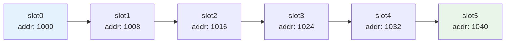
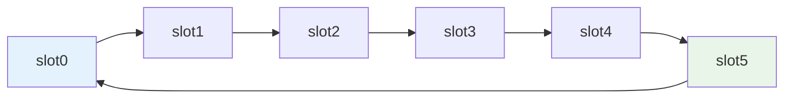
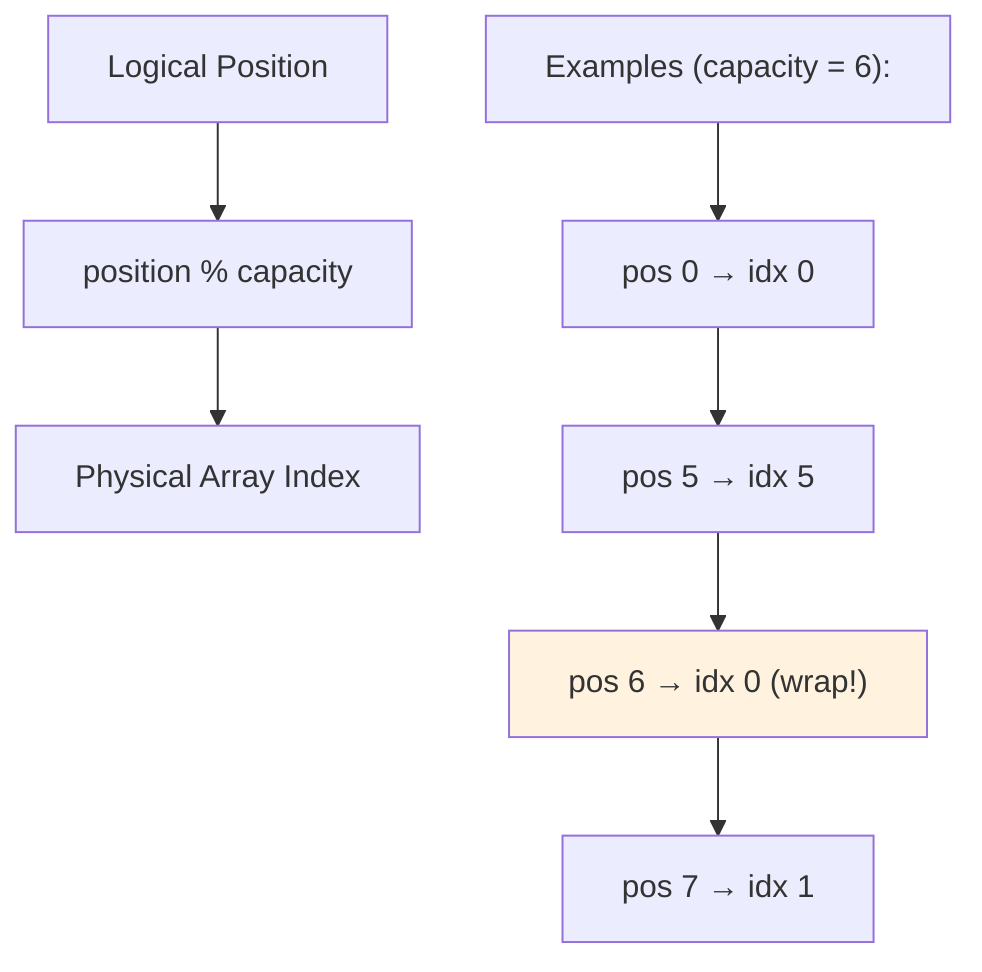
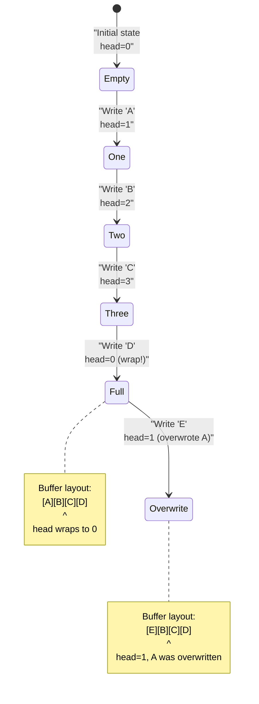

# Key Abstractions: The Building Blocks of Circular Thinking

Ring buffers operate on four fundamental abstractions that work together to create a simple yet powerful data structure. Understanding these abstractions is crucial to implementing, debugging, and optimizing ring buffer systems.

## 1. The Buffer: Fixed-Size Circular Memory

The buffer is the foundation—a fixed-size array that holds the actual data.

### Logical vs. Physical Layout

The magic of ring buffers lies in the abstraction: linear memory feels circular.

**Physical Layout (how it exists in memory):**


**Logical Layout (how we think about it):**


The key insight: **we treat linear memory as if it were circular** through mathematical operations.

### The Modulo Magic



### The Wraparound Mechanism

The buffer achieves circularity through modulo arithmetic:

```rust
// Convert logical position to physical array index
fn get_index(&self, position: usize) -> usize {
    position % self.capacity
}

// Examples with capacity = 6:
// position 0 → index 0
// position 1 → index 1  
// position 5 → index 5
// position 6 → index 0 (wraps around!)
// position 7 → index 1
```

This simple mathematical operation eliminates the need for complex branching logic.

### Buffer Initialization

Ring buffers are typically initialized with a fixed capacity:

```rust
struct RingBuffer<T> {
    buffer: Vec<T>,     // Fixed-size storage
    capacity: usize,    // Maximum number of elements
    head: usize,        // Write position  
    tail: usize,        // Read position
    count: usize,       // Current number of elements
}

impl<T: Default + Clone> RingBuffer<T> {
    fn new(capacity: usize) -> Self {
        Self {
            buffer: vec![T::default(); capacity],
            capacity,
            head: 0,
            tail: 0,
            count: 0,
        }
    }
}
```

The buffer pre-allocates all memory upfront, ensuring no dynamic allocation during operation.

## 2. The Head Pointer: Where New Data Goes

The head pointer tracks where the next write operation will occur.

### Head Movement Pattern

The head pointer advances systematically, wrapping around when it reaches the end:



**Visual Progression:**
```
Initial:     [    ][    ][    ][    ]    head=0
Write "A":   [  A ][    ][    ][    ]    head=1
Write "B":   [  A ][  B ][    ][    ]    head=2
Write "C":   [  A ][  B ][  C ][    ]    head=3
Write "D":   [  A ][  B ][  C ][  D ]    head=0 (wrapped!)
Write "E":   [  E ][  B ][  C ][  D ]    head=1 (overwrote A)
```

### Head Advancement Logic

```rust
fn write(&mut self, item: T) {
    // Place item at current head position
    self.buffer[self.head] = item;
    
    // Advance head (with wraparound)
    self.head = (self.head + 1) % self.capacity;
    
    // Handle full buffer case
    if self.count == self.capacity {
        // Buffer full: we overwrote the tail position
        self.tail = (self.tail + 1) % self.capacity;
    } else {
        // Buffer not full: increment count
        self.count += 1;
    }
}
```

The head pointer always moves forward, never backward. This ensures FIFO ordering.

### Head and Overwriting

When the buffer is full, the head "chases" the tail:

```
Buffer full:      [  E ][  B ][  C ][  D ]
                         ^              ^
                         head=1         tail=1

After write "F":  [  E ][  F ][  C ][  D ]
                               ^        ^  
                               head=2   tail=2 (advanced!)

The oldest data (B) was overwritten
The tail was forced to advance to maintain buffer invariants
```

## 3. The Tail Pointer: Where Data Is Read From

The tail pointer tracks where the next read operation will occur.

### Tail Movement Pattern

```
Buffer state:     [  E ][  F ][  C ][  D ]
                               ^        ^
                               head=2   tail=2

After read:       [  E ][  F ][  C ][  D ]
                               ^           ^
                               head=2      tail=3
                  (returned "C")

After read:       [  E ][  F ][  C ][  D ]
                               ^     ^
                               head=2 tail=0 (wrapped!)
                  (returned "D")

After read:       [  E ][  F ][  C ][  D ]
                         ^     ^
                         head=2 tail=1
                  (returned "E")
```

### Tail Advancement Logic

```rust
fn read(&mut self) -> Option<T> {
    if self.count == 0 {
        None  // Buffer is empty
    } else {
        // Get item at tail position
        let item = self.buffer[self.tail].clone();
        
        // Advance tail (with wraparound)
        self.tail = (self.tail + 1) % self.capacity;
        
        // Decrease count
        self.count -= 1;
        
        Some(item)
    }
}
```

The tail follows the head, maintaining the FIFO ordering of data.

### Tail and Empty Detection

The tail helps determine when the buffer is empty:

```rust
fn is_empty(&self) -> bool {
    self.count == 0
    // Alternative implementation: self.head == self.tail && self.count == 0
}
```

## 4. The Overwriting Behavior: Embracing Data Loss

Overwriting is what makes ring buffers unique—it's a feature, not a bug.

### The Overwriting Decision Tree

When a write occurs on a full buffer:

```
Is buffer full?
├─ No: Normal write
│  ├─ Place item at head
│  ├─ Advance head  
│  └─ Increment count
│
└─ Yes: Overwriting write
   ├─ Place item at head (overwrites oldest data)
   ├─ Advance head
   ├─ Advance tail (to maintain buffer invariants)
   └─ Count stays the same (capacity)
```

### Overwriting Examples

**Example 1: Sensor Data**
```rust
// Temperature sensor ring buffer (capacity = 3)
let mut temp_buffer = RingBuffer::new(3);

temp_buffer.write(20.1);  // [20.1][    ][    ]
temp_buffer.write(20.3);  // [20.1][20.3][    ]  
temp_buffer.write(20.2);  // [20.1][20.3][20.2] (full)
temp_buffer.write(20.5);  // [20.5][20.3][20.2] (overwrote 20.1)

// We kept the 3 most recent temperatures, lost the oldest
```

**Example 2: Audio Samples**
```rust
// Audio sample buffer (capacity = 4) 
let mut audio_buffer = RingBuffer::new(4);

audio_buffer.write(0.1);   // [0.1][   ][   ][   ]
audio_buffer.write(0.2);   // [0.1][0.2][   ][   ]
audio_buffer.write(0.3);   // [0.1][0.2][0.3][   ]
audio_buffer.write(0.4);   // [0.1][0.2][0.3][0.4] (full)
audio_buffer.write(0.5);   // [0.5][0.2][0.3][0.4] (overwrote 0.1)

// Audio player gets the most recent samples, old ones are discarded
```

### Overwriting Strategies

Different systems handle overwriting differently:

**Strategy 1: Silent Overwriting (Most Common)**
```rust
fn write(&mut self, item: T) {
    // Always succeeds, may overwrite old data
    self.buffer[self.head] = item;
    // ... advance pointers
}
```

**Strategy 2: Notify on Overwrite**
```rust
fn write(&mut self, item: T) -> bool {
    let did_overwrite = self.count == self.capacity;
    self.buffer[self.head] = item;
    // ... advance pointers
    did_overwrite  // Return whether we overwrote data
}
```

**Strategy 3: Count Lost Items**
```rust
struct RingBufferWithStats<T> {
    buffer: RingBuffer<T>,
    items_lost: usize,
}

impl<T> RingBufferWithStats<T> {
    fn write(&mut self, item: T) {
        if self.buffer.is_full() {
            self.items_lost += 1;
        }
        self.buffer.write(item);
    }
}
```

## Buffer State Visualization

Understanding buffer states is crucial for debugging:

### Empty Buffer
```
Buffer: [    ][    ][    ][    ]
         ^
         head=0, tail=0, count=0
```

### Partially Full Buffer  
```
Buffer: [  A ][  B ][    ][    ]
         ^           ^
         tail=0      head=2, count=2
```

### Full Buffer (No Wraparound)
```
Buffer: [  A ][  B ][  C ][  D ]
         ^                    ^
         tail=0               head=0 (wrapped), count=4
```

### Full Buffer (With Wraparound)
```
Buffer: [  E ][  F ][  C ][  D ]
                      ^     ^
                      tail=2 head=2, count=4
```

## Invariants: The Rules That Must Never Break

Ring buffers maintain several invariants:

### Invariant 1: Count Consistency
```
0 ≤ count ≤ capacity
```

### Invariant 2: Pointer Bounds
```
0 ≤ head < capacity
0 ≤ tail < capacity
```

### Invariant 3: Empty Condition
```
if count == 0 then buffer is empty
if count == capacity then buffer is full
```

### Invariant 4: FIFO Ordering
```
Items are always read in the order they were written
(for items that haven't been overwritten)
```

Breaking these invariants leads to undefined behavior, data corruption, or crashes.

## Advanced Abstractions: Power-of-Two Optimization

Many high-performance ring buffers use power-of-two sizes for optimization:

```rust
struct FastRingBuffer<T> {
    buffer: Vec<T>,
    mask: usize,    // capacity - 1 (where capacity is power of 2)
    head: usize,
    tail: usize,
}

impl<T> FastRingBuffer<T> {
    fn new(capacity: usize) -> Self {
        assert!(capacity.is_power_of_two());
        Self {
            buffer: Vec::with_capacity(capacity),
            mask: capacity - 1,
            head: 0,
            tail: 0,
        }
    }
    
    fn write(&mut self, item: T) {
        self.buffer[self.head & self.mask] = item;  // Bitwise AND instead of modulo
        self.head = self.head.wrapping_add(1);      // Let overflow handle wraparound
    }
}
```

**Why this works:**
- For power-of-two sizes, `x % capacity` equals `x & (capacity - 1)`
- Bitwise AND is faster than modulo division
- Wrapping arithmetic handles overflow automatically

## Memory Layout Considerations

Ring buffers can be optimized for different access patterns:

### Cache-Friendly Layout
```rust
// Keep metadata together for better cache locality
struct CacheFriendlyRingBuffer<T> {
    head: usize,
    tail: usize,  
    count: usize,
    capacity: usize,
    buffer: Vec<T>,  // Data array last
}
```

### Lock-Free Layout
```rust
use std::sync::atomic::{AtomicUsize, Ordering};

struct LockFreeRingBuffer<T> {
    buffer: Vec<T>,
    capacity: usize,
    head: AtomicUsize,    // Atomic for lock-free access
    tail: AtomicUsize,    // Atomic for lock-free access
}
```

These abstractions—buffer, head, tail, and overwriting—work together to create a data structure that's both simple to understand and powerful in practice. Each abstraction has a specific responsibility, and their interactions create the emergent behavior that makes ring buffers so useful for real-time, high-performance systems.

In the next section, we'll see these abstractions in action through practical implementations and real-world examples.