# Implementing a Logger: A Practical Ring Buffer Application

Let's build a practical logging system that demonstrates ring buffers in action. This logger will keep only the most recent N log messages in memory, making it perfect for embedded systems, debugging tools, and applications where memory usage must be bounded.

## The Problem: Unbounded Log Growth

Traditional loggers face a fundamental problem that grows exponentially over time:

```mermaid
graph TD
    A["Application Starts"] --> B["Log Message 1"]
    B --> C["Log Message 2"]
    C --> D["..."]
    D --> E["Log Message 1,000,000"]
    E --> F["💥 Out of Memory"]
    
    G["Memory Growth"] --> H["Time 0: 0 MB"]
    H --> I["Time 1h: 50 MB"]
    I --> J["Time 2h: 100 MB"]
    J --> K["Time 3h: 200 MB"]
    K --> L["Time 4h: CRASH"]
    
    style F fill:#ff6b6b
    style L fill:#ff6b6b
```



```rust
// Naive logger implementation
struct NaiveLogger {
    messages: Vec<String>,
}

impl NaiveLogger {
    fn log(&mut self, message: String) {
        self.messages.push(message);  // Grows without bound!
    }
}

// After running for a few hours...
let mut logger = NaiveLogger::new();
for i in 0..1_000_000 {
    logger.log(format!("Processing item {}", i));
}
// Memory usage: ~100MB and growing!
```

**The core issue**: Memory usage is directly proportional to application runtime, making long-running systems impossible.

## The Solution: Ring Buffer Logger

A ring buffer logger maintains a fixed-size window of recent log messages, solving the memory growth problem:


**Key Benefits:**
- 🎯 **Predictable Memory**: Always uses exactly `capacity × sizeof(LogEntry)` bytes
- 🚀 **Constant Performance**: O(1) operations regardless of runtime
- ⏰ **Recent Data Focus**: Keeps the most actionable/relevant logs
- 🔄 **Continuous Operation**: Never stops due to memory constraints

```rust
use std::fmt;

#[derive(Debug, Clone)]
pub struct LogEntry {
    pub timestamp: u64,
    pub level: LogLevel,
    pub message: String,
}

#[derive(Debug, Clone, PartialEq)]
pub enum LogLevel {
    Debug,
    Info, 
    Warning,
    Error,
}

impl fmt::Display for LogLevel {
    fn fmt(&self, f: &mut fmt::Formatter<'_>) -> fmt::Result {
        match self {
            LogLevel::Debug => write!(f, "DEBUG"),
            LogLevel::Info => write!(f, "INFO"),
            LogLevel::Warning => write!(f, "WARN"),
            LogLevel::Error => write!(f, "ERROR"),
        }
    }
}

pub struct RingLogger {
    buffer: Vec<LogEntry>,
    capacity: usize,
    head: usize,    // Next write position
    tail: usize,    // Next read position
    count: usize,   // Current number of entries
    total_messages: u64,  // Total messages ever logged
    lost_messages: u64,   // Messages lost due to overwriting
}
```

## Core Implementation

Let's implement the essential ring buffer operations for our logger:

```rust
impl RingLogger {
    pub fn new(capacity: usize) -> Self {
        Self {
            buffer: vec![LogEntry::default(); capacity],
            capacity,
            head: 0,
            tail: 0,
            count: 0,
            total_messages: 0,
            lost_messages: 0,
        }
    }
    
    pub fn log(&mut self, level: LogLevel, message: String) {
        let entry = LogEntry {
            timestamp: current_timestamp(),
            level,
            message,
        };
        
        // Store entry at head position
        self.buffer[self.head] = entry;
        
        // Update statistics
        self.total_messages += 1;
        
        // Handle buffer full case
        if self.count == self.capacity {
            // Buffer is full - we're overwriting the oldest entry
            self.lost_messages += 1;
            // Advance tail to maintain buffer state
            self.tail = (self.tail + 1) % self.capacity;
        } else {
            // Buffer not full - just increment count
            self.count += 1;
        }
        
        // Always advance head
        self.head = (self.head + 1) % self.capacity;
    }
    
    pub fn get_recent_logs(&self, max_count: usize) -> Vec<LogEntry> {
        let mut logs = Vec::new();
        let count = std::cmp::min(max_count, self.count);
        
        for i in 0..count {
            // Read from tail forward (oldest to newest)
            let index = (self.tail + i) % self.capacity;
            logs.push(self.buffer[index].clone());
        }
        
        logs
    }
    
    pub fn get_all_logs(&self) -> Vec<LogEntry> {
        self.get_recent_logs(self.count)
    }
    
    pub fn clear(&mut self) {
        self.head = 0;
        self.tail = 0;
        self.count = 0;
        // Don't reset total_messages and lost_messages for statistics
    }
    
    pub fn is_empty(&self) -> bool {
        self.count == 0
    }
    
    pub fn is_full(&self) -> bool {
        self.count == self.capacity
    }
    
    pub fn len(&self) -> usize {
        self.count
    }
    
    pub fn capacity(&self) -> usize {
        self.capacity
    }
    
    pub fn stats(&self) -> LoggerStats {
        LoggerStats {
            total_messages: self.total_messages,
            lost_messages: self.lost_messages,
            current_count: self.count,
            capacity: self.capacity,
            memory_usage: std::mem::size_of::<LogEntry>() * self.capacity,
        }
    }
}

#[derive(Debug)]
pub struct LoggerStats {
    pub total_messages: u64,
    pub lost_messages: u64,
    pub current_count: usize,
    pub capacity: usize,
    pub memory_usage: usize,
}

// Helper function to get current timestamp
fn current_timestamp() -> u64 {
    std::time::SystemTime::now()
        .duration_since(std::time::UNIX_EPOCH)
        .unwrap()
        .as_millis() as u64
}

// Default implementation for LogEntry
impl Default for LogEntry {
    fn default() -> Self {
        Self {
            timestamp: 0,
            level: LogLevel::Info,
            message: String::new(),
        }
    }
}
```

## Convenience Methods for Different Log Levels

Let's add convenient methods for different log levels:

```rust
impl RingLogger {
    pub fn debug(&mut self, message: &str) {
        self.log(LogLevel::Debug, message.to_string());
    }
    
    pub fn info(&mut self, message: &str) {
        self.log(LogLevel::Info, message.to_string());
    }
    
    pub fn warning(&mut self, message: &str) {
        self.log(LogLevel::Warning, message.to_string());
    }
    
    pub fn error(&mut self, message: &str) {
        self.log(LogLevel::Error, message.to_string());
    }
    
    // Support for formatted messages
    pub fn log_fmt(&mut self, level: LogLevel, args: std::fmt::Arguments) {
        self.log(level, args.to_string());
    }
}

// Macro for formatted logging
#[macro_export]
macro_rules! log_debug {
    ($logger:expr, $($arg:tt)*) => {
        $logger.log_fmt(LogLevel::Debug, format_args!($($arg)*))
    };
}

#[macro_export]
macro_rules! log_info {
    ($logger:expr, $($arg:tt)*) => {
        $logger.log_fmt(LogLevel::Info, format_args!($($arg)*))
    };
}

#[macro_export]
macro_rules! log_warning {
    ($logger:expr, $($arg:tt)*) => {
        $logger.log_fmt(LogLevel::Warning, format_args!($($arg)*))
    };
}

#[macro_export]
macro_rules! log_error {
    ($logger:expr, $($arg:tt)*) => {
        $logger.log_fmt(LogLevel::Error, format_args!($($arg)*))
    };
}
```

## Display and Formatting

Let's add methods to display logs in a readable format:

```rust
impl RingLogger {
    pub fn print_recent_logs(&self, count: usize) {
        let logs = self.get_recent_logs(count);
        
        if logs.is_empty() {
            println!("No logs available");
            return;
        }
        
        println!("Recent {} logs:", logs.len());
        println!("{}", "=".repeat(60));
        
        for entry in logs {
            println!("{}", format_log_entry(&entry));
        }
        
        println!("{}", "=".repeat(60));
        
        let stats = self.stats();
        if stats.lost_messages > 0 {
            println!("⚠️  {} messages were lost due to buffer overflow", stats.lost_messages);
        }
    }
    
    pub fn print_all_logs(&self) {
        self.print_recent_logs(self.count);
    }
    
    pub fn export_to_string(&self) -> String {
        let logs = self.get_all_logs();
        let mut output = String::new();
        
        for entry in logs {
            output.push_str(&format_log_entry(&entry));
            output.push('\n');
        }
        
        output
    }
}

fn format_log_entry(entry: &LogEntry) -> String {
    let datetime = format_timestamp(entry.timestamp);
    format!("[{}] {}: {}", datetime, entry.level, entry.message)
}

fn format_timestamp(timestamp: u64) -> String {
    // Simple timestamp formatting (in production, use chrono or similar)
    let seconds = timestamp / 1000;
    let millis = timestamp % 1000;
    
    // Convert to hours:minutes:seconds.milliseconds (simplified)
    let hours = (seconds / 3600) % 24;
    let minutes = (seconds / 60) % 60;
    let secs = seconds % 60;
    
    format!("{:02}:{:02}:{:02}.{:03}", hours, minutes, secs, millis)
}
```

## Filtering and Searching

Add methods to filter logs by level or search for specific content:

```rust
impl RingLogger {
    pub fn get_logs_by_level(&self, level: LogLevel) -> Vec<LogEntry> {
        self.get_all_logs()
            .into_iter()
            .filter(|entry| entry.level == level)
            .collect()
    }
    
    pub fn search_logs(&self, pattern: &str) -> Vec<LogEntry> {
        self.get_all_logs()
            .into_iter()
            .filter(|entry| entry.message.contains(pattern))
            .collect()
    }
    
    pub fn get_error_count(&self) -> usize {
        self.get_logs_by_level(LogLevel::Error).len()
    }
    
    pub fn get_warning_count(&self) -> usize {
        self.get_logs_by_level(LogLevel::Warning).len()
    }
    
    pub fn has_errors(&self) -> bool {
        self.get_error_count() > 0
    }
    
    pub fn has_warnings(&self) -> bool {
        self.get_warning_count() > 0
    }
}
```

## Complete Usage Example

Here's a comprehensive example showing the logger in action:

```rust
fn main() {
    // Create a logger that keeps only the last 10 messages
    let mut logger = RingLogger::new(10);
    
    println!("=== Ring Buffer Logger Demo ===\n");
    
    // Log some initial messages
    logger.info("Application starting");
    logger.debug("Loading configuration");
    logger.info("Configuration loaded successfully");
    
    // Simulate some application activity
    for i in 1..=5 {
        logger.info(&format!("Processing item {}", i));
        
        if i == 3 {
            logger.warning("Item 3 took longer than expected");
        }
        
        if i == 4 {
            logger.error("Failed to process item 4");
        }
    }
    
    logger.info("Processing complete");
    
    // Show current logs
    println!("Current logs (should be 9 total):");
    logger.print_all_logs();
    
    // Add more messages to trigger overflow
    println!("\nAdding more messages to trigger overflow...\n");
    
    for i in 6..=15 {
        logger.info(&format!("Additional message {}", i));
    }
    
    // Show logs after overflow
    println!("Logs after overflow (should be 10 total, oldest lost):");
    logger.print_all_logs();
    
    // Show statistics
    println!("\nLogger Statistics:");
    let stats = logger.stats();
    println!("  Total messages logged: {}", stats.total_messages);
    println!("  Messages lost (overflow): {}", stats.lost_messages);
    println!("  Current buffer usage: {}/{}", stats.current_count, stats.capacity);
    println!("  Memory usage: {} bytes", stats.memory_usage);
    
    // Demonstrate filtering
    println!("\nError messages only:");
    let errors = logger.get_logs_by_level(LogLevel::Error);
    for error in errors {
        println!("  {}", format_log_entry(&error));
    }
    
    // Demonstrate searching
    println!("\nMessages containing 'item':");
    let item_logs = logger.search_logs("item");
    for log in item_logs {
        println!("  {}", format_log_entry(&log));
    }
    
    // Show summary
    println!("\nSummary:");
    println!("  Errors: {}", logger.get_error_count());
    println!("  Warnings: {}", logger.get_warning_count());
    println!("  Has errors: {}", logger.has_errors());
    println!("  Has warnings: {}", logger.has_warnings());
}

// Example using the logging macros
fn demonstrate_macros() {
    let mut logger = RingLogger::new(5);
    
    log_info!(logger, "User {} logged in", "alice");
    log_debug!(logger, "Session ID: {}", "abc123");
    log_warning!(logger, "Low disk space: {}% remaining", 15);
    log_error!(logger, "Database connection failed after {} attempts", 3);
    
    logger.print_all_logs();
}
```

## Performance Characteristics

Our ring buffer logger provides excellent performance characteristics:

```rust
fn benchmark_logger() {
    let mut logger = RingLogger::new(1000);
    let start = std::time::Instant::now();
    
    // Log 100,000 messages
    for i in 0..100_000 {
        logger.info(&format!("Benchmark message {}", i));
    }
    
    let duration = start.elapsed();
    println!("Logged 100,000 messages in {:?}", duration);
    println!("Average time per message: {:?}", duration / 100_000);
    
    let stats = logger.stats();
    println!("Final stats: {:?}", stats);
}
```

## Memory-Constrained Environments

The ring buffer logger is particularly useful in memory-constrained environments:

```rust
// Embedded system logger (only 50 messages max)
fn embedded_logger_example() {
    let mut logger = RingLogger::new(50);
    
    // Simulate sensor readings
    for minute in 0..120 {  // 2 hours of readings
        if minute % 10 == 0 {
            logger.info(&format!("Sensor reading at minute {}: OK", minute));
        }
        
        if minute == 67 {
            logger.error("Sensor malfunction detected!");
        }
        
        if minute == 89 {
            logger.warning("Battery low");
        }
    }
    
    // Only the most recent 50 messages are kept
    logger.print_all_logs();
    
    let stats = logger.stats();
    println!("Memory used: {} bytes (fixed)", stats.memory_usage);
    println!("Messages lost: {} (older data automatically discarded)", stats.lost_messages);
}
```

## Key Benefits Demonstrated

This logger implementation showcases the key advantages of ring buffers:

1. **Bounded Memory Usage**: Never exceeds the configured capacity
2. **Predictable Performance**: O(1) operations for logging and retrieval
3. **Graceful Degradation**: Automatically discards old data when full
4. **Real-time Friendly**: No dynamic allocation during operation
5. **Simple Implementation**: Easy to understand and debug

The ring buffer logger strikes an optimal balance between functionality and resource constraints, making it ideal for production systems where reliability and predictable resource usage are more important than preserving every log message.

In the next section, we'll explore advanced lock-free implementations that enable concurrent access without blocking operations.