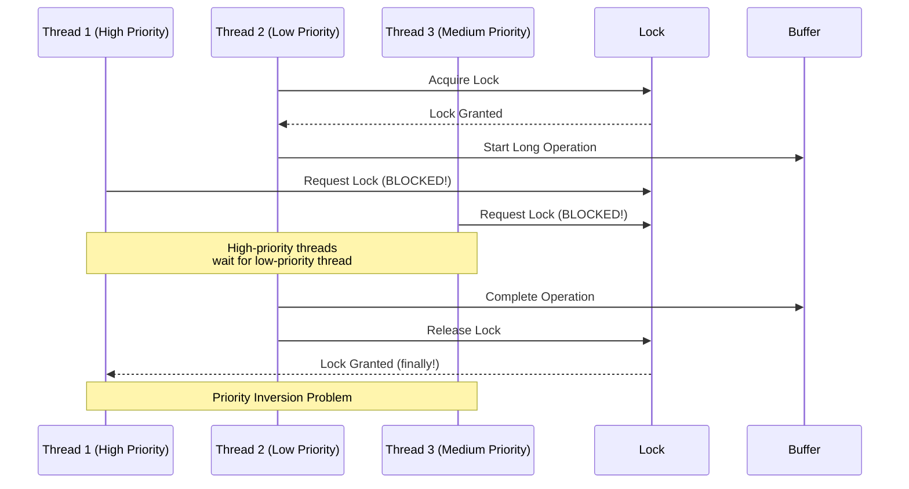
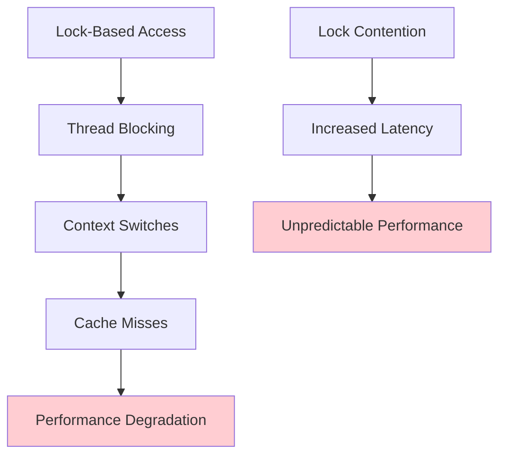
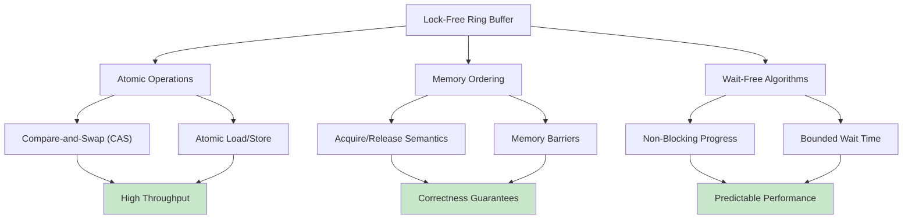
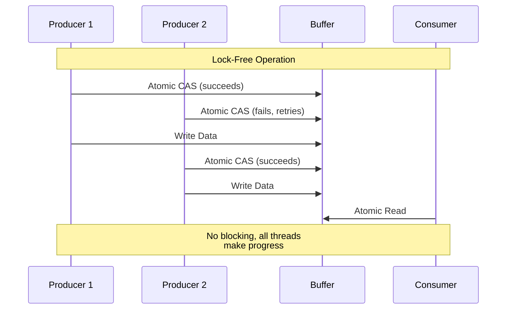

# Lock-Free Ring Buffers: The Art of Concurrent Cooperation

Lock-free ring buffers represent one of the most elegant solutions in concurrent programming: enabling multiple threads to cooperate without blocking each other. This deep dive explores how atomic operations, memory ordering, and careful algorithm design create systems that are both blazingly fast and remarkably robust.

## The Concurrency Challenge

Traditional thread synchronization uses locks to ensure mutual exclusion:

```rust
use std::sync::Mutex;

struct LockedRingBuffer<T> {
    buffer: Vec<T>,
    head: usize,
    tail: usize,
    capacity: usize,
    mutex: Mutex<()>,
}

impl<T> LockedRingBuffer<T> {
    fn write(&self, item: T) {
        let _guard = self.mutex.lock().unwrap();  // Block until lock acquired
        // ... perform write operation
        // Lock released when _guard goes out of scope
    }
}
```

### The Problems with Locks

Lock-based synchronization creates several performance and reliability issues:



**Key Problems:**

1. **Serialization Bottleneck**: Only one thread can access the buffer at a time
2. **Priority Inversion**: High-priority threads blocked by low-priority ones  
3. **Deadlock Risk**: Complex locking can cause permanent waits
4. **Context Switching**: Blocking/unblocking threads is expensive
5. **Cache Thrashing**: Lock contention causes cache misses



## The Lock-Free Promise

Lock-free ring buffers eliminate these problems through **atomic operations** and **careful memory ordering**:



**Comparison: Locked vs Lock-Free**



```rust
use std::sync::atomic::{AtomicUsize, Ordering};

struct LockFreeRingBuffer<T> {
    buffer: Vec<T>,
    capacity: usize,
    head: AtomicUsize,    // Atomic head pointer
    tail: AtomicUsize,    // Atomic tail pointer
}
```

**Key Properties:**
- **Non-blocking**: Threads never wait for each other
- **Progress Guarantee**: At least one thread always makes progress
- **High Throughput**: Eliminates lock contention overhead
- **Deterministic**: No priority inversion or deadlock risks

## Single Producer, Single Consumer (SPSC)

The simplest and most efficient lock-free ring buffer assumes exactly one producer thread and one consumer thread.

### SPSC Algorithm

```rust
use std::sync::atomic::{AtomicUsize, Ordering};
use std::cell::UnsafeCell;

pub struct SPSCRingBuffer<T> {
    buffer: Vec<UnsafeCell<T>>,
    capacity: usize,
    mask: usize,  // capacity - 1 (assumes power-of-2 capacity)
    head: AtomicUsize,  // Modified only by producer
    tail: AtomicUsize,  // Modified only by consumer
}

unsafe impl<T: Send> Sync for SPSCRingBuffer<T> {}

impl<T: Default> SPSCRingBuffer<T> {
    pub fn new(capacity: usize) -> Self {
        assert!(capacity.is_power_of_two());
        
        let mut buffer = Vec::with_capacity(capacity);
        for _ in 0..capacity {
            buffer.push(UnsafeCell::new(T::default()));
        }
        
        Self {
            buffer,
            capacity,
            mask: capacity - 1,
            head: AtomicUsize::new(0),
            tail: AtomicUsize::new(0),
        }
    }
    
    // Producer-side operation
    pub fn try_write(&self, item: T) -> Result<(), T> {
        let head = self.head.load(Ordering::Relaxed);
        let next_head = head.wrapping_add(1);
        
        // Check if buffer is full
        // We compare with tail using Acquire ordering to ensure we see
        // the latest updates from the consumer
        let tail = self.tail.load(Ordering::Acquire);
        if next_head & self.mask == tail & self.mask {
            return Err(item);  // Buffer is full
        }
        
        // Safe to write because:
        // 1. Only producer writes to head positions
        // 2. We've verified this position is not being read
        unsafe {
            *self.buffer[head & self.mask].get() = item;
        }
        
        // Publish the write with Release ordering
        // This ensures the data write above is visible before the head update
        self.head.store(next_head, Ordering::Release);
        
        Ok(())
    }
    
    // Consumer-side operation  
    pub fn try_read(&self) -> Option<T> {
        let tail = self.tail.load(Ordering::Relaxed);
        
        // Check if buffer is empty
        // We use Acquire ordering to ensure we see the latest head updates
        let head = self.head.load(Ordering::Acquire);
        if tail & self.mask == head & self.mask {
            return None;  // Buffer is empty
        }
        
        // Safe to read because:
        // 1. Only consumer reads from tail positions  
        // 2. We've verified this position has valid data
        let item = unsafe {
            std::ptr::read(self.buffer[tail & self.mask].get())
        };
        
        let next_tail = tail.wrapping_add(1);
        
        // Publish the read with Release ordering
        // This ensures the data read above completes before tail update
        self.tail.store(next_tail, Ordering::Release);
        
        Some(item)
    }
    
    pub fn is_empty(&self) -> bool {
        let head = self.head.load(Ordering::Acquire);
        let tail = self.tail.load(Ordering::Acquire);
        head & self.mask == tail & self.mask
    }
    
    pub fn is_full(&self) -> bool {
        let head = self.head.load(Ordering::Acquire);
        let tail = self.tail.load(Ordering::Acquire);
        head.wrapping_add(1) & self.mask == tail & self.mask
    }
}
```

### Memory Ordering Explained

Memory ordering is crucial for correctness in lock-free data structures:

**Ordering::Relaxed**: No synchronization constraints
- Used when only the atomicity of the operation matters
- Fastest but provides no ordering guarantees

**Ordering::Acquire**: Synchronizes with Release operations
- Ensures all writes before a Release are visible after this Acquire
- Used when reading shared state

**Ordering::Release**: Synchronizes with Acquire operations  
- Ensures all writes before this Release are visible to subsequent Acquires
- Used when publishing shared state

**Critical Pattern in SPSC**:
```rust
// Producer thread:
unsafe { *buffer[head].get() = item; }        // Write data
head.store(next_head, Ordering::Release);     // Publish with Release

// Consumer thread:
let head = head.load(Ordering::Acquire);      // Read head with Acquire
let item = unsafe { *buffer[tail].get() };    // Read data (synchronized!)
```

This ensures the consumer never reads garbage data.

## Multiple Producer, Single Consumer (MPSC)

MPSC is more complex because multiple producers must coordinate without interfering with each other.

### MPSC Algorithm

```rust
use std::sync::atomic::{AtomicUsize, Ordering};

pub struct MPSCRingBuffer<T> {
    buffer: Vec<UnsafeCell<T>>,
    capacity: usize,
    mask: usize,
    head: AtomicUsize,      // Shared by all producers
    tail: AtomicUsize,      // Modified only by consumer
    producer_count: AtomicUsize,  // Track active producers
}

impl<T: Default> MPSCRingBuffer<T> {
    pub fn new(capacity: usize) -> Self {
        assert!(capacity.is_power_of_two());
        
        let mut buffer = Vec::with_capacity(capacity);
        for _ in 0..capacity {
            buffer.push(UnsafeCell::new(T::default()));
        }
        
        Self {
            buffer,
            capacity,
            mask: capacity - 1,
            head: AtomicUsize::new(0),
            tail: AtomicUsize::new(0),
            producer_count: AtomicUsize::new(0),
        }
    }
    
    // Producer-side operation (multiple producers)
    pub fn try_write(&self, item: T) -> Result<(), T> {
        // Increment producer count (for graceful shutdown)
        self.producer_count.fetch_add(1, Ordering::Relaxed);
        
        loop {
            let head = self.head.load(Ordering::Relaxed);
            let next_head = head.wrapping_add(1);
            
            // Check if buffer is full
            let tail = self.tail.load(Ordering::Acquire);
            if next_head & self.mask == tail & self.mask {
                self.producer_count.fetch_sub(1, Ordering::Relaxed);
                return Err(item);  // Buffer is full
            }
            
            // Try to claim this head position atomically
            match self.head.compare_exchange_weak(
                head,
                next_head,
                Ordering::Release,
                Ordering::Relaxed
            ) {
                Ok(_) => {
                    // Successfully claimed position, write the data
                    unsafe {
                        *self.buffer[head & self.mask].get() = item;
                    }
                    
                    self.producer_count.fetch_sub(1, Ordering::Relaxed);
                    return Ok(());
                }
                Err(_) => {
                    // Another producer beat us, retry with new head value
                    continue;
                }
            }
        }
    }
    
    // Consumer-side operation (same as SPSC)
    pub fn try_read(&self) -> Option<T> {
        let tail = self.tail.load(Ordering::Relaxed);
        let head = self.head.load(Ordering::Acquire);
        
        if tail & self.mask == head & self.mask {
            return None;  // Buffer is empty
        }
        
        let item = unsafe {
            std::ptr::read(self.buffer[tail & self.mask].get())
        };
        
        let next_tail = tail.wrapping_add(1);
        self.tail.store(next_tail, Ordering::Release);
        
        Some(item)
    }
}
```

### Compare-and-Swap (CAS) Operations

The heart of MPSC coordination is the compare-and-swap operation:

```rust
// Atomic operation: if head == expected_value, set head = new_value
match self.head.compare_exchange_weak(
    expected_value,  // What we think head should be
    new_value,       // What we want to set it to
    success_order,   // Memory ordering if successful
    failure_order    // Memory ordering if failed
) {
    Ok(actual_old_value) => {
        // Success! We atomically updated head
        // actual_old_value == expected_value
    }
    Err(actual_current_value) => {
        // Failed! Another thread modified head first
        // actual_current_value != expected_value
        // We can retry with the new value
    }
}
```

**Why compare_exchange_weak?**
- On some architectures, CAS can fail spuriously (even when values match)
- `compare_exchange_weak` allows spurious failures but is faster
- The retry loop handles spurious failures naturally

## The ABA Problem and Solutions

The ABA problem is a classic concurrency issue that can affect lock-free data structures:

### The ABA Scenario

```
Thread 1: Reads head = A
Thread 2: Changes head A → B → A (back to original value)
Thread 1: CAS succeeds (sees A == A) but state has actually changed!
```

### ABA in Ring Buffers

```rust
// Dangerous scenario:
let head = self.head.load(Ordering::Relaxed);  // Read: head = 100

// Meanwhile, other threads:
// - Fill the entire buffer (head wraps around)
// - Empty the entire buffer  
// - Now head = 100 + buffer_size (which equals 100 mod buffer_size)

// Our CAS succeeds even though the buffer state completely changed!
self.head.compare_exchange(head, head + 1, ...)  // Succeeds incorrectly
```

### Solution: Generation Counters

Instead of just using position, combine position with a generation counter:

```rust
// Pack position and generation into single atomic
struct TaggedPointer {
    position: u32,    // Lower 32 bits: actual position
    generation: u32,  // Upper 32 bits: generation counter
}

fn pack(position: usize, generation: usize) -> u64 {
    ((generation as u64) << 32) | (position as u64 & 0xFFFFFFFF)
}

fn unpack(packed: u64) -> (usize, usize) {
    let position = (packed & 0xFFFFFFFF) as usize;
    let generation = (packed >> 32) as usize;
    (position, generation)
}

pub struct ABAResistantRingBuffer<T> {
    buffer: Vec<UnsafeCell<T>>,
    capacity: usize,
    mask: usize,
    head: AtomicU64,  // Packed position + generation
    tail: AtomicU64,  // Packed position + generation
}

impl<T: Default> ABAResistantRingBuffer<T> {
    pub fn try_write(&self, item: T) -> Result<(), T> {
        loop {
            let head_packed = self.head.load(Ordering::Relaxed);
            let (head_pos, head_gen) = unpack(head_packed);
            
            let next_head_pos = head_pos.wrapping_add(1);
            let next_head_gen = if next_head_pos & self.mask == 0 {
                head_gen.wrapping_add(1)  // Increment generation on wraparound
            } else {
                head_gen
            };
            let next_head_packed = pack(next_head_pos, next_head_gen);
            
            // Check for full buffer
            let tail_packed = self.tail.load(Ordering::Acquire);
            let (tail_pos, _) = unpack(tail_packed);
            
            if next_head_pos & self.mask == tail_pos & self.mask {
                return Err(item);  // Buffer full
            }
            
            // Attempt CAS with generation counter
            match self.head.compare_exchange_weak(
                head_packed,
                next_head_packed,
                Ordering::Release,
                Ordering::Relaxed
            ) {
                Ok(_) => {
                    unsafe {
                        *self.buffer[head_pos & self.mask].get() = item;
                    }
                    return Ok(());
                }
                Err(_) => continue,  // Retry with updated values
            }
        }
    }
}
```

## Performance Characteristics

Lock-free ring buffers provide exceptional performance:

### Benchmark Results

```rust
fn benchmark_comparison() {
    const ITERATIONS: usize = 1_000_000;
    
    // Lock-based ring buffer
    let locked_buffer = Arc::new(LockedRingBuffer::new(1024));
    let start = Instant::now();
    
    let handles: Vec<_> = (0..4).map(|_| {
        let buffer = locked_buffer.clone();
        thread::spawn(move || {
            for i in 0..ITERATIONS/4 {
                while buffer.try_write(i).is_err() {
                    thread::yield_now();
                }
            }
        })
    }).collect();
    
    for handle in handles {
        handle.join().unwrap();
    }
    
    let locked_duration = start.elapsed();
    
    // Lock-free ring buffer
    let lockfree_buffer = Arc::new(MPSCRingBuffer::new(1024));
    let start = Instant::now();
    
    let handles: Vec<_> = (0..4).map(|_| {
        let buffer = lockfree_buffer.clone();
        thread::spawn(move || {
            for i in 0..ITERATIONS/4 {
                while buffer.try_write(i).is_err() {
                    std::hint::spin_loop();
                }
            }
        })
    }).collect();
    
    for handle in handles {
        handle.join().unwrap();
    }
    
    let lockfree_duration = start.elapsed();
    
    println!("Locked buffer:    {:?}", locked_duration);
    println!("Lock-free buffer: {:?}", lockfree_duration);
    println!("Speedup: {:.2}x", locked_duration.as_nanos() as f64 / lockfree_duration.as_nanos() as f64);
}
```

**Typical Results:**
- Lock-free: 2-10x faster than locked versions
- Lower latency variance (no blocking)
- Better cache performance (no lock overhead)
- Scales better with more threads

## Real-World Applications

### High-Frequency Trading

```rust
// Ultra-low latency market data processing
struct MarketDataProcessor {
    price_buffer: SPSCRingBuffer<PriceUpdate>,
    order_buffer: MPSCRingBuffer<OrderRequest>,
}

impl MarketDataProcessor {
    fn process_market_data(&self) {
        // Producer: Network thread receives price updates
        while let Some(update) = receive_price_update() {
            if self.price_buffer.try_write(update).is_err() {
                // Market moving too fast! Log but don't block
                log_market_overload();
            }
        }
        
        // Consumer: Trading algorithm processes prices
        while let Some(price) = self.price_buffer.try_read() {
            if let Some(order) = generate_order(price) {
                self.order_buffer.try_write(order);
            }
        }
    }
}
```

### Audio Processing

```rust
// Real-time audio processing pipeline
struct AudioProcessor {
    input_buffer: SPSCRingBuffer<AudioSample>,
    output_buffer: SPSCRingBuffer<AudioSample>,
}

impl AudioProcessor {
    fn audio_callback(&self) {
        // Producer: Audio input thread
        thread::spawn(|| {
            loop {
                let sample = read_microphone();
                if self.input_buffer.try_write(sample).is_err() {
                    // Audio input overrun - drop sample to avoid glitches
                }
            }
        });
        
        // Consumer: Audio processing thread
        thread::spawn(|| {
            loop {
                if let Some(input) = self.input_buffer.try_read() {
                    let processed = apply_effects(input);
                    if self.output_buffer.try_write(processed).is_err() {
                        // Output buffer full - this will cause audio glitches
                        log_audio_underrun();
                    }
                }
            }
        });
    }
}
```

### Game Engine

```rust
// Game input processing
struct InputSystem {
    input_buffer: MPSCRingBuffer<InputEvent>,
}

impl InputSystem {
    fn process_inputs(&self) {
        // Multiple input sources (keyboard, mouse, gamepad)
        thread::spawn(|| {
            loop {
                if let Some(event) = poll_keyboard() {
                    self.input_buffer.try_write(event);
                }
            }
        });
        
        // Game logic thread processes all inputs
        thread::spawn(|| {
            loop {
                while let Some(event) = self.input_buffer.try_read() {
                    handle_input_event(event);
                }
                
                update_game_state();
                render_frame();
            }
        });
    }
}
```

## When to Use Lock-Free Ring Buffers

**Perfect for:**
- Real-time systems (audio, video, games)
- High-frequency trading
- Network packet processing
- Producer-consumer patterns with known rate limits
- Systems where predictable latency matters more than peak throughput

**Avoid when:**
- Complex synchronization requirements
- Need to support arbitrary numbers of producers/consumers
- Data relationships require transactional consistency
- Debugging is more important than performance

Lock-free ring buffers represent the pinnacle of performance for bounded producer-consumer communication. They achieve this through careful algorithm design, atomic operations, and a deep understanding of memory ordering. While complex to implement correctly, they provide unmatched performance for systems where every microsecond counts.

In the next section, we'll implement a complete, production-ready lock-free ring buffer in Rust that demonstrates all these concepts in working code.