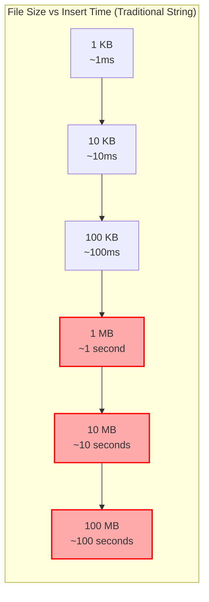

# The Core Problem: The Sluggishness of Large-Scale Text Manipulation

Imagine you're building a collaborative code editor, a word processor, or any application that handles large amounts of text. A user opens a multi-megabyte file—perhaps the source code for a large project or a chapter of a novel. They decide to insert a single word at the very beginning of the file.

If the entire file is stored as a single, contiguous block of memory (like a standard string in many programming languages), this seemingly simple operation becomes surprisingly expensive.

### The "Shifting Bricks" Analogy

Think of a long wall of bricks, where each brick is a character. If you want to add a new brick at the beginning of the wall, you can't just place it there. You have to:
1. Find a new, longer space.
2. Move the *entire wall*, brick by brick, to the new location, leaving a gap at the start.
3. Place the new brick in the gap.

This is what happens inside your computer's memory.

### Visualizing the Inefficiency

Let's say we have the string "Hello world" and we want to insert "Big " at the beginning.


To insert that one word, the application must:

1.  Allocate a new, larger block of memory.
2.  Copy the newly inserted word into the new block.
3.  Copy the *entire* original text, character by character, from its old location to the new one, right after the inserted word.
4.  Deallocate the old memory block.

This process is incredibly inefficient. For a 10 MB file, inserting a word at the beginning requires shifting 10 million characters. The application freezes, the user gets frustrated, and the experience is far from seamless. The same problem occurs for deletions. Removing a character at the beginning of the string also requires shifting all subsequent characters to fill the gap.

### The Scale of the Problem

Let's put some concrete numbers on this inefficiency:



At 1 MB, users start noticing lag. At 10 MB, the application becomes unusable. At 100 MB, you're looking at nearly two minutes to insert a single character at the beginning of a file. This is why many text editors either:

1. **Refuse to open large files** (showing "File too large" errors)
2. **Become unresponsive** during editing operations
3. **Split documents into chunks** (losing the ability to search/replace across the entire document)

### Real-World Pain Points

This problem manifests in applications you use every day:

- **Text editors** freezing when editing large configuration files
- **Code editors** becoming sluggish with large source files
- **Document processors** struggling with lengthy manuscripts
- **Log viewers** failing to handle large log files interactively
- **Collaborative editors** with poor performance on shared documents

### The Memory Allocation Crisis

There's an even deeper problem lurking beneath the surface. Each insertion doesn't just copy data—it triggers a cascade of memory operations:

```mermaid
sequencer
    participant App as Application
    participant Mem as Memory Manager
    participant OS as Operating System
    
    App->>Mem: Request larger memory block
    Mem->>OS: Search for contiguous space
    OS-->>Mem: Return new address (or fail)
    Mem->>App: Allocate new block
    App->>App: Copy old data to new location
    App->>App: Insert new data
    App->>Mem: Free old memory block
    Mem->>OS: Mark old space as available
```

This dance happens for **every single edit operation**. The larger your file, the more expensive each step becomes, creating a compound performance problem.

This is the core problem: **traditional string implementations are optimized for reading, not for editing.** They treat a string as a monolithic block, making insertions and deletions in the middle of large texts computationally expensive. How can we design a data structure that makes these "splicing" operations fast and efficient, even for enormous files?