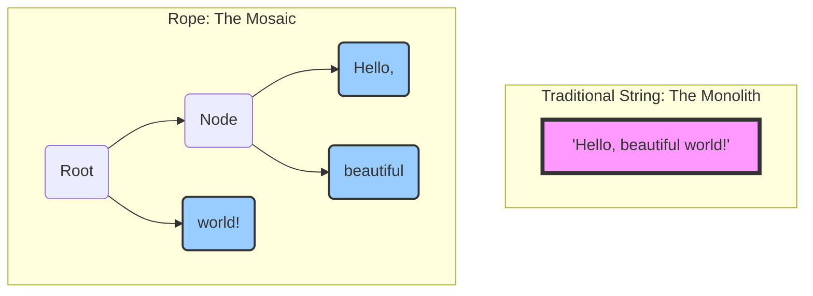
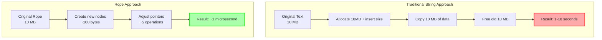
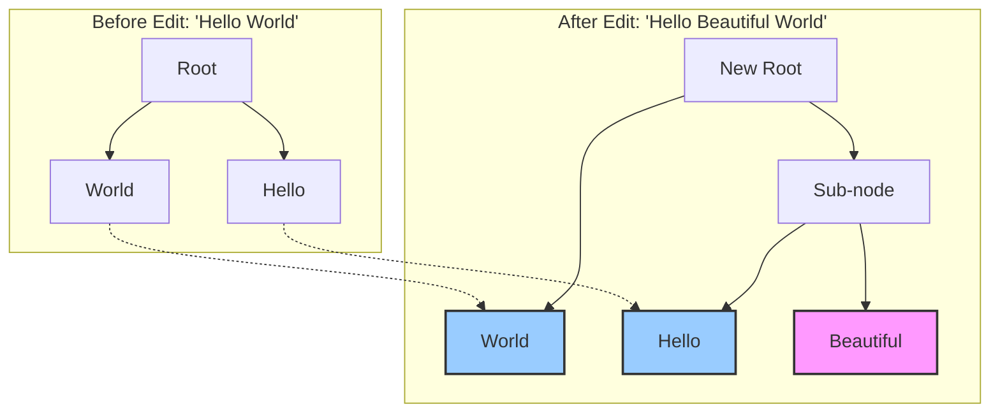

# The Guiding Philosophy: Divide and Conquer

The slowness of large string manipulation comes from treating the string as a single, monolithic entity. The guiding philosophy of the **Rope** data structure is to abandon this idea and embrace a "divide and conquer" strategy. Instead of one long string, we break it into many smaller, manageable pieces.

A Rope is a **binary tree** where each leaf node holds a small, immutable snippet of the text. The internal nodes of the tree don't store text themselves; they simply describe how the pieces are concatenated together.

### From Monolith to Mosaic

Let's visualize the difference in approach.

Here’s the core idea:

1.  **Break It Down:** A long string is split into smaller, fixed-size substrings. These become the leaves of our tree. For example, the string "Hello, beautiful world!" might be broken into "Hello, ", "beautiful ", and "world!".

2.  **Structure, Don't Copy:** When we want to combine or modify the text, we don't move the text itself. Instead, we build a new tree structure *around* the existing leaf nodes.
    *   **Concatenation:** To concatenate two strings, we simply create a new root node whose left child points to the root of the first string's rope and whose right child points to the root of the second's. No copying of the actual text is needed.
    *   **Insertion:** To insert text, we split the rope at the insertion point and create new internal nodes that link the original pieces with the new text. Again, the original leaves remain untouched.

3.  **Immutability is Key:** The leaf nodes containing the actual string data are immutable. This is crucial for efficiency and concurrency. When we "modify" the text, we are actually creating new nodes and reusing the existing, unchanged leaves. This is a form of "copy-on-write" at the structural level. It means that different versions of the text (e.g., before and after an edit) can share the majority of their data, saving a tremendous amount of memory.

### The Paradigm Shift: From Copying to Pointing

The breakthrough insight is this: **instead of moving text, we move pointers**. Here's the dramatic difference:

This is roughly a **million-fold improvement** in performance for large files. The rope doesn't touch the original text data at all—it simply creates a new organizational structure around it.

### The "Library Reorganization" Analogy

Imagine you're a librarian with a million books arranged on shelves. A reader wants to "insert" a new chapter between pages 50,000 and 50,001 of a specific book.

**Traditional String Approach (The Naive Librarian):**
1. Take every single book off the shelves
2. Find the specific page location
3. Print entirely new copies of every book, inserting the new chapter
4. Throw away all the old books
5. Place all the new books back on the shelves

**Rope Approach (The Smart Librarian):**
1. Create a new index card that says "Between page 50,000 and 50,001, insert Chapter X"
2. File the index card in the catalog system
3. Done!

When someone wants to read the book, they follow the index cards to get the complete, updated version without any books having been physically moved or recopied.

### Structural Immutability: The Secret Sauce

The dotted lines show that the original "Hello" and "World" leaf nodes are **reused**. Only the new "Beautiful" leaf and the organizational nodes are created. This sharing principle is what makes ropes both fast and memory-efficient.

### The Copy-on-Write Revolution

This structural approach enables powerful features that traditional strings simply can't match:

**Multiple Document Versions**: An editor with undo/redo can maintain 100 different document states while sharing 99% of the underlying text data.

**Concurrent Access**: Multiple threads can safely read different "versions" of the same document simultaneously.

**Efficient Snapshots**: Creating a backup of a document state is literally just copying a single pointer.

By focusing on manipulating the tree structure rather than the raw text data, Ropes transform expensive copy operations into cheap pointer manipulations. This makes insertions, deletions, and concatenations incredibly fast, especially for large texts, fulfilling the need for a high-performance text-splicing data structure.