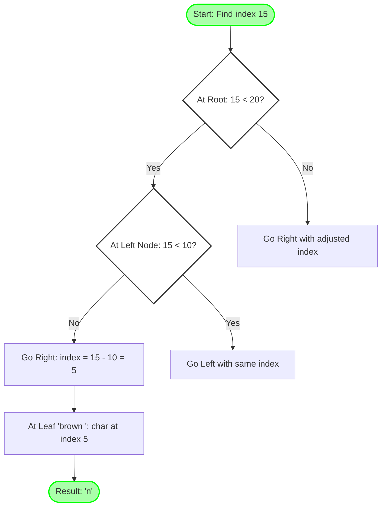
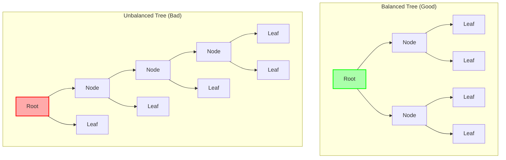

# Key Abstractions: Leaves, Nodes, and Weights

To understand how a Rope works, we need to grasp its three key abstractions: the `leaf`, the `internal node`, and the `weight`.

### 1. The Leaf

A **leaf** is the simplest component of a Rope. It's a node at the bottom of the tree that contains an actual, small, immutable string snippet. These are the fundamental building blocks of our text.

*   **Analogy:** Think of a book. The leaves are the individual, printed pages. Each page contains a chunk of the story.

### 2. The Internal Node

An **internal node** represents the concatenation of its children. It doesn't store any text itself. It simply has two children: a `left` child and a `right` child. The text represented by an internal node is the text of its left child followed by the text of its right child.

*   **Analogy:** The internal nodes are the table of contents or the book's binding. They don't contain the story, but they dictate the order in which the pages (leaves) are read.

### 3. The Weight

The **weight** is a critical piece of information stored in each internal node. It is the total length of all the text in its *left* sub-tree. This is the key to efficient indexing.

### A Detailed View

Let's visualize this with the string "Hello, beautiful world!".

```mermaid
graph TD
    A[Root<br/>weight=17] --> B[Node<br/>weight=7];
    A --> C[Leaf: "world!"];

    B --> D[Leaf: "Hello, "];
    B --> E[Leaf: "beautiful "];

    style C fill:#9cf,stroke:#333,stroke-width:2px
    style D fill:#9cf,stroke:#333,stroke-width:2px
    style E fill:#9cf,stroke:#333,stroke-width:2px
```

*   **Leaves:** We have three leaves: "Hello, " (length 7), "beautiful " (length 10), and "world!" (length 6).
*   **Internal Node `B`:** This node joins "Hello, " and "beautiful ". Its `weight` is 7, the length of its left child (`D`).
*   **Internal Node `A` (Root):** This node joins the result of `B` with "world!". Its `weight` is 17, the length of its entire left sub-tree (`B`), which is 7 + 10.

### How Indexing Works with Weights

Let's find the character at **index 12**.

1.  **Start at the Root (`A`):** The index `12` is less than the root's weight `17`. So, we go **left** to node `B`.
2.  **Move to Node `B`:** The index `12` is *not* less than node `B`'s weight `7`. So, we go **right** to node `E`. Before we do, we must update our index: `12 - 7 = 5`. We are now looking for the character at index `5` within this new subtree.
3.  **Arrive at Leaf `E`:** Node `E` is a leaf containing "beautiful ". We find the character at index `5`, which is **'f'**.

This traversal allows us to find any character in $O(\log n)$ time, where *n* is the number of leaves, which is dramatically faster than scanning a massive string from the beginning.

### The Weight System: Your Navigation Compass

The weight system is the ingenious insight that makes rope indexing fast. Think of it as a GPS for text navigation:

```mermaid
graph TD
    subgraph "The Weight Navigation System"
        A[Root: weight=17<br/>"Go left if index < 17"]
        A --> B[Node: weight=7<br/>"Go left if index < 7"]
        A --> C["Leaf: 'world!'<br/>No weight needed (leaf)"]
        B --> D["Leaf: 'Hello, '<br/>Length: 7"]
        B --> E["Leaf: 'beautiful '<br/>Length: 10"]
    end
    
    style A fill:#fef,stroke:#333,stroke-width:2px
    style B fill:#fef,stroke:#333,stroke-width:2px
    style C fill:#9cf,stroke:#333,stroke-width:2px
    style D fill:#9cf,stroke:#333,stroke-width:2px
    style E fill:#9cf,stroke:#333,stroke-width:2px
```

### Advanced Weight Calculations

Let's understand how weights are calculated for more complex trees:

```mermaid
graph TD
    subgraph "Complex Rope: 'The quick brown fox jumps'"
        A[Root<br/>weight=20] --> B[Left Node<br/>weight=10]
        A --> C[Right Node<br/>weight=9]
        
        B --> D[Leaf: "The quick "]
        B --> E[Leaf: "brown "]
        
        C --> F[Leaf: "fox "]
        C --> G[Leaf: "jumps"]
    end
    
    style A fill:#fef,stroke:#333,stroke-width:2px
    style B fill:#fef,stroke:#333,stroke-width:2px
    style C fill:#fef,stroke:#333,stroke-width:2px
    style D fill:#9cf,stroke:#333,stroke-width:2px
    style E fill:#9cf,stroke:#333,stroke-width:2px
    style F fill:#9cf,stroke:#333,stroke-width:2px
    style G fill:#9cf,stroke:#333,stroke-width:2px
```

**Weight Calculation Rules:**
- Root weight = 10 + 10 = 20 (entire left subtree)
- Left Node weight = 10 (length of "The quick ")
- Right Node weight = 4 (length of "fox ")

### Finding Character at Index 15: A Step-by-Step Journey

Let's trace through finding the character at index 15 in our complex rope:



**The Search Path:**
1. **Root**: Index 15 < weight 20 → Go LEFT to Left Node
2. **Left Node**: Index 15 ≥ weight 10 → Go RIGHT with adjusted index (15-10=5)
3. **Leaf "brown "**: Find character at index 5 → **'n'**

### Memory Layout: The Physical Reality

Understanding how ropes are actually stored in memory helps explain their efficiency:

```mermaid
graph LR
    subgraph "Memory Layout"
        A[Node Object<br/>left: ptr1<br/>right: ptr2<br/>weight: 17] 
        
        B[Node Object<br/>left: ptr3<br/>right: ptr4<br/>weight: 7]
        
        C[String Object<br/>"world!"]
        
        D[String Object<br/>"Hello, "]
        
        E[String Object<br/>"beautiful "]
    end
    
    A -.->|ptr1| B
    A -.->|ptr2| C
    B -.->|ptr3| D
    B -.->|ptr4| E
    
    style A fill:#fef,stroke:#333,stroke-width:2px
    style B fill:#fef,stroke:#333,stroke-width:2px
    style C fill:#9cf,stroke:#333,stroke-width:2px
    style D fill:#9cf,stroke:#333,stroke-width:2px
    style E fill:#9cf,stroke:#333,stroke-width:2px
```

**Key Insights:**
- Each internal node is ~24 bytes (two pointers + weight + metadata)
- String data remains in original locations
- Tree traversal follows pointer chains
- Cache-friendly for most operations

### The Balance Between Depth and Width

The efficiency of rope operations depends heavily on tree balance. Here's why:



**Balanced tree**: Max depth = log₂(n), guaranteeing O(log n) operations
**Unbalanced tree**: Can degrade to O(n), losing all benefits over traditional strings

This is why production rope implementations include automatic rebalancing mechanisms to maintain performance guarantees.