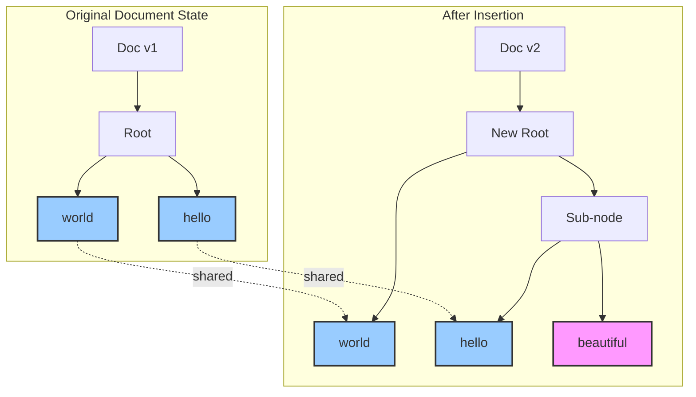

# A Visual Guide: Simulating an Insert

Let's walk through a visual example of how a Rope handles an insertion. We'll start with the string "hello world" and insert "beautiful " in the middle.

### Initial State: "hello world"

First, we represent "hello world" as a Rope. For simplicity, we'll break it into two leaves: "hello " and "world".

```mermaid
graph TD
    A[Root<br/>weight=6] --> B[Leaf: "hello "];
    A --> C[Leaf: "world"];

    style B fill:#9cf,stroke:#333,stroke-width:2px
    style C fill:#9cf,stroke:#333,stroke-width:2px
```

*   The root node has a `weight` of 6, which is the length of its left child, "hello ".

### The Goal: Insert "beautiful " at index 6

We want to insert "beautiful " between "hello " and "world". Here's how the Rope accomplishes this without copying the original strings.

#### Step 1: Split the Rope at Index 6

To insert, we first need to split the tree at the target index. We traverse the tree to find the split point.

1.  Start at the Root (`A`): The index `6` is equal to the root's weight `6`. This is a perfect split point. The left side of the split is the root's left child (`B`), and the right side is the root's right child (`C`).

We now have two independent sub-trees:

```mermaid
graph TD
    subgraph "Left Part (index 0-5)"
        B[Leaf: "hello "];
    end
    subgraph "Right Part (index 6+)"
        C[Leaf: "world"];
    end

    style B fill:#9cf,stroke:#333,stroke-width:2px
    style C fill:#9cf,stroke:#333,stroke-width:2px
```

The split creates a clean division at exactly the insertion point. Notice how we don't copy any character data—we simply identify the split point and separate the tree structure.

#### Step 2: Create a New Rope for the Inserted Text

We create a new leaf node for the string "beautiful ".

```mermaid
graph TD
    D[Leaf: "beautiful "];
    style D fill:#f9f,stroke:#333,stroke-width:2px
```

#### Step 3: Concatenate the Left Part and the New Text

We create a new internal node to concatenate the "hello " rope (our left part) with the new "beautiful " rope.

```mermaid
graph TD
    E[Node<br/>weight=6] --> B[Leaf: "hello "];
    E --> D[Leaf: "beautiful "];

    style B fill:#9cf,stroke:#333,stroke-width:2px
    style D fill:#f9f,stroke:#333,stroke-width:2px
```

*   This new node `E` has a `weight` of 6 (the length of its new left child, "hello ").

#### Step 4: Concatenate the Result with the Right Part

Finally, we create a new root node to concatenate our newly formed rope (`E`) with the remaining "world" part (`C`).

```mermaid
graph TD
    F[New Root<br/>weight=16] --> E[Node<br/>weight=6];
    F --> C[Leaf: "world"];
    E --> B[Leaf: "hello "];
    E --> D[Leaf: "beautiful "];

    style B fill:#9cf,stroke:#333,stroke-width:2px
    style C fill:#9cf,stroke:#333,stroke-width:2px
    style D fill:#f9f,stroke:#333,stroke-width:2px
```

*   The new root `F` has a `weight` of 16, which is the length of its left subtree (`E`), which is 6 ("hello ") + 10 ("beautiful ").

### Final Result

The final tree represents the string "hello beautiful world". Notice what we *didn't* do. We never modified the original "hello " and "world" leaves. We didn't copy any characters. We only created a few new internal nodes and pointed them to the existing leaves and the new leaf. This is why Ropes are so efficient for this kind of operation. We've performed a major string modification with just a few cheap pointer changes.

### Performance Analysis: The Numbers Don't Lie

Let's compare what just happened:

```mermaid
graph TD
    subgraph "Traditional String Insertion"
        A1[Original: "hello world"<br/>12 characters] --> A2[Allocate 22 chars]
        A2 --> A3[Copy "hello " (6 chars)]
        A3 --> A4[Copy "beautiful " (10 chars)]
        A4 --> A5[Copy "world" (5 chars)]
        A5 --> A6[Free original 12 chars]
        A6 --> A7[Result: 33 operations]
    end
    
    subgraph "Rope Insertion"
        B1[Original rope] --> B2[Split at index 6<br/>1 tree traversal]
        B2 --> B3[Create new leaf<br/>1 allocation]
        B3 --> B4[Create 2 internal nodes<br/>2 allocations]
        B4 --> B5[Result: 4 operations]
    end
    
    style A7 fill:#faa,stroke:#f00,stroke-width:2px
    style B5 fill:#afa,stroke:#0f0,stroke-width:2px
```

**Traditional String**: 33 operations (mostly character copying)
**Rope**: 4 operations (all pointer manipulations)

For a 1MB file with the same insertion:
- **Traditional**: ~1 million character copies + memory allocation overhead
- **Rope**: Still just 4 operations!

### Memory Sharing Visualization

Here's the beautiful part about structural sharing:



Both document versions coexist in memory, sharing the original text data. This is how text editors can provide instant undo/redo with minimal memory overhead.

### When Split Points Aren't Perfect

Our example was convenient—the split happened exactly at a node boundary. But what if we want to insert "big " at index 2 (inside "hello")?

```mermaid
graph TD
    subgraph "Insert at Index 2: Split Inside Leaf"
        A[Target: Insert "big " at index 2]
        A --> B[Split "hello " into "he" + "llo "]
        B --> C[Create: "he" + "big " + "llo " + "world"]
    end
    
    subgraph "Resulting Structure"
        D[New Root] --> E[Sub-node]
        D --> F[world]
        E --> G[Sub-node2] 
        E --> H[llo ]
        G --> I[he]
        G --> J[big ]
    end
    
    style I fill:#9cf,stroke:#333,stroke-width:2px
    style J fill:#f9f,stroke:#333,stroke-width:2px
    style H fill:#9cf,stroke:#333,stroke-width:2px
    style F fill:#9cf,stroke:#333,stroke-width:2px
```

Even when we need to split leaf nodes, we still only copy the small fragments being split, not the entire document. The scalability advantage remains intact.