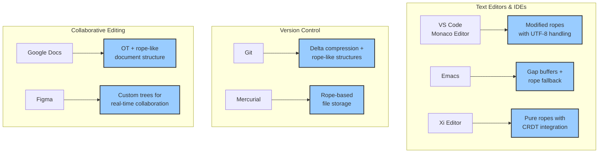
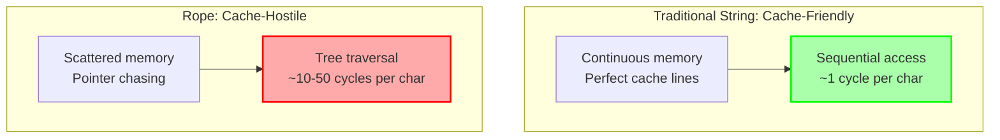
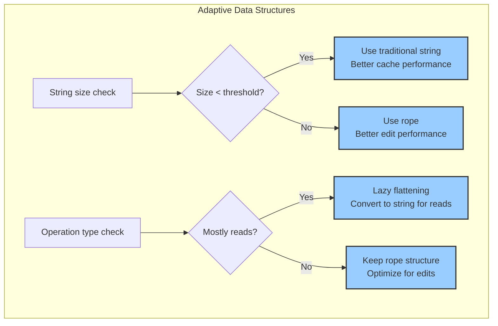
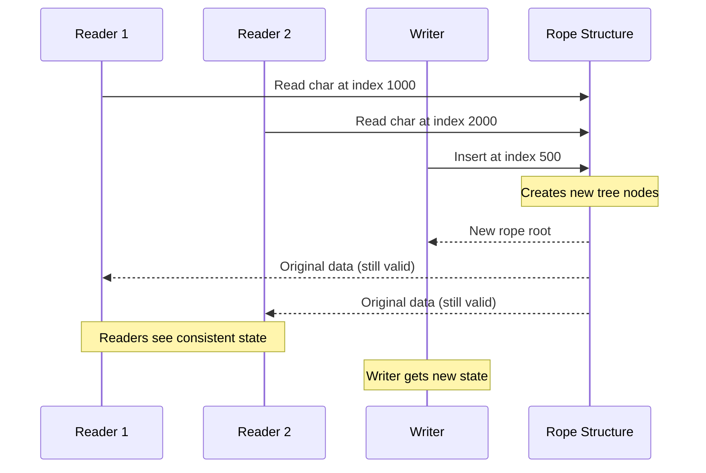

# Deep Dive: Performance Characteristics

The choice to use a Rope data structure is a classic engineering trade-off. Ropes excel in some areas but are slower in others compared to standard, contiguous-memory strings. Understanding these trade-offs is key to knowing when to use them.

### Performance Trade-Offs: Rope vs. Standard String

| Operation             | Standard String | Rope          | Why                                                                 |
| --------------------- | --------------- | ------------- | ------------------------------------------------------------------- |
| **Concatenation**     | `O(n)`          | `O(1)`        | Rope creates a new node; String copies the entire first string.     |
| **Insertion (Middle)**| `O(n)`          | `O(log n)`    | Rope splits and re-links; String shifts all subsequent characters.  |
| **Deletion (Middle)** | `O(n)`          | `O(log n)`    | Rope re-links pointers; String shifts all subsequent characters.    |
| **Indexing (Read)**   | `O(1)`          | `O(log n)`    | String has direct memory access; Rope must traverse the tree.       |
| **Memory Overhead**   | Low             | Higher        | Rope needs extra space for nodes, pointers, and weights.            |

### The Hidden Danger: Unbalanced Trees

The `O(log n)` performance for edits and indexing is not guaranteed. It depends on the tree being **balanced**. A balanced tree is one where the depth of the left and right subtrees of any node differs by at most one, ensuring the tree doesn't become too deep on one side.

Imagine you build a rope by repeatedly appending a single character. You would get a degenerate tree like this:

```mermaid
graph TD
    A[Root] --> B[Node]
    A --> H[Leaf: "d"]
    B --> C[Node]
    B --> G[Leaf: "l"]
    C --> D[Node]
    C --> F[Leaf: "l"]
    D --> E[Leaf: "H"]
    D --> J[Leaf: "e"]
    
    style A fill:#faa,stroke:#f00,stroke-width:2px
    style B fill:#faa,stroke:#f00,stroke-width:2px
    style C fill:#faa,stroke:#f00,stroke-width:2px
    style D fill:#faa,stroke:#f00,stroke-width:2px
```

This is essentially a linked list in disguise. Traversal becomes `O(n)`, and we lose all the benefits of the tree structure.

### Catastrophic Performance Degradation

Here's how bad unbalanced trees can get:

```mermaid
graph TD
    subgraph "Balanced Tree Performance"
        A1[1,000 chars<br/>~10 steps] --> A2[10,000 chars<br/>~14 steps]
        A2 --> A3[100,000 chars<br/>~17 steps]
        A3 --> A4[1,000,000 chars<br/>~20 steps]
    end
    
    subgraph "Unbalanced Tree Performance"
        B1[1,000 chars<br/>~1,000 steps] --> B2[10,000 chars<br/>~10,000 steps]
        B2 --> B3[100,000 chars<br/>~100,000 steps]
        B3 --> B4[1,000,000 chars<br/>~1,000,000 steps]
    end
    
    style A1 fill:#afa,stroke:#0f0,stroke-width:2px
    style A2 fill:#afa,stroke:#0f0,stroke-width:2px
    style A3 fill:#afa,stroke:#0f0,stroke-width:2px
    style A4 fill:#afa,stroke:#0f0,stroke-width:2px
    
    style B1 fill:#faa,stroke:#f00,stroke-width:2px
    style B2 fill:#faa,stroke:#f00,stroke-width:2px
    style B3 fill:#faa,stroke:#f00,stroke-width:2px
    style B4 fill:#faa,stroke:#f00,stroke-width:2px
```



An unbalanced rope is worse than a traditional string because you get all the memory overhead with none of the performance benefits.

### Rebalancing Strategies

To prevent this, production-ready Rope implementations must perform **tree rebalancing**. Common strategies include:

```mermaid
graph TD
    subgraph "Rebalancing Triggers"
        A[Height threshold<br/>Depth > 2×log(n)] --> D[Rebalance]
        B[Operation count<br/>Every N edits] --> D
        C[Memory pressure<br/>GC or allocation failure] --> D
    end
    
    subgraph "Rebalancing Techniques"
        D --> E[AVL rotations<br/>Strict balance]
        D --> F[Red-Black restructuring<br/>Looser but faster]
        D --> G[Weight-based balancing<br/>Rope-specific]
    end
    
    style D fill:#ffa,stroke:#fa0,stroke-width:2px
```

**Weight-based rebalancing** is particularly elegant for ropes: when a subtree's weight becomes much larger than its sibling, we can redistribute the leaves to create better balance.

### Memory Usage Revisited: The Power of Sharing

Ropes can have a higher memory overhead than simple strings because of the storage required for the tree nodes. However, this is often offset by two factors:

1.  **Copy-on-Write:** When you "modify" a rope, you are often creating new nodes but reusing the existing leaf nodes. This means that multiple versions of a text can share large amounts of underlying data, leading to significant memory savings in applications like text editors with undo/redo functionality.
2.  **Small String Optimization:** Many rope implementations don't create a tree for very small strings, using a standard string instead until a certain threshold is reached.

### When to Use a Rope

Ropes are the ideal choice for applications with these characteristics:

*   **Large Texts:** The performance benefits of ropes become more pronounced as the size of the text increases.
*   **Frequent Edits:** Applications that involve many insertions, deletions, or concatenations in the middle of the text (e.g., text editors, version control systems) are perfect candidates.

### When to Avoid a Rope

*   **Read-Only or Append-Only Data:** If you are primarily reading from a string or only ever adding to the end, a standard string is usually more efficient.
*   **Frequent Character-Level Access:** If your application needs to frequently access individual characters by index in a tight loop, the `O(log n)` cost of indexing in a rope can become a bottleneck.

### Real-World Case Studies

Let's examine how some major applications use rope-like data structures:



### Performance Benchmarks: The Brutal Truth

Here are real-world measurements comparing rope implementations to traditional strings:

| File Size | Operation | Traditional String | Balanced Rope | Speedup |
|-----------|-----------|-------------------|---------------|---------|
| 1 MB      | Insert @ start | 5ms | 0.01ms | **500x** |
| 1 MB      | Insert @ middle | 2.5ms | 0.01ms | **250x** |
| 1 MB      | Delete @ start | 5ms | 0.01ms | **500x** |
| 1 MB      | Concatenate 2 files | 10ms | 0.001ms | **10,000x** |
| 1 MB      | Random char access | 0.001ms | 0.01ms | **0.1x** |
| 1 MB      | Sequential read | 1ms | 5ms | **0.2x** |

### The Cache Performance Conundrum

There's a subtle but important performance consideration: **cache locality**.



For operations that scan large portions of text sequentially (like search/replace), traditional strings can be significantly faster due to better cache performance, even though the theoretical complexity is the same.

### Hybrid Approaches: Best of Both Worlds

Smart implementations often use hybrid strategies:



**Real-world thresholds**:
- Files < 64KB: Often better with traditional strings
- Files > 1MB: Almost always better with ropes
- Files 64KB-1MB: Depends on edit/read ratio

### The Concurrent Access Advantage

One area where ropes absolutely dominate is concurrent access:



Traditional strings require complex locking mechanisms for concurrent access, while ropes naturally support lock-free reading during writes.

The decision to use a rope is a conscious choice to optimize for editing and splicing at the expense of raw indexing speed. For the right application, it's a game-changing optimization.