# The Core Problem: When Distributed Transactions Break Down

## The Nightmare Scenario

Picture this: You're building an e-commerce platform where placing an order involves three separate microservices:

1. **Payment Service** - Charges the customer's credit card
2. **Inventory Service** - Reserves the product 
3. **Shipping Service** - Schedules delivery

In a perfect world, either all three operations succeed, or none of them do. But we live in a distributed world where networks fail, services crash, and timeouts happen.

## The Traditional Solution: Two-Phase Commit (2PC)

The textbook solution is **Two-Phase Commit (2PC)**:


1. **Phase 1 (Prepare)**: Coordinator asks all services: "Can you commit this transaction?"
2. **Phase 2 (Commit/Abort)**: If everyone says yes, coordinator tells everyone to commit. If anyone says no, everyone aborts.

This sounds elegant, but it has a fatal flaw.

## Why Two-Phase Commit Falls Apart

### The Blocking Problem

2PC blocks. If the coordinator crashes between phases, all participants are stuck waiting indefinitely. They can't commit (no confirmation from coordinator) and they can't abort (they already voted yes).


```
Payment Service: "I reserved $100, but I don't know if I should charge it..."
Inventory Service: "I reserved 1 iPhone, but I don't know if I should release it..."
Shipping Service: "I scheduled a pickup, but I don't know if I should cancel it..."
```

### The Availability Trade-off

2PC requires **synchronous coordination**. Every participant must be available and responsive for the entire transaction to succeed. In a world of:
- Network partitions
- Service maintenance windows  
- Cascading failures
- Geographic distribution

This becomes a recipe for system-wide outages.

### The Performance Problem

2PC requires **multiple round trips**:
1. Prepare phase: 1 round trip to each service
2. Commit phase: 1 round trip to each service
3. Plus coordinator logging and crash recovery

This adds significant latency and resource holding time.

## The Real-World Impact

Here's what happens when 2PC fails in production:

```mermaid
graph TD
    A[Customer Places Order] --> B[Payment Service]
    A --> C[Inventory Service]
    A --> D[Shipping Service]
    
    B --> E[✓ Card Charged]
    C --> F[✗ Service Crashes]
    D --> G[⏳ Waits Indefinitely]
    
    E --> H[Money Taken]
    F --> I[No Product Reserved]
    G --> J[Resources Locked]
    
    H --> K[Customer Complaint]
    I --> L[Data Inconsistency]
    J --> M[System Deadlock]
    
    K --> N[Manual Intervention Required]
    L --> N
    M --> N
    
    style F fill:#ffcccc
    style G fill:#ffffcc
    style H fill:#ffcccc
    style I fill:#ffcccc
    style J fill:#ffcccc
    style K fill:#ffcccc
    style L fill:#ffcccc
    style M fill:#ffcccc
    style N fill:#ff6666
```



**E-commerce Example:**
- Customer places order
- Payment service charges card ✓
- Inventory service crashes during prepare phase ✗
- Shipping service waits indefinitely
- Customer is charged but gets no product
- Manual intervention required

**Banking Example:**
- Transfer $1000 from Account A to Account B
- Account A debits $1000 ✓
- Network partition occurs
- Account B never receives credit
- Money "disappears" from the system
- Regulatory nightmare

## The Fundamental Question

How do we maintain **consistency** across distributed services without:
- Blocking operations
- Requiring perfect availability
- Sacrificing performance
- Creating single points of failure

The answer isn't to make distributed transactions more reliable. The answer is to **eliminate the need for distributed transactions entirely**.

## Enter the Saga Pattern

Instead of trying to make all operations atomic, we break them into **a sequence of local transactions**, each with a **compensating action** that can undo its effects.


Think of it like booking a vacation:
1. Book flight (can be cancelled)
2. Book hotel (can be cancelled)  
3. Book rental car (can be cancelled)

If the car rental fails, you don't lose your money - you just cancel the hotel and flight bookings.

This is the core insight of the Saga pattern: **Instead of preventing failure, we plan for it**.

## The Mental Shift


Traditional thinking: "How do we make sure nothing goes wrong?"
Saga thinking: "When something goes wrong, how do we clean up?"

This isn't just a technical pattern - it's a fundamental shift in how we think about distributed system design. We move from **pessimistic consistency** (assume failure is rare) to **optimistic consistency** (assume failure is normal).

The saga pattern transforms the question from "How do we prevent partial failures?" to "How do we recover from partial failures gracefully?"

In the next section, we'll explore the philosophy behind this approach and why it's more aligned with how distributed systems actually behave.