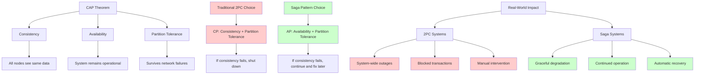
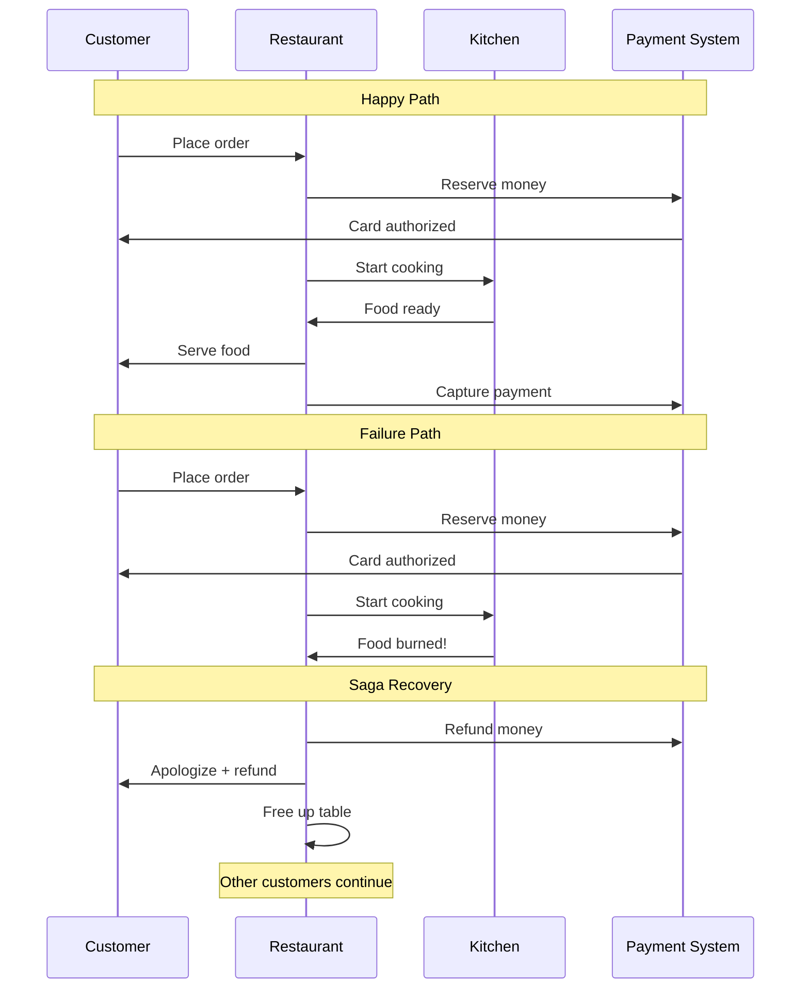
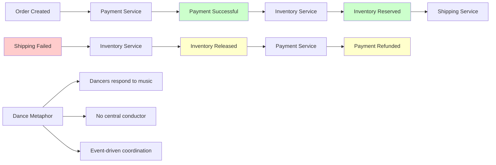
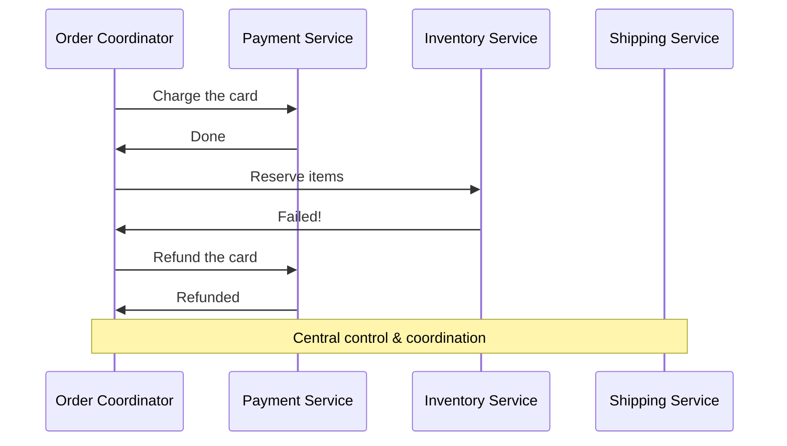

# The Guiding Philosophy: Embrace Eventual Consistency

## The Paradigm Shift

The saga pattern represents a fundamental philosophical shift in how we think about distributed systems. Instead of fighting the distributed nature of our systems, we embrace it.

## Core Principle 1: Failure is Normal, Not Exceptional

Traditional systems treat failure as an exception - something that shouldn't happen. Saga-based systems treat failure as a normal part of operation.

**Traditional Mindset:**
- "We'll use timeouts and retries to handle the rare network issue"
- "If we make the system robust enough, failures won't happen"
- "Consistency means everything happens atomically"

**Saga Mindset:**
- "Networks are unreliable, services will fail, let's design for it"
- "Failures are not bugs - they're features we need to handle gracefully"
- "Consistency means we can always reach a consistent state, even after failures"

## Core Principle 2: Prefer Availability Over Consistency

The saga pattern makes a deliberate choice in the famous **CAP theorem trade-off**:



- **Consistency**: All nodes see the same data at the same time
- **Availability**: System remains operational
- **Partition Tolerance**: System continues to operate despite network failures

Sagas choose **Availability + Partition Tolerance** over **Consistency + Partition Tolerance**.

### What This Means in Practice

```
Traditional (CP): "If we can't guarantee consistency, shut down"
Saga (AP): "If we can't guarantee immediate consistency, continue operating and fix it later"
```

## Core Principle 3: Eventual Consistency is Good Enough

The saga pattern embraces **eventual consistency** - the idea that the system will become consistent over time, even if it's temporarily inconsistent.

### Real-World Analogy: The Restaurant



When you order food at a restaurant:

1. **Order placed** (money reserved on your card)
2. **Kitchen starts cooking** (ingredients allocated)
3. **Food served** (transaction complete)

But what if the kitchen burns your food?

**Traditional approach**: Block the entire restaurant until we figure out what to do
**Saga approach**: Refund your money, free up the table, let other customers continue

The system temporarily had your money reserved for food you didn't get, but it quickly became consistent again.

## Core Principle 4: Compensation Over Prevention

Instead of preventing failures, we plan for recovery.

```mermaid
graph TD
    A[Business Operations] --> B[Forward Actions]
    A --> C[Compensating Actions]
    
    B --> B1[Book hotel room]
    B --> B2[Charge credit card]
    B --> B3[Reserve inventory]
    B --> B4[Send email]
    B --> B5[Schedule delivery]
    
    C --> C1[Cancel reservation]
    C --> C2[Issue refund]
    C --> C3[Release reservation]
    C --> C4[Send cancellation notice]
    C --> C5[Cancel shipment]
    
    D[Real Business Practices] --> E[Refund Policies]
    D --> F[Cancellation Procedures]
    D --> G[Customer Service]
    D --> H[Return Processes]
    
    I[Compensation Principles] --> J[Business Meaningful]
    I --> K[Not Just Technical Rollback]
    I --> L[Follows Business Rules]
    I --> M[Customer Friendly]
    
    style A fill:#ffcc99
    style B fill:#ccffcc
    style C fill:#ffcccc
    style D fill:#ccffcc
    style I fill:#ffffcc
```



### The Compensation Mindset

Every business operation should have a **compensating action**:

- **Book hotel room** ↔ **Cancel reservation**
- **Charge credit card** ↔ **Issue refund**
- **Reserve inventory** ↔ **Release reservation**
- **Send email** ↔ **Send cancellation notice**

This isn't just technical - it mirrors how business actually works. Real businesses have refund policies, cancellation procedures, and customer service departments.

## Core Principle 5: Business Logic Drives Technical Design

Sagas force us to think about the business process explicitly:

- What are the steps in this business process?
- What happens if each step fails?
- How do we communicate with customers about failures?
- What business rules govern cancellations and refunds?

This alignment between business logic and technical implementation is a feature, not a bug.

## The Mental Model: Choreography vs. Orchestration

The saga pattern offers two approaches to coordination:

### Choreography: Event-Driven Dance



Services communicate through events, like dancers responding to music:

```
Payment Service: "Payment successful!" 
  → Inventory Service: "I'll reserve items"
  → Shipping Service: "I'll schedule delivery"
```

If something fails, compensating events propagate:

```
Shipping Service: "Delivery failed!"
  → Inventory Service: "I'll release items"
  → Payment Service: "I'll refund payment"
```

### Orchestration: Central Conductor



A central coordinator directs the process:

```
Order Coordinator: "Payment Service, charge the card"
Payment Service: "Done"
Order Coordinator: "Inventory Service, reserve items"
Inventory Service: "Failed"
Order Coordinator: "Payment Service, refund the card"
```

## Trade-offs and Consequences

```mermaid
graph TD
    A[Saga Pattern Trade-offs] --> B[What You Gain]
    A --> C[What You Give Up]
    
    B --> B1[Resilience]
    B --> B2[Availability]
    B --> B3[Scalability]
    B --> B4[Flexibility]
    
    C --> C1[Immediate Consistency]
    C --> C2[Simplicity]
    C --> C3[Atomicity]
    C --> C4[Isolation]
    
    B1 --> B1a[No single point of failure]
    B2 --> B2a[System runs during partial failures]
    B3 --> B3a[Services scale independently]
    B4 --> B4a[Business processes evolve independently]
    
    C1 --> C1a[System may be temporarily inconsistent]
    C2 --> C2a[More complex to reason about]
    C3 --> C3a[No all-or-nothing guarantee]
    C4 --> C4a[Intermediate states visible]
    
    D[Decision Framework] --> E[Choose Sagas When]
    D --> F[Avoid Sagas When]
    
    E --> E1[Availability > Consistency]
    E --> E2[Graceful degradation needed]
    E --> E3[Independent service scaling]
    
    F --> F1[Strong consistency required]
    F --> F2[Compensation impossible]
    F --> F3[Truly atomic operations]
    
    style B fill:#ccffcc
    style C fill:#ffcccc
    style E fill:#ccffcc
    style F fill:#ffcccc
```



### What You Gain

1. **Resilience**: No single point of failure
2. **Availability**: System keeps running during partial failures
3. **Scalability**: Services can be scaled independently
4. **Flexibility**: Business processes can evolve independently

### What You Give Up

1. **Immediate consistency**: System may be temporarily inconsistent
2. **Simplicity**: More complex to reason about and debug
3. **Atomicity**: No guarantee that all operations succeed or fail together
4. **Isolation**: Intermediate states may be visible to other processes

## The Philosophical Question

The saga pattern forces us to ask: **Is perfect consistency worth system-wide unavailability?**

In most business contexts, the answer is no. It's better to:
- Process 99% of orders successfully
- Handle the 1% of failures gracefully
- Keep the system running for all users

Than to:
- Block all orders when one service has issues
- Require perfect coordination across all services
- Sacrifice availability for consistency

## When NOT to Use Sagas

```mermaid
graph TD
    A[Saga Suitability Decision] --> B[Use Sagas When]
    A --> C[DON'T Use Sagas When]
    
    B --> B1[Availability > Consistency]
    B --> B2[Graceful degradation possible]
    B --> B3[Natural compensation exists]
    B --> B4[Business process is divisible]
    
    C --> C1[Strong consistency legally required]
    C --> C2[Compensation impossible]
    C --> C3[Business process truly atomic]
    C --> C4[Intermediate states unacceptable]
    
    D[Examples: Use Sagas] --> E[E-commerce order processing]
    D --> F[User registration workflow]
    D --> G[Travel booking system]
    D --> H[Content publication pipeline]
    
    I[Examples: DON'T Use Sagas] --> J[Financial transactions]
    I --> K[Medical record updates]
    I --> L[Authentication systems]
    I --> M[Regulatory compliance]
    
    N[Key Questions] --> O["Can we compensate?"]  
    N --> P["Is eventual consistency OK?"]  
    N --> Q["Are intermediate states acceptable?"]  
    N --> R["Is availability more important than consistency?"]
    
    style B fill:#ccffcc
    style C fill:#ffcccc
    style D fill:#ccffcc
    style I fill:#ffcccc
    style O fill:#ffffcc
    style P fill:#ffffcc
    style Q fill:#ffffcc
    style R fill:#ffffcc
```



Sagas aren't appropriate when:
- **Strong consistency is legally required** (financial transactions, medical records)
- **Compensation is impossible** (you can't "unsend" an email to a customer)
- **Business process is truly atomic** (all steps must succeed or the business process is meaningless)

## The Bottom Line

```mermaid
graph TD
    A[Saga Philosophy] --> B[Accept Reality]
    A --> C[Embrace Trade-offs]
    A --> D[Design for Recovery]
    A --> E[Align with Business]
    
    B --> B1[Distributed systems are unreliable]
    B --> B2[Failures are normal, not exceptional]
    B --> B3[Perfect coordination impossible]
    
    C --> C1[Eventual consistency is practical]
    C --> C2[Availability over consistency]
    C --> C3[Graceful degradation over blocking]
    
    D --> D1[Plan for failure scenarios]
    D --> D2[Compensating actions ready]
    D --> D3[Recovery over prevention]
    
    E --> E1[Technical patterns mirror business]
    E --> E2[Compensation follows business rules]
    E --> E3[System behavior matches expectations]
    
    F[Core Transformation] --> G[From Fighting Distribution]
    F --> H[To Embracing Distribution]
    
    G --> G1[Complex coordination protocols]
    G --> G2[Blocking transactions]
    G --> G3[All-or-nothing thinking]
    
    H --> H1[Simple local transactions]
    H --> H2[Non-blocking operations]
    H --> H3[Graceful failure handling]
    
    style A fill:#ffcc99
    style B fill:#ccffcc
    style C fill:#ccffcc
    style D fill:#ccffcc
    style E fill:#ccffcc
    style F fill:#ffffcc
    style G fill:#ffcccc
    style H fill:#ccffcc
```



The saga pattern isn't just a technical pattern - it's a philosophical approach to building distributed systems that:

1. **Accepts** that distributed systems are inherently unreliable
2. **Embraces** eventual consistency as a practical trade-off
3. **Designs** for recovery rather than prevention
4. **Aligns** technical implementation with business reality

This philosophy prepares us for the key abstractions that make sagas work in practice, which we'll explore in the next section.