# Key Abstractions: The Building Blocks of Sagas

## The Core Abstractions

The saga pattern is built on three fundamental abstractions that mirror how we handle complex processes in the real world:

1. **Steps** - The individual actions in a business process
2. **Compensations** - The undo actions for each step
3. **Coordinator** - The entity that manages the process

Let's explore each one through the lens of a familiar analogy: booking a vacation.

## Abstraction 1: Steps

A **step** is a single, atomic business operation that can either succeed or fail. Each step:

- Has a clear business purpose
- Can be executed independently
- Produces a deterministic outcome
- Maintains local consistency

### The Vacation Booking Example

```
Step 1: Book Flight
- Input: Departure city, destination, dates
- Action: Reserve seats, charge card
- Output: Confirmation number or failure

Step 2: Book Hotel  
- Input: Destination, check-in/out dates
- Action: Reserve room, charge card
- Output: Reservation number or failure

Step 3: Book Rental Car
- Input: Pickup location, dates
- Action: Reserve vehicle, charge card
- Output: Reservation ID or failure
```

### Key Properties of Steps

1. **Idempotent**: Running the same step multiple times has the same effect
2. **Atomic**: Each step either fully succeeds or fully fails
3. **Isolated**: Steps don't interfere with each other
4. **Durable**: Once a step commits, its effects persist

## Abstraction 2: Compensations

A **compensation** is the business-meaningful way to undo the effects of a step. Compensations are not just technical rollbacks - they're business processes.

### The Vacation Booking Compensations

```
Step 1: Book Flight → Compensation: Cancel Flight
- Action: Cancel reservation, process refund
- Business rule: May incur cancellation fee
- Result: Seat released, money returned (minus fee)

Step 2: Book Hotel → Compensation: Cancel Hotel
- Action: Cancel reservation, process refund  
- Business rule: Free cancellation if >24 hours
- Result: Room released, money returned (maybe)

Step 3: Book Car → Compensation: Cancel Car Rental
- Action: Cancel reservation, process refund
- Business rule: Free cancellation anytime
- Result: Vehicle released, money returned
```

### Key Properties of Compensations

1. **Semantic**: They understand the business meaning of "undo"
2. **Idempotent**: Can be safely executed multiple times
3. **Best-effort**: May not perfectly undo (e.g., cancellation fees)
4. **Business-aware**: Follow real business rules and policies

### The Compensation Guarantee

Compensations don't guarantee perfect rollback - they guarantee **semantically meaningful rollback**. If you can't get a full refund due to cancellation policies, that's still a successful compensation.

## Abstraction 3: Coordinator

The **coordinator** orchestrates the saga, deciding when to execute steps and when to trigger compensations.

### Two Types of Coordinators

#### 1. Orchestrator (Central Coordinator)

A single service that directs the entire process:

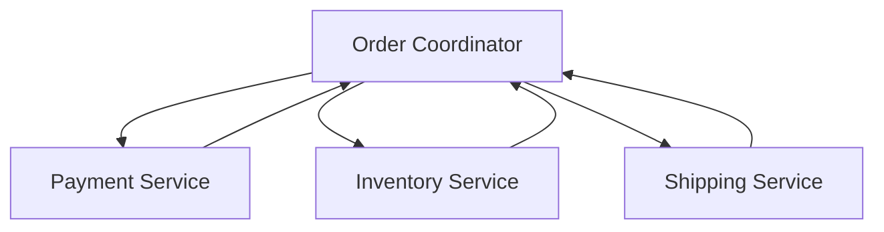

#### 2. Choreographer (Distributed Coordination)

Services coordinate through events:

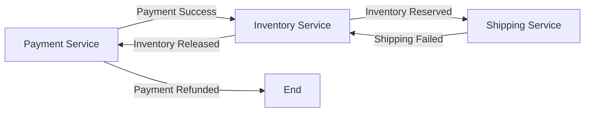

## The Saga State Machine

Every saga can be modeled as a state machine:

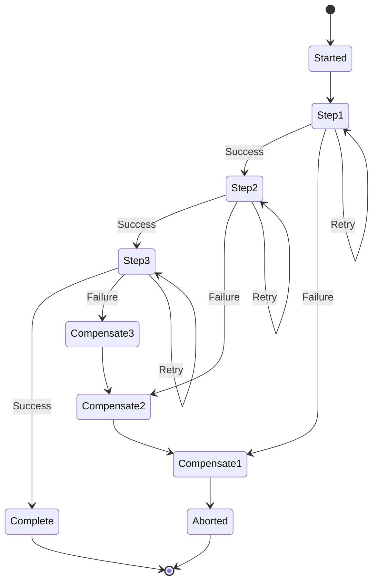

### State Transitions

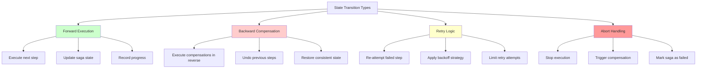

- **Forward**: Execute the next step
- **Backward**: Execute compensations in reverse order
- **Retry**: Re-attempt a failed step
- **Abort**: Stop execution and compensate

## Saga Execution Patterns

### Pattern 1: Linear Saga

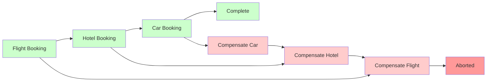

Steps execute in sequence:

```
Flight Booking → Hotel Booking → Car Booking
```

### Pattern 2: Parallel Saga

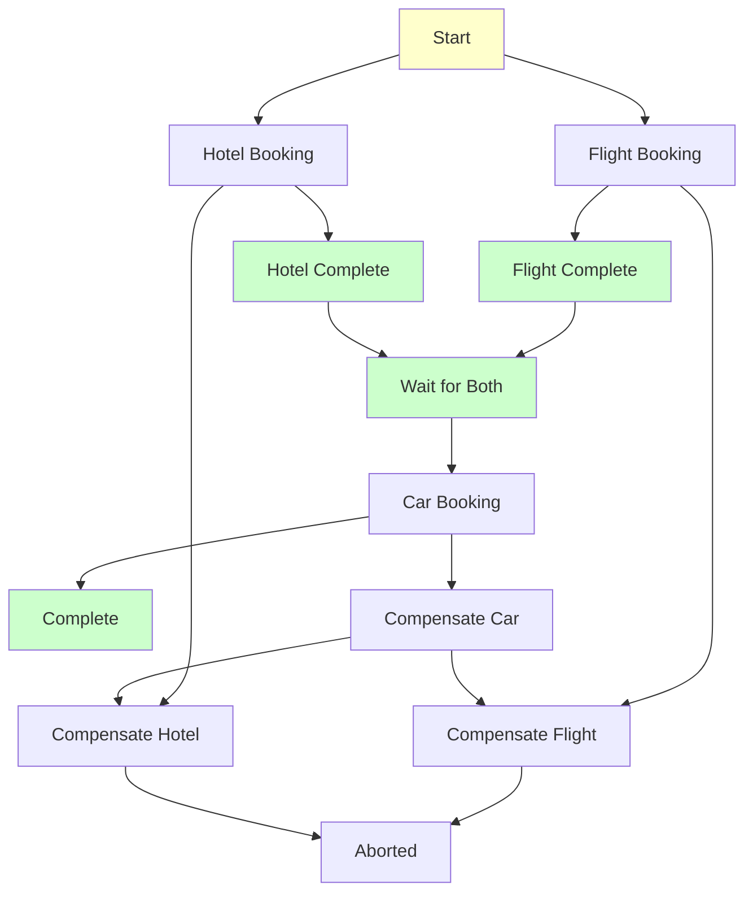

Independent steps execute concurrently:

```
Flight Booking ⟍
                 ⟩ → Continue when both complete
Hotel Booking  ⟋
```

### Pattern 3: Conditional Saga

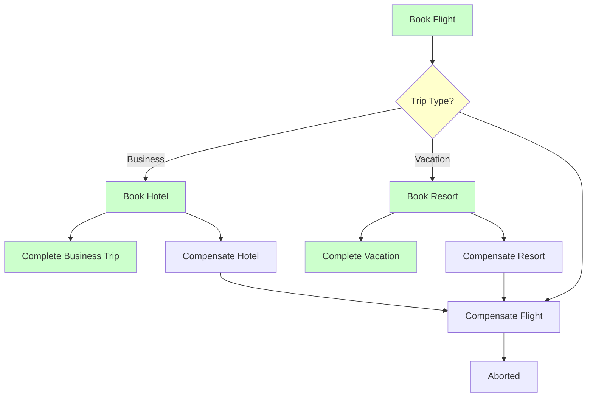

Steps execute based on conditions:

```
Book Flight → If (Business Trip) → Book Hotel
             → If (Vacation) → Book Resort
```

## Error Handling Strategies

### 1. Immediate Compensation

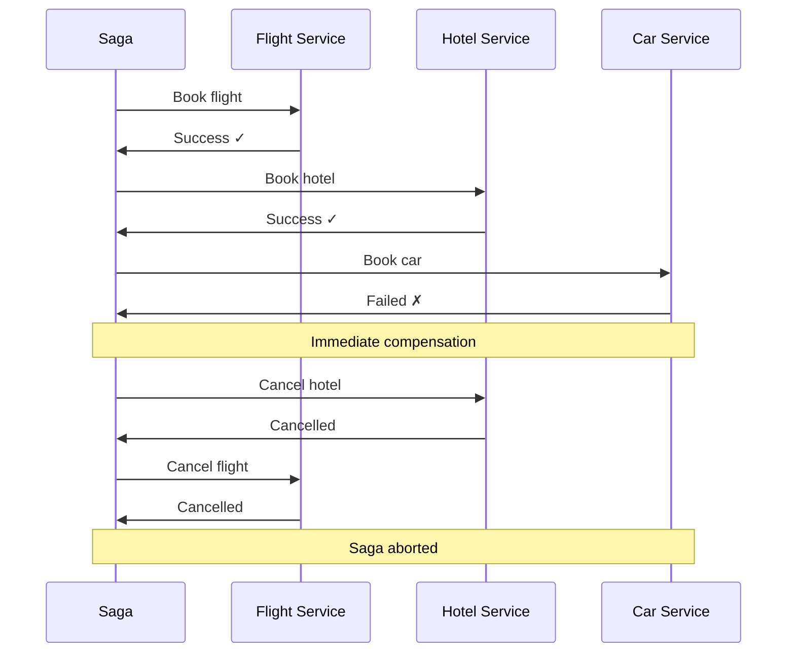

As soon as a step fails, start compensating:

```
Flight ✓ → Hotel ✓ → Car ✗ → Cancel Hotel → Cancel Flight
```

### 2. Retry with Backoff

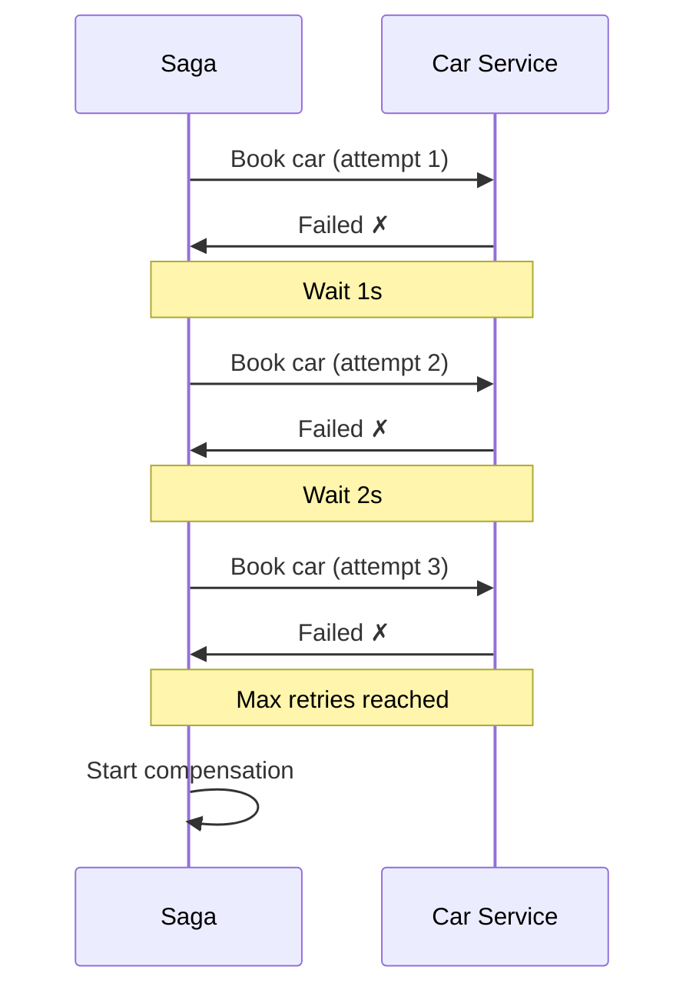

Try to recover from transient failures:

```
Flight ✓ → Hotel ✓ → Car ✗ → Wait → Car ✗ → Wait → Car ✗ → Compensate
```

### 3. Circuit Breaker

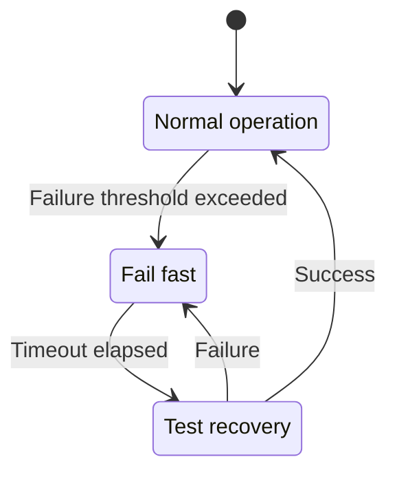

Stop trying if a service is clearly down:

```
Flight ✓ → Hotel ✓ → Car ✗ → (Car service down) → Compensate immediately
```

## The Data Model

### Saga Instance

```
SagaInstance {
    id: UUID
    type: "order_processing"
    state: "step_2_executing"
    context: { order_id: 123, amount: 99.99 }
    steps_completed: [step_1, step_2]
    compensations_executed: []
    created_at: timestamp
    updated_at: timestamp
}
```

### Step Definition

```
StepDefinition {
    name: "charge_payment"
    service: "payment_service"
    action: "POST /charges"
    compensation: "issue_refund"
    timeout: 30_seconds
    retry_policy: exponential_backoff
}
```

## The Mental Model: Booking a Vacation

When you book a vacation, you intuitively understand sagas:

1. **Steps**: Each booking is independent
2. **Compensations**: You can cancel each booking
3. **Coordination**: You manage the overall process
4. **Failure handling**: If one booking fails, you cancel the others
5. **Business rules**: Cancellation policies vary by provider

This isn't a technical abstraction - it's how complex processes work in the real world.

## The Implementation Spectrum

```mermaid
graph TD
    A[Implementation Approaches] --> B[Lightweight]
    A --> C[Heavyweight]
    
    B --> B1[Function Calls]
    B --> B2[Simple State Machine]
    B --> B3[Manual Compensation]
    
    C --> C1[Saga Framework]
    C --> C2[Workflow Engine]
    C --> C3[Event Sourcing]
    
    D[Trade-offs] --> E[Lightweight Pros]
    D --> F[Lightweight Cons]
    D --> G[Heavyweight Pros]
    D --> H[Heavyweight Cons]
    
    E --> E1[Simple to understand]
    E --> E2[Easy to debug]
    E --> E3[Low overhead]
    
    F --> F1[Manual error handling]
    F --> F2[No built-in recovery]
    F --> F3[Hard to monitor]
    
    G --> G1[Automatic recovery]
    G --> G2[Built-in monitoring]
    G --> G3[Distributed execution]
    
    H --> H1[Complex setup]
    H --> H2[Learning curve]
    H --> H3[Infrastructure overhead]
    
    style B fill:#ccffcc
    style C fill:#ffcccc
    style E fill:#ccffcc
    style F fill:#ffcccc
    style G fill:#ccffcc
    style H fill:#ffcccc
```

### Lightweight: Function Calls

```rust
fn book_vacation() -> Result<VacationBooking, BookingError> {
    let flight = book_flight()?;
    let hotel = book_hotel().or_else(|e| {
        cancel_flight(flight);
        Err(e)
    })?;
    let car = book_car().or_else(|e| {
        cancel_hotel(hotel);
        cancel_flight(flight);
        Err(e)
    })?;
    Ok(VacationBooking { flight, hotel, car })
}
```

### Heavyweight: Saga Framework

```rust
let saga = SagaBuilder::new()
    .step("book_flight", book_flight_handler, cancel_flight_handler)
    .step("book_hotel", book_hotel_handler, cancel_hotel_handler)
    .step("book_car", book_car_handler, cancel_car_handler)
    .build();

saga.execute(booking_request).await?;
```

## Key Insights

```mermaid
graph TD
    A[Saga Abstractions] --> B[Technical Patterns]
    A --> C[Business Processes]
    
    B --> B1[Steps & State Machines]
    B --> B2[Compensation Logic]
    B --> B3[Error Handling]
    
    C --> C1[Business Workflows]
    C --> C2[Recovery Procedures]
    C --> C3[Customer Experience]
    
    D[Key Realizations] --> E[Not Just Technical]
    D --> F[Business-Aware]
    D --> G[Resilient by Design]
    
    E --> E1[Mirror real business processes]
    E --> E2[Follow business rules]
    E --> E3[Align with user expectations]
    
    F --> F1[Compensations != Rollbacks]
    F --> F2[Coordinators implement business logic]
    F --> F3[Failure handling is business-driven]
    
    G --> G1[Designed for recovery]
    G --> G2[Flexible and adaptable]
    G --> G3[Customer-friendly failure modes]
    
    H[Design Principles] --> I[Resilience]
    H --> J[Flexibility]
    H --> K[Business Alignment]
    
    style A fill:#ffcc99
    style B fill:#ccffcc
    style C fill:#ccffcc
    style D fill:#ffffcc
    style H fill:#ccffcc
```

1. **Sagas are not just technical patterns** - they mirror real business processes
2. **Compensations are not rollbacks** - they're business-aware recovery actions
3. **Coordinators don't just sequence operations** - they implement business logic
4. **Failure is handled at the business level** - not just the technical level

These abstractions give us the vocabulary to design distributed systems that behave more like real-world processes: resilient, flexible, and business-aware.

In the next section, we'll see how these abstractions come together in a practical example: processing an e-commerce order.