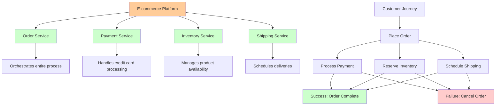
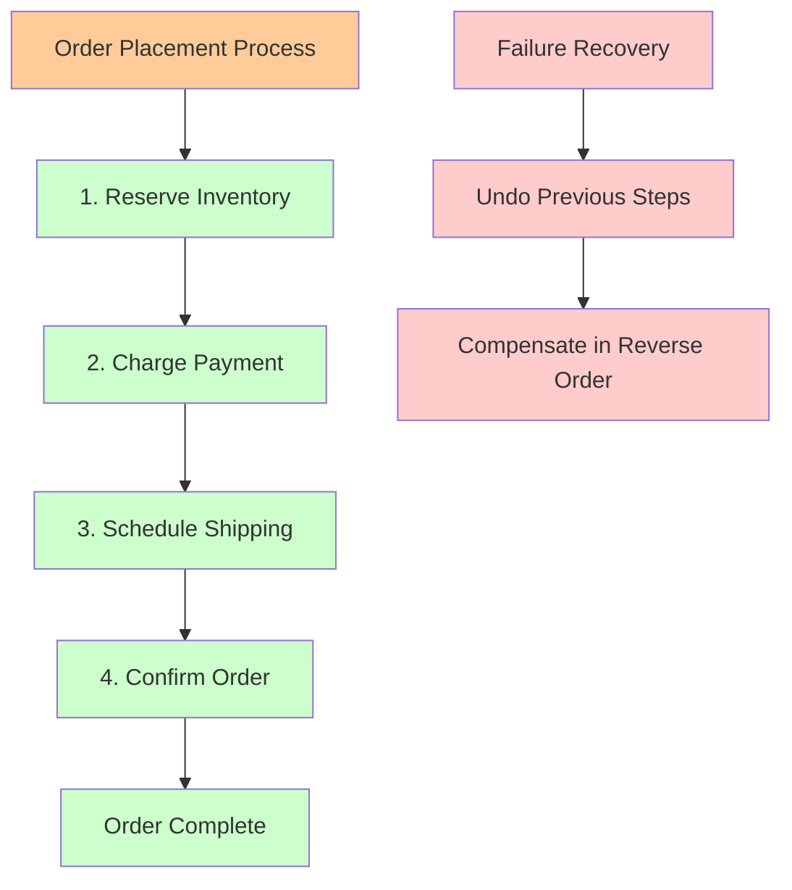
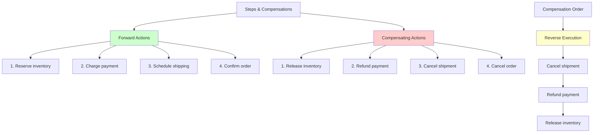
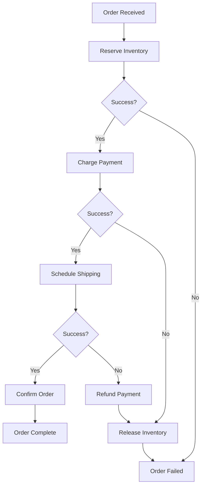
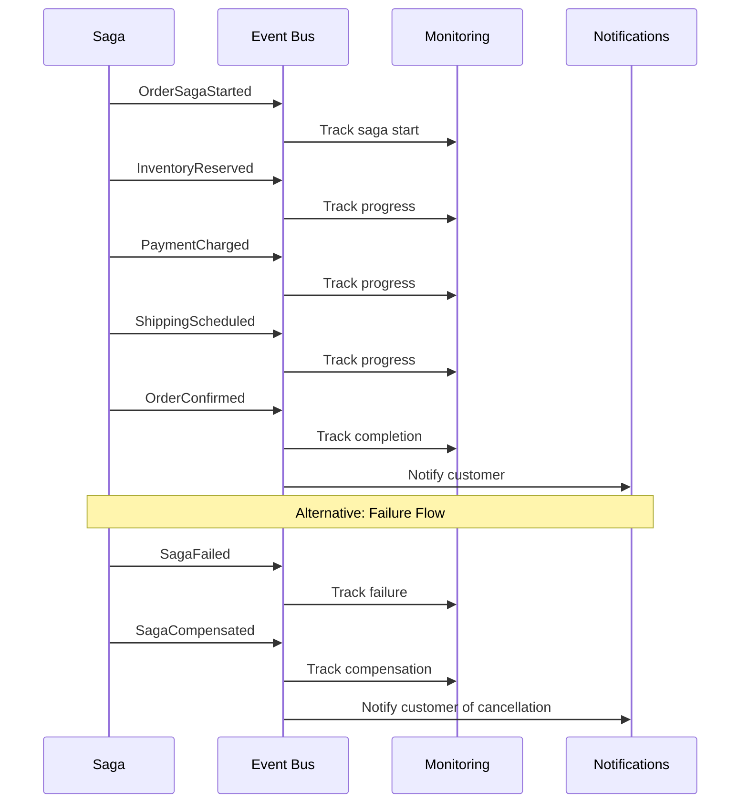

# Order Processing Saga: A Practical Implementation

## The Business Scenario



You're building an e-commerce platform with these microservices:
- **Payment Service**: Handles credit card processing
- **Inventory Service**: Manages product availability
- **Shipping Service**: Schedules deliveries
- **Order Service**: Orchestrates the entire process

When a customer places an order, all three operations must succeed, or the order should be cancelled gracefully.

## The Saga Design

### Step 1: Define the Business Process



```
Order Placement Process:
1. Reserve inventory for the ordered items
2. Charge the customer's payment method
3. Schedule shipping for the order
4. Confirm the order

If any step fails, undo all previous steps.
```

### Step 2: Map Steps to Compensations



| Step | Action | Compensation |
|------|--------|-------------|
| 1 | Reserve inventory | Release inventory |
| 2 | Charge payment | Refund payment |
| 3 | Schedule shipping | Cancel shipment |
| 4 | Confirm order | Cancel order |

### Step 3: Design the Saga Flow



## Implementation Strategy: Orchestration

We'll use the **orchestration pattern** with a central Order Service coordinating the saga.

### The Order Saga Orchestrator

```rust
pub struct OrderSaga {
    order_id: String,
    customer_id: String,
    items: Vec<OrderItem>,
    payment_method: PaymentMethod,
    shipping_address: Address,
    state: SagaState,
    compensations: Vec<CompensationAction>,
}

#[derive(Debug, PartialEq)]
pub enum SagaState {
    Started,
    InventoryReserved,
    PaymentCharged,
    ShippingScheduled,
    OrderConfirmed,
    Failed,
    Compensating,
    Aborted,
}

pub enum CompensationAction {
    ReleaseInventory(String),
    RefundPayment(String),
    CancelShipping(String),
    CancelOrder(String),
}
```

### Step 1: Reserve Inventory

```rust
impl OrderSaga {
    async fn reserve_inventory(&mut self) -> Result<(), SagaError> {
        let request = InventoryReservationRequest {
            order_id: self.order_id.clone(),
            items: self.items.clone(),
        };
        
        match self.inventory_service.reserve(request).await {
            Ok(reservation) => {
                self.state = SagaState::InventoryReserved;
                self.compensations.push(
                    CompensationAction::ReleaseInventory(reservation.id)
                );
                Ok(())
            }
            Err(e) => {
                self.state = SagaState::Failed;
                Err(SagaError::InventoryReservationFailed(e))
            }
        }
    }
}
```

### Step 2: Charge Payment

```rust
impl OrderSaga {
    async fn charge_payment(&mut self) -> Result<(), SagaError> {
        let amount = self.calculate_total_amount();
        let request = PaymentRequest {
            order_id: self.order_id.clone(),
            customer_id: self.customer_id.clone(),
            amount,
            payment_method: self.payment_method.clone(),
        };
        
        match self.payment_service.charge(request).await {
            Ok(charge) => {
                self.state = SagaState::PaymentCharged;
                self.compensations.push(
                    CompensationAction::RefundPayment(charge.id)
                );
                Ok(())
            }
            Err(e) => {
                self.state = SagaState::Failed;
                self.compensate().await?;
                Err(SagaError::PaymentFailed(e))
            }
        }
    }
}
```

### Step 3: Schedule Shipping

```rust
impl OrderSaga {
    async fn schedule_shipping(&mut self) -> Result<(), SagaError> {
        let request = ShippingRequest {
            order_id: self.order_id.clone(),
            items: self.items.clone(),
            address: self.shipping_address.clone(),
        };
        
        match self.shipping_service.schedule(request).await {
            Ok(shipment) => {
                self.state = SagaState::ShippingScheduled;
                self.compensations.push(
                    CompensationAction::CancelShipping(shipment.id)
                );
                Ok(())
            }
            Err(e) => {
                self.state = SagaState::Failed;
                self.compensate().await?;
                Err(SagaError::ShippingFailed(e))
            }
        }
    }
}
```

### Step 4: Confirm Order

```rust
impl OrderSaga {
    async fn confirm_order(&mut self) -> Result<(), SagaError> {
        let request = OrderConfirmationRequest {
            order_id: self.order_id.clone(),
            customer_id: self.customer_id.clone(),
        };
        
        match self.order_service.confirm(request).await {
            Ok(_) => {
                self.state = SagaState::OrderConfirmed;
                Ok(())
            }
            Err(e) => {
                self.state = SagaState::Failed;
                self.compensate().await?;
                Err(SagaError::OrderConfirmationFailed(e))
            }
        }
    }
}
```

## The Compensation Logic

```rust
impl OrderSaga {
    async fn compensate(&mut self) -> Result<(), SagaError> {
        self.state = SagaState::Compensating;
        
        // Execute compensations in reverse order
        for compensation in self.compensations.iter().rev() {
            match compensation {
                CompensationAction::CancelShipping(shipment_id) => {
                    self.shipping_service.cancel(shipment_id).await?;
                }
                CompensationAction::RefundPayment(charge_id) => {
                    self.payment_service.refund(charge_id).await?;
                }
                CompensationAction::ReleaseInventory(reservation_id) => {
                    self.inventory_service.release(reservation_id).await?;
                }
                CompensationAction::CancelOrder(order_id) => {
                    self.order_service.cancel(order_id).await?;
                }
            }
        }
        
        self.state = SagaState::Aborted;
        Ok(())
    }
}
```

## The Main Saga Execution

```rust
impl OrderSaga {
    pub async fn execute(&mut self) -> Result<(), SagaError> {
        // Step 1: Reserve inventory
        self.reserve_inventory().await?;
        
        // Step 2: Charge payment
        self.charge_payment().await?;
        
        // Step 3: Schedule shipping
        self.schedule_shipping().await?;
        
        // Step 4: Confirm order
        self.confirm_order().await?;
        
        Ok(())
    }
}
```

## Error Handling and Retry Logic

### Transient vs. Permanent Failures

```rust
#[derive(Debug)]
pub enum SagaError {
    TransientError(String),
    PermanentError(String),
    CompensationError(String),
}

impl OrderSaga {
    async fn execute_with_retry(&mut self) -> Result<(), SagaError> {
        let mut attempts = 0;
        const MAX_RETRIES: u32 = 3;
        
        loop {
            match self.execute().await {
                Ok(_) => return Ok(()),
                Err(SagaError::TransientError(_)) if attempts < MAX_RETRIES => {
                    attempts += 1;
                    tokio::time::sleep(
                        Duration::from_secs(2_u64.pow(attempts))
                    ).await;
                    continue;
                }
                Err(e) => return Err(e),
            }
        }
    }
}
```

## Event-Driven Notifications



```rust
#[derive(Debug, Clone)]
pub enum SagaEvent {
    OrderSagaStarted { order_id: String },
    InventoryReserved { order_id: String, reservation_id: String },
    PaymentCharged { order_id: String, charge_id: String },
    ShippingScheduled { order_id: String, shipment_id: String },
    OrderConfirmed { order_id: String },
    SagaFailed { order_id: String, reason: String },
    SagaCompensated { order_id: String },
}

impl OrderSaga {
    async fn publish_event(&self, event: SagaEvent) {
        self.event_bus.publish(event).await;
    }
}
```

## Testing the Saga

### Unit Test: Happy Path

```rust
#[tokio::test]
async fn test_order_saga_happy_path() {
    let mut saga = OrderSaga::new(
        "order-123",
        "customer-456",
        vec![OrderItem::new("product-1", 2)],
        PaymentMethod::CreditCard("1234-5678-9012-3456"),
        Address::new("123 Main St", "City", "State", "12345"),
    );
    
    let result = saga.execute().await;
    
    assert!(result.is_ok());
    assert_eq!(saga.state, SagaState::OrderConfirmed);
    assert_eq!(saga.compensations.len(), 3); // All steps executed
}
```

### Integration Test: Inventory Failure

```rust
#[tokio::test]
async fn test_order_saga_inventory_failure() {
    let mut saga = OrderSaga::new(/* ... */);
    
    // Mock inventory service to fail
    saga.inventory_service
        .expect_reserve()
        .returning(|_| Err(InventoryError::OutOfStock));
    
    let result = saga.execute().await;
    
    assert!(result.is_err());
    assert_eq!(saga.state, SagaState::Failed);
    assert_eq!(saga.compensations.len(), 0); // No compensations needed
}
```

### Integration Test: Payment Failure with Compensation

```rust
#[tokio::test]
async fn test_order_saga_payment_failure_with_compensation() {
    let mut saga = OrderSaga::new(/* ... */);
    
    // Mock inventory service to succeed
    saga.inventory_service
        .expect_reserve()
        .returning(|_| Ok(InventoryReservation { id: "res-123" }));
    
    // Mock payment service to fail
    saga.payment_service
        .expect_charge()
        .returning(|_| Err(PaymentError::CardDeclined));
    
    // Mock inventory service to handle compensation
    saga.inventory_service
        .expect_release()
        .returning(|_| Ok(()));
    
    let result = saga.execute().await;
    
    assert!(result.is_err());
    assert_eq!(saga.state, SagaState::Aborted);
    // Verify that inventory was released
}
```

## Monitoring and Observability

```mermaid
graph TD
    A[Saga Observability] --> B[Metrics]
    A --> C[Tracing]
    A --> D[Logging]
    A --> E[Alerting]
    
    B --> B1[Completion Rate]
    B --> B2[Duration Histogram]
    B --> B3[Error Rate]
    B --> B4[Step Performance]
    
    C --> C1[Distributed Traces]
    C --> C2[Span Correlation]
    C --> C3[Service Dependencies]
    C --> C4[End-to-End Visibility]
    
    D --> D1[Structured Logs]
    D --> D2[Correlation IDs]
    D --> D3[Context Propagation]
    D --> D4[Audit Trail]
    
    E --> E1[SLA Violations]
    E --> E2[High Error Rates]
    E --> E3[Long-Running Sagas]
    E --> E4[Compensation Failures]
    
    F[Monitoring Dashboard] --> G[Saga Health]
    F --> H[Performance Metrics]
    F --> I[Business KPIs]
    
    G --> G1[Success Rate: 99.2%]
    G --> G2[Avg Duration: 1.2s]
    G --> G3[Active Sagas: 145]
    
    H --> H1[P95 Latency: 2.1s]
    H --> H2[Error Rate: 0.8%]
    H --> H3[Compensation Rate: 2.1%]
    
    I --> I1[Orders/min: 487]
    I --> I2[Revenue/hour: $12,450]
    I --> I3[Customer Satisfaction: 94%]
    
    style A fill:#ffcc99
    style B fill:#ccffcc
    style C fill:#ccffcc
    style D fill:#ccffcc
    style E fill:#ffcccc
    style F fill:#ffffcc
```



### Saga Metrics

```rust
impl OrderSaga {
    fn record_metrics(&self) {
        match self.state {
            SagaState::OrderConfirmed => {
                metrics::counter!("saga.order.completed").increment(1);
            }
            SagaState::Aborted => {
                metrics::counter!("saga.order.aborted").increment(1);
            }
            SagaState::Failed => {
                metrics::counter!("saga.order.failed").increment(1);
            }
            _ => {}
        }
        
        metrics::histogram!("saga.order.duration")
            .record(self.get_duration().as_secs_f64());
    }
}
```

### Distributed Tracing

```rust
#[tracing::instrument(skip(self))]
impl OrderSaga {
    async fn execute(&mut self) -> Result<(), SagaError> {
        tracing::info!(
            order_id = %self.order_id,
            customer_id = %self.customer_id,
            "Starting order saga"
        );
        
        // Execute saga steps with tracing
        self.reserve_inventory().await?;
        self.charge_payment().await?;
        self.schedule_shipping().await?;
        self.confirm_order().await?;
        
        tracing::info!(
            order_id = %self.order_id,
            "Order saga completed successfully"
        );
        
        Ok(())
    }
}
```

## Key Takeaways

```mermaid
graph TD
    A[Order Processing Saga Lessons] --> B[Design Principles]
    A --> C[Implementation Guidelines]
    A --> D[Operational Considerations]
    
    B --> B1[Orchestration provides clear control flow]
    B --> B2[Compensations execute in reverse order]
    B --> B3[State management is crucial]
    
    C --> C1[Idempotency is essential]
    C --> C2[Error handling must be robust]
    C --> C3[Testing requires comprehensive scenarios]
    
    D --> D1[Monitoring is critical]
    D --> D2[Observability spans multiple services]
    D --> D3[Business metrics matter]
    
    E[Success Factors] --> F[Clear Business Process]
    E --> G[Well-Defined Compensations]
    E --> H[Comprehensive Testing]
    E --> I[Robust Monitoring]
    
    J[Common Pitfalls] --> K[Forgotten Edge Cases]
    J --> L[Non-Idempotent Operations]
    J --> M[Poor Error Handling]
    J --> N[Insufficient Monitoring]
    
    style A fill:#ffcc99
    style B fill:#ccffcc
    style C fill:#ccffcc
    style D fill:#ccffcc
    style E fill:#ccffcc
    style J fill:#ffcccc
```



1. **Orchestration provides clear control flow** - Easy to understand and debug
2. **Compensations are executed in reverse order** - Mimics transaction rollback semantics
3. **State management is crucial** - Track progress and handle failures appropriately
4. **Idempotency is essential** - Both steps and compensations must be idempotent
5. **Monitoring is critical** - Sagas span multiple services and need comprehensive observability

This implementation provides a solid foundation for handling distributed transactions in a microservices architecture while maintaining business consistency and system resilience.

In the next section, we'll explore the trade-offs between orchestration and choreography patterns in more detail.