# Choreography vs. Orchestration: Two Approaches to Saga Coordination

## The Fundamental Question


When implementing sagas, you face a crucial architectural decision: **How should the saga steps be coordinated?**

There are two primary approaches:

1. **Orchestration**: A central coordinator directs the saga
2. **Choreography**: Services coordinate through events

Each approach has profound implications for your system's complexity, reliability, and maintainability.

## Orchestration: The Central Conductor

### The Mental Model

Think of a symphony orchestra. The conductor stands at the center, directing when each section plays, maintaining tempo, and ensuring harmony. If something goes wrong, the conductor stops the music and corrects the issue.

### How Orchestration Works


A single service (the orchestrator) manages the entire saga:

1. **Maintains saga state** - Tracks progress and manages transitions
2. **Coordinates service calls** - Invokes services in the correct order
3. **Handles failures** - Decides when to compensate and which services to call
4. **Provides single source of truth** - All saga logic is centralized

### Orchestration Example: Order Processing

```rust
pub struct OrderOrchestrator {
    state: SagaState,
    payment_service: PaymentService,
    inventory_service: InventoryService,
    shipping_service: ShippingService,
    saga_repository: SagaRepository,
}

impl OrderOrchestrator {
    pub async fn process_order(&mut self, order: Order) -> Result<(), SagaError> {
        // Save saga state
        self.saga_repository.save(&self.state).await?;
        
        // Step 1: Reserve inventory
        self.state = SagaState::ReservingInventory;
        let reservation = self.inventory_service.reserve(&order.items).await?;
        
        // Step 2: Charge payment
        self.state = SagaState::ChargingPayment;
        let charge = self.payment_service.charge(&order.payment).await
            .map_err(|e| {
                // Compensation: release inventory
                self.inventory_service.release(&reservation.id).await;
                e
            })?;
        
        // Step 3: Schedule shipping
        self.state = SagaState::SchedulingShipping;
        let shipment = self.shipping_service.schedule(&order.shipping).await
            .map_err(|e| {
                // Compensation: refund payment and release inventory
                self.payment_service.refund(&charge.id).await;
                self.inventory_service.release(&reservation.id).await;
                e
            })?;
        
        self.state = SagaState::Completed;
        Ok(())
    }
}
```

## Choreography: The Event-Driven Dance

### The Mental Model

Think of a dance troupe performing without a conductor. Each dancer listens to the music (events) and knows their choreography. When one dancer completes a move, it signals the next dancer to begin. If someone stumbles, the other dancers adapt and recover.

### How Choreography Works


Services coordinate through events:

1. **Event-driven communication** - Services publish and subscribe to events
2. **Distributed state management** - Each service manages its own state
3. **Reactive compensation** - Services react to failure events
4. **Autonomous behavior** - Services make decisions independently

### Choreography Example: Order Processing

```rust
// Payment Service
impl PaymentService {
    async fn handle_order_received(&self, event: OrderReceived) -> Result<(), Error> {
        let charge = self.charge_payment(&event.order).await?;
        
        self.event_bus.publish(PaymentProcessed {
            order_id: event.order_id,
            charge_id: charge.id,
        }).await?;
        
        Ok(())
    }
    
    async fn handle_inventory_failed(&self, event: InventoryFailed) -> Result<(), Error> {
        self.refund_payment(&event.charge_id).await?;
        
        self.event_bus.publish(PaymentRefunded {
            order_id: event.order_id,
            charge_id: event.charge_id,
        }).await?;
        
        Ok(())
    }
}

// Inventory Service
impl InventoryService {
    async fn handle_payment_processed(&self, event: PaymentProcessed) -> Result<(), Error> {
        let reservation = self.reserve_inventory(&event.order_id).await
            .map_err(|e| {
                self.event_bus.publish(InventoryFailed {
                    order_id: event.order_id,
                    charge_id: event.charge_id,
                    reason: e.to_string(),
                }).await;
                e
            })?;
        
        self.event_bus.publish(InventoryReserved {
            order_id: event.order_id,
            reservation_id: reservation.id,
        }).await?;
        
        Ok(())
    }
}
```

## Comparing the Approaches


### Complexity Analysis

| Aspect | Orchestration | Choreography |
|--------|---------------|-------------|
| **Business Logic** | Centralized, easy to understand | Distributed, harder to trace |
| **Service Coupling** | High coupling to orchestrator | Low coupling between services |
| **Failure Handling** | Explicit compensation logic | Reactive event handling |
| **Testing** | Easy to unit test | Complex integration testing |
| **Debugging** | Single place to debug | Distributed debugging needed |


### Scalability Characteristics

#### Orchestration Scaling

```
Advantages:
✓ Orchestrator can be horizontally scaled
✓ Clear performance bottleneck identification
✓ Easier to implement backpressure

Disadvantages:
✗ Orchestrator becomes a bottleneck
✗ Single point of failure
✗ Network hops: Service → Orchestrator → Service
```

#### Choreography Scaling

```
Advantages:
✓ No central bottleneck
✓ Services scale independently
✓ Direct service-to-service communication

Disadvantages:
✗ Event ordering complexity
✗ Harder to implement backpressure
✗ Event stream scaling challenges
```

## Failure Handling: A Deep Dive

### Orchestration Failure Scenarios

#### Scenario 1: Service Failure

```rust
// Orchestrator handles service failure
async fn process_order(&mut self, order: Order) -> Result<(), SagaError> {
    let reservation = self.inventory_service.reserve(&order.items).await?;
    
    // Payment service fails
    let charge_result = self.payment_service.charge(&order.payment).await;
    
    match charge_result {
        Ok(charge) => {
            // Continue with shipping
            self.shipping_service.schedule(&order.shipping).await?;
        }
        Err(e) => {
            // Explicit compensation
            self.inventory_service.release(&reservation.id).await?;
            return Err(SagaError::PaymentFailed(e));
        }
    }
    
    Ok(())
}
```

#### Scenario 2: Orchestrator Failure

```rust
// Orchestrator crash recovery
impl OrderOrchestrator {
    pub async fn recover() -> Result<(), SagaError> {
        let incomplete_sagas = self.saga_repository
            .find_incomplete_sagas()
            .await?;
        
        for saga in incomplete_sagas {
            match saga.state {
                SagaState::ReservingInventory => {
                    // Determine if inventory was reserved
                    if self.inventory_service.is_reserved(&saga.order_id).await? {
                        // Continue from payment step
                        self.charge_payment(&saga).await?;
                    } else {
                        // Restart from beginning
                        self.reserve_inventory(&saga).await?;
                    }
                }
                SagaState::ChargingPayment => {
                    // Check payment status and continue or compensate
                    self.handle_payment_recovery(&saga).await?;
                }
                // ... other states
            }
        }
        
        Ok(())
    }
}
```

### Choreography Failure Scenarios

#### Scenario 1: Event Loss

```rust
// Event sourcing with replay capability
impl InventoryService {
    async fn handle_payment_processed(&self, event: PaymentProcessed) -> Result<(), Error> {
        // Idempotent operation
        if self.is_already_processed(&event.order_id).await? {
            return Ok(());
        }
        
        let reservation = self.reserve_inventory(&event.order_id).await?;
        
        // Reliable event publishing with retries
        self.event_bus.publish_with_retry(InventoryReserved {
            order_id: event.order_id,
            reservation_id: reservation.id,
        }, 3).await?;
        
        Ok(())
    }
}
```

#### Scenario 2: Service Unavailability

```rust
// Event replay and catch-up
impl ShippingService {
    async fn startup_recovery(&self) -> Result<(), Error> {
        let last_processed = self.get_last_processed_event().await?;
        
        let missed_events = self.event_bus
            .replay_events_since(last_processed)
            .await?;
        
        for event in missed_events {
            self.handle_event(event).await?;
        }
        
        Ok(())
    }
}
```

## When to Choose Each Approach


### Choose Orchestration When:

1. **Complex business logic** - Multiple conditional paths and business rules
2. **Strict ordering requirements** - Steps must execute in a specific sequence
3. **Centralized monitoring** - Need single place to track saga progress
4. **Simpler debugging** - Team prefers centralized troubleshooting
5. **Regulatory compliance** - Need clear audit trail and control

### Choose Choreography When:

1. **High scalability requirements** - Need to eliminate central bottlenecks
2. **Service autonomy** - Teams want to own their service's behavior
3. **Loose coupling** - Services should remain independent
4. **Event-driven architecture** - Already using event sourcing/CQRS
5. **Resilience over consistency** - Prefer availability over immediate consistency


## Hybrid Approaches

### Orchestration with Event Notifications

```rust
impl OrderOrchestrator {
    async fn process_order(&mut self, order: Order) -> Result<(), SagaError> {
        // Orchestrated coordination
        let reservation = self.inventory_service.reserve(&order.items).await?;
        let charge = self.payment_service.charge(&order.payment).await?;
        let shipment = self.shipping_service.schedule(&order.shipping).await?;
        
        // Event notification for interested parties
        self.event_bus.publish(OrderCompleted {
            order_id: order.id,
            customer_id: order.customer_id,
        }).await?;
        
        Ok(())
    }
}
```

### Choreography with Coordination Service

```rust
// Lightweight coordination service
pub struct SagaCoordinator {
    event_bus: EventBus,
    saga_repository: SagaRepository,
}

impl SagaCoordinator {
    // Tracks saga progress without controlling it
    async fn handle_saga_event(&self, event: SagaEvent) -> Result<(), Error> {
        let saga_state = self.saga_repository
            .update_saga_progress(&event.saga_id, &event)
            .await?;
        
        // Detect saga completion or failure
        if saga_state.is_complete() {
            self.event_bus.publish(SagaCompleted {
                saga_id: event.saga_id,
            }).await?;
        } else if saga_state.is_failed() {
            self.event_bus.publish(SagaFailed {
                saga_id: event.saga_id,
                reason: saga_state.failure_reason(),
            }).await?;
        }
        
        Ok(())
    }
}
```

## Performance Implications


### Orchestration Performance

```
Pros:
+ Fewer network hops for simple flows
+ Easier to implement timeouts and retries
+ Clear resource management

Cons:
- Orchestrator becomes CPU/memory bottleneck
- All traffic flows through central point
- Higher latency for complex workflows
```

### Choreography Performance

```
Pros:
+ Direct service communication
+ Better load distribution
+ Parallel processing opportunities

Cons:
- Event processing overhead
- Eventual consistency delays
- Complex event ordering at scale
```

## Testing Strategies

### Testing Orchestration

```rust
#[tokio::test]
async fn test_orchestrator_payment_failure() {
    let mut orchestrator = OrderOrchestrator::new();
    
    // Mock successful inventory reservation
    orchestrator.inventory_service
        .expect_reserve()
        .returning(|_| Ok(Reservation { id: "res-123" }));
    
    // Mock payment failure
    orchestrator.payment_service
        .expect_charge()
        .returning(|_| Err(PaymentError::CardDeclined));
    
    // Mock compensation
    orchestrator.inventory_service
        .expect_release()
        .returning(|_| Ok(()));
    
    let result = orchestrator.process_order(order).await;
    assert!(result.is_err());
    
    // Verify compensation was called
    orchestrator.inventory_service.verify();
}
```

### Testing Choreography

```rust
#[tokio::test]
async fn test_choreography_compensation_flow() {
    let mut test_harness = EventTestHarness::new();
    
    // Trigger initial event
    test_harness.publish(OrderReceived {
        order_id: "order-123",
        customer_id: "customer-456",
    }).await;
    
    // Verify payment processing
    test_harness.expect_event::<PaymentProcessed>().await;
    
    // Simulate inventory failure
    test_harness.publish(InventoryFailed {
        order_id: "order-123",
        reason: "Out of stock".to_string(),
    }).await;
    
    // Verify compensation events
    test_harness.expect_event::<PaymentRefunded>().await;
    test_harness.expect_event::<OrderCancelled>().await;
}
```

## Key Takeaways


1. **Orchestration excels at business logic clarity** - Use when process complexity is high
2. **Choreography excels at scalability** - Use when service autonomy is important
3. **Failure handling differs fundamentally** - Orchestration uses explicit compensation, choreography uses reactive events
4. **Testing approaches are complementary** - Orchestration favors unit testing, choreography requires integration testing
5. **Hybrid approaches can combine benefits** - Consider orchestration with event notifications or choreography with coordination services

```mermaid
flowchart TD
    A["🎯 Choosing the Right Pattern"] --> B["📊 Analyze Your Context"]
    B --> C["🔍 Evaluate Trade-offs"]
    C --> D["🚀 Start Implementation"]
    D --> E["📈 Monitor & Iterate"]
    
    B --> B1["Team structure & skills"]
    B --> B2["Business complexity"]
    B --> B3["Scale requirements"]
    B --> B4["Existing architecture"]
    
    C --> C1["Control vs Autonomy"]
    C --> C2["Consistency vs Availability"]
    C --> C3["Simplicity vs Scalability"]
    C --> C4["Centralized vs Distributed"]
    
    D --> D1["🏗️ Prototype both approaches"]
    D --> D2["⚡ Measure performance"]
    D --> D3["🧪 Test failure scenarios"]
    D --> D4["📋 Document decisions"]
    
    E --> E1["📊 Monitor saga health"]
    E --> E2["🔄 Iterate based on feedback"]
    E --> E3["🌟 Consider hybrid evolution"]
    E --> E4["📚 Share learnings"]
    
    style A fill:#ff9900
    style B fill:#3399ff
    style C fill:#ff6600
    style D fill:#00cc66
    style E fill:#9933ff
```



The choice between orchestration and choreography isn't just technical - it reflects your team's organizational structure, operational preferences, and business requirements. Understanding both approaches deeply will help you make the right choice for your specific context.

In the next section, we'll implement a complete saga system in Rust, showing how these concepts come together in working code.