# The Guiding Philosophy: Hierarchical Pre-computation

The segment tree's brilliance lies in a simple yet powerful insight: **any range query can be answered by combining a small number of pre-computed segments**. Instead of scanning every element or precomputing every possible range, we strategically precompute aggregates for a logarithmic number of carefully chosen segments.

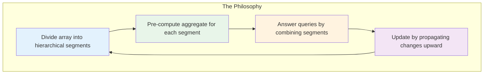

## The Regional Sales Hierarchy Analogy

Imagine a large corporation with a hierarchical sales structure:

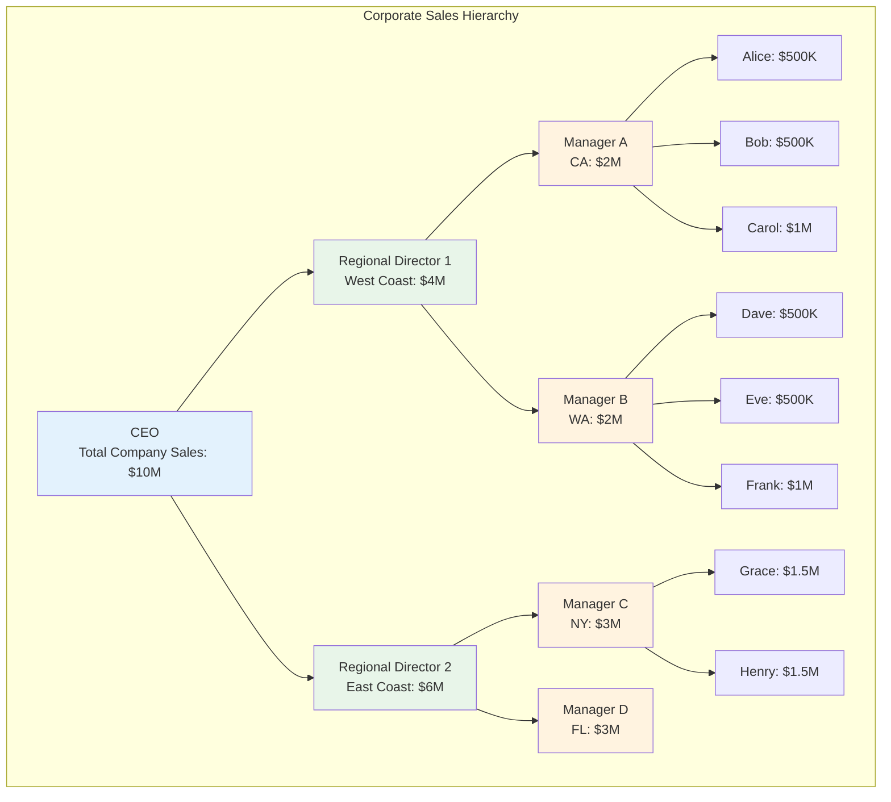

### How Queries Work in This Hierarchy

**Query: "What's the total sales for the West Coast?"**
- **Direct answer**: Ask Regional Director 1 → $4M
- **No need to contact**: Individual salespeople
- **Time complexity**: O(1) - single lookup

**Query: "What's the total sales for CA and NY combined?"**
- **Smart combination**: Manager A ($2M) + Manager C ($3M) = $5M
- **No need to contact**: Regional Directors or individual salespeople
- **Time complexity**: O(log n) - logarithmic number of lookups

**Update: "Alice's sales increased by $100K"**
- **Propagate upward**: Alice → Manager A → Regional Director 1 → CEO
- **Affected nodes**: Only 4 nodes in the path from leaf to root
- **Time complexity**: O(log n) - logarithmic update cost

## The Segment Tree Parallel

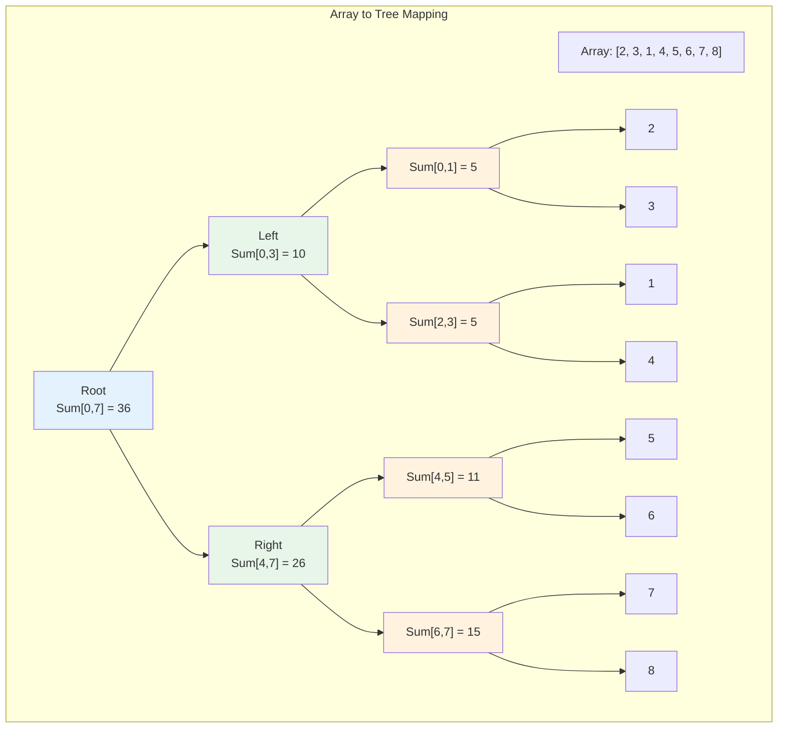

Just like the sales hierarchy:
- **Leaf nodes** = Individual array elements (salespeople)
- **Internal nodes** = Precomputed aggregates for ranges (managers)
- **Root node** = Aggregate for entire array (CEO)

## The Power of Logarithmic Decomposition

### Why Any Range Can Be Represented by O(log n) Segments

The key insight is that any range `[i, j]` in the original array can be decomposed into at most `2 × log n` segments in the tree.

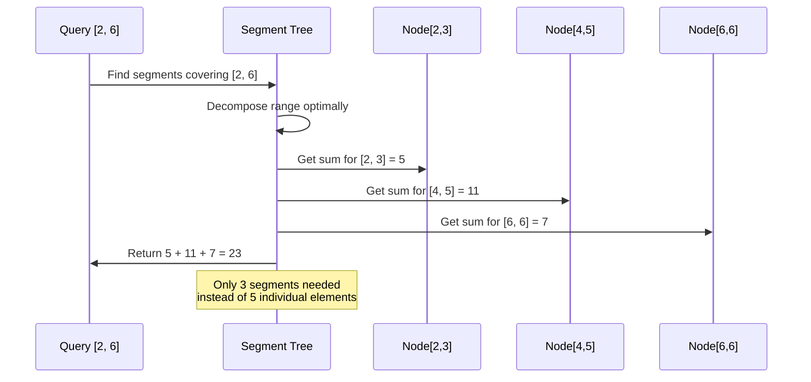

### The Decomposition Strategy

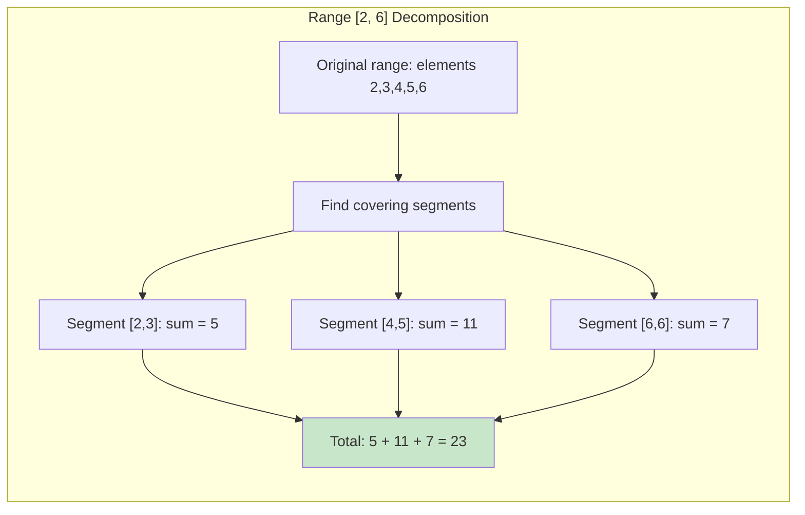

**The algorithm**:
1. Start with the desired range `[left, right]`
2. Find the largest segments that fit entirely within this range
3. Use at most 2 segments per level of the tree
4. Combine the results

## Core Design Principles

### 1. Hierarchical Structure
```mermaid
pyramid
    title Segment Tree Hierarchy
    
    Level_0 : "Root: Entire Array"
    Level_1 : "Two Halves"
    Level_2 : "Four Quarters"  
    Level_3 : "Eight Segments"
    Level_4 : "Individual Elements"
```

Each level represents ranges of decreasing size, with each node responsible for exactly twice as many elements as its children.

### 2. Complete Binary Tree Property

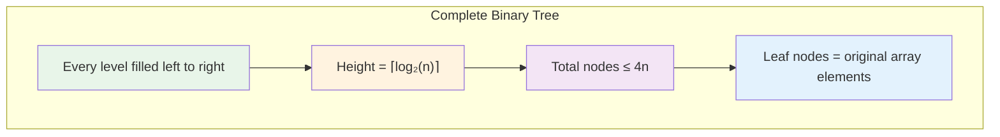

This structure guarantees:
- **Predictable height**: O(log n)
- **Efficient space usage**: O(n) total nodes
- **Balanced operations**: Consistent performance

### 3. Aggregation Function Flexibility

Segment trees work with any **associative** function:

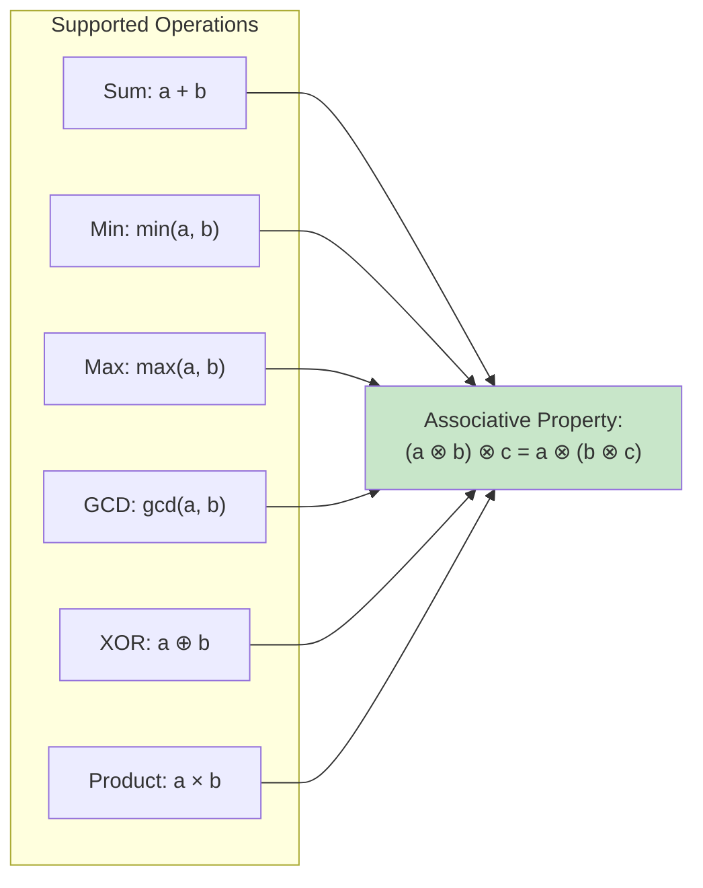

**Why associativity matters**: It allows us to combine segments in any order and still get the correct result.

## The Mathematical Beauty

### Space-Time Trade-off Analysis

```mermaid
xychart-beta
    title "Complexity Comparison"
    x-axis ["Linear Scan", "Full Precomputation", "Segment Tree"]
    y-axis "Complexity" 0 --> 100
    bar [1, 100, 5]
    bar [100, 1, 5]
    bar [1, 100, 4]
```

| Approach | Query Time | Update Time | Space |
|----------|------------|-------------|--------|
| Linear Scan | O(n) | O(1) | O(1) |
| Full Precomputation | O(1) | O(n²) | O(n²) |
| **Segment Tree** | **O(log n)** | **O(log n)** | **O(n)** |

### Why This Is Optimal

The segment tree achieves the optimal balance for the range query problem:

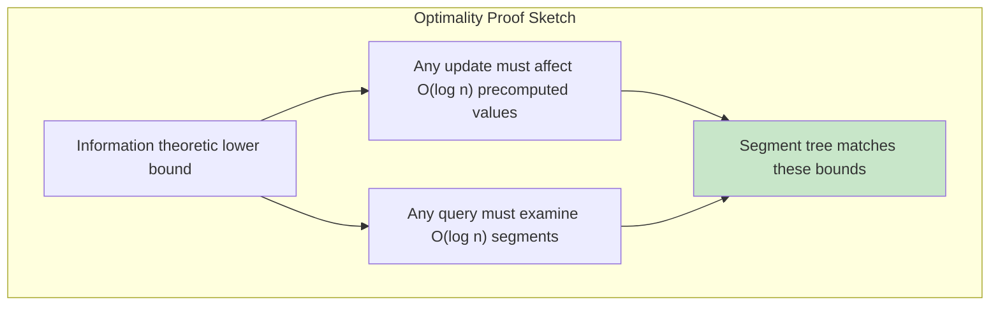

### The Sweet Spot Analysis

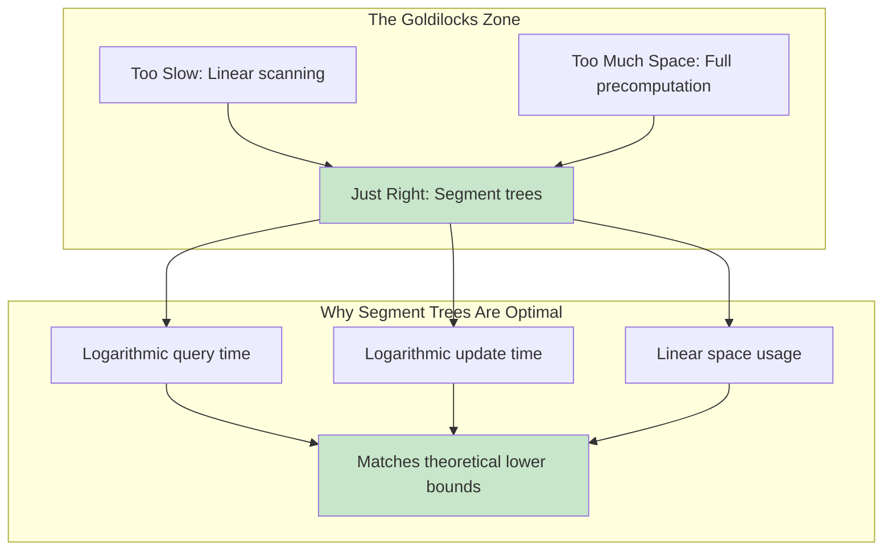

## Real-World Applications

The hierarchical philosophy applies across many domains:

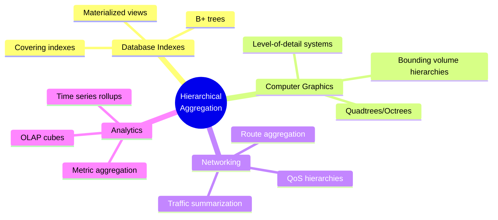

## The Philosophy in Action

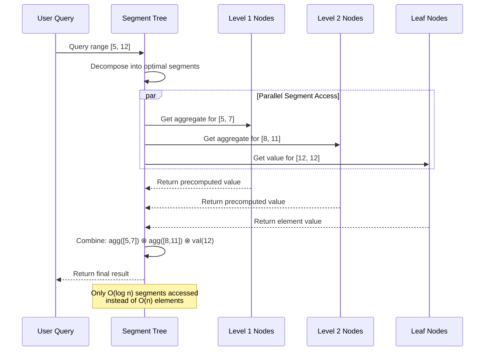

This hierarchical approach transforms an intractable problem into an elegant, efficient solution. The next section explores the specific abstractions that make this possible in practice.