# Key Abstractions: The Building Blocks of Segment Trees

Understanding segment trees requires mastering three fundamental abstractions that work together to enable efficient range queries and updates.

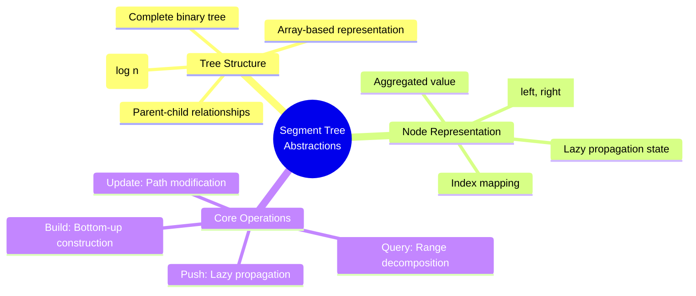

## The Tree Structure: Perfect Binary Organization

### Complete Binary Tree Properties

A segment tree is a **complete binary tree** where each node represents a contiguous range of the original array.

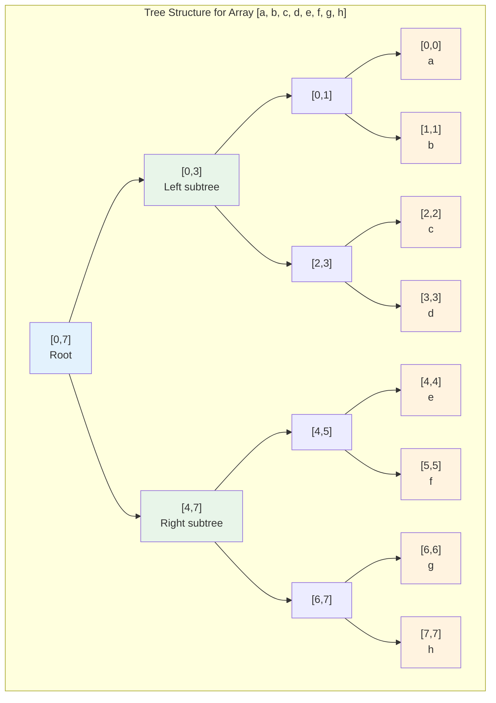

### Array-Based Representation

Segment trees are typically implemented using arrays rather than explicit pointers, using a clever indexing scheme:

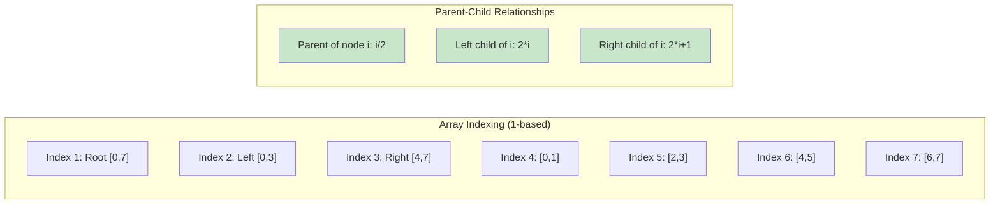

**Index Mathematics**:
```rust
// For 1-based indexing
fn parent(i: usize) -> usize { i / 2 }
fn left_child(i: usize) -> usize { 2 * i }
fn right_child(i: usize) -> usize { 2 * i + 1 }

// Tree navigation is O(1) arithmetic
```

### Size Calculation

For an array of size `n`, the segment tree requires at most `4n` nodes:

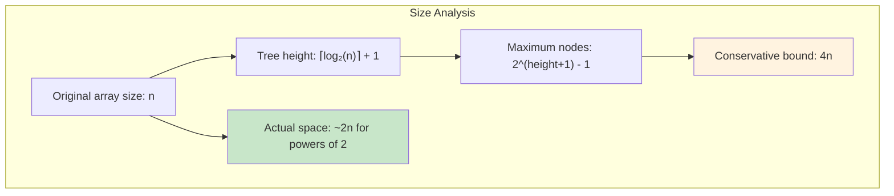

## Node Representation: The Information Container

Each node in the segment tree contains essential information for range operations:

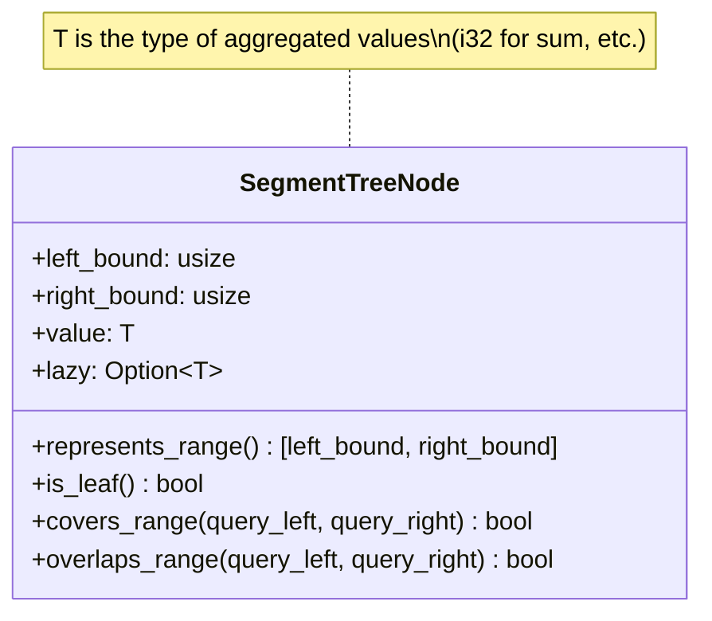

### Range Boundaries

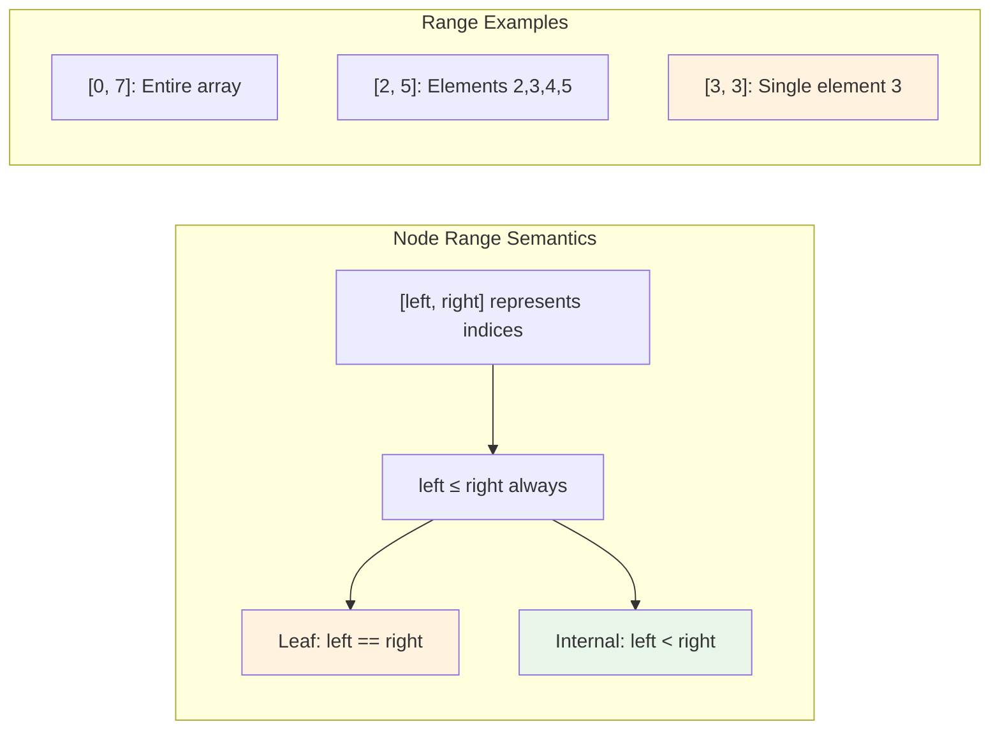

### Aggregated Value Storage

The `value` field stores the result of applying the aggregation function to all elements in the node's range:

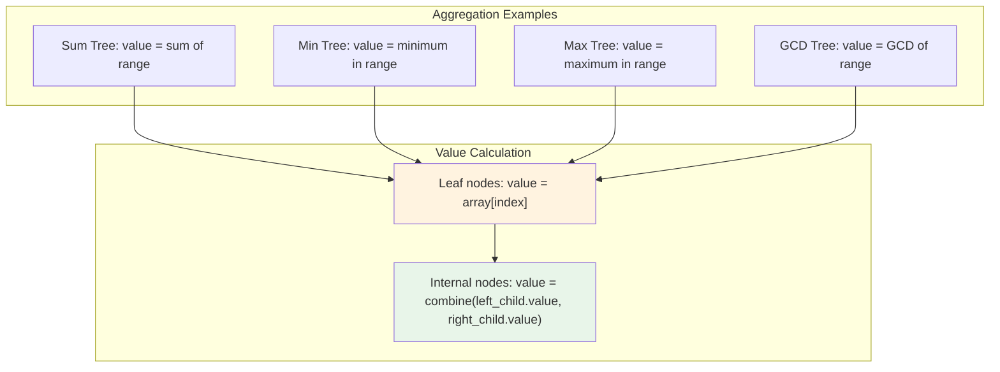

### Lazy Propagation (Advanced)

For range updates, nodes may store pending updates in a `lazy` field:

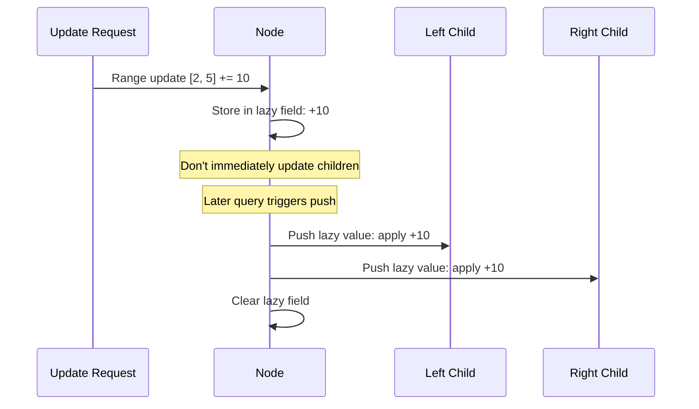

This optimization allows O(log n) range updates instead of O(n).

## Core Operations: The Functional Interface

### 1. Query Operation: Range Decomposition

The query operation decomposes the requested range into optimal tree segments:

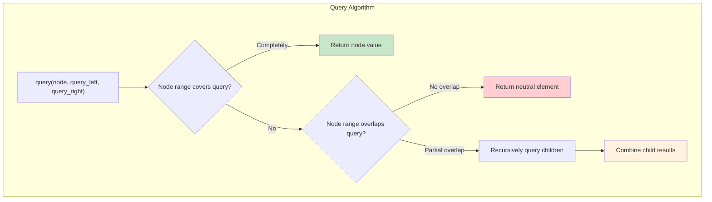

**Query Types**:
```rust
// Complete coverage: node range ⊆ query range
if node_left >= query_left && node_right <= query_right {
    return node.value;
}

// No overlap: disjoint ranges
if node_right < query_left || node_left > query_right {
    return neutral_element();
}

// Partial overlap: recurse to children
let left_result = query(left_child, query_left, query_right);
let right_result = query(right_child, query_left, query_right);
combine(left_result, right_result)
```

### 2. Update Operation: Path Modification

Updates modify a single element and propagate changes upward:

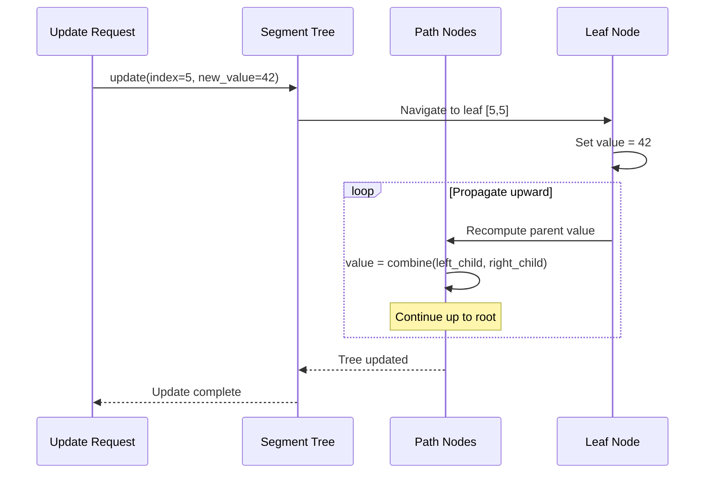

**Update Path**: Exactly one path from root to leaf, affecting O(log n) nodes.

### 3. Build Operation: Bottom-up Construction

Building the tree efficiently from an input array:

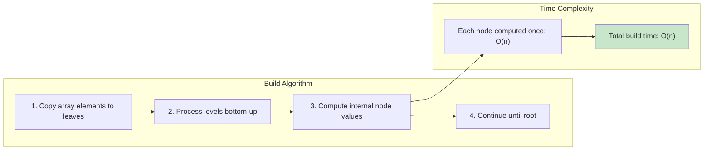

## Range Relationship Types

Understanding how ranges relate is crucial for efficient operations:

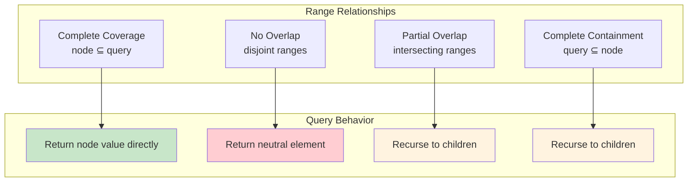

### The Decision Tree for Range Queries

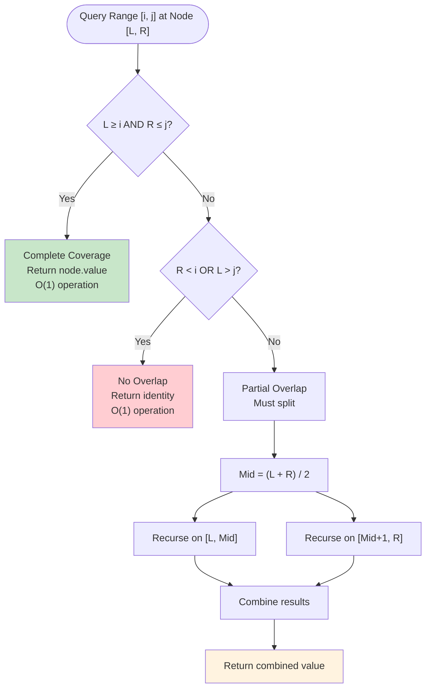

### Visual Range Examples

```mermaid
gantt
    title Range Relationship Examples
    dateFormat X
    axisFormat %s
    
    section Node Range [2,6]
    Node Coverage : 2, 6
    
    section Query Examples
    Complete Coverage [3,5] : 3, 5
    No Overlap [8,10] : 8, 10
    Partial Overlap [1,4] : 1, 4
    Contains Node [0,8] : 0, 8
```

## Aggregation Functions: The Mathematical Core

Segment trees work with any **associative** function:

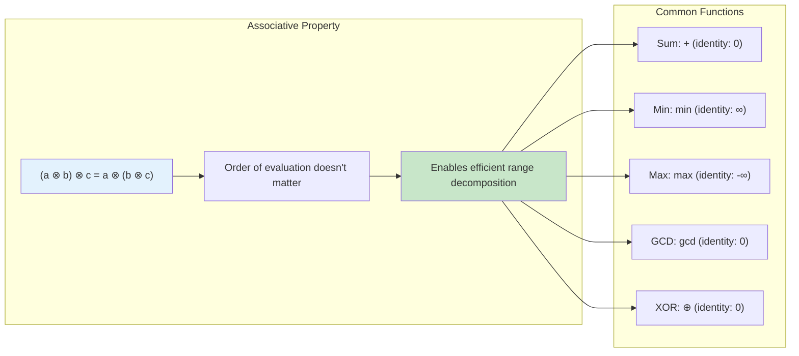

### Function Requirements

```rust
trait Monoid {
    type T;
    
    // Associative operation
    fn combine(a: Self::T, b: Self::T) -> Self::T;
    
    // Identity element
    fn identity() -> Self::T;
}

// Example: Sum monoid
impl Monoid for SumOp {
    type T = i32;
    
    fn combine(a: i32, b: i32) -> i32 { a + b }
    fn identity() -> i32 { 0 }
}
```

## Memory Layout and Cache Efficiency

The array-based representation provides excellent cache locality:

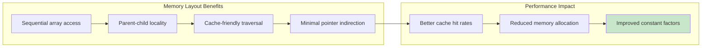

## The Abstraction in Action

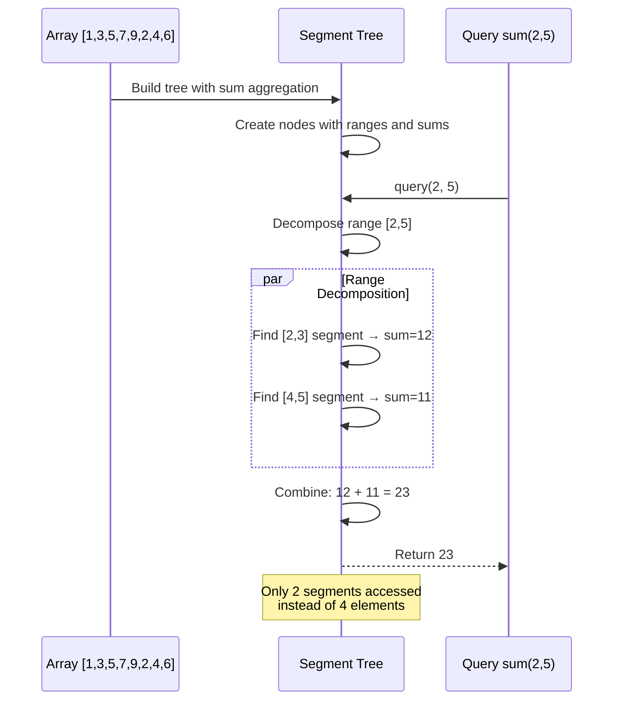

These abstractions—tree structure, node representation, and core operations—work together to transform the challenging range query problem into an elegant, efficient solution. The next section shows how to put these abstractions into practice by building your first segment tree.