# Building a Sum Tree: A Step-by-Step Guide

Let's build a complete segment tree for sum queries from scratch. We'll use the array `[1, 3, 5, 7]` as our example and walk through every step of construction, querying, and updating.

```mermaid
flowchart TD
    subgraph "Construction Journey"
        A["1. Initialize Structure<br/>📐 Set up array and calculate size"]
        B["2. Build Tree Bottom-Up<br/>🏗️ Place leaves and compute internals"]
        C["3. Verify Correctness<br/>✅ Test with known queries"]
        D["4. Perform Updates<br/>🔄 Modify elements and propagate"]
        E["5. Optimize Performance<br/>⚡ Measure and improve"]
    end
    
    A --> B
    B --> C
    C --> D
    D --> E
    
    style A fill:#e3f2fd
    style B fill:#e8f5e9
    style C fill:#fff3e0
    style D fill:#f3e5f5
    style E fill:#e1f5fe
```



## Step 1: Initialize the Structure

### Array Analysis
```rust
let input_array = [1, 3, 5, 7];
let n = input_array.len(); // n = 4
```

### Calculate Tree Size
For an array of size `n`, we need at most `4n` nodes in our segment tree:

```mermaid
flowchart LR
    subgraph "Size Calculation"
        A["Array size: n = 4"]
        B["Tree height: ⌈log₂(4)⌉ = 2"]
        C["Maximum nodes: 4 × 4 = 16"]
        D["Actual nodes needed: 7"]
    end
    
    A --> B
    B --> C
    C --> D
    
    style D fill:#c8e6c9
```



### Tree Structure Visualization


## Step 2: Build the Tree Bottom-Up

### Implementation Structure
```rust
struct SegmentTree {
    tree: Vec<i32>,
    n: usize,
}

impl SegmentTree {
    fn new(arr: &[i32]) -> Self {
        let n = arr.len();
        let mut tree = vec![0; 4 * n];
        let mut seg_tree = SegmentTree { tree, n };
        seg_tree.build(arr, 1, 0, n - 1);
        seg_tree
    }
}
```

### Build Algorithm Walkthrough

```mermaid
sequenceDiagram
    participant B as Build Process
    participant T as Tree Array
    participant A as Input Array [1,3,5,7]
    
    Note over B: Start build(arr, node=1, start=0, end=3)
    
    B->>B: Is leaf? (start == end) → No
    B->>B: Calculate mid = (0+3)/2 = 1
    
    par Build Left Subtree
        B->>T: build(arr, 2, 0, 1)
        Note over T: Recursively build left
    and Build Right Subtree  
        B->>T: build(arr, 3, 2, 3)
        Note over T: Recursively build right
    end
    
    B->>T: tree[1] = tree[2] + tree[3]
    T-->>B: Root complete with sum
```



### Detailed Build Steps

**Step 2.1: Build Leaves (Base Case)**
```rust
fn build(&mut self, arr: &[i32], node: usize, start: usize, end: usize) {
    if start == end {
        // Leaf node
        self.tree[node] = arr[start];
    } else {
        // Internal node - recurse and combine
        let mid = (start + end) / 2;
        self.build(arr, 2 * node, start, mid);
        self.build(arr, 2 * node + 1, mid + 1, end);
        self.tree[node] = self.tree[2 * node] + self.tree[2 * node + 1];
    }
}
```

**Step 2.2: Trace Through Construction**

```mermaid
flowchart TD
    subgraph "Construction Order"
        A["1. build(1, 0, 3)"]
        B["2. build(2, 0, 1)"]
        C["3. build(4, 0, 0) → tree[4] = 1"]
        D["4. build(5, 1, 1) → tree[5] = 3"]
        E["5. tree[2] = tree[4] + tree[5] = 4"]
        F["6. build(3, 2, 3)"]
        G["7. build(6, 2, 2) → tree[6] = 5"]
        H["8. build(7, 3, 3) → tree[7] = 7"]
        I["9. tree[3] = tree[6] + tree[7] = 12"]
        J["10. tree[1] = tree[2] + tree[3] = 16"]
    end
    
    A --> B
    B --> C
    B --> D
    C --> E
    D --> E
    A --> F
    F --> G
    F --> H
    G --> I
    H --> I
    E --> J
    I --> J
    
    style J fill:#c8e6c9
```



**Final Tree State**:
```
tree[1] = 16  // [0,3]: sum of entire array
tree[2] = 4   // [0,1]: sum of first half
tree[3] = 12  // [2,3]: sum of second half
tree[4] = 1   // [0,0]: first element
tree[5] = 3   // [1,1]: second element
tree[6] = 5   // [2,2]: third element
tree[7] = 7   // [3,3]: fourth element
```

## Step 3: Implement Range Queries

### Query Algorithm
```rust
fn query(&self, node: usize, start: usize, end: usize, 
         query_start: usize, query_end: usize) -> i32 {
    
    // Complete overlap: node range ⊆ query range
    if query_start <= start && end <= query_end {
        return self.tree[node];
    }
    
    // No overlap: disjoint ranges  
    if end < query_start || start > query_end {
        return 0; // neutral element for sum
    }
    
    // Partial overlap: split and recurse
    let mid = (start + end) / 2;
    let left_sum = self.query(2 * node, start, mid, query_start, query_end);
    let right_sum = self.query(2 * node + 1, mid + 1, end, query_start, query_end);
    
    left_sum + right_sum
}
```

### Query Examples

**Example 1: Query sum(1, 2) - sum of elements at indices 1 and 2**

```mermaid
sequenceDiagram
    participant Q as Query sum(1,2)
    participant N1 as Node 1 [0,3]
    participant N2 as Node 2 [0,1] 
    participant N3 as Node 3 [2,3]
    participant N5 as Node 5 [1,1]
    participant N6 as Node 6 [2,2]
    
    Q->>N1: query(1, 0, 3, 1, 2)
    Note over N1: Partial overlap [0,3] ∩ [1,2]
    
    par Split Query
        N1->>N2: query(2, 0, 1, 1, 2)
        Note over N2: Partial overlap [0,1] ∩ [1,2]
        N2->>N5: query(5, 1, 1, 1, 2)
        Note over N5: Complete overlap [1,1] ⊆ [1,2]
        N5-->>N2: Return 3
        N2-->>N1: Return 3
    and
        N1->>N3: query(3, 2, 3, 1, 2)
        Note over N3: Partial overlap [2,3] ∩ [1,2]
        N3->>N6: query(6, 2, 2, 1, 2)
        Note over N6: Complete overlap [2,2] ⊆ [1,2]
        N6-->>N3: Return 5
        N3-->>N1: Return 5
    end
    
    N1->>N1: Combine: 3 + 5 = 8
    N1-->>Q: Return 8
```



**Example 2: Query sum(0, 1) - sum of first two elements**


### Query Performance Analysis


**Key insight**: Even for different query ranges, we access at most O(log n) nodes.

### The Query Path Visualization


## Step 4: Implement Updates

### Update Algorithm
```rust
fn update(&mut self, node: usize, start: usize, end: usize, 
          index: usize, new_value: i32) {
    
    if start == end {
        // Leaf node - update the value
        self.tree[node] = new_value;
    } else {
        // Internal node - find the correct child
        let mid = (start + end) / 2;
        
        if index <= mid {
            self.update(2 * node, start, mid, index, new_value);
        } else {
            self.update(2 * node + 1, mid + 1, end, index, new_value);
        }
        
        // Recompute this node's value
        self.tree[node] = self.tree[2 * node] + self.tree[2 * node + 1];
    }
}
```

### Update Example: Change array[2] from 5 to 10

**Before Update**: `[1, 3, 5, 7]`
**After Update**: `[1, 3, 10, 7]`


**Tree State After Update**:
```
tree[1] = 21  // [0,3]: 1+3+10+7 = 21
tree[2] = 4   // [0,1]: unchanged
tree[3] = 17  // [2,3]: 10+7 = 17  
tree[4] = 1   // [0,0]: unchanged
tree[5] = 3   // [1,1]: unchanged
tree[6] = 10  // [2,2]: updated!
tree[7] = 7   // [3,3]: unchanged
```

### Update Path Visualization

```mermaid
flowchart TD
    subgraph "Update Propagation Path"
        A["🎯 Target: Update index 2"]
        B["📍 Path: 1 → 3 → 6"]
        C["⚡ Affected nodes: 3 out of 7"]
        D["💾 Unchanged nodes: 4 out of 7"]
    end
    
    A --> B
    B --> C
    C --> D
    
    style C fill:#fff3e0
    style D fill:#c8e6c9
```



### The Ripple Effect Analysis


## Step 5: Complete Implementation

### Full Working Code
```rust
struct SegmentTree {
    tree: Vec<i32>,
    n: usize,
}

impl SegmentTree {
    fn new(arr: &[i32]) -> Self {
        let n = arr.len();
        let mut tree = vec![0; 4 * n];
        let mut seg_tree = SegmentTree { tree, n };
        seg_tree.build(arr, 1, 0, n - 1);
        seg_tree
    }
    
    fn build(&mut self, arr: &[i32], node: usize, start: usize, end: usize) {
        if start == end {
            self.tree[node] = arr[start];
        } else {
            let mid = (start + end) / 2;
            self.build(arr, 2 * node, start, mid);
            self.build(arr, 2 * node + 1, mid + 1, end);
            self.tree[node] = self.tree[2 * node] + self.tree[2 * node + 1];
        }
    }
    
    fn query(&self, node: usize, start: usize, end: usize, 
             query_start: usize, query_end: usize) -> i32 {
        if query_start <= start && end <= query_end {
            return self.tree[node];
        }
        if end < query_start || start > query_end {
            return 0;
        }
        
        let mid = (start + end) / 2;
        let left_sum = self.query(2 * node, start, mid, query_start, query_end);
        let right_sum = self.query(2 * node + 1, mid + 1, end, query_start, query_end);
        left_sum + right_sum
    }
    
    fn update(&mut self, node: usize, start: usize, end: usize, 
              index: usize, new_value: i32) {
        if start == end {
            self.tree[node] = new_value;
        } else {
            let mid = (start + end) / 2;
            if index <= mid {
                self.update(2 * node, start, mid, index, new_value);
            } else {
                self.update(2 * node + 1, mid + 1, end, index, new_value);
            }
            self.tree[node] = self.tree[2 * node] + self.tree[2 * node + 1];
        }
    }
    
    // Public interface methods
    pub fn range_sum(&self, left: usize, right: usize) -> i32 {
        self.query(1, 0, self.n - 1, left, right)
    }
    
    pub fn update_element(&mut self, index: usize, value: i32) {
        self.update(1, 0, self.n - 1, index, value);
    }
}
```

## Step 6: Testing and Verification

### Comprehensive Test Suite
```rust
#[cfg(test)]
mod tests {
    use super::*;

    #[test]
    fn test_construction_and_queries() {
        let arr = [1, 3, 5, 7];
        let seg_tree = SegmentTree::new(&arr);
        
        // Test single element queries
        assert_eq!(seg_tree.range_sum(0, 0), 1);
        assert_eq!(seg_tree.range_sum(1, 1), 3);
        assert_eq!(seg_tree.range_sum(2, 2), 5);
        assert_eq!(seg_tree.range_sum(3, 3), 7);
        
        // Test range queries
        assert_eq!(seg_tree.range_sum(0, 1), 4);   // 1 + 3
        assert_eq!(seg_tree.range_sum(1, 2), 8);   // 3 + 5
        assert_eq!(seg_tree.range_sum(2, 3), 12);  // 5 + 7
        assert_eq!(seg_tree.range_sum(0, 3), 16);  // entire array
    }
    
    #[test]
    fn test_updates() {
        let arr = [1, 3, 5, 7];
        let mut seg_tree = SegmentTree::new(&arr);
        
        // Update and verify
        seg_tree.update_element(2, 10);
        assert_eq!(seg_tree.range_sum(2, 2), 10);
        assert_eq!(seg_tree.range_sum(0, 3), 21);  // 1+3+10+7
        assert_eq!(seg_tree.range_sum(1, 2), 13);  // 3+10
    }
}
```

### Performance Verification

```mermaid
flowchart LR
    subgraph "Complexity Verification"
        A["Build: O(n) ✅"]
        B["Query: O(log n) ✅"]
        C["Update: O(log n) ✅"]
        D["Space: O(n) ✅"]
    end
    
    A --> B
    B --> C
    C --> D
    
    style A fill:#c8e6c9
    style B fill:#c8e6c9
    style C fill:#c8e6c9
    style D fill:#c8e6c9
```



## Key Takeaways

```mermaid
mindmap
  root((Segment Tree
    Mastery))
    Construction
      Bottom-up building
      O(n) time complexity
      Array-based storage
      
    Querying
      Range decomposition
      Logarithmic segments
      Efficient combination
      
    Updating
      Single path modification
      Upward propagation
      Minimal node changes
      
    Performance
      O(log n) operations
      O(n) space usage
      Cache-friendly access
```

### Implementation Patterns


You now have a complete, working segment tree for sum queries! This implementation handles:

- ✅ **Efficient construction** in O(n) time
- ✅ **Fast range queries** in O(log n) time  
- ✅ **Quick updates** in O(log n) time
- ✅ **Optimal space usage** with O(n) storage
- ✅ **Clean, testable code** with comprehensive verification

The next section explores why these operations achieve their logarithmic complexity and the mathematical principles behind segment tree efficiency.