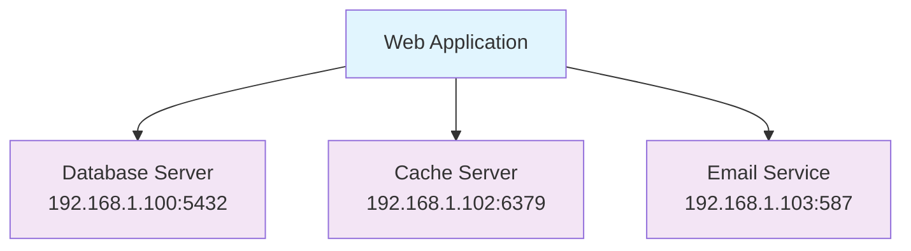
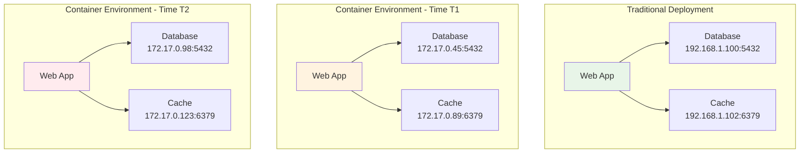
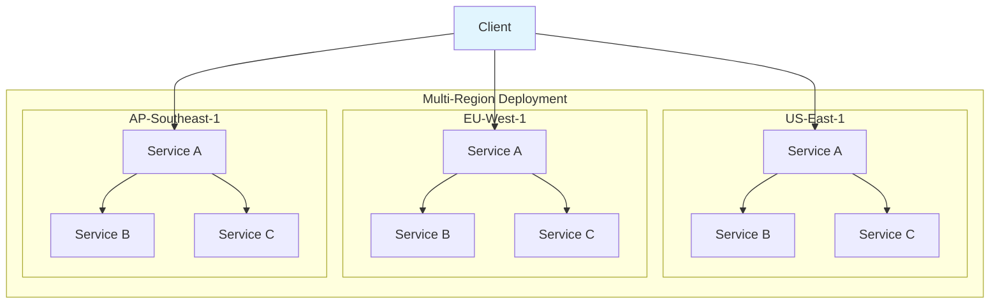
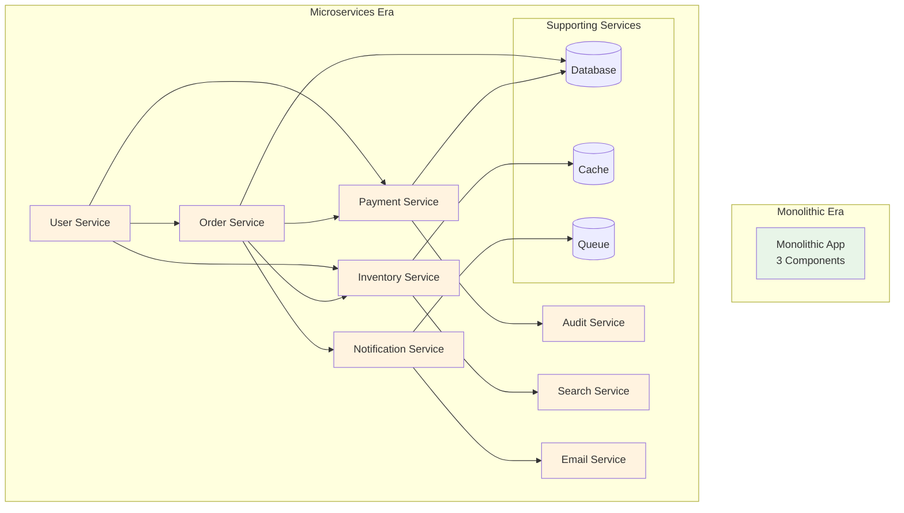
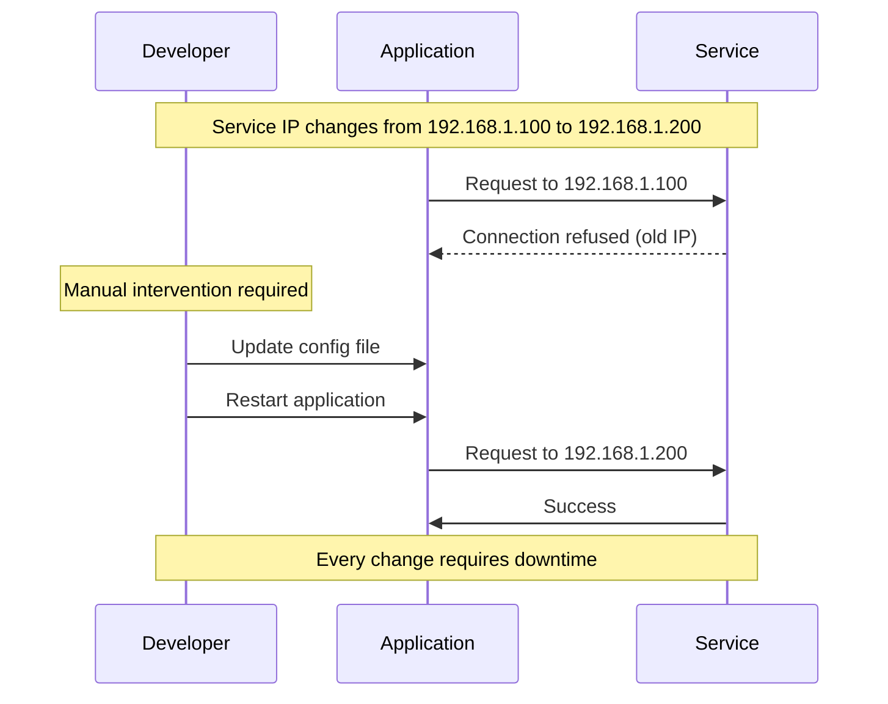
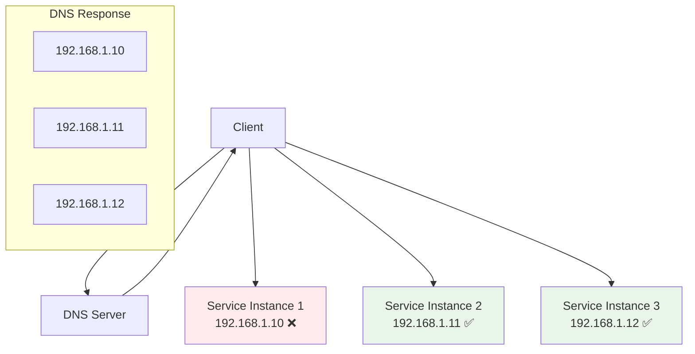
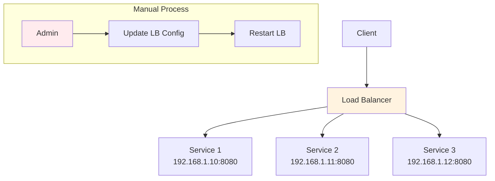
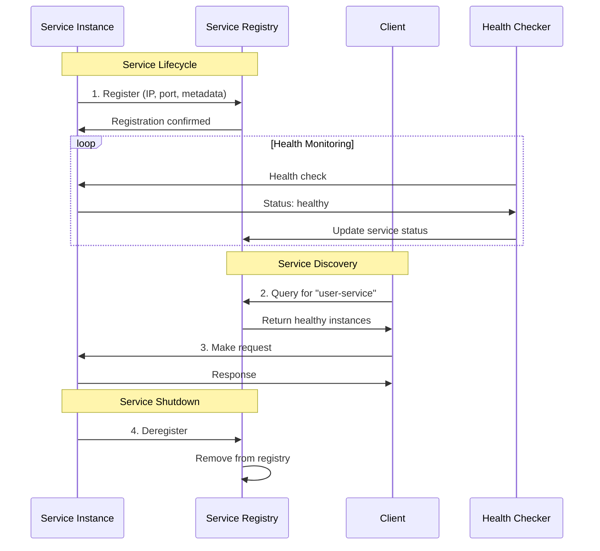
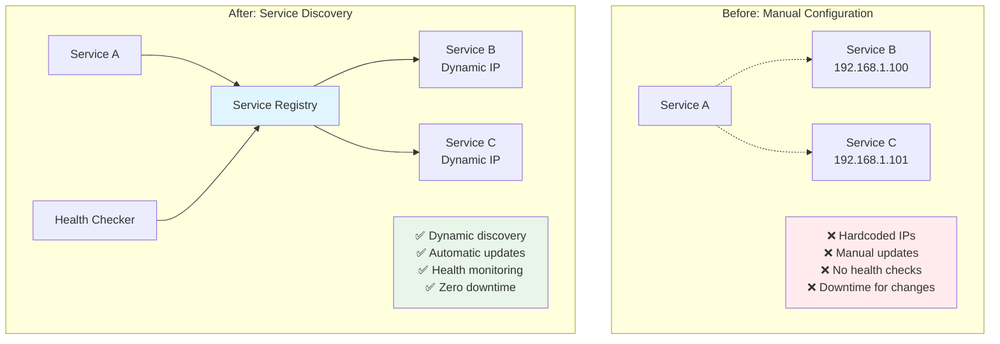

# The Core Problem: Finding Services in a Dynamic World

## The Static World's Simple Solution

In the early days of computing, service discovery was trivial. You knew exactly where everything lived:



These addresses were hardcoded into configuration files, and life was simple. When your web application needed to connect to the database, it knew exactly where to look:

```yaml
# config.yml - Simple and predictable
services:
  database:
    host: 192.168.1.100
    port: 5432
  cache:
    host: 192.168.1.102
    port: 6379
  email:
    host: 192.168.1.103
    port: 587
```

## When Static Becomes Problematic

But modern systems shattered this simple world. Consider what happens in today's dynamic environments:

### The Container Revolution



- **Containers spawn and die**: A container might get IP `172.17.0.45` today and `172.17.0.98` tomorrow
- **Orchestration systems**: Kubernetes, Docker Swarm, and others constantly shuffle services around
- **Scaling events**: Auto-scaling means services appear and disappear based on load

### The Cloud Native Reality



- **Ephemeral infrastructure**: Virtual machines and containers are treated as cattle, not pets
- **Health-based routing**: Unhealthy instances must be automatically removed from service
- **Multi-region deployments**: Services might be available in `us-east-1` today but moved to `eu-west-1` tomorrow

### The Microservices Explosion



- **Service proliferation**: Instead of 3 services, you now have 30, 300, or 3000
- **Inter-service communication**: Each service needs to find and communicate with multiple others
- **Version management**: Different versions of the same service might run simultaneously

## The Fundamental Challenge

**The core problem**: How do you maintain a current, accurate directory of available services when everything is constantly changing?

Think of it like trying to organize a massive conference where:
- Speakers constantly arrive and leave
- Room assignments change hourly
- Some speakers become unavailable due to illness
- New speakers join last-minute
- Attendees need to find the right room for each talk

A printed program becomes useless within minutes. You need a **dynamic, real-time directory** that updates automatically.

## Why Traditional Solutions Fail

### Hardcoded Configuration



```yaml
# This breaks the moment anything changes
database_host: 192.168.1.100
cache_host: 192.168.1.102
```

**Problem**: Requires manual updates and service restarts for every change.

### DNS Round-Robin



```
service.example.com → 192.168.1.10, 192.168.1.11, 192.168.1.12
```

**Problems**: 
- No health checking (clients hit unhealthy services)
- Poor load distribution (DNS caching causes uneven distribution)
- Caching issues make updates slow (TTL delays)
- No way to communicate service metadata

### Load Balancer Configuration



```nginx
upstream backend {
    server 192.168.1.10:8080;
    server 192.168.1.11:8080;
    server 192.168.1.12:8080;
}
```

**Problems**:
- Manual configuration updates
- Single point of failure
- No service-specific routing logic

## The Real-World Impact

Without proper service discovery, you face:

1. **Brittle deployments**: Every service change requires configuration updates across multiple systems
2. **Poor resilience**: Failed services continue receiving traffic
3. **Operational overhead**: Human intervention needed for every scale event
4. **Tight coupling**: Services must know intimate details about each other's infrastructure

## The Service Discovery Solution

Service discovery solves this by creating a **dynamic registry** where:



**Key Principles:**

1. **Services register themselves** when they start
2. **Services deregister** when they stop or become unhealthy
3. **Clients query the registry** to find available services
4. **Health checks** ensure only healthy services are returned
5. **Metadata** provides rich information about service capabilities

### The Transformation: From Chaos to Order



This transforms the chaotic problem of "where is everything?" into a structured, automated solution that scales with your infrastructure.

### The Mental Model: Dynamic Phone Book

Think of service discovery as a **smart phone book** that:
- Automatically adds new entries when services join
- Removes entries when services leave or become unreachable
- Provides real-time status information
- Allows rich queries ("Find all payment services in US-East region")
- Updates instantly without manual intervention

In the next section, we'll explore the philosophical principles that guide effective service discovery systems.