# The Guiding Philosophy: Living Registry Principles

## The Central Metaphor: A Dynamic Company Directory

Imagine a large, fast-growing company where people constantly join, leave, change roles, and work from different locations. A static printed directory becomes useless immediately. Instead, you need a **living directory** that updates automatically.

```mermaid
graph TD
    subgraph "Traditional Directory"
        PD[📋 Printed Directory<br/>January 2024]
        PD -.-> E1[John: Sales, Ext 123]
        PD -.-> E2[Jane: Marketing, Ext 456]
        PD -.-> E3[Bob: Engineering, Ext 789]
        
        style PD fill:#ffebee
        style E1 fill:#ffebee
        style E2 fill:#ffebee
        style E3 fill:#ffebee
    end
    
    subgraph "Living Directory"
        LD[📱 Digital Directory<br/>Real-time]
        LD --> E4[John: Sales, Ext 123 ✅]
        LD --> E5[Jane: Marketing, Remote 🏠]
        LD --> E6[Bob: Engineering, Ext 789 ✅]
        LD --> E7[Alice: DevOps, Ext 101 ✅]
        
        style LD fill:#e8f5e8
        style E4 fill:#e8f5e8
        style E5 fill:#e8f5e8
        style E6 fill:#e8f5e8
        style E7 fill:#e8f5e8
    end
    
    Note1["❌ Outdated information<br/>❌ Manual updates<br/>❌ No status info"] --> PD
    Note2["✅ Real-time updates<br/>✅ Automatic changes<br/>✅ Status tracking"] --> LD
```

This is exactly what service discovery provides for your distributed system:

| Company Directory | Service Discovery |
|---|---|
| Employee joins → Add to directory | Service starts → Register in registry |
| Employee leaves → Remove from directory | Service stops → Deregister from registry |
| Employee changes role → Update directory | Service updates → Refresh metadata |
| Check availability → Call extension | Check health → Health check endpoint |
| Find by department → Search directory | Find by service type → Query registry |

## Core Philosophical Principles

### 1. Self-Registration: Services Know Themselves Best

**Principle**: Services should register themselves rather than being registered by external systems.

**Why**: Only the service knows:
- When it's truly ready to accept traffic
- What capabilities it actually supports
- How healthy it currently is
- What metadata is most relevant

**Anti-pattern**: External orchestration systems trying to guess when services are ready.

### 2. Heartbeat Health: Prove You're Alive

**Principle**: Registration is not enough; services must continuously prove they're healthy.

**The Reality**: Services can fail in subtle ways:
- Process running but unable to handle requests
- Database connections broken
- Disk space exhausted
- Memory leaks causing degraded performance

**Implementation**: Regular health checks that verify real functionality, not just process existence.

### 3. Graceful Degradation: Failing Forward

**Principle**: When parts of the discovery system fail, the system should degrade gracefully rather than collapse.

```mermaid
graph TD
    subgraph "Normal Operation"
        A1[Client] --> B1[Service Registry]
        B1 --> C1[Fresh Service List]
        C1 --> D1[Successful Request]
    end
    
    subgraph "Registry Failure"
        A2[Client] --> B2[Service Registry ❌]
        B2 -.-> C2[Cached Service List]
        C2 --> D2[Degraded but Working]
    end
    
    subgraph "Complete Failure"
        A3[Client] --> B3[Service Registry ❌]
        B3 -.-> C3[Static Fallback Config]
        C3 --> D3[Minimal Functionality]
    end
    
    style B1 fill:#e8f5e8
    style B2 fill:#fff3e0
    style B3 fill:#ffebee
```

**Strategies**:
- **Client-side caching**: Keep last-known good service list
- **Fallback mechanisms**: Static configuration as last resort
- **Circuit breakers**: Prevent cascading failures
- **Timeout and retry policies**: Handle temporary failures
- **Service mesh integration**: Multiple discovery layers

### 4. Eventual Consistency: Embrace the Distributed Reality

**Principle**: Perfect consistency is impossible in distributed systems; design for eventual consistency.

```mermaid
graph TD
    subgraph "CAP Theorem Trade-offs"
        subgraph "CP: Consistency + Partition Tolerance"
            CP1[Strong Consistency] --> CP2[Service Registry]
            CP2 --> CP3["⚠️ Unavailable during<br/>network partitions"]
        end
        
        subgraph "AP: Availability + Partition Tolerance"
            AP1[Always Available] --> AP2[Service Registry]
            AP2 --> AP3["⚠️ Temporary stale data<br/>during partitions"]
        end
        
        subgraph "CA: Consistency + Availability"
            CA1[Perfect Consistency] --> CA2[Service Registry]
            CA2 --> CA3["❌ Impossible in<br/>distributed systems"]
        end
    end
    
    style CP3 fill:#fff3e0
    style AP3 fill:#e8f5e8
    style CA3 fill:#ffebee
```

**Trade-offs**:
- **CP (Consistency-Partition tolerance)**: Strong consistency but availability suffers during network partitions
- **AP (Availability-Partition tolerance)**: Always available but may return stale data
- **CA (Consistency-Availability)**: Impossible in distributed systems

**Why Service Discovery Chooses AP**:

Most service discovery systems choose AP because:
- Brief inconsistency is better than complete unavailability
- Applications can handle some stale routing information
- Network partitions are temporary
- Service discovery is about "eventually finding" services, not perfect consistency

## Design Trade-offs and Decisions

### Centralized vs. Decentralized

**Centralized Registry**:
- ✅ Simple to understand and implement
- ✅ Consistent view of all services
- ✅ Easier debugging and monitoring
- ❌ Single point of failure
- ❌ Scalability bottleneck
- ❌ Network latency for distant clients

**Decentralized Registry**:
- ✅ No single point of failure
- ✅ Better scalability
- ✅ Lower latency (local nodes)
- ❌ Complex consensus algorithms
- ❌ Potential for split-brain scenarios
- ❌ More complex operational overhead

**Modern Approach**: Distributed but coordinated (like Consul's Raft consensus).

### Push vs. Pull Discovery

**Push Model**: Registry actively notifies clients of changes

**Pull Model**: Clients actively query the registry

**Trade-offs**:
- **Push**: Lower latency, more complex client state management
- **Pull**: Simpler clients, higher latency, more registry load

### Service-Side vs. Client-Side Discovery

**Service-Side Discovery**: Load balancer handles discovery

**Client-Side Discovery**: Clients query registry directly

**Philosophy**: Choose based on your complexity tolerance and performance requirements.

## The Living Registry Mental Model

Think of service discovery as maintaining a **living registry** with these characteristics:

### 1. Self-Maintaining
- Services join and leave automatically
- No manual intervention required
- Failures are detected and handled

### 2. Real-Time
- Changes propagate quickly
- Health status reflects current reality
- No stale information lingers

### 3. Queryable
- Rich metadata available
- Flexible query capabilities
- Support for different discovery patterns

### 4. Resilient
- Survives partial failures
- Graceful degradation
- Recovery mechanisms

## Implementation Philosophy

### Start Simple, Evolve Complexity

1. **Phase 1**: Basic registration and health checks
2. **Phase 2**: Add metadata and advanced querying
3. **Phase 3**: Implement advanced features like blue-green deployments
4. **Phase 4**: Add observability and debugging tools

### Embrace the CAP Theorem

You cannot have all three:
- **Consistency**: All nodes see the same data simultaneously
- **Availability**: System remains operational
- **Partition Tolerance**: System continues despite network failures

For service discovery, choose **AP** (Availability + Partition Tolerance) because:
- Services need to keep running during network issues
- Brief inconsistency is acceptable
- Manual intervention during outages is not scalable
- Service discovery is about "finding" services, not perfect data consistency

## The Final Principle: Observability First

**Principle**: Service discovery is infrastructure; it must be observable and debuggable.

**Requirements**:
- **Metrics**: Registration/deregistration rates, health check success/failure rates, discovery query performance
- **Logging**: Service lifecycle events, health check results, discovery patterns
- **Alerting**: Registry health, abnormal service behavior, performance degradation
- **Visualization**: Service topology, health status, discovery patterns

**Key Observability Questions**:
1. **"Is the registry healthy?"** → Registry availability metrics
2. **"Are services registering properly?"** → Registration success rates
3. **"Which services are failing health checks?"** → Health check failure logs
4. **"How fast are discovery queries?"** → Query response time metrics
5. **"What's the service topology?"** → Service relationship visualization

## Mental Model Summary: The Living Directory

This philosophical foundation guides all technical decisions in service discovery systems. Next, we'll explore the key abstractions that make this philosophy concrete.