# Key Abstractions: The Building Blocks of Service Discovery

## The Company Directory Analogy

Before diving into technical abstractions, let's expand our company directory metaphor:


**Mapping the Concepts**:

| Company Directory | Service Discovery |
|---|---|
| **Employee** (Name, dept, ext, office) | **Service** (Name, address, port, metadata) |
| **Directory Database** (Central employee list) | **Service Registry** (Central service database) |
| **Receptionist** (Helps visitors find people) | **Discovery Client** (Helps apps find services) |
| **Phone Extension** (How to reach someone) | **Service Endpoint** (How to connect to service) |
| **Department** (Organizational grouping) | **Service Tags** (Logical grouping) |
| **Employee Status** (Available, in meeting, etc.) | **Health Status** (Healthy, unhealthy, etc.) |

## Core Abstraction 1: The Service Registry

### What It Is
The **Service Registry** is the central nervous system of service discovery. It's a distributed database that maintains the current state of all services in your system.

### Mental Model: The Living Phonebook

```mermaid
graph TD
    subgraph "Traditional Phonebook"
        PB[📞 Static Phonebook]
        PB --> E1[John: 555-1234]
        PB --> E2[Jane: 555-5678]
        PB --> E3[Bob: 555-9012]
        
        style PB fill:#ffebee
        style E1 fill:#ffebee
        style E2 fill:#ffebee
        style E3 fill:#ffebee
    end
    
    subgraph "Living Service Registry"
        SR[🔄 Dynamic Service Registry]
        
        subgraph "Auto-Discovery"
            AD1[Service Starts → Auto-Register]
            AD2[Service Stops → Auto-Remove]
            AD3[Service Fails → Mark Unhealthy]
        end
        
        subgraph "Rich Queries"
            Q1[Find by Name]
            Q2[Find by Tags]
            Q3[Find by Health Status]
            Q4[Find by Region]
        end
        
        SR --> AD1
        SR --> AD2
        SR --> AD3
        
        SR --> Q1
        SR --> Q2
        SR --> Q3
        SR --> Q4
        
        style SR fill:#e8f5e8
        style AD1 fill:#e8f5e8
        style AD2 fill:#e8f5e8
        style AD3 fill:#e8f5e8
    end
```



Think of it as a **living phonebook** that:
- Automatically adds new entries when services start
- Removes entries when services stop or become unhealthy
- Provides rich search capabilities beyond simple name lookup
- Updates in real-time without manual intervention
- Includes health status and rich metadata

### Key Properties

**1. Service Identity**
```json
{
  "id": "user-service-01",
  "name": "user-service",
  "address": "192.168.1.45",
  "port": 8080,
  "tags": ["production", "v2.1.0"],
  "metadata": {
    "version": "2.1.0",
    "region": "us-east-1",
    "capabilities": ["read", "write"]
  }
}
```

**2. Service Lifecycle**


**3. Query Interface**
```
// Find all instances of a service
GET /v1/health/service/user-service

// Find healthy instances in a specific datacenter
GET /v1/health/service/user-service?dc=us-east-1&passing=true

// Find services with specific tags
GET /v1/health/service/user-service?tag=production&tag=v2.1.0
```

## Core Abstraction 2: Health Checks

### What They Are
**Health Checks** are the mechanism by which the registry determines whether a service is capable of handling requests.

### Mental Model
Think of health checks as a **security guard making rounds**:
- Visits each service at regular intervals
- Asks: "Are you operational and ready to serve?"
- Takes action if no satisfactory response

### Types of Health Checks

```mermaid
graph TD
    subgraph "Health Check Types"
        subgraph "HTTP Health Checks"
            H1[Registry] --> H2[GET /health]
            H2 --> H3[Service Response]
            H3 --> H4{Status Code?}
            H4 -->|200-299| H5[✅ Healthy]
            H4 -->|400-599| H6[❌ Unhealthy]
            H4 -->|Timeout| H7[❌ Unhealthy]
        end
        
        subgraph "TCP Health Checks"
            T1[Registry] --> T2[TCP Connect]
            T2 --> T3{Connection?}
            T3 -->|Success| T4[✅ Healthy]
            T3 -->|Failure| T5[❌ Unhealthy]
        end
        
        subgraph "Script Health Checks"
            S1[Registry] --> S2[Execute Script]
            S2 --> S3{Exit Code?}
            S3 -->|0| S4[✅ Healthy]
            S3 -->|Non-zero| S5[❌ Unhealthy]
        end
    end
    
    style H5 fill:#e8f5e8
    style T4 fill:#e8f5e8
    style S4 fill:#e8f5e8
    style H6 fill:#ffebee
    style H7 fill:#ffebee
    style T5 fill:#ffebee
    style S5 fill:#ffebee
```



**1. HTTP Health Checks**
```http
GET /health → 200 OK
{
  "status": "healthy",
  "checks": {
    "database": "ok",
    "cache": "ok",
    "disk_space": "ok"
  }
}
```

**2. TCP Health Checks**
```
Connect to service:port → Connection successful = healthy
```

**3. Script-Based Health Checks**
```bash
#!/bin/bash
# Custom health check script
if curl -f http://localhost:8080/health > /dev/null 2>&1; then
    exit 0  # Healthy
else
    exit 1  # Unhealthy
fi
```

### Health Check Lifecycle


**Detailed Health Check State Machine**:


## Core Abstraction 3: Service Metadata

### What It Is
**Service Metadata** provides rich, contextual information about services beyond just their network location.

### Mental Model: The Enhanced Business Card

```mermaid
graph TD
    subgraph "Traditional Business Card"
        BC[📇 Basic Business Card]
        BC --> N[Name: John Smith]
        BC --> T[Title: Software Engineer]
        BC --> P[Phone: 555-1234]
        BC --> E[Email: john@company.com]
        
        style BC fill:#ffebee
    end
    
    subgraph "Service Metadata: Enhanced Profile"
        SM[🏷️ Service Metadata]
        
        subgraph "Identity"
            I1[Name: user-service]
            I2[Version: v2.1.0]
            I3[Environment: production]
        end
        
        subgraph "Capabilities"
            C1[Operations: read, write, delete]
            C2[Protocols: HTTP, gRPC]
            C3[Data Formats: JSON, Protobuf]
        end
        
        subgraph "Operational Info"
            O1[Region: us-east-1]
            O2[Instance Type: m5.large]
            O3[Load Balancer Weight: 100]
        end
        
        subgraph "Custom Attributes"
            A1[Team: user-experience]
            A2[Cost Center: engineering]
            A3[Maintenance Window: sunday-2am]
        end
        
        SM --> I1
        SM --> I2
        SM --> I3
        SM --> C1
        SM --> C2
        SM --> C3
        SM --> O1
        SM --> O2
        SM --> O3
        SM --> A1
        SM --> A2
        SM --> A3
        
        style SM fill:#e8f5e8
    end
```



Think of metadata as an **employee's enhanced business card** that includes:
- Basic info (name, contact, version)
- Capabilities (skills, protocols, operations)
- Preferences (region, load balancer weight)
- Status (health, availability, maintenance windows)
- Custom attributes (team, cost center, etc.)

### Categories of Metadata

**1. Identity Metadata**
```json
{
  "service_name": "user-service",
  "service_id": "user-service-01",
  "version": "2.1.0",
  "environment": "production"
}
```

**2. Capability Metadata**
```json
{
  "supported_operations": ["read", "write", "delete"],
  "api_version": "v2",
  "protocols": ["http", "grpc"],
  "data_formats": ["json", "protobuf"]
}
```

**3. Operational Metadata**
```json
{
  "region": "us-east-1",
  "datacenter": "us-east-1a",
  "instance_type": "m5.large",
  "load_balancer_weight": 100
}
```

**4. Custom Metadata**
```json
{
  "team": "user-experience",
  "cost_center": "engineering",
  "maintenance_window": "sunday-2am-utc"
}
```

### Using Metadata for Smart Routing


**Version-Based Routing (Canary Deployment)**:
```sql
-- Route 10% of traffic to v2.1.0, 90% to v2.0.0
SELECT * FROM services 
WHERE name = 'user-service' 
AND version = '2.1.0' 
AND random() < 0.1

UNION ALL

SELECT * FROM services 
WHERE name = 'user-service' 
AND version = '2.0.0' 
AND random() >= 0.1
```

**Geographic Routing**:
```sql
-- Prefer services in the same region, fallback to others
SELECT * FROM services 
WHERE name = 'user-service' 
AND region = 'us-east-1' 
ORDER BY latency ASC
LIMIT 1

-- If no local services, use remote
UNION ALL

SELECT * FROM services 
WHERE name = 'user-service' 
AND region != 'us-east-1'
ORDER BY latency ASC
LIMIT 1
```

**Capability-Based Routing**:
```sql
-- Route based on required capabilities
SELECT * FROM services 
WHERE name = 'user-service' 
AND capabilities LIKE '%write%'
AND health_status = 'healthy'
ORDER BY load_balancer_weight DESC
```

## Core Abstraction 4: The Service Discovery Client

### What It Is
The **Discovery Client** is the interface between your application and the service registry. It abstracts away the complexity of service lookup and provides a simple API.

### Mental Model: The Smart Phone Contacts App


Think of it as a **smart phone contacts app** that:
- Automatically syncs with the company directory
- Caches frequently used contacts
- Provides search and filtering capabilities
- Handles directory updates seamlessly
- Provides offline functionality
- Learns from usage patterns

### Client Responsibilities


**1. Service Lookup with Caching**
```go
client := discovery.NewClient()
services, err := client.Discover("user-service", discovery.HealthyOnly())
if err != nil {
    return err
}

// Pick a service instance (load balancing logic)
instance := services[rand.Intn(len(services))]
```

**2. Multi-Level Caching Strategy**


**3. Load Balancing Strategies**
```go
// Round-robin load balancing
func (c *Client) pickInstance(services []Service) Service {
    c.mutex.Lock()
    defer c.mutex.Unlock()
    
    instance := services[c.roundRobinIndex % len(services)]
    c.roundRobinIndex++
    return instance
}

// Weighted random selection
func (c *Client) pickWeightedInstance(services []Service) Service {
    totalWeight := 0
    for _, service := range services {
        totalWeight += service.Weight
    }
    
    r := rand.Intn(totalWeight)
    for _, service := range services {
        r -= service.Weight
        if r <= 0 {
            return service
        }
    }
    return services[0] // fallback
}
```

## Advanced Abstractions

### Service Mesh Integration

**Service Mesh** abstracts service discovery into the network layer:


### Event-Driven Discovery

**Event Stream** provides real-time updates:


```json
{
  "event": "service_registered",
  "service": {
    "id": "user-service-02",
    "name": "user-service",
    "address": "192.168.1.46",
    "port": 8080,
    "tags": ["production", "v2.1.0"],
    "metadata": {
      "region": "us-east-1",
      "version": "2.1.0"
    }
  },
  "timestamp": "2024-01-15T10:30:00Z"
}
```

### Multi-Registry Federation

**Federated Registry** spans multiple environments:


## Putting It All Together: The Complete System


**The Complete Service Discovery Flow**:


**Key Integration Points**:

1. **Services register** with the registry, providing rich metadata
2. **Health checks** continuously verify service availability
3. **Clients query** the registry using metadata filters
4. **Load balancing** distributes requests across healthy instances
5. **Caching** improves performance and resilience
6. **Event streams** provide real-time updates
7. **Circuit breakers** prevent cascading failures

### Mental Model Summary


The next section will provide practical, hands-on experience with these abstractions using Consul, a popular service discovery system.