# Consul Basics: Your First Service Discovery Experience

## Prerequisites

- Docker installed on your machine
- Basic understanding of HTTP and JSON
- Familiarity with command-line tools
- Optional: `jq` for JSON parsing

## What is Consul?

Consul is HashiCorp's service discovery and configuration tool. It provides:
- **Service registration and discovery**
- **Health checking**
- **Key-value storage**
- **Multi-datacenter support**

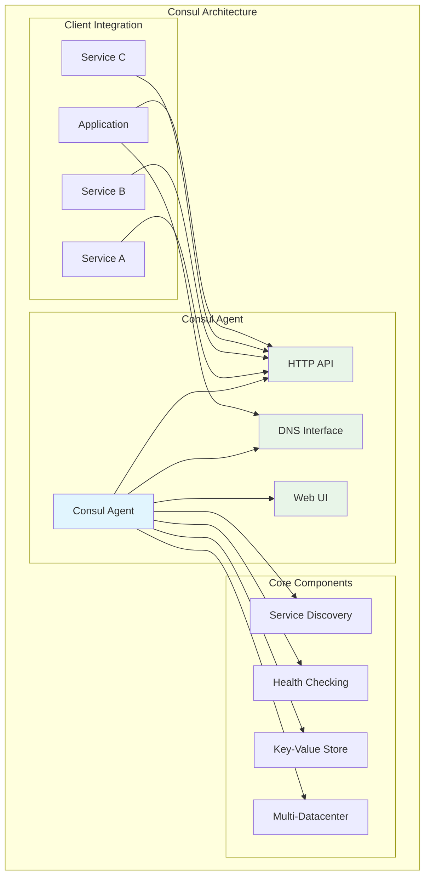

Think of Consul as a **digital receptionist** for your services—it knows where everyone is and can direct traffic accordingly.

### The Digital Receptionist Analogy

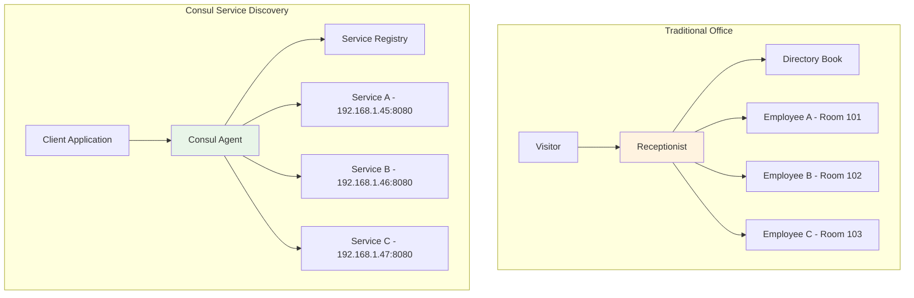

## Setting Up Consul

### 1. Start Consul in Development Mode

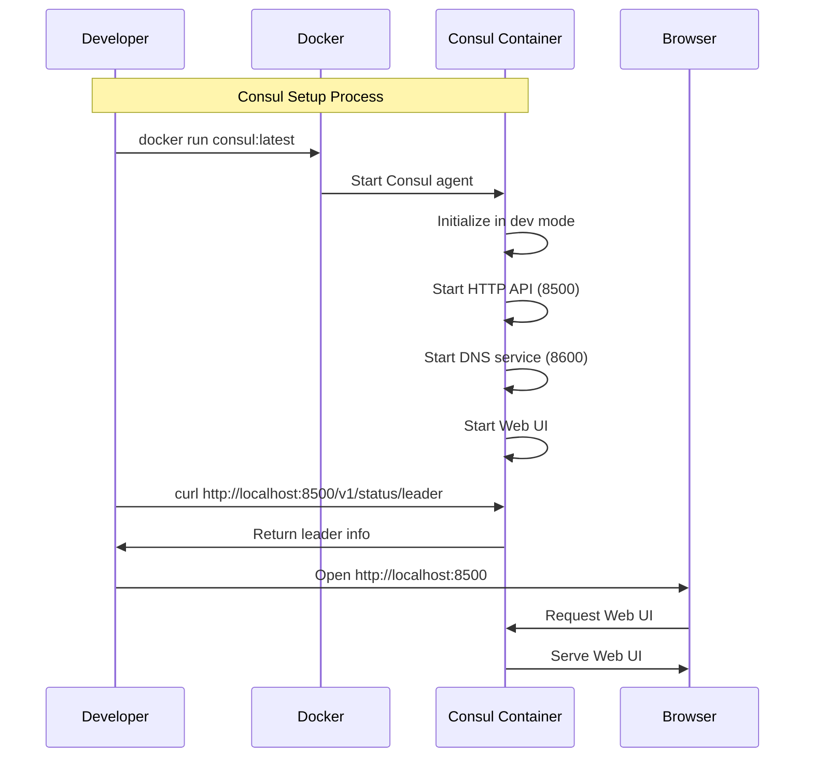

```bash
# Pull and run Consul in development mode
docker run -d --name consul-dev \
  -p 8500:8500 \
  -p 8600:8600/udp \
  consul:latest agent -dev -client=0.0.0.0

# Verify it's running
curl http://localhost:8500/v1/status/leader
```

**Consul Development Mode Setup**:

```mermaid
graph TD
    subgraph "Consul Container"
        subgraph "Network Ports"
            P1[8500 - HTTP API]
            P2[8600 - DNS]
        end
        
        subgraph "Core Services"
            API[HTTP API Server]
            DNS[DNS Server]
            UI[Web UI]
            Agent[Consul Agent]
        end
        
        subgraph "Storage"
            Mem[In-Memory Storage<br/>(Dev Mode Only)]
        end
        
        Agent --> API
        Agent --> DNS
        Agent --> UI
        Agent --> Mem
        
        API --> P1
        DNS --> P2
        
        style Agent fill:#e1f5fe
        style Mem fill:#fff3e0
    end
    
    subgraph "Your Machine"
        Browser[Browser<br/>http://localhost:8500]
        CLI[Command Line<br/>curl/API calls]
        Apps[Your Applications]
    end
    
    Browser --> P1
    CLI --> P1
    Apps --> P1
    Apps --> P2
```

This starts Consul with:
- **Web UI**: http://localhost:8500
- **HTTP API**: Port 8500
- **DNS**: Port 8600

### 2. Explore the Web UI

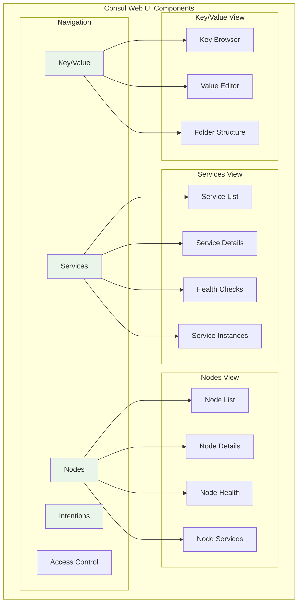

Open http://localhost:8500 in your browser. You'll see:
- **Services**: Currently empty (we'll add services here)
- **Nodes**: Your local Consul agent
- **Key/Value**: Configuration storage
- **Intentions**: Service-to-service permissions

## Registering Your First Service

### The Service Registration Flow

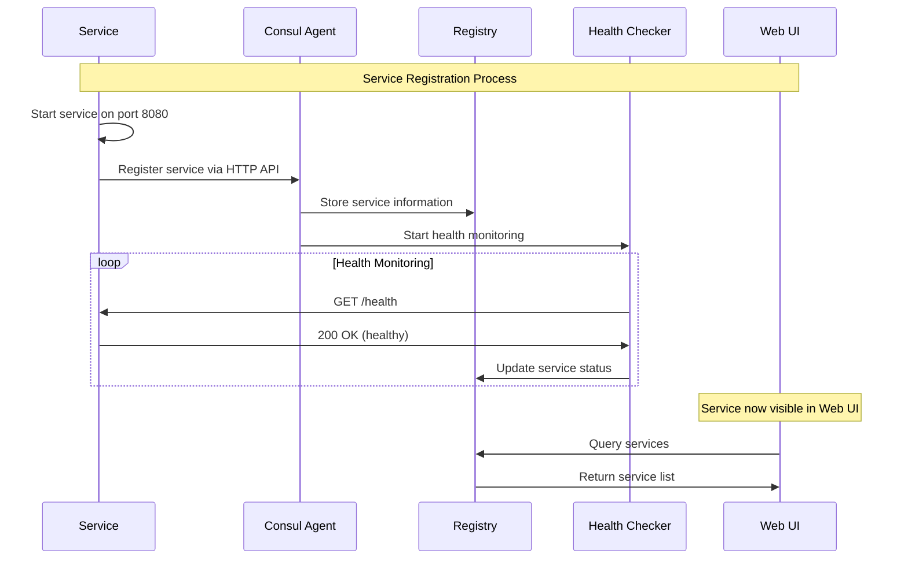

### 1. Create a Simple Web Service

Let's create a basic web service that we'll register with Consul:

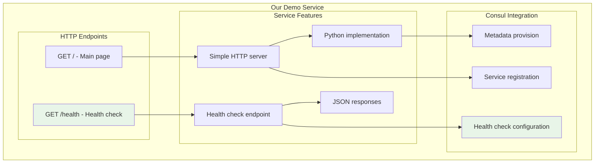

```bash
# Create a simple HTTP server
mkdir consul-demo && cd consul-demo

# Create a simple Python web server
cat > web_service.py << 'EOF'
#!/usr/bin/env python3
import http.server
import socketserver
import json
import threading
import time

class HealthHandler(http.server.SimpleHTTPRequestHandler):
    def do_GET(self):
        if self.path == '/health':
            self.send_response(200)
            self.send_header('Content-type', 'application/json')
            self.end_headers()
            health_data = {
                'status': 'healthy',
                'service': 'web-service',
                'timestamp': time.time()
            }
            self.wfile.write(json.dumps(health_data).encode())
        elif self.path == '/':
            self.send_response(200)
            self.send_header('Content-type', 'text/html')
            self.end_headers()
            self.wfile.write(b'<h1>Hello from Web Service!</h1>')
        else:
            self.send_response(404)
            self.end_headers()

if __name__ == '__main__':
    PORT = 8080
    with socketserver.TCPServer(("", PORT), HealthHandler) as httpd:
        print(f"Server running on port {PORT}")
        httpd.serve_forever()
EOF

# Make it executable
chmod +x web_service.py

# Run the service in the background
python3 web_service.py &
SERVICE_PID=$!

# Test the service
curl http://localhost:8080/health
```

### 2. Register the Service with Consul

```mermaid
sequenceDiagram
    participant D as Developer
    participant C as Consul API
    participant R as Registry
    participant H as Health Checker
    participant S as Service
    
    Note over D,S: Service Registration
    
    D->>C: POST /v1/agent/service/register
    Note over D: {
      "ID": "web-service-1",
      "Name": "web-service",
      "Address": "localhost",
      "Port": 8080,
      "Tags": ["web", "python", "v1.0"],
      "Check": {
        "HTTP": "http://localhost:8080/health",
        "Interval": "10s"
      }
    }
    
    C->>R: Store service registration
    C->>H: Configure health check
    C->>D: 200 OK - Registration successful
    
    Note over H,S: Health Check Setup
    
    H->>S: GET /health (every 10s)
    S->>H: 200 OK + health status
    H->>R: Update service health
```

Now let's register our web service with Consul:

```bash
# Register the service
curl -X PUT http://localhost:8500/v1/agent/service/register \
  -H "Content-Type: application/json" \
  -d '{
    "ID": "web-service-1",
    "Name": "web-service",
    "Address": "localhost",
    "Port": 8080,
    "Tags": ["web", "python", "v1.0"],
    "Meta": {
      "version": "1.0.0",
      "environment": "development"
    },
    "Check": {
      "HTTP": "http://localhost:8080/health",
      "Interval": "10s",
      "Timeout": "3s"
    }
  }'
```

**Service Registration Breakdown**:

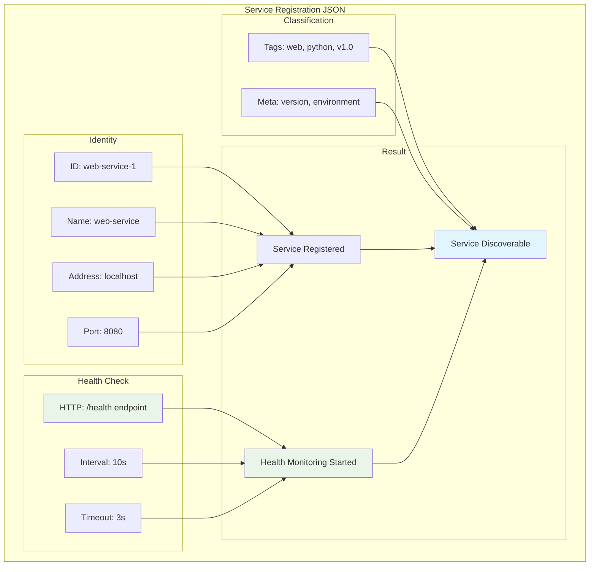

### 3. Verify the Registration

```bash
# List all services
curl http://localhost:8500/v1/agent/services | jq

# Get specific service details
curl http://localhost:8500/v1/health/service/web-service | jq

# Check the web UI
echo "Visit http://localhost:8500 to see your service!"
```

## Understanding Health Checks

### Health Check Architecture

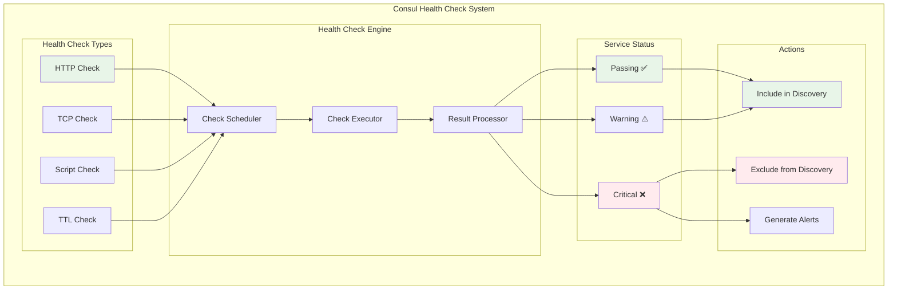

### 1. Health Check Types

Consul supports several health check types:

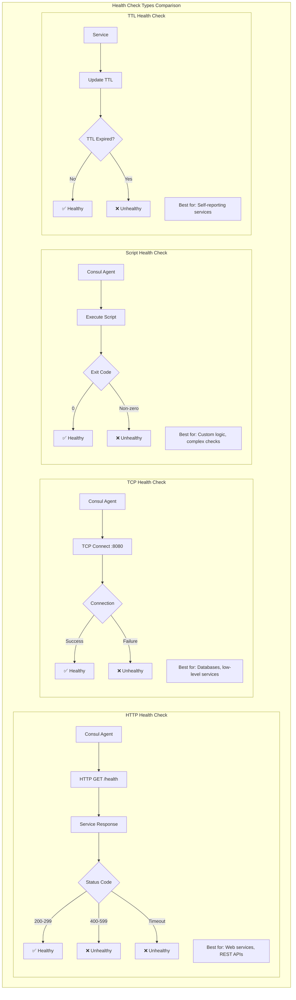

```bash
# HTTP health check (what we used)
curl -X PUT http://localhost:8500/v1/agent/check/register \
  -H "Content-Type: application/json" \
  -d '{
    "ID": "web-service-http",
    "Name": "Web Service HTTP Check",
    "ServiceID": "web-service-1",
    "HTTP": "http://localhost:8080/health",
    "Interval": "10s",
    "Timeout": "3s"
  }'

# TCP health check
curl -X PUT http://localhost:8500/v1/agent/check/register \
  -H "Content-Type: application/json" \
  -d '{
    "ID": "web-service-tcp",
    "Name": "Web Service TCP Check",
    "ServiceID": "web-service-1",
    "TCP": "localhost:8080",
    "Interval": "10s",
    "Timeout": "3s"
  }'
```

### 2. Health Check States

```bash
# Check current health status
curl http://localhost:8500/v1/health/checks/web-service | jq

# Manually pass/fail a check
curl -X PUT http://localhost:8500/v1/agent/check/pass/web-service-http
curl -X PUT http://localhost:8500/v1/agent/check/fail/web-service-http
```

## Service Discovery in Action

### The Discovery Process

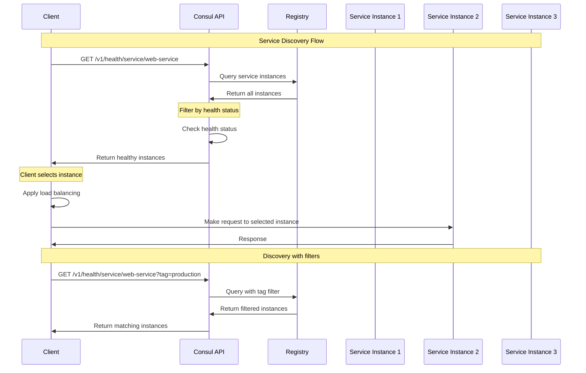

### 1. Discovering Services

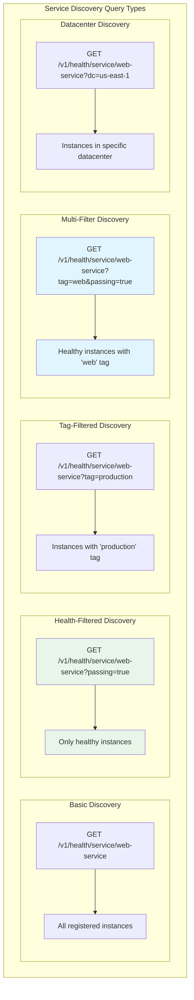

```bash
# Find all instances of web-service
curl http://localhost:8500/v1/health/service/web-service | jq

# Find only healthy instances
curl http://localhost:8500/v1/health/service/web-service?passing=true | jq

# Find services with specific tags
curl http://localhost:8500/v1/health/service/web-service?tag=web | jq

# Combine filters
curl "http://localhost:8500/v1/health/service/web-service?tag=production&passing=true" | jq
```

### 2. Create a Discovery Client

Let's create a simple client that discovers and connects to services:

```bash
cat > discovery_client.py << 'EOF'
#!/usr/bin/env python3
import requests
import json
import random
import time

class ConsulDiscoveryClient:
    def __init__(self, consul_host='localhost', consul_port=8500):
        self.consul_url = f"http://{consul_host}:{consul_port}"
    
    def discover_service(self, service_name, healthy_only=True):
        """Discover instances of a service"""
        url = f"{self.consul_url}/v1/health/service/{service_name}"
        if healthy_only:
            url += "?passing=true"
        
        try:
            response = requests.get(url)
            response.raise_for_status()
            services = response.json()
            
            return [{
                'id': service['Service']['ID'],
                'address': service['Service']['Address'],
                'port': service['Service']['Port'],
                'tags': service['Service']['Tags'],
                'healthy': all(check['Status'] == 'passing' 
                             for check in service['Checks'])
            } for service in services]
        except requests.exceptions.RequestException as e:
            print(f"Error discovering service: {e}")
            return []
    
    def get_service_instance(self, service_name):
        """Get a single service instance using round-robin"""
        instances = self.discover_service(service_name)
        if not instances:
            return None
        
        # Simple random selection (in real systems, use proper load balancing)
        return random.choice(instances)
    
    def make_request(self, service_name, path="/"):
        """Make a request to a service instance"""
        instance = self.get_service_instance(service_name)
        if not instance:
            return None
        
        url = f"http://{instance['address']}:{instance['port']}{path}"
        try:
            response = requests.get(url)
            return response.text
        except requests.exceptions.RequestException as e:
            print(f"Error making request to {url}: {e}")
            return None

# Example usage
if __name__ == '__main__':
    client = ConsulDiscoveryClient()
    
    # Discover web-service instances
    print("Discovering web-service instances...")
    instances = client.discover_service('web-service')
    print(f"Found {len(instances)} instances:")
    for instance in instances:
        print(f"  - {instance['id']}: {instance['address']}:{instance['port']}")
    
    # Make requests to the service
    print("\nMaking requests to the service...")
    for i in range(5):
        response = client.make_request('web-service', '/')
        if response:
            print(f"Request {i+1}: {response[:50]}...")
        time.sleep(1)
EOF

# Make it executable
chmod +x discovery_client.py

# Run the discovery client
python3 discovery_client.py
```

## Scaling with Multiple Instances

### Load Balancing and High Availability

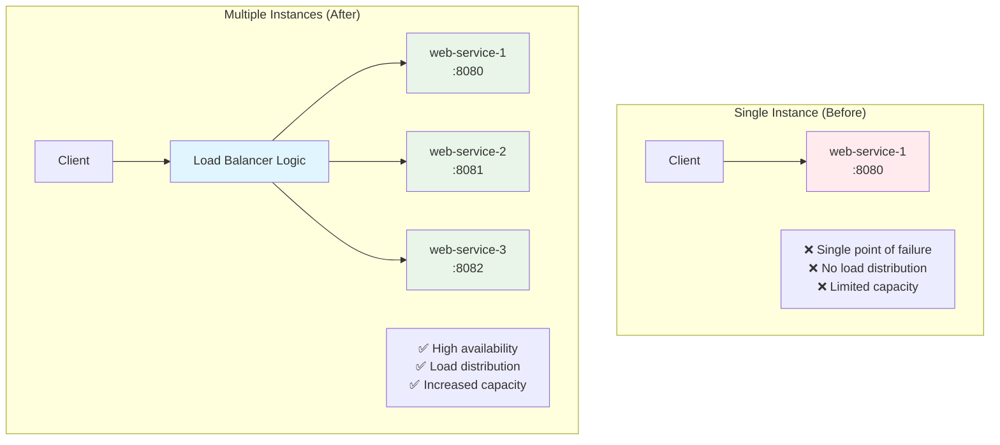

### 1. Register Multiple Service Instances

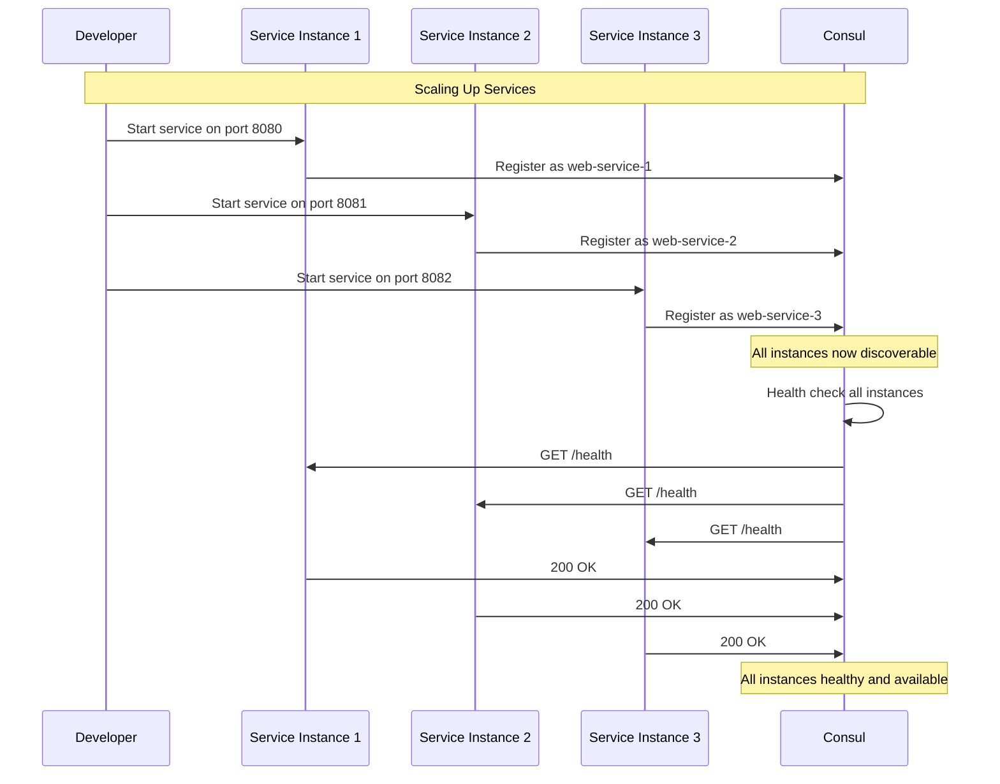

```bash
# Start additional service instances
python3 web_service.py &
SERVICE_PID_2=$!

# Register second instance (on different port)
curl -X PUT http://localhost:8500/v1/agent/service/register \
  -H "Content-Type: application/json" \
  -d '{
    "ID": "web-service-2",
    "Name": "web-service",
    "Address": "localhost",
    "Port": 8081,
    "Tags": ["web", "python", "v1.0"],
    "Meta": {
      "version": "1.0.0",
      "environment": "development"
    },
    "Check": {
      "HTTP": "http://localhost:8081/health",
      "Interval": "10s",
      "Timeout": "3s"
    }
  }'
```

### 2. Test Load Distribution

```bash
# Run the discovery client again
python3 discovery_client.py

# You should see requests distributed across both instances
```

## Service Metadata and Tagging

### 1. Advanced Service Registration

```bash
# Register a service with rich metadata
curl -X PUT http://localhost:8500/v1/agent/service/register \
  -H "Content-Type: application/json" \
  -d '{
    "ID": "user-service-1",
    "Name": "user-service",
    "Address": "localhost",
    "Port": 9090,
    "Tags": ["api", "user", "v2.0", "production"],
    "Meta": {
      "version": "2.0.0",
      "environment": "production",
      "team": "user-experience",
      "capabilities": "read,write,delete",
      "protocol": "http"
    },
    "Check": {
      "HTTP": "http://localhost:9090/health",
      "Interval": "10s",
      "Timeout": "3s"
    }
  }'
```

### 2. Query by Metadata

```bash
# Find services by tag
curl "http://localhost:8500/v1/health/service/user-service?tag=production" | jq

# Find services with specific metadata (using catalog endpoint)
curl "http://localhost:8500/v1/catalog/service/user-service" | jq '.[] | select(.ServiceMeta.environment == "production")'
```

## DNS Interface

Consul provides a DNS interface for service discovery:

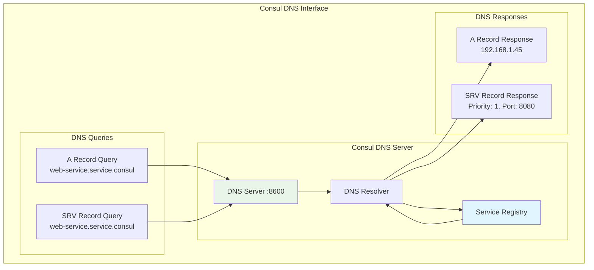

```bash
# Query services via DNS
dig @127.0.0.1 -p 8600 web-service.service.consul

# Query for SRV records (includes port information)
dig @127.0.0.1 -p 8600 web-service.service.consul SRV

# Query for healthy instances only
dig @127.0.0.1 -p 8600 web-service.service.consul

# Query specific datacenter
dig @127.0.0.1 -p 8600 web-service.service.dc1.consul
```

### DNS Query Types

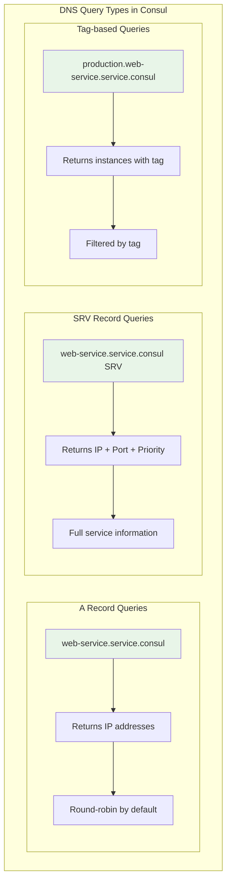

## Best Practices Demonstrated

### Service Lifecycle Best Practices

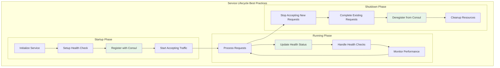

### 1. Graceful Shutdown

```bash
cat > graceful_service.py << 'EOF'
#!/usr/bin/env python3
import signal
import sys
import requests
import time
from web_service import HealthHandler
import socketserver

class GracefulService:
    def __init__(self, service_id, port):
        self.service_id = service_id
        self.port = port
        self.consul_url = "http://localhost:8500"
        self.running = True
        
        # Set up signal handlers
        signal.signal(signal.SIGINT, self.shutdown)
        signal.signal(signal.SIGTERM, self.shutdown)
    
    def register(self):
        """Register service with Consul"""
        registration = {
            "ID": self.service_id,
            "Name": "graceful-service",
            "Address": "localhost",
            "Port": self.port,
            "Tags": ["graceful", "demo"],
            "Check": {
                "HTTP": f"http://localhost:{self.port}/health",
                "Interval": "10s",
                "Timeout": "3s"
            }
        }
        
        try:
            response = requests.put(
                f"{self.consul_url}/v1/agent/service/register",
                json=registration
            )
            response.raise_for_status()
            print(f"Service {self.service_id} registered successfully")
        except requests.exceptions.RequestException as e:
            print(f"Failed to register service: {e}")
    
    def deregister(self):
        """Deregister service from Consul"""
        try:
            response = requests.put(
                f"{self.consul_url}/v1/agent/service/deregister/{self.service_id}"
            )
            response.raise_for_status()
            print(f"Service {self.service_id} deregistered successfully")
        except requests.exceptions.RequestException as e:
            print(f"Failed to deregister service: {e}")
    
    def shutdown(self, signum, frame):
        """Graceful shutdown handler"""
        print(f"Received signal {signum}, shutting down gracefully...")
        self.running = False
        self.deregister()
        sys.exit(0)
    
    def run(self):
        """Run the service"""
        self.register()
        
        # Start HTTP server
        with socketserver.TCPServer(("", self.port), HealthHandler) as httpd:
            print(f"Service running on port {self.port}")
            while self.running:
                httpd.handle_request()

if __name__ == '__main__':
    service = GracefulService("graceful-service-1", 8082)
    service.run()
EOF

# Run the graceful service
python3 graceful_service.py
# Press Ctrl+C to see graceful shutdown
```

## Cleanup

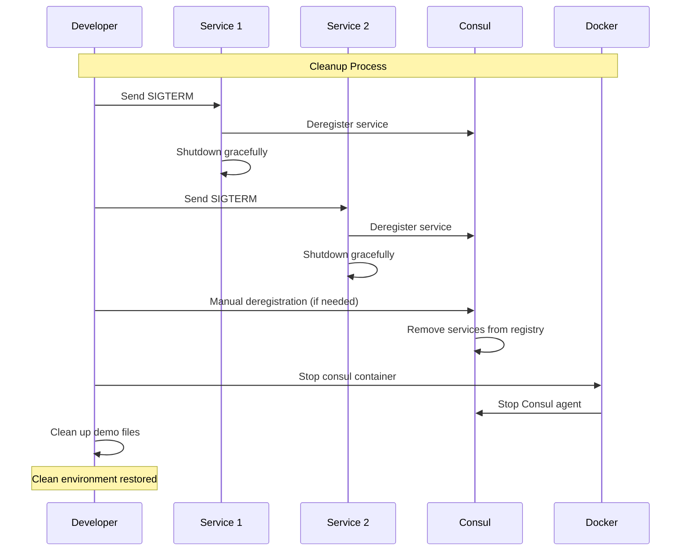

```bash
# Stop all services
kill $SERVICE_PID $SERVICE_PID_2 2>/dev/null || true

# Deregister services (if not done gracefully)
curl -X PUT http://localhost:8500/v1/agent/service/deregister/web-service-1
curl -X PUT http://localhost:8500/v1/agent/service/deregister/web-service-2

# Stop Consul
docker stop consul-dev
docker rm consul-dev

# Clean up files
rm -f web_service.py discovery_client.py graceful_service.py
```

## Key Takeaways

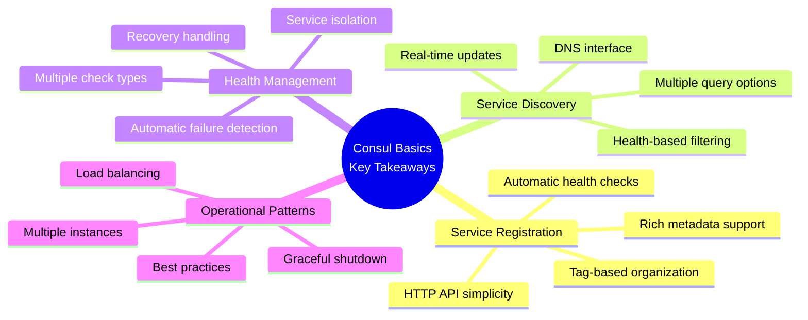

**Core Concepts Demonstrated**:

1. **Service registration** is straightforward with Consul's HTTP API
2. **Health checks** automatically manage service availability
3. **Service discovery** enables dynamic service location
4. **Metadata and tags** provide rich service information
5. **Graceful shutdown** ensures clean service deregistration
6. **Scaling** through multiple instances is seamless
7. **DNS interface** provides alternative discovery method

**What You've Learned**:

```mermaid
graph TD
    subgraph "Practical Skills Gained"
        subgraph "Consul Operations"
            O1[Start Consul in dev mode]
            O2[Use Consul Web UI]
            O3[Register services via API]
            O4[Query services programmatically]
        end
        
        subgraph "Service Development"
            D1[Create health check endpoints]
            D2[Implement graceful shutdown]
            D3[Handle service metadata]
            D4[Build discovery clients]
        end
        
        subgraph "System Design"
            S1[Understand service lifecycle]
            S2[Design for high availability]
            S3[Implement load balancing]
            S4[Plan for failure scenarios]
        end
        
        style O1 fill:#e8f5e8
        style D1 fill:#e8f5e8
        style S1 fill:#e8f5e8
    end
```

This hands-on experience demonstrates the core concepts of service discovery in action. Next, we'll explore the architectural patterns and trade-offs in client-side vs. server-side discovery.