# Client-Side vs Server-Side Discovery: Architecture Patterns Deep Dive

## The Fundamental Question

When implementing service discovery, you face a crucial architectural decision: **Who handles the discovery logic?**

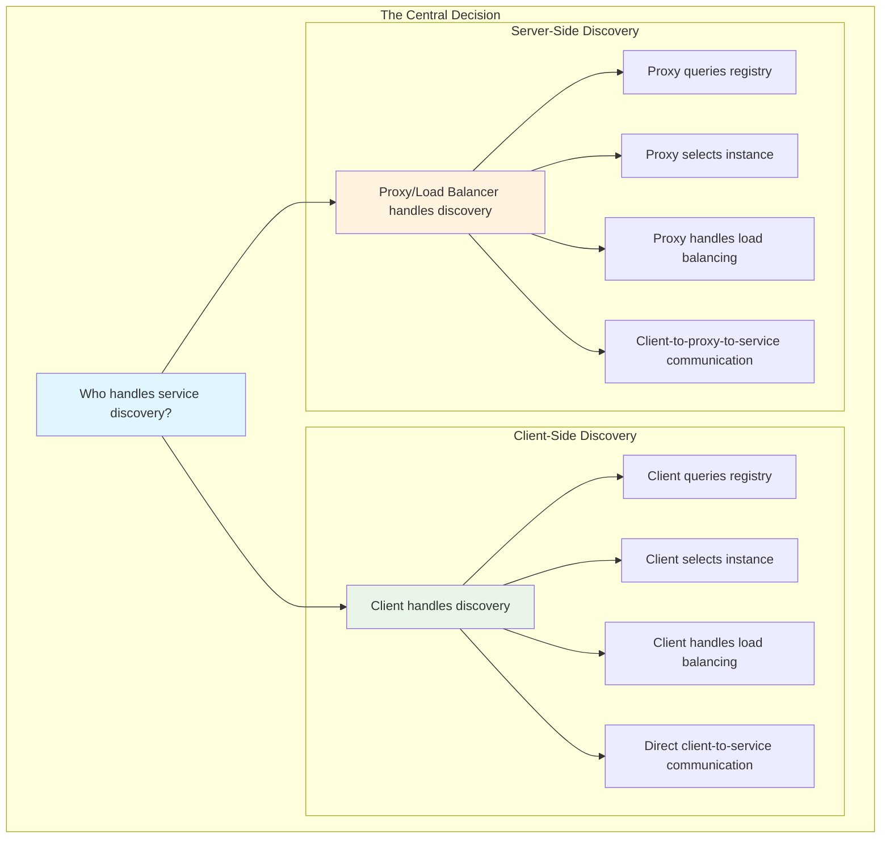

- **Client-Side Discovery**: Clients query the service registry directly and handle load balancing
- **Server-Side Discovery**: A proxy or load balancer queries the registry and routes requests

This choice fundamentally shapes your system's complexity, performance, and failure modes.

### Impact on System Architecture

```mermaid
compare
    title Client-Side vs Server-Side Discovery
    
    "Client-Side" : {
        "Complexity": "Client complexity increases",
        "Performance": "Lower latency (direct communication)",
        "Scalability": "Scales with client count",
        "Failure Modes": "Client handles failures locally"
    }
    
    "Server-Side" : {
        "Complexity": "Proxy complexity increases",
        "Performance": "Higher latency (proxy hop)",
        "Scalability": "Scales with proxy capacity",
        "Failure Modes": "Proxy is single point of failure"
    }
```

## Client-Side Discovery: The Direct Approach

### Architecture Overview

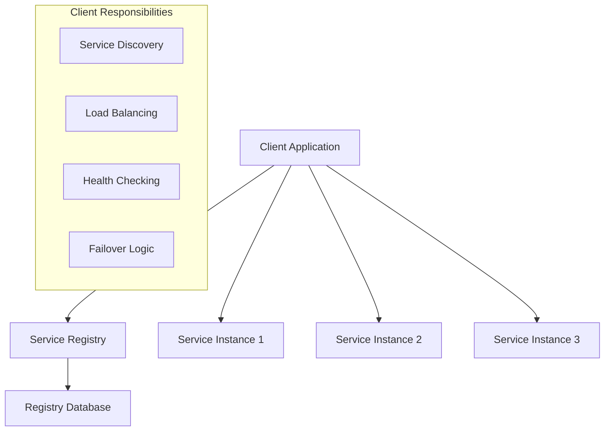

### How It Works

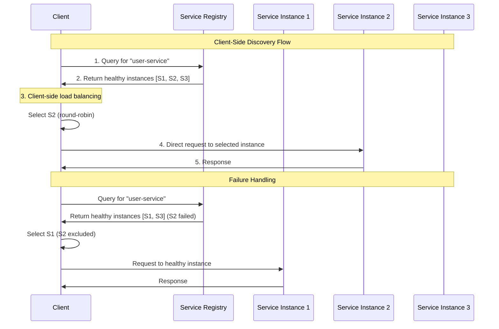

1. **Client queries** the service registry for available instances
2. **Client receives** a list of healthy service instances
3. **Client selects** an instance using load balancing logic
4. **Client makes** the request directly to the chosen instance

### The Client's Responsibilities

```mermaid
graph TD
    subgraph "Client-Side Discovery Responsibilities"
        subgraph "Core Functions"
            F1[Service Registry Communication]
            F2[Service Instance Selection]
            F3[Load Balancing Algorithm]
            F4[Health Status Tracking]
        end
        
        subgraph "Advanced Functions"
            A1[Circuit Breaker Logic]
            A2[Retry Mechanisms]
            A3[Failover Strategies]
            A4[Performance Monitoring]
        end
        
        subgraph "Operational Functions"
            O1[Caching Strategy]
            O2[Configuration Management]
            O3[Error Handling]
            O4[Logging and Metrics]
        end
        
        F1 --> F2
        F2 --> F3
        F3 --> F4
        
        F4 --> A1
        A1 --> A2
        A2 --> A3
        A3 --> A4
        
        A4 --> O1
        O1 --> O2
        O2 --> O3
        O3 --> O4
        
        style F1 fill:#e8f5e8
        style A1 fill:#fff3e0
        style O1 fill:#e1f5fe
    end
```

### Example Implementation

```python
import requests
import random
import time
from typing import List, Optional

class ClientSideDiscovery:
    def __init__(self, registry_url: str):
        self.registry_url = registry_url
        self.service_cache = {}
        self.last_refresh = {}
        self.refresh_interval = 30  # seconds
    
    def discover_service(self, service_name: str) -> List[dict]:
        """Discover healthy instances of a service"""
        now = time.time()
        
        # Check cache freshness
        if (service_name in self.service_cache and 
            now - self.last_refresh.get(service_name, 0) < self.refresh_interval):
            return self.service_cache[service_name]
        
        # Fetch from registry
        try:
            response = requests.get(
                f"{self.registry_url}/v1/health/service/{service_name}?passing=true"
            )
            response.raise_for_status()
            
            services = []
            for service_data in response.json():
                services.append({
                    'address': service_data['Service']['Address'],
                    'port': service_data['Service']['Port'],
                    'tags': service_data['Service']['Tags'],
                    'weight': service_data['Service'].get('Meta', {}).get('weight', 1)
                })
            
            # Update cache
            self.service_cache[service_name] = services
            self.last_refresh[service_name] = now
            
            return services
            
        except requests.exceptions.RequestException as e:
            print(f"Registry query failed: {e}")
            # Return cached data if available
            return self.service_cache.get(service_name, [])
    
    def select_instance(self, instances: List[dict], strategy: str = 'round_robin') -> Optional[dict]:
        """Select an instance using the specified strategy"""
        if not instances:
            return None
        
        if strategy == 'random':
            return random.choice(instances)
        elif strategy == 'weighted':
            return self._weighted_selection(instances)
        else:  # round_robin
            return self._round_robin_selection(instances)
    
    def _weighted_selection(self, instances: List[dict]) -> dict:
        """Select instance based on weights"""
        total_weight = sum(instance['weight'] for instance in instances)
        r = random.uniform(0, total_weight)
        
        current_weight = 0
        for instance in instances:
            current_weight += instance['weight']
            if r <= current_weight:
                return instance
        
        return instances[-1]  # fallback
    
    def _round_robin_selection(self, instances: List[dict]) -> dict:
        """Simple round-robin selection"""
        if not hasattr(self, '_rr_index'):
            self._rr_index = 0
        
        instance = instances[self._rr_index % len(instances)]
        self._rr_index += 1
        return instance
    
    def make_request(self, service_name: str, path: str = "/", **kwargs) -> Optional[requests.Response]:
        """Make a request to a service with automatic discovery and failover"""
        instances = self.discover_service(service_name)
        
        # Try multiple instances on failure
        for attempt in range(min(3, len(instances))):
            instance = self.select_instance(instances)
            if not instance:
                continue
            
            url = f"http://{instance['address']}:{instance['port']}{path}"
            try:
                response = requests.get(url, timeout=5, **kwargs)
                response.raise_for_status()
                return response
            except requests.exceptions.RequestException as e:
                print(f"Request to {url} failed: {e}")
                # Remove failed instance from this attempt
                instances.remove(instance)
        
        return None

# Usage example
client = ClientSideDiscovery("http://localhost:8500")
response = client.make_request("user-service", "/api/users/123")
```

### Advantages of Client-Side Discovery

**1. Simplicity**
- No additional infrastructure components
- Direct client-to-service communication
- Easier to understand and debug

**2. Performance**
- No extra network hop through a proxy
- Client can cache service information
- Optimal routing decisions based on client context

**3. Flexibility**
- Clients can implement custom load balancing strategies
- Service-specific routing logic
- Client-side circuit breakers and retry logic

**4. Decentralization**
- No single point of failure (beyond the registry)
- Clients can operate with cached data during registry outages

### Disadvantages of Client-Side Discovery

**1. Client Complexity**
- Every client must implement discovery logic
- Load balancing algorithms in client code
- Language-specific client libraries needed

**2. Coupling**
- Clients tightly coupled to service registry
- Service registry changes affect all clients
- Difficult to change discovery mechanisms

**3. Operational Overhead**
- Multiple client libraries to maintain
- Consistent behavior across different languages
- Debugging distributed across many clients

## Server-Side Discovery: The Proxy Approach

### Architecture Overview

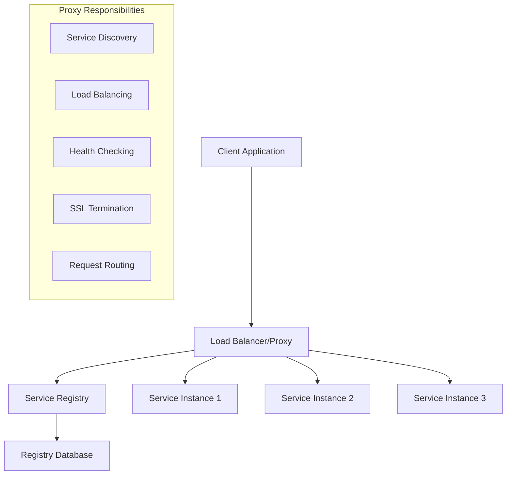

### How It Works

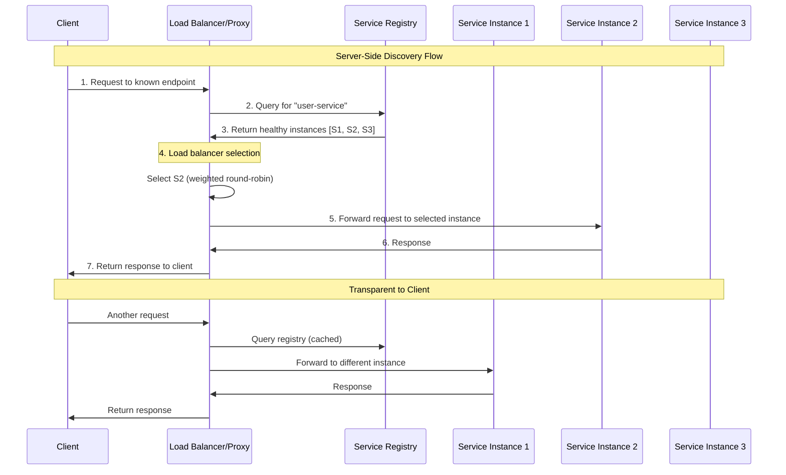

1. **Client makes** a request to a known load balancer endpoint
2. **Load balancer queries** the service registry for available instances
3. **Load balancer selects** an instance and forwards the request
4. **Load balancer returns** the response to the client

### The Proxy's Responsibilities

```mermaid
graph TD
    subgraph "Server-Side Discovery Responsibilities"
        subgraph "Core Proxy Functions"
            P1[Request Routing]
            P2[Service Registry Integration]
            P3[Load Balancing]
            P4[Health Check Management]
        end
        
        subgraph "Advanced Proxy Functions"
            A1[SSL/TLS Termination]
            A2[Request/Response Transformation]
            A3[Rate Limiting]
            A4[Circuit Breaker]
        end
        
        subgraph "Operational Functions"
            O1[Connection Pooling]
            O2[Caching Strategy]
            O3[Metrics Collection]
            O4[High Availability]
        end
        
        P1 --> P2
        P2 --> P3
        P3 --> P4
        
        P4 --> A1
        A1 --> A2
        A2 --> A3
        A3 --> A4
        
        A4 --> O1
        O1 --> O2
        O2 --> O3
        O3 --> O4
        
        style P1 fill:#e8f5e8
        style A1 fill:#fff3e0
        style O1 fill:#e1f5fe
    end
```

### Example Implementation with HAProxy

```haproxy
# HAProxy configuration for server-side discovery
global
    daemon

defaults
    mode http
    timeout connect 5000ms
    timeout client 50000ms
    timeout server 50000ms

# Template for service discovery integration
resolvers consul
    nameserver consul1 127.0.0.1:8600
    resolve_retries 3
    timeout retry 1s

# Dynamic backend with Consul DNS
backend user_service
    balance roundrobin
    option httpchk GET /health
    
    # Dynamic service discovery via Consul DNS
    server-template user- 5 user-service.service.consul:8080 \
        check resolvers consul init-addr none

# Frontend
frontend main
    bind *:80
    default_backend user_service
```

### Example Implementation with Custom Proxy

```go
package main

import (
    "fmt"
    "net/http"
    "net/http/httputil"
    "net/url"
    "strings"
    "time"
    
    "github.com/hashicorp/consul/api"
)

type ServiceProxy struct {
    consulClient *api.Client
    cache        map[string][]*api.ServiceEntry
    lastRefresh  map[string]time.Time
}

func NewServiceProxy() (*ServiceProxy, error) {
    client, err := api.NewClient(api.DefaultConfig())
    if err != nil {
        return nil, err
    }
    
    return &ServiceProxy{
        consulClient: client,
        cache:        make(map[string][]*api.ServiceEntry),
        lastRefresh:  make(map[string]time.Time),
    }, nil
}

func (sp *ServiceProxy) getHealthyInstances(serviceName string) ([]*api.ServiceEntry, error) {
    // Check cache
    if instances, exists := sp.cache[serviceName]; exists {
        if time.Since(sp.lastRefresh[serviceName]) < 30*time.Second {
            return instances, nil
        }
    }
    
    // Query Consul
    services, _, err := sp.consulClient.Health().Service(serviceName, "", true, nil)
    if err != nil {
        // Return cached data on error
        if cached, exists := sp.cache[serviceName]; exists {
            return cached, nil
        }
        return nil, err
    }
    
    // Update cache
    sp.cache[serviceName] = services
    sp.lastRefresh[serviceName] = time.Now()
    
    return services, nil
}

func (sp *ServiceProxy) selectInstance(instances []*api.ServiceEntry) *api.ServiceEntry {
    if len(instances) == 0 {
        return nil
    }
    
    // Simple round-robin (in production, use proper load balancing)
    return instances[time.Now().UnixNano()%int64(len(instances))]
}

func (sp *ServiceProxy) ServeHTTP(w http.ResponseWriter, r *http.Request) {
    // Extract service name from path
    parts := strings.Split(r.URL.Path, "/")
    if len(parts) < 2 {
        http.Error(w, "Invalid path", http.StatusBadRequest)
        return
    }
    
    serviceName := parts[1]
    
    // Get healthy instances
    instances, err := sp.getHealthyInstances(serviceName)
    if err != nil {
        http.Error(w, fmt.Sprintf("Service discovery error: %v", err), http.StatusServiceUnavailable)
        return
    }
    
    // Select instance
    instance := sp.selectInstance(instances)
    if instance == nil {
        http.Error(w, "No healthy instances available", http.StatusServiceUnavailable)
        return
    }
    
    // Create proxy
    target := &url.URL{
        Scheme: "http",
        Host:   fmt.Sprintf("%s:%d", instance.Service.Address, instance.Service.Port),
    }
    
    proxy := httputil.NewSingleHostReverseProxy(target)
    
    // Update request path (remove service name)
    r.URL.Path = "/" + strings.Join(parts[2:], "/")
    
    // Forward request
    proxy.ServeHTTP(w, r)
}

func main() {
    proxy, err := NewServiceProxy()
    if err != nil {
        panic(err)
    }
    
    fmt.Println("Service proxy running on :8080")
    http.ListenAndServe(":8080", proxy)
}
```

### Advantages of Server-Side Discovery

**1. Client Simplicity**
- Clients only need to know the load balancer address
- No service discovery logic in application code
- Language-agnostic approach

**2. Centralized Control**
- Single point for routing policies
- Easier to implement cross-cutting concerns
- Consistent behavior across all services

**3. Operational Benefits**
- Centralized monitoring and logging
- SSL termination at the proxy
- Request/response transformation capabilities

**4. Advanced Features**
- Circuit breakers and retries
- Rate limiting and throttling
- Request tracing and metrics

### Disadvantages of Server-Side Discovery

**1. Additional Infrastructure**
- Extra component to deploy and maintain
- Potential single point of failure
- Additional latency from proxy hop

**2. Complexity**
- Proxy configuration and management
- High availability requirements
- Debugging distributed across client, proxy, and service

**3. Performance Overhead**
- Additional network hop
- Proxy processing time
- Potential bottleneck under high load

## Hybrid Approaches

### Service Mesh Pattern

Modern service mesh solutions like Istio, Linkerd, and Consul Connect combine both approaches:

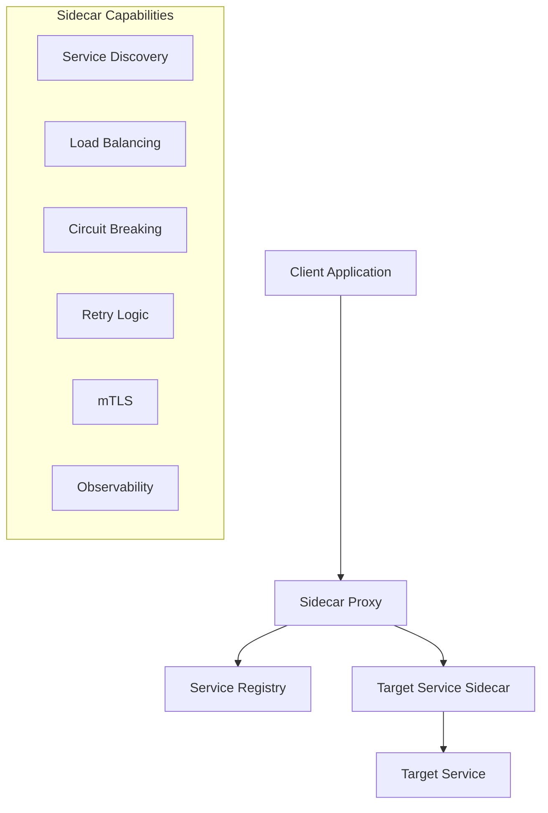

**Benefits**:
- Client simplicity with proxy features
- Automatic sidecar injection
- Advanced traffic management
- Security and observability built-in

### Edge Proxy + Client Libraries

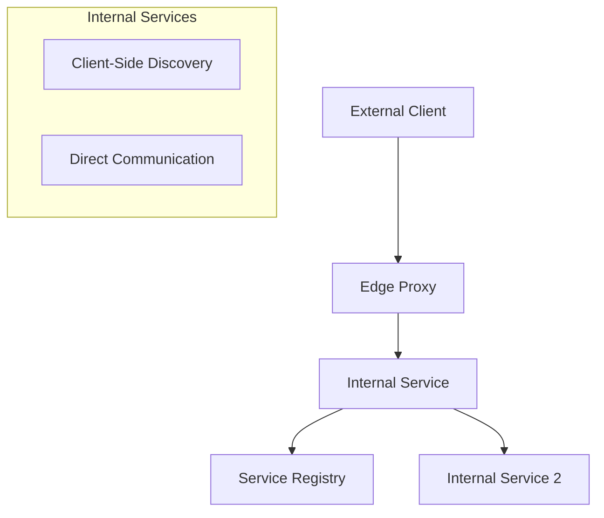

**Pattern**: Use server-side discovery for external traffic and client-side discovery for internal service-to-service communication.

## Decision Framework

### Choose Client-Side Discovery When:

- **Simple architecture** with few service types
- **Performance is critical** (every millisecond matters)
- **Teams prefer decentralized** control
- **Polyglot environment** with strong client library support

### Choose Server-Side Discovery When:

- **Complex routing requirements** (A/B testing, canary deployments)
- **Centralized policies** needed (security, compliance)
- **Operational simplicity** preferred
- **Cross-cutting concerns** (logging, metrics, tracing)

### Choose Hybrid When:

- **Large-scale systems** with diverse requirements
- **Microservices architecture** with service mesh
- **Security is paramount** (mTLS, policy enforcement)
- **Observability is critical** (distributed tracing, metrics)

## Performance Comparison

### Latency Analysis

```mermaid
gantt
    title Service Discovery Latency Comparison
    dateFormat X
    axisFormat %s
    
    section Client-Side Discovery
    Registry Query    :0, 10
    Service Request   :10, 15
    
    section Server-Side Discovery (Cold)
    Proxy Processing  :0, 2
    Registry Query    :2, 12
    Service Request   :12, 17
    
    section Server-Side Discovery (Warm)
    Proxy Processing  :0, 2
    Cached Registry   :2, 3
    Service Request   :3, 8
```

**Detailed Latency Breakdown**:

| Scenario | Registry Query | Load Balancing | Service Request | Total Latency |
|----------|----------------|----------------|-----------------|---------------|
| **Client-Side** | 10ms | 1ms | 5ms | **16ms** |
| **Server-Side (Cold)** | 10ms | 2ms | 5ms | **17ms** |
| **Server-Side (Warm)** | 1ms (cached) | 2ms | 5ms | **8ms** |

### Throughput Considerations

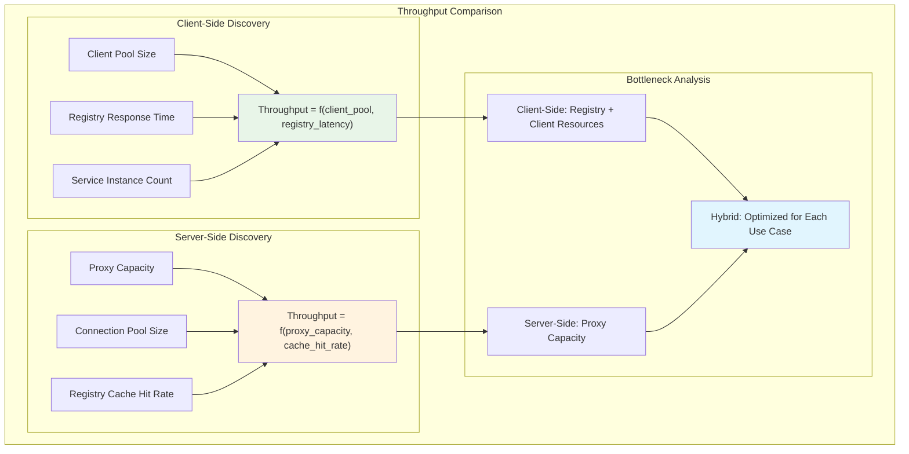

- **Client-Side**: Limited by client connection pooling and registry responsiveness
- **Server-Side**: Limited by proxy capacity and configuration
- **Hybrid**: Best of both worlds with proper design

## Mental Model for Decision Making

Think of service discovery patterns like **navigation systems**:

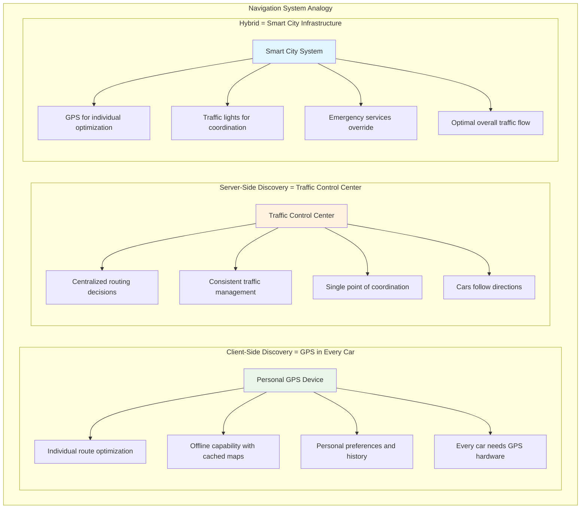

### Decision Framework Matrix

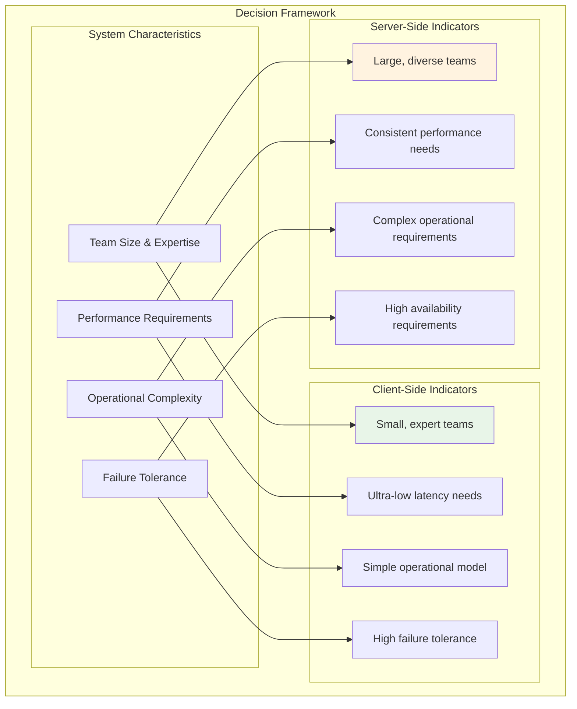

**Client-Side Discovery** = **GPS in every car**
- Each driver has their own navigation system
- Can choose optimal routes based on personal preferences
- Works offline with cached maps
- Every car needs GPS hardware and updates

**Server-Side Discovery** = **Traffic control center**
- Centralized routing decisions
- Consistent traffic management
- Single point of coordination
- Cars just follow directions

**Hybrid** = **Smart city infrastructure**
- GPS for individual optimization
- Traffic lights for coordination
- Emergency services can override
- Best overall traffic flow

### Final Decision Tree

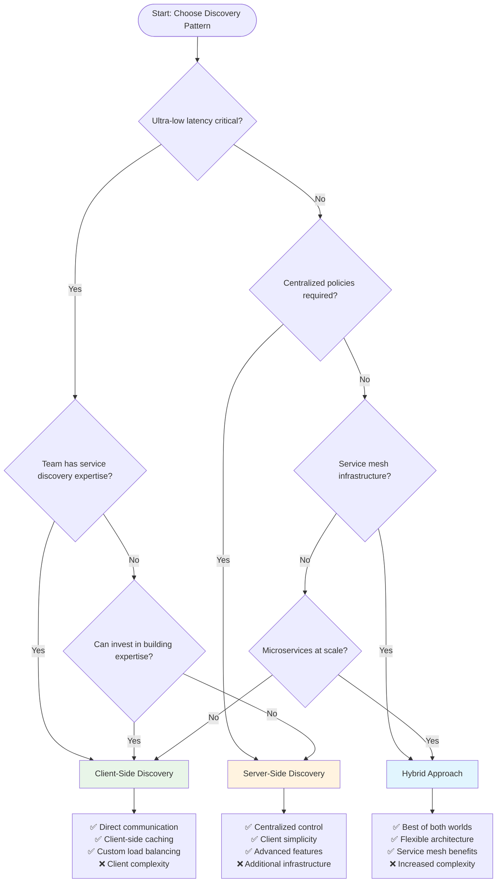

Choose the pattern that best fits your system's complexity, performance requirements, and operational preferences.