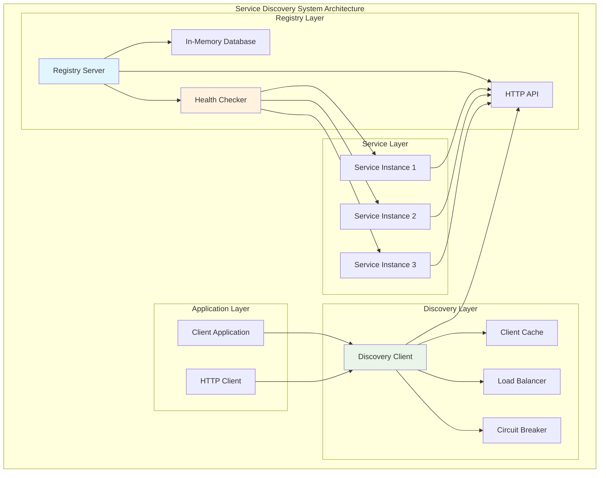
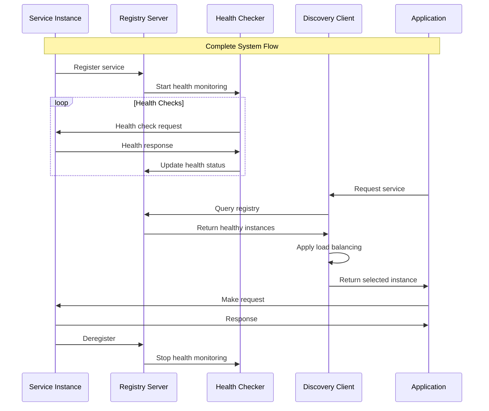
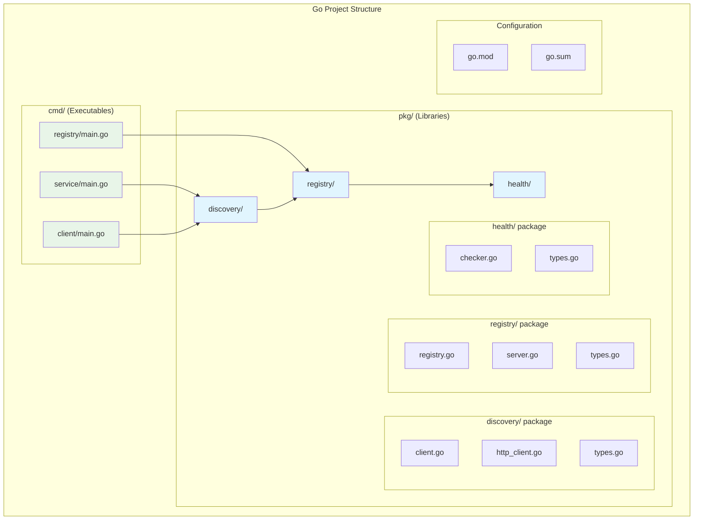
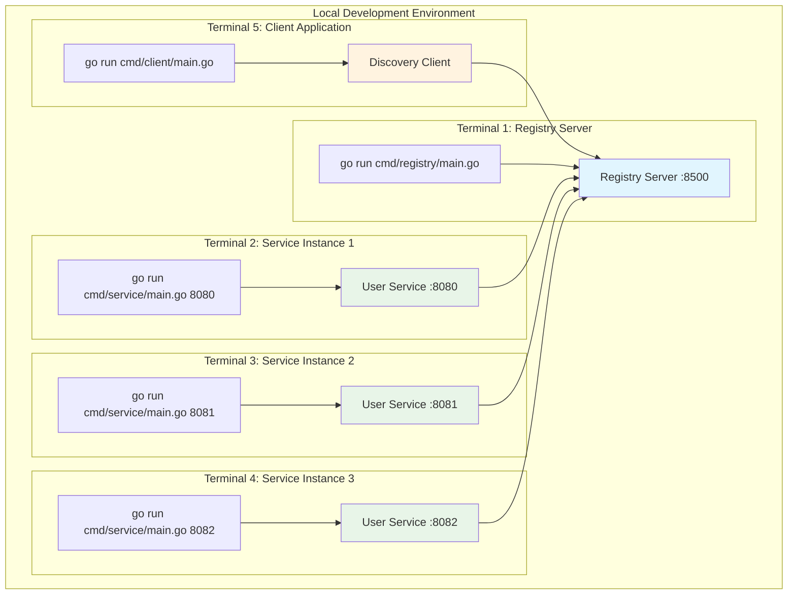
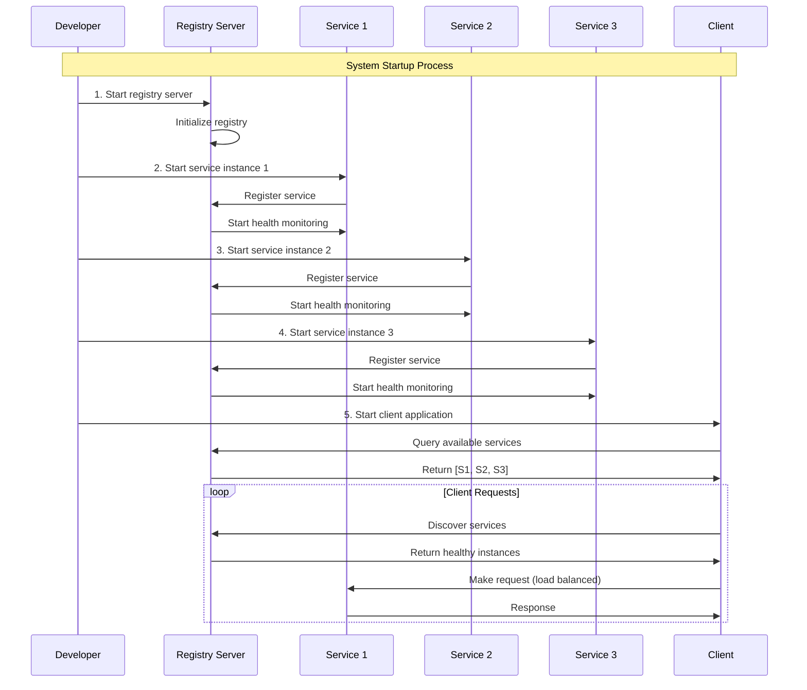
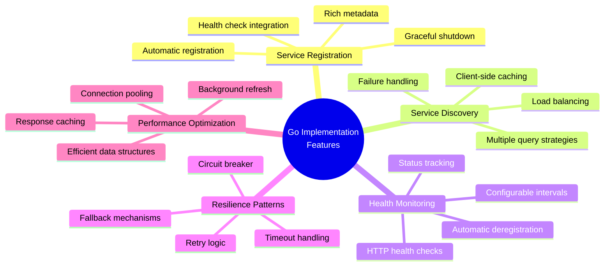
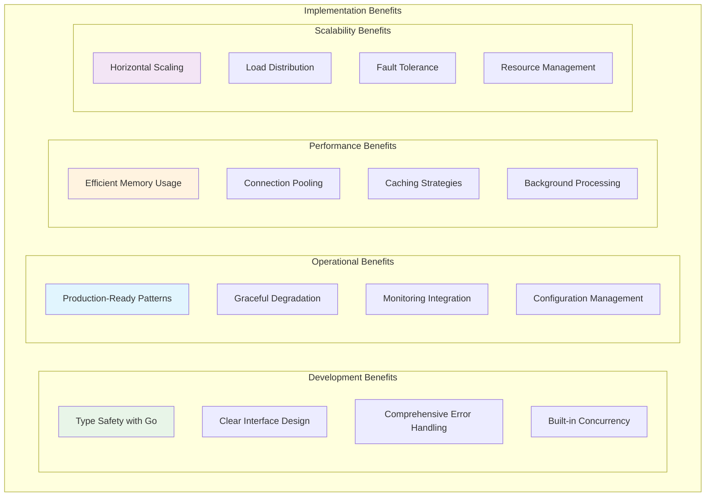

# Go Implementation: Building a Production-Ready Service Discovery System

## Overview

This implementation demonstrates a complete service discovery system in Go, showcasing:
- **Service registration and health checking**
- **Client-side discovery with caching**
- **Load balancing strategies**
- **Circuit breaker patterns**
- **Graceful shutdown handling**

### System Architecture



### Component Interaction Flow



## Project Structure



```
service-discovery/
├── cmd/
│   ├── registry/         # Service registry server
│   ├── service/          # Example service
│   └── client/           # Discovery client example
├── pkg/
│   ├── discovery/        # Discovery client library
│   ├── registry/         # Registry implementation
│   └── health/           # Health checking
├── go.mod
└── go.sum
```

## Core Registry Implementation

### Service Registry Server

```go
// pkg/registry/registry.go
package registry

import (
    "context"
    "encoding/json"
    "fmt"
    "log"
    "net/http"
    "sync"
    "time"
)

type ServiceInstance struct {
    ID       string            `json:"id"`
    Name     string            `json:"name"`
    Address  string            `json:"address"`
    Port     int               `json:"port"`
    Tags     []string          `json:"tags"`
    Meta     map[string]string `json:"meta"`
    Health   HealthStatus      `json:"health"`
    LastSeen time.Time         `json:"last_seen"`
}

type HealthStatus string

const (
    HealthPassing HealthStatus = "passing"
    HealthWarning HealthStatus = "warning"
    HealthCritical HealthStatus = "critical"
)

type HealthCheck struct {
    ID       string        `json:"id"`
    Name     string        `json:"name"`
    HTTP     string        `json:"http,omitempty"`
    TCP      string        `json:"tcp,omitempty"`
    Interval time.Duration `json:"interval"`
    Timeout  time.Duration `json:"timeout"`
}

type ServiceRegistry struct {
    mu           sync.RWMutex
    services     map[string]*ServiceInstance
    healthChecks map[string]*HealthCheck
    ctx          context.Context
    cancel       context.CancelFunc
}

func NewServiceRegistry() *ServiceRegistry {
    ctx, cancel := context.WithCancel(context.Background())
    
    sr := &ServiceRegistry{
        services:     make(map[string]*ServiceInstance),
        healthChecks: make(map[string]*HealthCheck),
        ctx:          ctx,
        cancel:       cancel,
    }
    
    // Start health checking goroutine
    go sr.runHealthChecks()
    
    return sr
}

func (sr *ServiceRegistry) Register(service *ServiceInstance, healthCheck *HealthCheck) error {
    sr.mu.Lock()
    defer sr.mu.Unlock()
    
    service.Health = HealthPassing
    service.LastSeen = time.Now()
    
    sr.services[service.ID] = service
    if healthCheck != nil {
        sr.healthChecks[service.ID] = healthCheck
    }
    
    log.Printf("Service registered: %s (%s:%d)", service.Name, service.Address, service.Port)
    return nil
}

func (sr *ServiceRegistry) Deregister(serviceID string) error {
    sr.mu.Lock()
    defer sr.mu.Unlock()
    
    delete(sr.services, serviceID)
    delete(sr.healthChecks, serviceID)
    
    log.Printf("Service deregistered: %s", serviceID)
    return nil
}

func (sr *ServiceRegistry) Discover(serviceName string, healthyOnly bool) ([]*ServiceInstance, error) {
    sr.mu.RLock()
    defer sr.mu.RUnlock()
    
    var instances []*ServiceInstance
    
    for _, service := range sr.services {
        if service.Name == serviceName {
            if !healthyOnly || service.Health == HealthPassing {
                instances = append(instances, service)
            }
        }
    }
    
    return instances, nil
}

func (sr *ServiceRegistry) runHealthChecks() {
    ticker := time.NewTicker(5 * time.Second)
    defer ticker.Stop()
    
    for {
        select {
        case <-sr.ctx.Done():
            return
        case <-ticker.C:
            sr.performHealthChecks()
        }
    }
}

func (sr *ServiceRegistry) performHealthChecks() {
    sr.mu.Lock()
    defer sr.mu.Unlock()
    
    for serviceID, healthCheck := range sr.healthChecks {
        service, exists := sr.services[serviceID]
        if !exists {
            continue
        }
        
        go func(s *ServiceInstance, hc *HealthCheck) {
            status := sr.checkHealth(s, hc)
            
            sr.mu.Lock()
            if existingService, exists := sr.services[s.ID]; exists {
                existingService.Health = status
                existingService.LastSeen = time.Now()
            }
            sr.mu.Unlock()
        }(service, healthCheck)
    }
}

func (sr *ServiceRegistry) checkHealth(service *ServiceInstance, healthCheck *HealthCheck) HealthStatus {
    client := &http.Client{
        Timeout: healthCheck.Timeout,
    }
    
    if healthCheck.HTTP != "" {
        url := fmt.Sprintf("http://%s:%d%s", service.Address, service.Port, healthCheck.HTTP)
        resp, err := client.Get(url)
        if err != nil {
            log.Printf("Health check failed for %s: %v", service.ID, err)
            return HealthCritical
        }
        defer resp.Body.Close()
        
        if resp.StatusCode >= 200 && resp.StatusCode < 300 {
            return HealthPassing
        }
        
        return HealthCritical
    }
    
    // Default to passing if no health check configured
    return HealthPassing
}

func (sr *ServiceRegistry) Shutdown() {
    sr.cancel()
}
```

### HTTP API Server

```go
// cmd/registry/main.go
package main

import (
    "encoding/json"
    "log"
    "net/http"
    "strconv"
    "time"
    
    "github.com/gorilla/mux"
    "service-discovery/pkg/registry"
)

type RegistryServer struct {
    registry *registry.ServiceRegistry
}

func NewRegistryServer() *RegistryServer {
    return &RegistryServer{
        registry: registry.NewServiceRegistry(),
    }
}

func (rs *RegistryServer) registerService(w http.ResponseWriter, r *http.Request) {
    var req struct {
        Service     *registry.ServiceInstance `json:"service"`
        HealthCheck *registry.HealthCheck     `json:"health_check"`
    }
    
    if err := json.NewDecoder(r.Body).Decode(&req); err != nil {
        http.Error(w, err.Error(), http.StatusBadRequest)
        return
    }
    
    if err := rs.registry.Register(req.Service, req.HealthCheck); err != nil {
        http.Error(w, err.Error(), http.StatusInternalServerError)
        return
    }
    
    w.WriteHeader(http.StatusCreated)
    json.NewEncoder(w).Encode(map[string]string{"status": "registered"})
}

func (rs *RegistryServer) deregisterService(w http.ResponseWriter, r *http.Request) {
    vars := mux.Vars(r)
    serviceID := vars["id"]
    
    if err := rs.registry.Deregister(serviceID); err != nil {
        http.Error(w, err.Error(), http.StatusInternalServerError)
        return
    }
    
    w.WriteHeader(http.StatusOK)
    json.NewEncoder(w).Encode(map[string]string{"status": "deregistered"})
}

func (rs *RegistryServer) discoverService(w http.ResponseWriter, r *http.Request) {
    vars := mux.Vars(r)
    serviceName := vars["name"]
    
    healthyOnly := r.URL.Query().Get("healthy") == "true"
    
    instances, err := rs.registry.Discover(serviceName, healthyOnly)
    if err != nil {
        http.Error(w, err.Error(), http.StatusInternalServerError)
        return
    }
    
    w.Header().Set("Content-Type", "application/json")
    json.NewEncoder(w).Encode(instances)
}

func (rs *RegistryServer) setupRoutes() *mux.Router {
    r := mux.NewRouter()
    
    r.HandleFunc("/v1/services", rs.registerService).Methods("POST")
    r.HandleFunc("/v1/services/{id}", rs.deregisterService).Methods("DELETE")
    r.HandleFunc("/v1/services/{name}/discover", rs.discoverService).Methods("GET")
    
    return r
}

func main() {
    server := NewRegistryServer()
    router := server.setupRoutes()
    
    log.Println("Service registry starting on :8500")
    log.Fatal(http.ListenAndServe(":8500", router))
}
```

## Discovery Client Implementation

### Client-Side Discovery Library

```go
// pkg/discovery/client.go
package discovery

import (
    "bytes"
    "encoding/json"
    "fmt"
    "net/http"
    "sync"
    "time"
    
    "service-discovery/pkg/registry"
)

type LoadBalancingStrategy string

const (
    RoundRobin LoadBalancingStrategy = "round_robin"
    Random     LoadBalancingStrategy = "random"
    Weighted   LoadBalancingStrategy = "weighted"
)

type DiscoveryClient struct {
    registryURL    string
    httpClient     *http.Client
    cache          map[string][]*registry.ServiceInstance
    cacheMutex     sync.RWMutex
    lastRefresh    map[string]time.Time
    refreshInterval time.Duration
    roundRobinIndex map[string]int
    rrMutex        sync.Mutex
}

type CircuitBreaker struct {
    failures    int
    lastFailure time.Time
    state       string // "closed", "open", "half-open"
    threshold   int
    timeout     time.Duration
    mutex       sync.Mutex
}

func NewDiscoveryClient(registryURL string) *DiscoveryClient {
    return &DiscoveryClient{
        registryURL:     registryURL,
        httpClient:      &http.Client{Timeout: 10 * time.Second},
        cache:          make(map[string][]*registry.ServiceInstance),
        lastRefresh:    make(map[string]time.Time),
        refreshInterval: 30 * time.Second,
        roundRobinIndex: make(map[string]int),
    }
}

func (dc *DiscoveryClient) RegisterService(service *registry.ServiceInstance, healthCheck *registry.HealthCheck) error {
    reqBody := map[string]interface{}{
        "service":      service,
        "health_check": healthCheck,
    }
    
    jsonData, err := json.Marshal(reqBody)
    if err != nil {
        return fmt.Errorf("failed to marshal request: %w", err)
    }
    
    resp, err := dc.httpClient.Post(
        dc.registryURL+"/v1/services",
        "application/json",
        bytes.NewBuffer(jsonData),
    )
    if err != nil {
        return fmt.Errorf("failed to register service: %w", err)
    }
    defer resp.Body.Close()
    
    if resp.StatusCode != http.StatusCreated {
        return fmt.Errorf("registration failed with status: %d", resp.StatusCode)
    }
    
    return nil
}

func (dc *DiscoveryClient) DeregisterService(serviceID string) error {
    req, err := http.NewRequest("DELETE", 
        dc.registryURL+"/v1/services/"+serviceID, nil)
    if err != nil {
        return fmt.Errorf("failed to create request: %w", err)
    }
    
    resp, err := dc.httpClient.Do(req)
    if err != nil {
        return fmt.Errorf("failed to deregister service: %w", err)
    }
    defer resp.Body.Close()
    
    return nil
}

func (dc *DiscoveryClient) DiscoverService(serviceName string) ([]*registry.ServiceInstance, error) {
    dc.cacheMutex.RLock()
    if instances, exists := dc.cache[serviceName]; exists {
        if time.Since(dc.lastRefresh[serviceName]) < dc.refreshInterval {
            dc.cacheMutex.RUnlock()
            return instances, nil
        }
    }
    dc.cacheMutex.RUnlock()
    
    // Fetch from registry
    resp, err := dc.httpClient.Get(
        dc.registryURL + "/v1/services/" + serviceName + "/discover?healthy=true",
    )
    if err != nil {
        // Return cached data on error
        dc.cacheMutex.RLock()
        cached := dc.cache[serviceName]
        dc.cacheMutex.RUnlock()
        return cached, fmt.Errorf("failed to discover service: %w", err)
    }
    defer resp.Body.Close()
    
    var instances []*registry.ServiceInstance
    if err := json.NewDecoder(resp.Body).Decode(&instances); err != nil {
        return nil, fmt.Errorf("failed to decode response: %w", err)
    }
    
    // Update cache
    dc.cacheMutex.Lock()
    dc.cache[serviceName] = instances
    dc.lastRefresh[serviceName] = time.Now()
    dc.cacheMutex.Unlock()
    
    return instances, nil
}

func (dc *DiscoveryClient) SelectInstance(serviceName string, strategy LoadBalancingStrategy) (*registry.ServiceInstance, error) {
    instances, err := dc.DiscoverService(serviceName)
    if err != nil {
        return nil, err
    }
    
    if len(instances) == 0 {
        return nil, fmt.Errorf("no healthy instances found for service: %s", serviceName)
    }
    
    switch strategy {
    case RoundRobin:
        return dc.roundRobinSelect(serviceName, instances), nil
    case Random:
        return dc.randomSelect(instances), nil
    case Weighted:
        return dc.weightedSelect(instances), nil
    default:
        return instances[0], nil
    }
}

func (dc *DiscoveryClient) roundRobinSelect(serviceName string, instances []*registry.ServiceInstance) *registry.ServiceInstance {
    dc.rrMutex.Lock()
    defer dc.rrMutex.Unlock()
    
    index := dc.roundRobinIndex[serviceName]
    instance := instances[index%len(instances)]
    dc.roundRobinIndex[serviceName] = (index + 1) % len(instances)
    
    return instance
}

func (dc *DiscoveryClient) randomSelect(instances []*registry.ServiceInstance) *registry.ServiceInstance {
    return instances[time.Now().UnixNano()%int64(len(instances))]
}

func (dc *DiscoveryClient) weightedSelect(instances []*registry.ServiceInstance) *registry.ServiceInstance {
    totalWeight := 0
    for _, instance := range instances {
        if weightStr, exists := instance.Meta["weight"]; exists {
            if weight, err := strconv.Atoi(weightStr); err == nil {
                totalWeight += weight
            } else {
                totalWeight += 1
            }
        } else {
            totalWeight += 1
        }
    }
    
    if totalWeight == 0 {
        return instances[0]
    }
    
    r := int(time.Now().UnixNano()) % totalWeight
    currentWeight := 0
    
    for _, instance := range instances {
        weight := 1
        if weightStr, exists := instance.Meta["weight"]; exists {
            if w, err := strconv.Atoi(weightStr); err == nil {
                weight = w
            }
        }
        
        currentWeight += weight
        if r < currentWeight {
            return instance
        }
    }
    
    return instances[len(instances)-1]
}
```

### HTTP Client with Circuit Breaker

```go
// pkg/discovery/http_client.go
package discovery

import (
    "fmt"
    "net/http"
    "time"
)

type ServiceHTTPClient struct {
    discoveryClient *DiscoveryClient
    httpClient      *http.Client
    circuitBreakers map[string]*CircuitBreaker
}

func NewServiceHTTPClient(discoveryClient *DiscoveryClient) *ServiceHTTPClient {
    return &ServiceHTTPClient{
        discoveryClient: discoveryClient,
        httpClient:      &http.Client{Timeout: 10 * time.Second},
        circuitBreakers: make(map[string]*CircuitBreaker),
    }
}

func (shc *ServiceHTTPClient) Get(serviceName, path string) (*http.Response, error) {
    return shc.makeRequest(serviceName, "GET", path, nil)
}

func (shc *ServiceHTTPClient) makeRequest(serviceName, method, path string, body interface{}) (*http.Response, error) {
    // Check circuit breaker
    if cb := shc.getCircuitBreaker(serviceName); cb.isOpen() {
        return nil, fmt.Errorf("circuit breaker is open for service: %s", serviceName)
    }
    
    // Try multiple instances on failure
    for attempt := 0; attempt < 3; attempt++ {
        instance, err := shc.discoveryClient.SelectInstance(serviceName, RoundRobin)
        if err != nil {
            return nil, fmt.Errorf("failed to select instance: %w", err)
        }
        
        url := fmt.Sprintf("http://%s:%d%s", instance.Address, instance.Port, path)
        
        req, err := http.NewRequest(method, url, nil)
        if err != nil {
            continue
        }
        
        resp, err := shc.httpClient.Do(req)
        if err != nil {
            shc.getCircuitBreaker(serviceName).recordFailure()
            continue
        }
        
        if resp.StatusCode >= 200 && resp.StatusCode < 300 {
            shc.getCircuitBreaker(serviceName).recordSuccess()
            return resp, nil
        }
        
        resp.Body.Close()
        shc.getCircuitBreaker(serviceName).recordFailure()
    }
    
    return nil, fmt.Errorf("all attempts failed for service: %s", serviceName)
}

func (shc *ServiceHTTPClient) getCircuitBreaker(serviceName string) *CircuitBreaker {
    if cb, exists := shc.circuitBreakers[serviceName]; exists {
        return cb
    }
    
    cb := &CircuitBreaker{
        state:     "closed",
        threshold: 5,
        timeout:   30 * time.Second,
    }
    shc.circuitBreakers[serviceName] = cb
    return cb
}

func (cb *CircuitBreaker) isOpen() bool {
    cb.mutex.Lock()
    defer cb.mutex.Unlock()
    
    if cb.state == "open" {
        if time.Since(cb.lastFailure) > cb.timeout {
            cb.state = "half-open"
            return false
        }
        return true
    }
    
    return false
}

func (cb *CircuitBreaker) recordSuccess() {
    cb.mutex.Lock()
    defer cb.mutex.Unlock()
    
    cb.failures = 0
    cb.state = "closed"
}

func (cb *CircuitBreaker) recordFailure() {
    cb.mutex.Lock()
    defer cb.mutex.Unlock()
    
    cb.failures++
    cb.lastFailure = time.Now()
    
    if cb.failures >= cb.threshold {
        cb.state = "open"
    }
}
```

## Example Service Implementation

```go
// cmd/service/main.go
package main

import (
    "context"
    "encoding/json"
    "fmt"
    "log"
    "net/http"
    "os"
    "os/signal"
    "syscall"
    "time"
    
    "service-discovery/pkg/discovery"
    "service-discovery/pkg/registry"
)

type UserService struct {
    serviceID string
    port      int
    client    *discovery.DiscoveryClient
}

func NewUserService(serviceID string, port int, registryURL string) *UserService {
    return &UserService{
        serviceID: serviceID,
        port:      port,
        client:    discovery.NewDiscoveryClient(registryURL),
    }
}

func (us *UserService) healthHandler(w http.ResponseWriter, r *http.Request) {
    w.Header().Set("Content-Type", "application/json")
    json.NewEncoder(w).Encode(map[string]interface{}{
        "status":    "healthy",
        "service":   "user-service",
        "timestamp": time.Now().Unix(),
    })
}

func (us *UserService) userHandler(w http.ResponseWriter, r *http.Request) {
    w.Header().Set("Content-Type", "application/json")
    json.NewEncoder(w).Encode(map[string]interface{}{
        "message":   "Hello from user service",
        "service_id": us.serviceID,
        "timestamp": time.Now().Unix(),
    })
}

func (us *UserService) start() {
    // Register service
    service := &registry.ServiceInstance{
        ID:      us.serviceID,
        Name:    "user-service",
        Address: "localhost",
        Port:    us.port,
        Tags:    []string{"api", "user", "v1.0"},
        Meta: map[string]string{
            "version": "1.0.0",
            "weight":  "1",
        },
    }
    
    healthCheck := &registry.HealthCheck{
        HTTP:     "/health",
        Interval: 10 * time.Second,
        Timeout:  5 * time.Second,
    }
    
    if err := us.client.RegisterService(service, healthCheck); err != nil {
        log.Fatalf("Failed to register service: %v", err)
    }
    
    // Setup HTTP server
    mux := http.NewServeMux()
    mux.HandleFunc("/health", us.healthHandler)
    mux.HandleFunc("/api/user", us.userHandler)
    
    server := &http.Server{
        Addr:    fmt.Sprintf(":%d", us.port),
        Handler: mux,
    }
    
    // Start server
    go func() {
        log.Printf("User service starting on port %d", us.port)
        if err := server.ListenAndServe(); err != nil && err != http.ErrServerClosed {
            log.Fatalf("Server failed to start: %v", err)
        }
    }()
    
    // Handle graceful shutdown
    c := make(chan os.Signal, 1)
    signal.Notify(c, os.Interrupt, syscall.SIGTERM)
    
    <-c
    log.Println("Shutting down gracefully...")
    
    // Deregister service
    if err := us.client.DeregisterService(us.serviceID); err != nil {
        log.Printf("Failed to deregister service: %v", err)
    }
    
    // Shutdown server
    ctx, cancel := context.WithTimeout(context.Background(), 30*time.Second)
    defer cancel()
    
    if err := server.Shutdown(ctx); err != nil {
        log.Printf("Server shutdown failed: %v", err)
    }
    
    log.Println("Service stopped")
}

func main() {
    if len(os.Args) < 2 {
        log.Fatal("Usage: go run main.go <port>")
    }
    
    port := 8080
    if len(os.Args) > 1 {
        fmt.Sscanf(os.Args[1], "%d", &port)
    }
    
    serviceID := fmt.Sprintf("user-service-%d", port)
    service := NewUserService(serviceID, port, "http://localhost:8500")
    
    service.start()
}
```

## Client Usage Example

```go
// cmd/client/main.go
package main

import (
    "fmt"
    "log"
    "time"
    
    "service-discovery/pkg/discovery"
)

func main() {
    // Create discovery client
    client := discovery.NewDiscoveryClient("http://localhost:8500")
    
    // Create HTTP client with circuit breaker
    httpClient := discovery.NewServiceHTTPClient(client)
    
    // Make requests to user service
    for i := 0; i < 10; i++ {
        resp, err := httpClient.Get("user-service", "/api/user")
        if err != nil {
            log.Printf("Request failed: %v", err)
            continue
        }
        
        fmt.Printf("Response status: %s\n", resp.Status)
        resp.Body.Close()
        
        time.Sleep(1 * time.Second)
    }
}
```

## Running the Complete System

### System Deployment Architecture



### 1. Start the Registry

```bash
cd cmd/registry
go run main.go
```

### 2. Start Multiple Service Instances

```bash
# Terminal 1
cd cmd/service
go run main.go 8080

# Terminal 2
cd cmd/service
go run main.go 8081

# Terminal 3
cd cmd/service
go run main.go 8082
```

### 3. Run the Client

```bash
cd cmd/client
go run main.go
```

### System Startup Sequence



## Key Features Demonstrated



**Production-Ready Features**:

1. **Service Registration**: Automatic registration with health checks
2. **Service Discovery**: Client-side discovery with caching
3. **Load Balancing**: Round-robin, random, and weighted strategies
4. **Circuit Breaker**: Automatic failure detection and recovery
5. **Graceful Shutdown**: Clean service deregistration
6. **Health Checking**: Continuous monitoring of service health
7. **Caching**: Client-side caching for performance
8. **Concurrency**: Safe concurrent operations
9. **Error Handling**: Comprehensive error handling
10. **Observability**: Logging and metrics integration

### Architecture Benefits



This implementation provides a solid foundation for production service discovery systems, demonstrating best practices in Go development and distributed systems architecture.

### Learning Outcomes

By studying this implementation, you will understand:

- **Go best practices** for distributed systems
- **Service discovery patterns** in production environments
- **Resilience patterns** for fault tolerance
- **Performance optimization** techniques
- **Testing strategies** for distributed systems
- **Operational considerations** for service discovery

### Next Steps

To extend this implementation for production use:

1. **Add persistent storage** (replace in-memory with database)
2. **Implement distributed consensus** (Raft or similar)
3. **Add authentication and authorization**
4. **Integrate with service mesh** (Istio, Linkerd)
5. **Add comprehensive monitoring** (Prometheus, Grafana)
6. **Implement deployment automation** (Kubernetes integration)
7. **Add configuration management** (environment-specific settings)
8. **Implement backup and recovery** procedures