# The Core Problem: When One Server Isn't Enough

## The Fundamental Limit

Every piece of hardware has finite capacity:
- **Storage**: Your hard drives eventually fill up
- **Memory**: RAM has a ceiling
- **CPU**: Processing power hits a wall
- **Network**: Bandwidth becomes a bottleneck

But your data and users keep growing. What happens when your single, most powerful server—even the beefiest machine money can buy—simply cannot handle your workload anymore?

## The Monolithic Database Bottleneck

Picture a single database server handling all your application's data:

This works beautifully... until it doesn't. Consider these breaking points:

**Storage Overflow**: Your e-commerce platform has 10 million products with images and metadata. Each product averages 1MB of data. That's 10TB—and your server's storage is maxed out.

**Memory Pressure**: Your analytics queries need to process millions of rows simultaneously. The working set no longer fits in RAM, causing disk thrashing and query timeouts.

**CPU Saturation**: Black Friday arrives. Thousands of concurrent users hammer your database with reads and writes. Your CPU cores are pegged at 100%, and response times crawl to seconds.

**Write Bottlenecks**: A single database can only process so many transactions per second. Even with SSDs and optimized indexes, there's a hard ceiling on write throughput.

## The Scaling Dilemma

```mermaid
flowchart TD
    A[Database at Capacity] --> B{Scaling Strategy}
    
    B --> C[Vertical Scaling<br/>Scale Up]
    B --> D[Horizontal Scaling<br/>Scale Out]
    
    C --> E[Bigger Machine]
    E --> F[More RAM<br/>Faster CPU<br/>Larger Drives]
    
    F --> G[Problems]
    G --> H[💰 Exponential cost]
    G --> I[🚫 Hard limits]
    G --> J[☠️ Single point of failure]
    G --> K[⏰ Downtime for upgrades]
    
    D --> L[More Machines]
    L --> M[Distribute Workload]
    
    M --> N[Challenges]
    N --> O[🔄 Data consistency]
    N --> P[⚡ Query performance]
    N --> Q[🛡️ High availability]
    
    style H fill:#ff9999
    style I fill:#ff9999
    style J fill:#ff9999
    style K fill:#ff9999
    style O fill:#FFA500
    style P fill:#FFA500
    style Q fill:#FFA500
```

You have two choices when you hit these limits:

### Vertical Scaling (Scale Up)
Buy a bigger machine. More RAM, faster CPUs, larger drives.

**Problems:**
- **Exponential Cost**: Doubling performance often quadruples the price
- **Hard Limits**: Even the most expensive hardware has ceilings
- **Single Point of Failure**: Your entire system depends on one machine
- **Downtime for Upgrades**: Replacing hardware means service interruption

### Horizontal Scaling (Scale Out)
Add more machines and distribute the workload.

**The Challenge**: How do you split your data across multiple servers while maintaining:
- **Consistency**: All servers have the right data
- **Performance**: Queries are still fast
- **Availability**: The system works even if some servers fail

## The Sharding Solution

Sharding is horizontal scaling for databases. Instead of one massive database, you create multiple smaller databases (shards) that together store all your data.

**Library System Analogy:**

The key insight: **Most queries only need a subset of your data**. If you can route each query to the right shard, you can scale almost linearly by adding more servers.

## Why This Problem Is Hard

Sharding isn't just "split the data and you're done." Several challenges make this a complex distributed systems problem:

```mermaid
graph TD
    A[Sharding Challenges] --> B[Data Distribution]
    A --> C[Query Routing]
    A --> D[Cross-Shard Operations]
    A --> E[Rebalancing]
    A --> F[Consistency]
    
    B --> G[How to decide which data goes where?<br/>• By user ID?<br/>• By geography?<br/>• By date range?]
    
    C --> H[How does app know which shard to query?<br/>• Lookup service?<br/>• Hash function?<br/>• Directory service?]
    
    D --> I[What if query needs data from multiple shards?<br/>• JOIN across shards?<br/>• Aggregation queries?<br/>• Transaction spanning shards?]
    
    E --> J[How to add/remove shards gracefully?<br/>• Rebalance existing data?<br/>• Minimize downtime?<br/>• Handle hotspots?]
    
    F --> K[How to maintain data integrity?<br/>• ACID across shards?<br/>• Eventual consistency?<br/>• Conflict resolution?]
    
    style A fill:#87CEEB
    style G fill:#FFA500
    style H fill:#FFA500
    style I fill:#ff9999
    style J fill:#ff9999
    style K fill:#ff9999
```

**The Complexity Ladder:**

1. **Data Distribution**: How do you decide which data goes where?
2. **Query Routing**: How does the application know which shard to query?
3. **Cross-Shard Operations**: What happens when a query needs data from multiple shards?
4. **Rebalancing**: How do you redistribute data when you add or remove shards?
5. **Consistency**: How do you maintain data integrity across multiple servers?

These challenges explain why sharding is often called "the last resort" for scaling databases. But when you truly need it, it's the only way to break through the single-server ceiling.

The next step is understanding the philosophy that makes sharding work: **divide and conquer**.