# The Guiding Philosophy: Divide and Conquer

## The Core Principle


Sharding embodies one of the oldest problem-solving strategies in computer science: **divide and conquer**. When a problem is too large to handle as a single unit, break it into smaller, manageable pieces that can be solved independently.

In database terms: **Split a large dataset horizontally into smaller, more manageable pieces called shards, and distribute them across multiple servers.**

## The Horizontal Split

Understanding "horizontal" vs "vertical" splitting is crucial:


### Vertical Splitting (Normalization)
Split by **columns** (features):
```
Users Table:
[id, name, email, address, preferences, purchase_history]

Becomes:
Users Basic: [id, name, email]
Users Details: [id, address, preferences]  
Users Purchases: [id, purchase_history]
```

### Horizontal Splitting (Sharding)
Split by **rows** (data instances):
```
Users Table (10M users):
[1, "Alice", "alice@email.com"]
[2, "Bob", "bob@email.com"]
...
[10000000, "Zoe", "zoe@email.com"]

Becomes:
Shard 1: Users 1-2,500,000
Shard 2: Users 2,500,001-5,000,000
Shard 3: Users 5,000,001-7,500,000
Shard 4: Users 7,500,001-10,000,000
```

## The Philosophy in Action

```mermaid
graph TD
    A[Sharding Philosophy] --> B[Locality Principle]
    A --> C[Independence Principle]
    A --> D[Predictable Routing]
    
    B --> E[Group Related Data Together]
    E --> F[E-commerce: User + Orders + Cart]
    E --> G[Social Media: User + Posts + Messages]
    E --> H[Gaming: Player + Stats + Inventory]
    
    C --> I[Independent Shard Operations]
    I --> J[Most reads hit one shard]
    I --> K[Most writes affect one shard]
    I --> L[Failures are isolated]
    I --> M[Linear scaling]
    
    D --> N[Deterministic Routing Function]
    N --> O[shard_id = hash(key) % shards]
    N --> P[Fast: O(1) lookup]
    N --> Q[Consistent: same key → same shard]
    N --> R[Distributed: even spread]
    
    style B fill:#90EE90
    style C fill:#87CEEB
    style D fill:#FFD700
```

### 1. Locality Principle
**Most operations work on related data that can be grouped together.**

Examples:
- **E-commerce**: A user's orders, preferences, and shopping cart are typically accessed together
- **Social Media**: A user's posts, followers, and messages form a natural cluster
- **Gaming**: Player stats, inventory, and achievements are often queried as a unit

**Insight**: If you can group related data into the same shard, most queries will hit only one shard.

### 2. Independence Principle
**Each shard should operate independently for the majority of operations.**

This means:
- **Reads**: Most queries should only need one shard
- **Writes**: Most updates should only affect one shard
- **Failures**: If one shard goes down, others continue working
- **Scaling**: You can add capacity by adding more shards

### 3. Predictable Routing
**Given any piece of data, you should be able to quickly determine which shard contains it.**

This requires a deterministic function:
```
shard_id = hash(shard_key) % number_of_shards
```

The routing must be:
- **Fast**: O(1) lookup, no database queries needed
- **Consistent**: The same key always routes to the same shard
- **Distributed**: Data should spread evenly across shards

## The Library Analogy

```mermaid
graph TD
    subgraph "Monolithic Library System"
        A1[Central Library<br/>📚 All books<br/>🏢 One massive building<br/>🚗 Limited parking<br/>👥 Crowded]
    end
    
    subgraph "Sharded Library System"
        B1[Fiction Branch<br/>📖 Novels & Stories]
        B2[Science Branch<br/>🔬 Technical & Scientific]
        B3[History Branch<br/>📜 Historical Documents]
        B4[Children's Branch<br/>🎨 Kids' Books]
    end
    
    C[Catalog System<br/>📞 Call main number<br/>🗺️ Routes to correct branch]
    
    A1 --> C
    C --> B1
    C --> B2
    C --> B3
    C --> B4
    
    D[Query: "Book about quantum physics"]
    D --> C
    C --> E["Science Branch on Oak Street"]
    
    style A1 fill:#ff9999
    style C fill:#87CEEB
    style B1 fill:#90EE90
    style B2 fill:#90EE90
    style B3 fill:#90EE90
    style B4 fill:#90EE90
    style E fill:#FFD700
```

Imagine you're designing a city's library system:

### The Monolithic Library
- **One massive building** with every book
- **Problems**: 
  - Long walk to find any book
  - Crowded during peak hours
  - Single point of failure
  - Limited parking and space

### The Sharded Library System
- **Multiple branch libraries** across the city
- **Fiction Branch**: All novels and short stories
- **Science Branch**: Technical and scientific texts
- **History Branch**: Historical documents and biographies
- **Children's Branch**: Kids' books and educational materials

**Benefits**:
- **Faster Access**: You know exactly which branch to visit
- **Reduced Congestion**: Load distributed across branches
- **Fault Tolerance**: Other branches work if one closes
- **Scalability**: Add more branches as the city grows

**The Catalog System** (your router):
- You call the main number
- "I need a book about quantum physics"
- "That's at the Science Branch on Oak Street"

## Key Design Trade-offs

```mermaid
graph LR
    subgraph "Before Sharding"
        A1[Simplicity ✅]
        A2[Flexibility ✅]
        A3[Strong Consistency ✅]
        A4[Easy Maintenance ✅]
        A5[Limited Scale ❌]
    end
    
    subgraph "After Sharding"
        B1[Complexity ❌]
        B2[Query Restrictions ❌]
        B3[Eventual Consistency ❌]
        B4[Complex Ops ❌]
        B5[Massive Scale ✅]
    end
    
    A1 -.-> B1
    A2 -.-> B2
    A3 -.-> B3
    A4 -.-> B4
    A5 -.-> B5
    
    style A5 fill:#ff9999
    style B5 fill:#90EE90
```



Sharding forces you to make explicit trade-offs:

### 1. Simplicity vs. Scalability
- **Before**: Simple single-database queries
- **After**: Complex routing logic and cross-shard operations

### 2. Flexibility vs. Performance
- **Before**: Any query pattern works
- **After**: Queries that span multiple shards are expensive

### 3. Consistency vs. Availability
- **Before**: ACID transactions across all data
- **After**: Eventual consistency for cross-shard operations

### 4. Maintenance vs. Scalability
- **Before**: One database to monitor and optimize
- **After**: Multiple shards to manage, monitor, and rebalance

## The Golden Rule


**Design your shard key to minimize cross-shard operations.**

This single principle drives every sharding decision:
- How do you partition your data?
- What queries will your application make?
- How can you group related data together?
- What trade-offs are you willing to accept?

The success of your sharding strategy depends entirely on choosing the right boundaries. Get this right, and you can scale to massive datasets with linear performance. Get it wrong, and you'll have all the complexity of distributed systems with none of the benefits.

The art of sharding lies in understanding your data access patterns and designing partitions that align with how your application actually works.