# Key Abstractions: The Building Blocks of Sharding

## The Three Pillars

```mermaid
graph TD
    A[Sharding System] --> B[Shard Key]
    A --> C[Router]
    A --> D[Resharding]
    
    B --> E[Data partitioning attribute<br/>• Determines shard placement<br/>• Must have high cardinality<br/>• Should align with queries]
    
    C --> F[Query coordination component<br/>• Directs queries to shards<br/>• Aggregates results<br/>• Handles cross-shard operations]
    
    D --> G[Data redistribution process<br/>• Handles topology changes<br/>• Rebalances data<br/>• Maintains consistency]
    
    style A fill:#87CEEB
    style B fill:#90EE90
    style C fill:#FFD700
    style D fill:#FFA500
```



Every sharding system is built on three fundamental abstractions:

1. **Shard Key**: The data attribute that determines partitioning
2. **Router**: The component that directs queries to the correct shard
3. **Resharding**: The process of redistributing data when the topology changes

Understanding these concepts deeply is essential for designing and operating sharded systems.

## Abstraction 1: The Shard Key

### Definition
The **shard key** is the data attribute (or combination of attributes) used to determine which shard stores a particular piece of data.

### The Highway Toll System Analogy

```mermaid
graph LR
    subgraph "Highway Traffic"
        C1[Car: ABC-123]
        C2[Car: XYZ-789]
        C3[Car: DEF-456]
        C4[Car: QRS-012]
    end
    
    subgraph "Toll Booth Assignment"
        T1[Booth 1<br/>hash(ABC-123) % 4 = 1]
        T2[Booth 2<br/>hash(XYZ-789) % 4 = 2]
        T3[Booth 3<br/>hash(DEF-456) % 4 = 3]
        T4[Booth 4<br/>hash(QRS-012) % 4 = 0]
    end
    
    C1 --> T1
    C2 --> T2
    C3 --> T3
    C4 --> T4
    
    style T1 fill:#90EE90
    style T2 fill:#90EE90
    style T3 fill:#90EE90
    style T4 fill:#90EE90
```

Think of a highway with multiple toll booths:
- **License plate number** is your "shard key"
- **Toll booth assignment**: `license_plate % number_of_booths`
- **Even distribution**: Assuming random license plates, cars spread evenly across booths
- **Predictable routing**: The same car always goes to the same booth

### Shard Key Properties

#### 1. High Cardinality

```mermaid
graph TD
    subgraph "Bad Example: Low Cardinality (country)"
        A1[Shard 1: USA<br/>60% of users<br/>🔥 HOT SPOT!]
        A2[Shard 2: China<br/>25% of users]
        A3[Shard 3: Germany<br/>8% of users<br/>🥶 Underutilized]
        A4[Shard 4: Others<br/>7% of users<br/>🥶 Underutilized]
    end
    
    subgraph "Good Example: High Cardinality (user_id)"
        B1[Shard 1: Users 1-2.5M<br/>25% load ✅]
        B2[Shard 2: Users 2.5M-5M<br/>25% load ✅]
        B3[Shard 3: Users 5M-7.5M<br/>25% load ✅]
        B4[Shard 4: Users 7.5M-10M<br/>25% load ✅]
    end
    
    style A1 fill:#ff9999
    style A3 fill:#87CEEB
    style A4 fill:#87CEEB
    style B1 fill:#90EE90
    style B2 fill:#90EE90
    style B3 fill:#90EE90
    style B4 fill:#90EE90
```



**Bad Example**: `country` field with only 50 possible values
```
Shard 1: [USA users]     ← 60% of all users
Shard 2: [China users]   ← 25% of all users  
Shard 3: [Germany users] ← 8% of all users
Shard 4: [Other users]   ← 7% of all users
```

**Good Example**: `user_id` with millions of unique values
```
Shard 1: [users 1-2.5M]     ← 25% of all users
Shard 2: [users 2.5M-5M]    ← 25% of all users
Shard 3: [users 5M-7.5M]    ← 25% of all users
Shard 4: [users 7.5M-10M]   ← 25% of all users
```

#### 2. Even Distribution
The values should spread data uniformly across shards to avoid hotspots.

#### 3. Query-Aligned
Most common queries should include the shard key to avoid cross-shard operations.

```sql
-- Good: Single-shard query
SELECT * FROM orders WHERE user_id = 12345;

-- Bad: Cross-shard query
SELECT * FROM orders WHERE order_date = '2024-01-15';
```

## Abstraction 2: The Router (Query Coordinator)

### Definition
The **router** is the component that receives client queries and directs them to the appropriate shard(s).

### The Restaurant Host Analogy

```mermaid
graph TD
    A[Restaurant Entrance] --> B[Host/Router]
    
    C[Customer with Reservation<br/>"Smith party of 4"]
    C --> B
    
    B --> D[Check reservation system<br/>hash("Smith") % 4 = 2]
    D --> E[Direct to Section 2]
    
    subgraph "Restaurant Sections"
        S1[Section 1<br/>Tables 1-10]
        S2[Section 2<br/>Tables 11-20<br/>⭐ Smith party goes here]
        S3[Section 3<br/>Tables 21-30]
        S4[Section 4<br/>Tables 31-40]
    end
    
    E --> S2
    
    F[Shared Kitchen<br/>All sections use same resources]
    S1 -.-> F
    S2 -.-> F
    S3 -.-> F
    S4 -.-> F
    
    style B fill:#87CEEB
    style S2 fill:#90EE90
```

Imagine a large restaurant with multiple dining sections:
- **Host** (router) greets customers at the entrance
- **Reservation name** (shard key) determines the section
- **Host directs** customers to the right section
- **Sections operate independently** but share the same kitchen

### Router Responsibilities

#### 1. Query Parsing
Extract the shard key from incoming queries:
```sql
-- Router extracts user_id = 12345
SELECT * FROM orders WHERE user_id = 12345 AND status = 'pending';
```

#### 2. Shard Resolution
Calculate which shard(s) to query:
```python
def get_shard(user_id: int, num_shards: int) -> int:
    return hash(user_id) % num_shards
```

#### 3. Query Distribution
Send the query to the appropriate shard(s):
```
Client Query → Router → Shard 2 → Results → Router → Client
```

#### 4. Result Aggregation
For cross-shard queries, combine results from multiple shards:
```sql
-- This query hits all shards
SELECT COUNT(*) FROM orders WHERE order_date = '2024-01-15';

-- Router must:
-- 1. Send query to all shards
-- 2. Collect all counts
-- 3. Sum them up
-- 4. Return final result
```

### Router Types

```mermaid
graph TD
    A[Router Architectures] --> B[Application-Level]
    A --> C[Proxy Router]
    A --> D[Database-Native]
    
    B --> E[App contains routing logic<br/>• Simple to implement<br/>• Tight coupling<br/>• Each app must handle routing]
    
    C --> F[Dedicated routing service<br/>• Centralized logic<br/>• Language agnostic<br/>• Additional network hop]
    
    D --> G[Database handles sharding<br/>• Transparent to apps<br/>• Vendor-specific<br/>• Limited flexibility]
    
    style B fill:#90EE90
    style C fill:#87CEEB
    style D fill:#FFD700
```



#### Application-Level Router
The application code contains the routing logic:
```python
class ShardRouter:
    def get_shard(self, user_id):
        return f"shard_{hash(user_id) % self.num_shards}"
    
    def query_user_orders(self, user_id):
        shard = self.get_shard(user_id)
        return self.databases[shard].query(
            f"SELECT * FROM orders WHERE user_id = {user_id}"
        )
```

#### Proxy Router
A dedicated service handles routing:
```
Client → Proxy Router → Database Shards
```

#### Database-Native Router
The database system handles sharding internally (like MongoDB's mongos).

## Abstraction 3: Resharding

### Definition
**Resharding** is the process of redistributing data when you need to change the number of shards.

### The Growing City Analogy

```mermaid
graph TD
    subgraph "Before: 4 Library Branches"
        A1[Branch A<br/>25,000 residents<br/>📚 25% of books]
        A2[Branch B<br/>25,000 residents<br/>📚 25% of books]
        A3[Branch C<br/>25,000 residents<br/>📚 25% of books]
        A4[Branch D<br/>25,000 residents<br/>📚 25% of books]
    end
    
    B[Population Growth<br/>100K → 200K residents]
    
    subgraph "After: 6 Library Branches"
        C1[Branch A<br/>33,333 residents<br/>📚 16.7% of books]
        C2[Branch B<br/>33,333 residents<br/>📚 16.7% of books]
        C3[Branch C<br/>33,333 residents<br/>📚 16.7% of books]
        C4[Branch D<br/>33,333 residents<br/>📚 16.7% of books]
        C5[Branch E<br/>33,333 residents<br/>📚 16.7% of books]
        C6[Branch F<br/>33,333 residents<br/>📚 16.7% of books]
    end
    
    A1 --> B
    A2 --> B
    A3 --> B
    A4 --> B
    
    B --> C1
    B --> C2
    B --> C3
    B --> C4
    B --> C5
    B --> C6
    
    D[Resharding Process<br/>📚 Move books between branches<br/>🗺️ Update catalog system]
    
    style B fill:#FFA500
    style D fill:#87CEEB
```



Imagine a city that outgrows its library branch system:
- **Original**: 4 branches serving 100,000 residents
- **Growth**: Population grows to 200,000
- **Problem**: Branches are overcrowded
- **Solution**: Build 2 more branches (4 → 6 branches)
- **Resharding**: Move some books from existing branches to new ones

### When Resharding Is Needed

#### Adding Shards (Scale Out)
```
Before: 4 shards, 1M users each
Shard 1: users 1-1M
Shard 2: users 1M-2M  
Shard 3: users 2M-3M
Shard 4: users 3M-4M

After: 8 shards, 500K users each
Shard 1: users 1-500K
Shard 2: users 500K-1M
Shard 3: users 1M-1.5M
...
```

#### Removing Shards (Scale Down)
Consolidate underutilized shards to reduce costs.

#### Rebalancing
Fix uneven distribution caused by data growth patterns.

### Resharding Strategies


#### 1. Stop-the-World
- Stop all writes
- Move data between shards
- Update routing tables
- Resume operations

**Pros**: Simple and consistent
**Cons**: Downtime required

#### 2. Live Migration
- Migrate data while system remains online
- Use techniques like double-writing or read-repair
- Complex but zero-downtime

#### 3. Consistent Hashing
- Use virtual nodes to minimize data movement
- Only `1/N` of data needs to move when adding a shard

### The Data Movement Problem

Resharding is expensive because:
- **Network bandwidth**: Moving TBs of data across servers
- **Storage I/O**: Reading from source and writing to destination
- **Consistency**: Ensuring data integrity during migration
- **Application changes**: Updating routing logic

## Putting It All Together


Here's how the three abstractions work together in a real query:

```sql
-- Query: Get user's recent orders
SELECT * FROM orders 
WHERE user_id = 12345 
AND order_date > '2024-01-01';
```

**Step 1 - Router extracts shard key**:
```
shard_key = user_id = 12345
```

**Step 2 - Router calculates shard**:
```
shard_id = hash(12345) % 4 = 2
```

**Step 3 - Router sends query to Shard 2**:
```
Shard 2 processes the query locally
```

**Step 4 - Router returns results**:
```
Results flow back to client
```

The beauty of these abstractions is that they hide the complexity of distributed data storage behind familiar database interfaces. When designed well, applications can scale to massive datasets with minimal changes to business logic.

The key is choosing the right shard key—everything else follows from that fundamental decision.