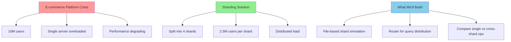
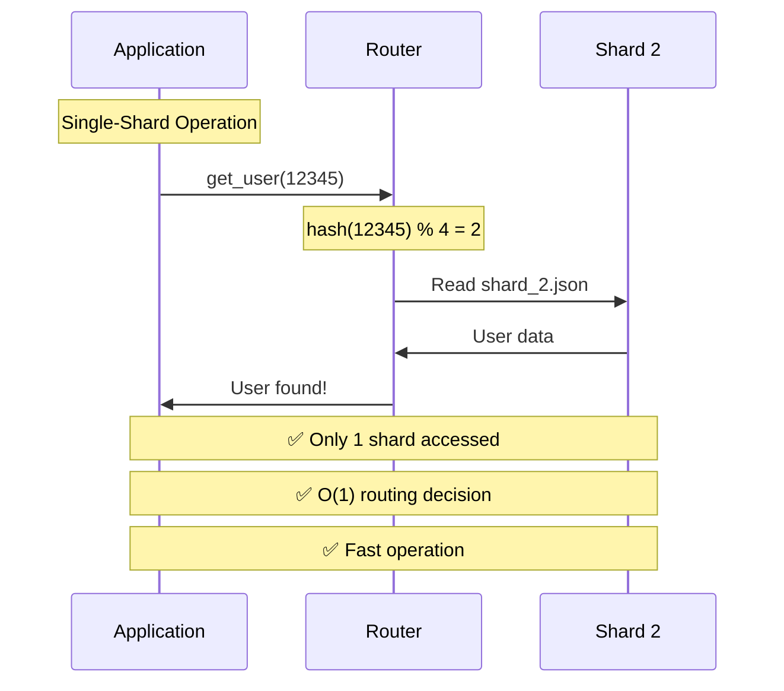
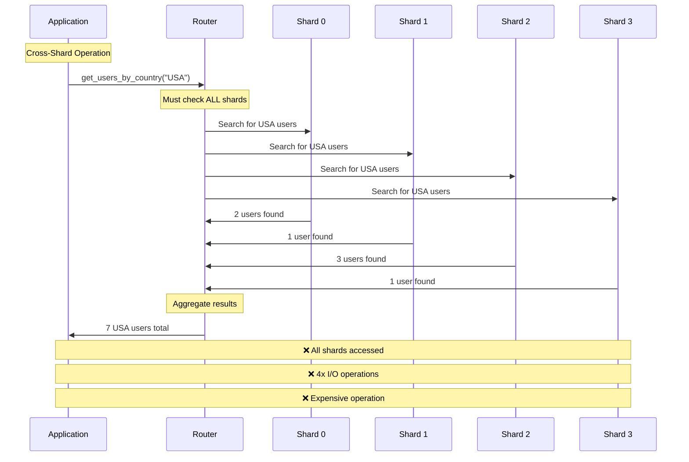
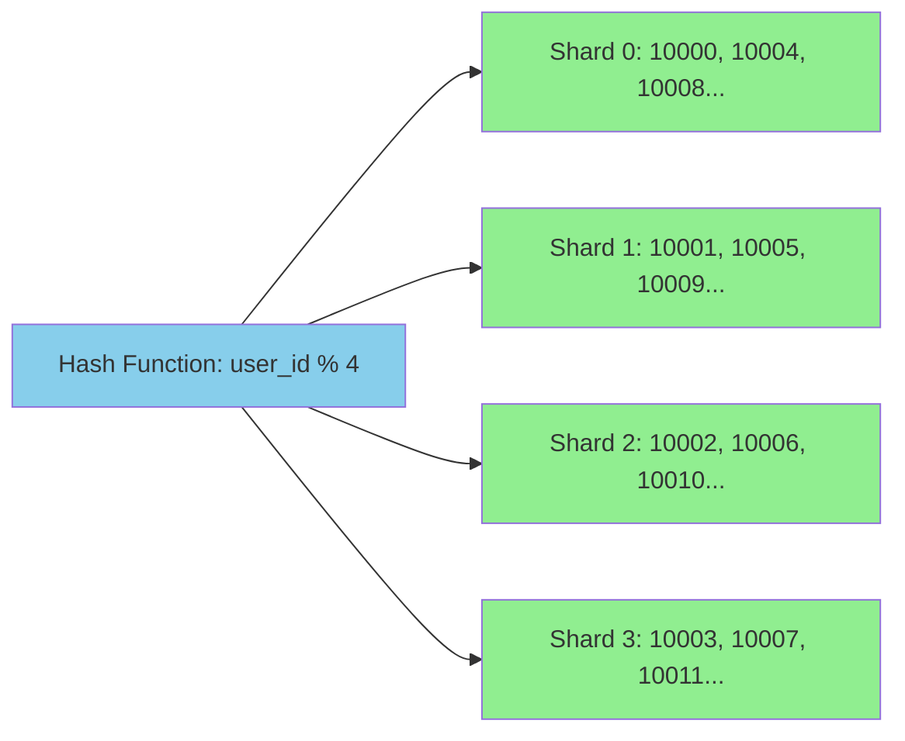
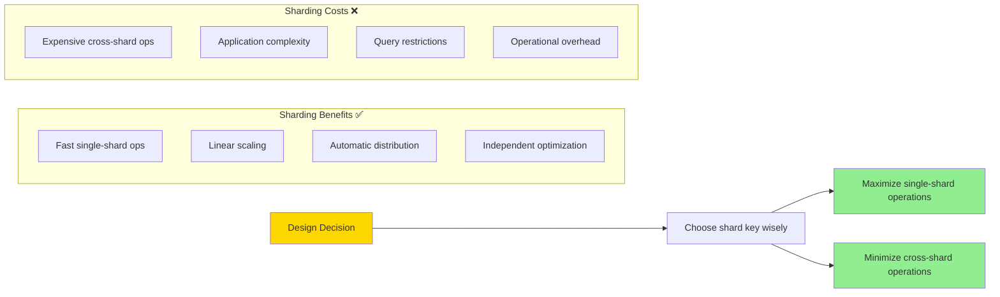
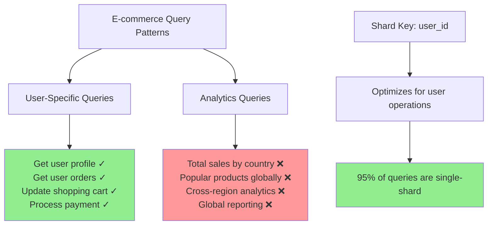

# Simulating Sharding: A Hands-On Guide

## The Setup: A Growing E-commerce Platform



Let's simulate sharding with a realistic scenario. You're running an e-commerce platform that's outgrown a single database. You have 10 million users, and your single server can't handle the load.

We'll demonstrate:
1. How to distribute user data across multiple "shards" (files)
2. How a router decides where to read/write data
3. The difference between single-shard and cross-shard operations

## Step 1: Create the Simulation Environment

```mermaid
graph LR
    A[ShardedUserStore] --> B[Shard 0<br/>shard_0.json]
    A --> C[Shard 1<br/>shard_1.json]
    A --> D[Shard 2<br/>shard_2.json]
    A --> E[Shard 3<br/>shard_3.json]
    
    F[Router Logic] --> G[hash(user_id) % 4]
    G --> H[Routes to correct shard]
    
    style A fill:#87CEEB
    style F fill:#90EE90
```

We'll simulate shards using separate files and implement a simple router in Python.

```python
import hashlib
import json
import os
from typing import Dict, List, Optional

class ShardedUserStore:
    def __init__(self, num_shards: int = 4):
        self.num_shards = num_shards
        self.shard_dir = "user_shards"
        self._create_shard_files()
    
    def _create_shard_files(self):
        """Create separate files for each shard."""
        os.makedirs(self.shard_dir, exist_ok=True)
        for i in range(self.num_shards):
            shard_file = f"{self.shard_dir}/shard_{i}.json"
            if not os.path.exists(shard_file):
                with open(shard_file, 'w') as f:
                    json.dump({}, f)
    
    def _get_shard_id(self, user_id: int) -> int:
        """Route user_id to appropriate shard."""
        return hash(user_id) % self.num_shards
    
    def _get_shard_file(self, shard_id: int) -> str:
        """Get the file path for a shard."""
        return f"{self.shard_dir}/shard_{shard_id}.json"
```

## Step 2: Implement Basic CRUD Operations

```python
    def create_user(self, user_id: int, user_data: Dict) -> bool:
        """Create a user in the appropriate shard."""
        shard_id = self._get_shard_id(user_id)
        shard_file = self._get_shard_file(shard_id)
        
        # Read current shard data
        with open(shard_file, 'r') as f:
            shard_data = json.load(f)
        
        # Add new user
        shard_data[str(user_id)] = user_data
        
        # Write back to shard
        with open(shard_file, 'w') as f:
            json.dump(shard_data, f, indent=2)
        
        print(f"✓ User {user_id} created in shard {shard_id}")
        return True
    
    def get_user(self, user_id: int) -> Optional[Dict]:
        """Get a user from the appropriate shard."""
        shard_id = self._get_shard_id(user_id)
        shard_file = self._get_shard_file(shard_id)
        
        with open(shard_file, 'r') as f:
            shard_data = json.load(f)
        
        user_data = shard_data.get(str(user_id))
        if user_data:
            print(f"✓ User {user_id} found in shard {shard_id}")
        else:
            print(f"✗ User {user_id} not found in shard {shard_id}")
        
        return user_data
    
    def update_user(self, user_id: int, updates: Dict) -> bool:
        """Update a user in the appropriate shard."""
        shard_id = self._get_shard_id(user_id)
        shard_file = self._get_shard_file(shard_id)
        
        with open(shard_file, 'r') as f:
            shard_data = json.load(f)
        
        if str(user_id) in shard_data:
            shard_data[str(user_id)].update(updates)
            
            with open(shard_file, 'w') as f:
                json.dump(shard_data, f, indent=2)
            
            print(f"✓ User {user_id} updated in shard {shard_id}")
            return True
        else:
            print(f"✗ User {user_id} not found for update")
            return False
```

## Step 3: Demonstrate Single-Shard Operations



```python
def demo_single_shard_operations():
    """Show how single-shard operations work efficiently."""
    print("=== Single-Shard Operations Demo ===\n")
    
    store = ShardedUserStore(num_shards=4)
    
    # Create some users
    users = [
        (12345, {"name": "Alice Johnson", "email": "alice@email.com", "country": "USA"}),
        (67890, {"name": "Bob Smith", "email": "bob@email.com", "country": "Canada"}),
        (11111, {"name": "Carol White", "email": "carol@email.com", "country": "UK"}),
        (22222, {"name": "David Brown", "email": "david@email.com", "country": "USA"}),
    ]
    
    print("Creating users:")
    for user_id, user_data in users:
        store.create_user(user_id, user_data)
    
    print("\nReading users:")
    for user_id, _ in users:
        user = store.get_user(user_id)
        if user:
            print(f"  Found: {user['name']} ({user['email']})")
    
    print("\nUpdating user 12345:")
    store.update_user(12345, {"last_login": "2024-01-15"})
    
    updated_user = store.get_user(12345)
    print(f"  Updated user: {updated_user}")
```

## Step 4: Implement Cross-Shard Operations



```python
    def get_all_users_by_country(self, country: str) -> List[Dict]:
        """Cross-shard operation: find users by country."""
        print(f"\n=== Cross-Shard Query: Users in {country} ===")
        all_users = []
        
        # Must check ALL shards
        for shard_id in range(self.num_shards):
            shard_file = self._get_shard_file(shard_id)
            
            with open(shard_file, 'r') as f:
                shard_data = json.load(f)
            
            print(f"Checking shard {shard_id}...")
            shard_users = []
            
            for user_id, user_data in shard_data.items():
                if user_data.get('country') == country:
                    shard_users.append({
                        'user_id': int(user_id),
                        **user_data
                    })
            
            print(f"  Found {len(shard_users)} users in shard {shard_id}")
            all_users.extend(shard_users)
        
        print(f"Total users in {country}: {len(all_users)}")
        return all_users
    
    def get_user_count(self) -> int:
        """Cross-shard operation: count all users."""
        print("\n=== Cross-Shard Count: Total Users ===")
        total_count = 0
        
        for shard_id in range(self.num_shards):
            shard_file = self._get_shard_file(shard_id)
            
            with open(shard_file, 'r') as f:
                shard_data = json.load(f)
            
            shard_count = len(shard_data)
            print(f"Shard {shard_id}: {shard_count} users")
            total_count += shard_count
        
        print(f"Total users across all shards: {total_count}")
        return total_count
```

## Step 5: Show Data Distribution

```mermaid
graph TD
    A[Hash Function Distribution] --> B[hash(user_id) % 4]
    
    B --> C[Shard 0<br/>user_ids: 10000, 10004, 10008, 10012<br/>Even distribution]
    B --> D[Shard 1<br/>user_ids: 10001, 10005, 10009, 10013<br/>Even distribution]
    B --> E[Shard 2<br/>user_ids: 10002, 10006, 10010, 10014<br/>Even distribution]
    B --> F[Shard 3<br/>user_ids: 10003, 10007, 10011, 10015<br/>Even distribution]
    
    style C fill:#90EE90
    style D fill:#90EE90
    style E fill:#90EE90
    style F fill:#90EE90
```

```python
    def show_shard_distribution(self):
        """Display how data is distributed across shards."""
        print("\n=== Shard Distribution Analysis ===")
        
        for shard_id in range(self.num_shards):
            shard_file = self._get_shard_file(shard_id)
            
            with open(shard_file, 'r') as f:
                shard_data = json.load(f)
            
            user_ids = [int(uid) for uid in shard_data.keys()]
            
            print(f"\nShard {shard_id}:")
            print(f"  Users: {len(user_ids)}")
            if user_ids:
                print(f"  User ID range: {min(user_ids)} - {max(user_ids)}")
                print(f"  Sample users: {sorted(user_ids)[:3]}")
```

## Step 6: Complete Demo

```python
def main():
    """Run the complete sharding simulation."""
    
    # Single-shard operations
    demo_single_shard_operations()
    
    # Create store with more users for cross-shard demo
    store = ShardedUserStore(num_shards=4)
    
    # Add more users to demonstrate distribution
    import random
    countries = ["USA", "Canada", "UK", "Germany", "France"]
    
    print("\n=== Adding 20 Random Users ===")
    for i in range(20):
        user_id = 10000 + i
        user_data = {
            "name": f"User {i+1}",
            "email": f"user{i+1}@email.com",
            "country": random.choice(countries)
        }
        store.create_user(user_id, user_data)
    
    # Show distribution
    store.show_shard_distribution()
    
    # Cross-shard operations
    usa_users = store.get_all_users_by_country("USA")
    total_users = store.get_user_count()
    
    print(f"\nFinal Results:")
    print(f"- USA users found: {len(usa_users)}")
    print(f"- Total users: {total_users}")

if __name__ == "__main__":
    main()
```

## Key Observations from the Simulation

```mermaid
graph TD
    A[Sharding Performance Analysis] --> B[Single-Shard Operations]
    A --> C[Cross-Shard Operations]
    A --> D[Data Distribution]
    
    B --> E[✓ O(1) routing decision<br/>✓ Direct lookup<br/>✓ Single I/O operation<br/>✓ Scales linearly]
    
    C --> F[✗ Must check ALL shards<br/>✗ N× I/O operations<br/>✗ Application aggregation<br/>✗ Expensive at scale]
    
    D --> G[Hash-based distribution<br/>✓ Even spread<br/>✓ Order-independent<br/>✓ Predictable routing]
    
    style E fill:#90EE90
    style F fill:#ff9999
    style G fill:#87CEEB
```

### Efficient Single-Shard Operations
```
User 12345 → hash(12345) % 4 = Shard 2
✓ Direct lookup, no need to check other shards
✓ O(1) routing decision
✓ Single file I/O operation
```

### Expensive Cross-Shard Operations
```
Query: "Find all users in USA"
✗ Must check ALL 4 shards
✗ 4x file I/O operations
✗ Application must aggregate results
```

### Data Distribution


Notice how the hash function distributes users evenly across shards, regardless of the order they were created.

## Running the Simulation

Save the code as `sharding_demo.py` and run:

```bash
python sharding_demo.py
```

This will create a `user_shards/` directory with 4 JSON files representing your shards. You can examine these files to see exactly how the data is distributed.

## Real-World Implications



This simulation demonstrates the fundamental trade-offs of sharding:

**✅ Benefits:**
- Single-shard operations are fast and scale linearly
- Data distribution is automatic and even
- Each shard can be optimized independently

**❌ Costs:**
- Cross-shard operations require hitting multiple shards
- Application complexity increases (routing logic)
- Some queries become much more expensive



The key insight: **Design your shard key so that most of your queries are single-shard operations.** In our e-commerce example, using `user_id` as the shard key works well because most queries are user-specific (orders, preferences, shopping cart).

However, analytics queries like "total sales by country" become expensive cross-shard operations. This is the fundamental trade-off you must consider when designing a sharded system.