# Deep Dive: Choosing a Shard Key

## The Most Critical Decision

```mermaid
flowchart TD
    A[Shard Key Decision] --> B{Choose Correctly?}
    
    B -->|Yes ✅| C[Linear Scaling]
    B -->|No ❌| D[Distributed Complexity]
    
    C --> E[Predictable Performance]
    C --> F[Even Load Distribution]
    C --> G[Simple Operations]
    
    D --> H[Worse Than Single DB]
    D --> I[Hotspots & Bottlenecks]
    D --> J[Complex Cross-Shard Ops]
    
    K[Everything Flows From This Choice] --> L[Performance]
    K --> M[Scalability]
    K --> N[Operational Complexity]
    
    style A fill:#FFD700
    style C fill:#90EE90
    style D fill:#ff9999
```



Choosing the right shard key is the most important decision in your sharding strategy. **Everything else—performance, scalability, operational complexity—flows from this single choice.**

Get it right, and your system scales linearly with predictable performance. Get it wrong, and you'll have all the complexity of distributed systems with performance worse than a single database.

## The Three Pillars of a Good Shard Key


### 1. High Cardinality

**Cardinality** = the number of distinct values your shard key can have.

#### Bad: Low Cardinality


```sql
-- Shard key: user_type (only 3 values)
CREATE TABLE users (
    id INT,
    name VARCHAR(100),
    user_type ENUM('free', 'premium', 'enterprise')  -- Shard key
);

-- Distribution disaster:
Shard 1: 'free' users      → 85% of all users
Shard 2: 'premium' users   → 12% of all users  
Shard 3: 'enterprise' users → 3% of all users
```

#### Good: High Cardinality

```mermaid
graph TD
    A[High Cardinality: user_id] --> B[Millions of Distinct Values]
    B --> C[Shard 1: users 1-2.5M<br/>25% load ✅]
    B --> D[Shard 2: users 2.5M-5M<br/>25% load ✅]
    B --> E[Shard 3: users 5M-7.5M<br/>25% load ✅]
    B --> F[Shard 4: users 7.5M-10M<br/>25% load ✅]
    
    G[Benefits] --> H[Even distribution]
    G --> I[Linear scaling possible]
    G --> J[No hotspots]
    
    style C fill:#90EE90
    style D fill:#90EE90
    style E fill:#90EE90
    style F fill:#90EE90
    style G fill:#87CEEB
```



```sql
-- Shard key: user_id (millions of values)
CREATE TABLE users (
    id INT PRIMARY KEY,  -- Shard key
    name VARCHAR(100),
    user_type ENUM('free', 'premium', 'enterprise')
);

-- Even distribution:
Shard 1: user_ids 1-2.5M      → 25% of users
Shard 2: user_ids 2.5M-5M     → 25% of users
Shard 3: user_ids 5M-7.5M     → 25% of users
Shard 4: user_ids 7.5M-10M    → 25% of users
```

### 2. Even Distribution


High cardinality means nothing if values cluster unevenly.

#### Bad: Skewed Distribution
```sql
-- Shard key: company_id in B2B SaaS
-- Problem: Company sizes vary wildly

Company A: 50,000 employees → Massive shard
Company B: 12,000 employees → Large shard
Company C: 500 employees    → Medium shard
Company D: 50 employees     → Small shard
Company E: 5 employees      → Tiny shard
```

**The "Enterprise Customer" Problem:**
- One Fortune 500 customer = 90% of your traffic
- Their shard becomes a bottleneck
- Other shards sit mostly idle

#### Good: Natural Distribution
```sql
-- Shard key: user_id with hash function
shard_id = hash(user_id) % num_shards

-- Hash functions distribute randomly:
Shard 1: Random users → ~25% of traffic
Shard 2: Random users → ~25% of traffic  
Shard 3: Random users → ~25% of traffic
Shard 4: Random users → ~25% of traffic
```

### 3. Query Alignment


**Most of your queries should include the shard key.**

#### The E-commerce Example

**Good Shard Key: `user_id`**
```sql
-- ✅ Single-shard queries (fast)
SELECT * FROM orders WHERE user_id = 12345;
SELECT * FROM cart WHERE user_id = 12345;
UPDATE users SET last_login = NOW() WHERE user_id = 12345;

-- ❌ Cross-shard queries (slow)
SELECT COUNT(*) FROM orders WHERE order_date = '2024-01-15';
SELECT * FROM orders WHERE product_id = 67890;
```

**Bad Shard Key: `order_date`**
```sql
-- ✅ Single-shard queries (limited usefulness)
SELECT * FROM orders WHERE order_date = '2024-01-15';

-- ❌ Cross-shard queries (most common operations!)
SELECT * FROM orders WHERE user_id = 12345;  -- User's order history
UPDATE users SET last_login = NOW() WHERE user_id = 12345;  -- Login
SELECT * FROM cart WHERE user_id = 12345;  -- Shopping cart
```

## Common Shard Key Patterns

### 1. Entity ID Pattern
Use the primary key of your main entity.

**Examples:**
- **E-commerce**: `user_id`
- **Social Media**: `user_id`
- **Gaming**: `player_id`
- **B2B SaaS**: `tenant_id` or `organization_id`

**Pros:**
- High cardinality
- Even distribution (with hash)
- Aligns with user-centric queries

**Cons:**
- Analytics queries become expensive
- Cross-user operations are complex

### 2. Composite Key Pattern
Combine multiple attributes for better alignment.

```sql
-- Shard key: (tenant_id, timestamp_bucket)
shard_key = hash(tenant_id + floor(timestamp / 3600))  -- Hour buckets

-- Good for time-series data with multi-tenancy
```

**Pros:**
- Can optimize for multiple query patterns
- Better data locality for related records

**Cons:**
- More complex routing logic
- Risk of uneven distribution if not careful

### 3. Geographic Pattern
Shard by location for locality-sensitive applications.

```sql
-- Shard key: region
shard_key = user_region  -- 'us-east', 'eu-west', 'asia-pacific'
```

**Pros:**
- Low latency (data close to users)
- Regulatory compliance (data residency)
- Natural query alignment for regional features

**Cons:**
- Uneven distribution (population differences)
- Complex cross-region operations
- Difficult to rebalance

## Anti-Patterns: Shard Keys to Avoid

```mermaid
graph TD
    A[Common Shard Key Anti-Patterns] --> B[Timestamp Trap]
    A --> C[Status Field Mistake]
    A --> D[Auto-Increment Trap]
    
    B --> E[created_at as shard key<br/>❌ All new data → one shard<br/>❌ Write hotspots<br/>❌ Read-only old shards]
    
    C --> F[order_status as shard key<br/>❌ Low cardinality<br/>❌ Uneven distribution<br/>❌ Processing hotspots]
    
    D --> G[user_id % shards (no hash)<br/>❌ Predictable routing<br/>❌ Sequential hotspots<br/>❌ Uneven growth]
    
    H[The Fix] --> I[Always hash sequential IDs<br/>✅ hash(user_id) % shards]
    
    style B fill:#ff9999
    style C fill:#ff9999
    style D fill:#ff9999
    style I fill:#90EE90
```

### 1. The Timestamp Trap
```sql
-- BAD: created_at as shard key
shard_key = date(created_at)

-- Problems:
-- - All new data goes to one shard (hotspot)
-- - Older shards become read-only
-- - Uneven write distribution
```

### 2. The Status Field Mistake
```sql
-- BAD: order_status as shard key
shard_key = order_status  -- 'pending', 'shipped', 'delivered'

-- Problems:
-- - Low cardinality (few distinct values)
-- - Uneven distribution (most orders are 'delivered')
-- - Hotspots when order processing happens
```

### 3. The Auto-Increment Trap
```sql
-- BAD: Sequential IDs without hashing
shard_key = user_id % num_shards

-- Problems:
-- - All new users go to predictable shards
-- - Uneven growth patterns
-- - Hotspots during user registration
```

**Fix**: Always hash sequential IDs:
```sql
shard_key = hash(user_id) % num_shards
```

## Case Study: Instagram's Evolution

Instagram's sharding strategy evolved as they grew:

### Phase 1: Simple User ID Sharding
```sql
shard_key = user_id % num_shards
```

**Worked for:**
- User profiles
- User's own photos
- User's followers/following

**Problems:**
- Popular posts span multiple users (cross-shard)
- Discovery feeds require multiple shards
- Celebrity accounts create hotspots

### Phase 2: Hybrid Approach
```sql
-- User data: shard by user_id
user_shard = hash(user_id) % user_shards

-- Media data: shard by media_id  
media_shard = hash(media_id) % media_shards

-- Activity feeds: separate system entirely
```

**Lesson**: Different data types might need different shard keys.

## The Resharding Problem

**What happens when your shard key choice turns out to be wrong?**

### Changing Shard Keys
Changing the shard key requires resharding ALL data:

```
Before: shard_key = user_id % 4
Shard 1: users [1, 5, 9, 13, ...]
Shard 2: users [2, 6, 10, 14, ...]

After: shard_key = hash(user_id) % 4  
Shard 1: users [1, 8, 12, 15, ...]  -- Different users!
Shard 2: users [3, 7, 11, 16, ...]  -- Different users!
```

**Every single record** must be:
1. Read from the old shard
2. Routed to the new shard  
3. Written to the new location
4. Verified for consistency

This can take **weeks** for large datasets and requires careful coordination to avoid downtime.

## Decision Framework


Use this framework when choosing a shard key:

### Step 1: Analyze Query Patterns
```
List your top 10 most frequent queries:
1. SELECT * FROM orders WHERE user_id = ?     (80% of queries)
2. UPDATE users SET last_login = ? WHERE user_id = ?  (10%)
3. SELECT COUNT(*) FROM orders WHERE date = ?  (5%)
4. SELECT * FROM products WHERE category = ?   (3%)
5. ...
```

### Step 2: Identify Entity Relationships
```
Core entities and their relationships:
- Users (1) → Orders (many)
- Users (1) → Cart Items (many)  
- Users (1) → Reviews (many)
- Orders (1) → Order Items (many)
```

### Step 3: Calculate Cardinality
```
Potential shard keys:
- user_id: 10M distinct values ✅
- order_id: 50M distinct values ✅  
- product_id: 100K distinct values ✅
- category_id: 50 distinct values ❌
```

### Step 4: Estimate Distribution
```
Data volume by shard key:
- user_id: Even (hash-based) ✅
- order_id: Skewed by time (recent orders larger) ⚠️
- product_id: Skewed by popularity ❌
```

### Step 5: Project Cross-Shard Operations
```
With user_id as shard key:
- Single-shard: 90% of queries ✅
- Cross-shard: 10% of queries (analytics) ⚠️

With product_id as shard key:
- Single-shard: 30% of queries ❌
- Cross-shard: 70% of queries ❌
```

## The Golden Rules

```mermaid
graph TD
    A["🏆 Golden Rules for Shard Keys"] --> B["🎯 80%+ single-shard queries"]
    A --> C["📈 High cardinality (millions)"]
    A --> D["⚖️ Even distribution"]
    A --> E["📊 Plan for growth"]
    A --> F["🤝 Accept trade-offs"]
    
    G["⚠️ Reality Check"] --> H["No perfect shard key exists"]
    G --> I["Every choice has trade-offs"]
    G --> J["Optimize for common operations"]
    G --> K["Accept expensive cross-shard ops"]
    
    L["💰 Cost of Change"] --> M["Changing shard key = resharding ALL data"]
    L --> N["Weeks of downtime/complexity"]
    L --> O["Worth investing time upfront"]
    
    style A fill:#FFD700
    style G fill:#FFA500
    style L fill:#ff9999
```



1. **Most queries should be single-shard** - aim for 80%+ of queries to include the shard key
2. **Choose high cardinality** - millions of distinct values, not hundreds
3. **Ensure even distribution** - use hash functions for naturally skewed data
4. **Plan for growth** - consider how data distribution will change over time
5. **Accept the trade-offs** - some queries will become expensive, design around this

Remember: **There is no perfect shard key.** Every choice involves trade-offs. The goal is to optimize for your most common operations while accepting the costs of less frequent cross-shard operations.

The shard key decision is permanent enough that it's worth spending significant time getting it right. Changing it later is possible but extremely expensive.