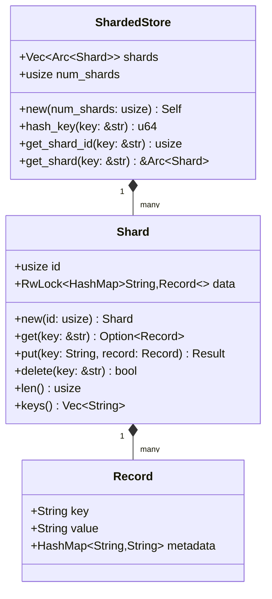
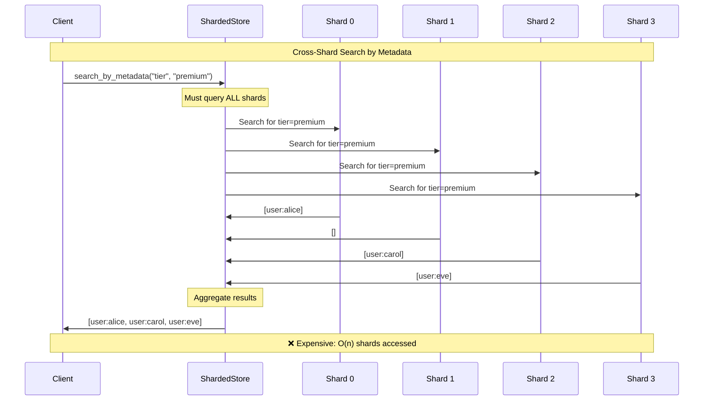
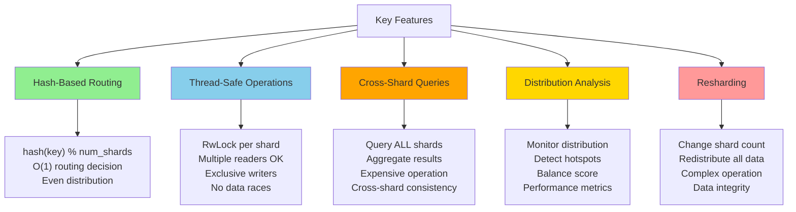

# Rust Implementation: A Sharded Key-Value Store

## Overview

```mermaid
graph TD
    A[Sharded Key-Value Store] --> B[Hash-Based Routing]
    A --> C[Single-Shard Ops]
    A --> D[Cross-Shard Ops]
    A --> E[Thread Safety]
    A --> F[Resharding]
    
    B --> G[hash(key) % num_shards]
    C --> H[Direct shard access<br/>O(1) performance]
    D --> I[Query all shards<br/>Aggregate results]
    E --> J[RwLock per shard<br/>Concurrent access]
    F --> K[Redistribute all data<br/>Change shard count]
    
    style A fill:#87CEEB
    style H fill:#90EE90
    style I fill:#FFA500
    style J fill:#FFD700
    style K fill:#ff9999
```

We'll build a complete sharded key-value store in Rust that demonstrates:
- Hash-based shard routing
- Single-shard and cross-shard operations
- Thread-safe concurrent access
- Resharding capabilities

This implementation showcases the core concepts of sharding in a production-ready way.

## Core Data Structures



```rust
use std::collections::HashMap;
use std::sync::{Arc, RwLock};
use std::hash::{Hash, Hasher};
use std::collections::hash_map::DefaultHasher;
use serde::{Serialize, Deserialize};

#[derive(Debug, Clone, Serialize, Deserialize)]
pub struct Record {
    pub key: String,
    pub value: String,
    pub metadata: HashMap<String, String>,
}

#[derive(Debug)]
pub struct Shard {
    id: usize,
    data: RwLock<HashMap<String, Record>>,
}

impl Shard {
    pub fn new(id: usize) -> Self {
        Self {
            id,
            data: RwLock::new(HashMap::new()),
        }
    }
    
    pub fn get(&self, key: &str) -> Option<Record> {
        let data = self.data.read().unwrap();
        data.get(key).cloned()
    }
    
    pub fn put(&self, key: String, record: Record) -> Result<(), String> {
        let mut data = self.data.write().unwrap();
        data.insert(key, record);
        Ok(())
    }
    
    pub fn delete(&self, key: &str) -> bool {
        let mut data = self.data.write().unwrap();
        data.remove(key).is_some()
    }
    
    pub fn len(&self) -> usize {
        let data = self.data.read().unwrap();
        data.len()
    }
    
    pub fn keys(&self) -> Vec<String> {
        let data = self.data.read().unwrap();
        data.keys().cloned().collect()
    }
}
```

## The Sharded Store

```rust
#[derive(Debug)]
pub struct ShardedStore {
    shards: Vec<Arc<Shard>>,
    num_shards: usize,
}

impl ShardedStore {
    pub fn new(num_shards: usize) -> Self {
        let shards = (0..num_shards)
            .map(|i| Arc::new(Shard::new(i)))
            .collect();
        
        Self {
            shards,
            num_shards,
        }
    }
    
    fn hash_key(key: &str) -> u64 {
        let mut hasher = DefaultHasher::new();
        key.hash(&mut hasher);
        hasher.finish()
    }
    
    fn get_shard_id(&self, key: &str) -> usize {
        (Self::hash_key(key) % self.num_shards as u64) as usize
    }
    
    fn get_shard(&self, key: &str) -> &Arc<Shard> {
        let shard_id = self.get_shard_id(key);
        &self.shards[shard_id]
    }
}
```

## Basic Operations

```rust
impl ShardedStore {
    pub fn put(&self, key: String, value: String) -> Result<(), String> {
        let record = Record {
            key: key.clone(),
            value,
            metadata: HashMap::new(),
        };
        
        let shard = self.get_shard(&key);
        shard.put(key, record)
    }
    
    pub fn put_with_metadata(
        &self, 
        key: String, 
        value: String, 
        metadata: HashMap<String, String>
    ) -> Result<(), String> {
        let record = Record {
            key: key.clone(),
            value,
            metadata,
        };
        
        let shard = self.get_shard(&key);
        shard.put(key, record)
    }
    
    pub fn get(&self, key: &str) -> Option<Record> {
        let shard = self.get_shard(key);
        shard.get(key)
    }
    
    pub fn delete(&self, key: &str) -> bool {
        let shard = self.get_shard(key);
        shard.delete(key)
    }
    
    pub fn exists(&self, key: &str) -> bool {
        self.get(key).is_some()
    }
}
```

## Cross-Shard Operations



```rust
impl ShardedStore {
    pub fn get_all_keys(&self) -> Vec<String> {
        let mut all_keys = Vec::new();
        
        for shard in &self.shards {
            all_keys.extend(shard.keys());
        }
        
        all_keys
    }
    
    pub fn total_count(&self) -> usize {
        self.shards.iter().map(|shard| shard.len()).sum()
    }
    
    pub fn search_by_metadata(&self, meta_key: &str, meta_value: &str) -> Vec<Record> {
        let mut results = Vec::new();
        
        for shard in &self.shards {
            let data = shard.data.read().unwrap();
            for record in data.values() {
                if let Some(value) = record.metadata.get(meta_key) {
                    if value == meta_value {
                        results.push(record.clone());
                    }
                }
            }
        }
        
        results
    }
    
    pub fn get_statistics(&self) -> ShardStatistics {
        let mut stats = ShardStatistics {
            total_records: 0,
            shard_info: Vec::new(),
        };
        
        for (i, shard) in self.shards.iter().enumerate() {
            let count = shard.len();
            stats.total_records += count;
            stats.shard_info.push(ShardInfo {
                shard_id: i,
                record_count: count,
            });
        }
        
        stats
    }
}

#[derive(Debug)]
pub struct ShardStatistics {
    pub total_records: usize,
    pub shard_info: Vec<ShardInfo>,
}

#[derive(Debug)]
pub struct ShardInfo {
    pub shard_id: usize,
    pub record_count: usize,
}
```

## Resharding Implementation

```mermaid
flowchart TD
    A[Start Resharding] --> B[Collect All Records]
    B --> C[Create New Shard Structure]
    C --> D[Redistribute Records]
    D --> E[Update Store Configuration]
    E --> F[Complete]
    
    subgraph "Data Movement"
        G[Old: 2 shards] --> H[hash(key) % 2]
        I[New: 4 shards] --> J[hash(key) % 4]
        
        K["Record migration:<br/>Every record moves<br/>to new location"]
    end
    
    B --> G
    D --> I
    D --> K
    
    style A fill:#87CEEB
    style F fill:#90EE90
    style K fill:#FFA500
```

```rust
impl ShardedStore {
    pub fn reshard(&mut self, new_num_shards: usize) -> Result<(), String> {
        if new_num_shards == self.num_shards {
            return Ok(());
        }
        
        println!("Starting resharding: {} → {} shards", self.num_shards, new_num_shards);
        
        // Collect all existing data
        let mut all_records = Vec::new();
        for shard in &self.shards {
            let data = shard.data.read().unwrap();
            for (key, record) in data.iter() {
                all_records.push((key.clone(), record.clone()));
            }
        }
        
        println!("Collected {} records for redistribution", all_records.len());
        
        // Create new shard structure
        let new_shards: Vec<Arc<Shard>> = (0..new_num_shards)
            .map(|i| Arc::new(Shard::new(i)))
            .collect();
        
        // Redistribute data to new shards
        for (key, record) in all_records {
            let new_shard_id = (Self::hash_key(&key) % new_num_shards as u64) as usize;
            new_shards[new_shard_id].put(key, record)?;
        }
        
        // Update the store
        self.shards = new_shards;
        self.num_shards = new_num_shards;
        
        println!("Resharding completed successfully");
        Ok(())
    }
    
    pub fn analyze_distribution(&self) -> DistributionAnalysis {
        let stats = self.get_statistics();
        let total = stats.total_records as f64;
        
        let mut analysis = DistributionAnalysis {
            expected_per_shard: total / self.num_shards as f64,
            actual_distribution: Vec::new(),
            balance_score: 0.0,
        };
        
        let mut variance_sum = 0.0;
        
        for shard_info in stats.shard_info {
            let actual = shard_info.record_count as f64;
            let deviation = actual - analysis.expected_per_shard;
            variance_sum += deviation * deviation;
            
            analysis.actual_distribution.push(ShardDistribution {
                shard_id: shard_info.shard_id,
                record_count: shard_info.record_count,
                percentage: if total > 0.0 { (actual / total) * 100.0 } else { 0.0 },
                deviation_from_expected: deviation,
            });
        }
        
        // Calculate balance score (lower is better, 0 = perfect balance)
        analysis.balance_score = if self.num_shards > 0 {
            (variance_sum / self.num_shards as f64).sqrt()
        } else {
            0.0
        };
        
        analysis
    }
}

#[derive(Debug)]
pub struct DistributionAnalysis {
    pub expected_per_shard: f64,
    pub actual_distribution: Vec<ShardDistribution>,
    pub balance_score: f64,
}

#[derive(Debug)]
pub struct ShardDistribution {
    pub shard_id: usize,
    pub record_count: usize,
    pub percentage: f64,
    pub deviation_from_expected: f64,
}
```

## Usage Examples and Testing

```rust
#[cfg(test)]
mod tests {
    use super::*;
    
    #[test]
    fn test_basic_operations() {
        let store = ShardedStore::new(4);
        
        // Test put and get
        store.put("user:1".to_string(), "Alice".to_string()).unwrap();
        store.put("user:2".to_string(), "Bob".to_string()).unwrap();
        
        assert_eq!(store.get("user:1").unwrap().value, "Alice");
        assert_eq!(store.get("user:2").unwrap().value, "Bob");
        assert!(store.get("user:3").is_none());
        
        // Test delete
        assert!(store.delete("user:1"));
        assert!(!store.delete("user:1")); // Already deleted
        assert!(store.get("user:1").is_none());
    }
    
    #[test]
    fn test_distribution() {
        let store = ShardedStore::new(4);
        
        // Add many records
        for i in 0..1000 {
            let key = format!("key:{}", i);
            let value = format!("value:{}", i);
            store.put(key, value).unwrap();
        }
        
        let analysis = store.analyze_distribution();
        
        // Check that distribution is reasonably balanced
        assert!(analysis.balance_score < 50.0, "Distribution too unbalanced");
        
        // Check that all shards have some data
        for shard_dist in &analysis.actual_distribution {
            assert!(shard_dist.record_count > 0, "Shard {} is empty", shard_dist.shard_id);
        }
    }
    
    #[test]
    fn test_cross_shard_operations() {
        let store = ShardedStore::new(3);
        
        // Add records with metadata
        let mut metadata = HashMap::new();
        metadata.insert("category".to_string(), "premium".to_string());
        
        store.put_with_metadata("user:1".to_string(), "Alice".to_string(), metadata.clone()).unwrap();
        store.put_with_metadata("user:2".to_string(), "Bob".to_string(), metadata).unwrap();
        
        let mut basic_metadata = HashMap::new();
        basic_metadata.insert("category".to_string(), "basic".to_string());
        store.put_with_metadata("user:3".to_string(), "Carol".to_string(), basic_metadata).unwrap();
        
        // Test cross-shard search
        let premium_users = store.search_by_metadata("category", "premium");
        assert_eq!(premium_users.len(), 2);
        
        let basic_users = store.search_by_metadata("category", "basic");
        assert_eq!(basic_users.len(), 1);
    }
    
    #[test]
    fn test_resharding() {
        let mut store = ShardedStore::new(2);
        
        // Add test data
        for i in 0..100 {
            let key = format!("item:{}", i);
            let value = format!("data:{}", i);
            store.put(key, value).unwrap();
        }
        
        assert_eq!(store.total_count(), 100);
        
        // Reshard to 4 shards
        store.reshard(4).unwrap();
        
        // Verify data integrity
        assert_eq!(store.total_count(), 100);
        assert_eq!(store.num_shards, 4);
        
        // Check that data is still accessible
        for i in 0..100 {
            let key = format!("item:{}", i);
            assert!(store.exists(&key), "Key {} missing after reshard", key);
        }
    }
}

fn main() {
    // Demo: Create a sharded store
    let store = ShardedStore::new(4);
    
    println!("=== Sharded Key-Value Store Demo ===\n");
    
    // Add some sample data
    println!("Adding sample data...");
    let sample_data = vec![
        ("user:alice", "Alice Johnson", "premium"),
        ("user:bob", "Bob Smith", "basic"),
        ("user:carol", "Carol White", "premium"),
        ("user:david", "David Brown", "basic"),
        ("user:eve", "Eve Wilson", "enterprise"),
    ];
    
    for (key, name, tier) in sample_data {
        let mut metadata = HashMap::new();
        metadata.insert("tier".to_string(), tier.to_string());
        metadata.insert("created".to_string(), "2024-01-15".to_string());
        
        store.put_with_metadata(key.to_string(), name.to_string(), metadata).unwrap();
        
        let shard_id = store.get_shard_id(key);
        println!("  {} → shard {}", key, shard_id);
    }
    
    // Show distribution
    println!("\n=== Distribution Analysis ===");
    let analysis = store.analyze_distribution();
    println!("Expected per shard: {:.1}", analysis.expected_per_shard);
    println!("Balance score: {:.2}", analysis.balance_score);
    
    for dist in &analysis.actual_distribution {
        println!(
            "Shard {}: {} records ({:.1}%), deviation: {:.1}",
            dist.shard_id,
            dist.record_count,
            dist.percentage,
            dist.deviation_from_expected
        );
    }
    
    // Demonstrate single-shard operations
    println!("\n=== Single-Shard Operations ===");
    if let Some(record) = store.get("user:alice") {
        println!("Found: {} (tier: {})", 
                record.value, 
                record.metadata.get("tier").unwrap_or(&"unknown".to_string()));
    }
    
    // Demonstrate cross-shard operations
    println!("\n=== Cross-Shard Operations ===");
    let premium_users = store.search_by_metadata("tier", "premium");
    println!("Premium users: {}", premium_users.len());
    for user in premium_users {
        println!("  - {}", user.value);
    }
    
    println!("\nTotal records: {}", store.total_count());
    
    // Demonstrate resharding
    println!("\n=== Resharding Demo ===");
    let mut mutable_store = store;
    println!("Current shards: {}", mutable_store.num_shards);
    mutable_store.reshard(6).unwrap();
    println!("After resharding: {} shards", mutable_store.num_shards);
    
    let new_analysis = mutable_store.analyze_distribution();
    println!("New balance score: {:.2}", new_analysis.balance_score);
}
```

## Key Features Demonstrated



### 1. Hash-Based Routing
```rust
fn get_shard_id(&self, key: &str) -> usize {
    (Self::hash_key(key) % self.num_shards as u64) as usize
}
```

### 2. Thread-Safe Operations
Each shard uses `RwLock` for concurrent access:
- Multiple readers can access simultaneously
- Writers get exclusive access
- Prevents data races in multi-threaded environments

### 3. Cross-Shard Queries
Operations that span multiple shards aggregate results:
```rust
pub fn search_by_metadata(&self, meta_key: &str, meta_value: &str) -> Vec<Record> {
    // Query ALL shards and combine results
}
```

### 4. Distribution Analysis
Monitor how evenly data is distributed across shards to detect hotspots.

### 5. Resharding
Redistribute all data when changing the number of shards—a complex but necessary operation for scaling.

## Running the Implementation

Add to `Cargo.toml`:
```toml
[dependencies]
serde = { version = "1.0", features = ["derive"] }
```

Compile and run:
```bash
cargo run
```

```mermaid
graph LR
    subgraph "Sharding Benefits ✅"
        A1[Fast single-shard ops<br/>O(1) routing]
        A2[Even distribution<br/>Hash-based partitioning]
        A3[Linear scaling<br/>Add more shards]
    end
    
    subgraph "Sharding Costs ❌"
        B1[Expensive cross-shard ops<br/>Query all shards]
        B2[Operational complexity<br/>Monitoring, resharding]
        B3[Application complexity<br/>Shard-aware logic]
    end
    
    C[Production Reality] --> D[Accept trade-offs]
    D --> E[Optimize for common operations]
    D --> F[Design around limitations]
    
    style A1 fill:#90EE90
    style A2 fill:#90EE90
    style A3 fill:#90EE90
    style B1 fill:#ff9999
    style B2 fill:#ff9999
    style B3 fill:#ff9999
    style C fill:#87CEEB
```

This implementation demonstrates the core trade-offs of sharding:
- **Fast single-shard operations** (O(1) routing)
- **Expensive cross-shard operations** (query all shards)
- **Even distribution** (hash-based partitioning)
- **Operational complexity** (resharding, monitoring)

The code provides a solid foundation for understanding how production sharding systems work in practice.