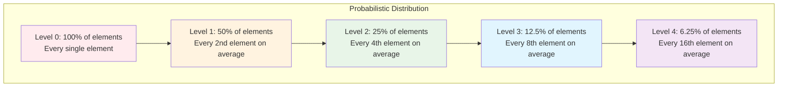
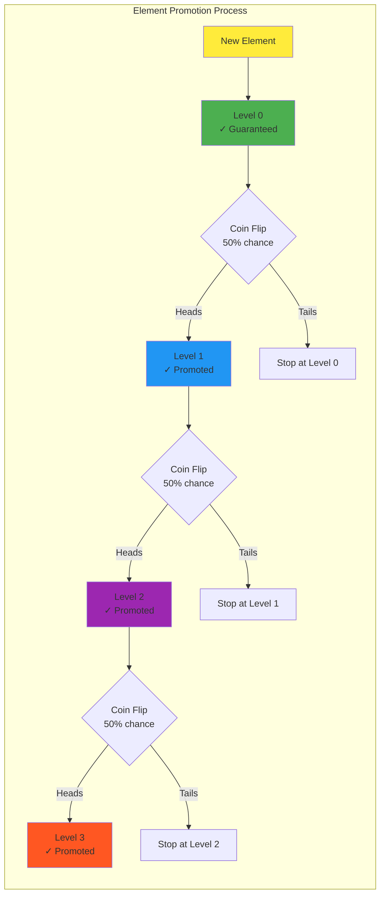

# Key Abstractions: The Building Blocks

## The Two Core Abstractions

Every skip list is built on two fundamental abstractions:

1. **Multi-level Linked List**: A linked list with multiple layers of forward pointers
2. **Probabilistic Promotion**: A randomized process for deciding which elements get express lane access

Understanding these deeply is essential for both implementing and reasoning about skip lists.

## Abstraction 1: The Multi-Level Linked List

### Structure Definition

A skip list is a **collection of sorted linked lists** stacked on top of each other:

```
Level 2:  HEAD -------→ 25 -------→ 68 -------→ NULL
Level 1:  HEAD ----→ 12 → 25 ----→ 42 → 68 ----→ NULL  
Level 0:  HEAD → 3 → 7 → 12 → 18 → 25 → 31 → 42 → 56 → 68 → NULL
```

**Key Properties:**
- **All levels are sorted** in the same order
- **Level 0 contains every element** (the complete dataset)
- **Higher levels contain subsets** of lower levels
- **Every node has forward pointers** for each level it participates in

### Node Structure

Each node in a skip list contains:
```rust
Node {
    value: T,                    // The stored data
    forward: Vec<Option<Node>>,  // Array of forward pointers (one per level)
}
```

**Visual representation of a multi-level node:**
```mermaid
graph TB
    subgraph "Node 25 Structure"
        V[Value: 25]
        
        subgraph "Forward Pointers Array"
            P0[Level 0 → Node(31)]
            P1[Level 1 → Node(42)]
            P2[Level 2 → Node(68)]
        end
        
        V --> P0
        V --> P1
        V --> P2
    end
    
    subgraph "Target Nodes"
        N31[Node 31]
        N42[Node 42] 
        N68[Node 68]
    end
    
    P0 -.-> N31
    P1 -.-> N42
    P2 -.-> N68
    
    style V fill:#ffeb3b
    style P0 fill:#e8f5e8
    style P1 fill:#fff3e0
    style P2 fill:#ffebee
```

**Example Node at levels 0, 1, and 2:**
```rust
Node(25) {
    value: 25,
    forward: [
        Some(Node(31)),  // Level 0: points to next element (31)
        Some(Node(42)),  // Level 1: skips ahead to 42  
        Some(Node(68)),  // Level 2: skips way ahead to 68
    ]
}
```

### Level Invariants

The multi-level structure maintains critical invariants:

#### 1. Subset Property
```
Level k+1 ⊆ Level k
```
Every element in a higher level must also exist in all lower levels.

#### 2. Ordering Property  
```
For all levels: if A → B, then A.value < B.value
```
Each level maintains sorted order independently.

#### 3. Connectivity Property
```
Level 0 must be a complete linked list connecting all elements
```
You can reach any element by traversing Level 0.

### The Search Path

The multi-level structure enables a **consistent search strategy**:

```python
def search(self, target):
    current = self.head
    level = self.max_level
    
    while level >= 0:
        # Move right as far as possible at this level
        while (current.forward[level] is not None and 
               current.forward[level].value < target):
            current = current.forward[level]
        
        # Drop down to the next level
        level -= 1
    
    # Check if the next node contains our target
    next_node = current.forward[0]
    return next_node and next_node.value == target
```

**The beauty**: This algorithm works regardless of how elements are distributed across levels.

## Abstraction 2: Probabilistic Promotion

### The Promotion Process

When inserting a new element, we must decide which levels it should participate in. This is where probability enters:

```python
def random_level(self, max_level=16, p=0.5):
    level = 0
    while random.random() < p and level < max_level:
        level += 1
    return level
```

**The Process:**
1. Every element starts at Level 0
2. With probability `p` (typically 0.5), promote to Level 1  
3. With probability `p²` (0.25), promote to Level 2
4. With probability `pᵏ`, promote to Level k
5. Continue until promotion fails or max level reached

### Expected Distribution

With p = 0.5, we expect:



**The Pattern**: Each level has roughly **half the elements** of the level below it.

### Coin Flip Visualization



### Why This Distribution Works

The geometric progression creates **natural express lanes**:

```
Level 3: 1 element per 8 (average)
Level 2: 1 element per 4 (average)  
Level 1: 1 element per 2 (average)
Level 0: All elements
```

**Search Efficiency**: Starting from the top, each level roughly halves the search space—giving us the O(log n) performance we want.

### The Height Analysis

**Question**: How tall does a skip list grow?

With probability p = 0.5 and n elements:
- **Expected maximum level** ≈ log₂(n)
- **With high probability**, height stays within O(log n)

**Example**: With 1 million elements:
- Expected height ≈ 20 levels
- 99.9% chance height < 30 levels

This bounded height is crucial for performance guarantees.

## The Interaction Between Abstractions

### Search Performance

The combination of multi-level structure and probabilistic promotion gives us:

```
Expected comparisons = O(log n)

Why?
- Start at level ~log₂(n) 
- Each level expects ~2 steps before dropping down
- Total: log₂(n) levels × 2 steps = O(log n)
```

### Insertion Complexity

```python
def insert(self, value):
    # 1. Find insertion point (O(log n))
    update = self._find_update_path(value)
    
    # 2. Determine levels (O(1) expected)
    new_level = self.random_level()
    
    # 3. Create and link node (O(k) where k is new_level)
    new_node = Node(value, new_level)
    for level in range(new_level + 1):
        new_node.forward[level] = update[level].forward[level]
        update[level].forward[level] = new_node
```

**Total Complexity**: O(log n) expected time

### Space Complexity

Each node stores:
- **1 data element**
- **k forward pointers** (where k is its level)

**Expected space per node**:
```
E[pointers] = ∑(k=0 to ∞) k × p^k × (1-p)
            = p/(1-p)
            = 1 (when p = 0.5)
```

**Result**: Each node stores an average of **2 pointers** (Level 0 + 1 additional), giving us **O(n) total space**.

## Advanced Concepts

### Update Vectors

During insertion/deletion, we maintain an **update vector** that tracks the rightmost node at each level that points to our insertion point:

```
Inserting 27:

Level 2:  1 -------→ 25 -------→ 68
Level 1:  1 ----→ 12 → 25 ----→ 42 → 68  
Level 0:  1 → 3 → 7 → 12 → 18 → 25 → 31 → 42 → 56 → 68
                                ↑
                        Insert 27 here

Update vector = [Node(25), Node(25), Node(25)]
All levels point to Node(25) as the insertion predecessor
```

### Concurrent Access Patterns

The probabilistic promotion enables **easier concurrent implementations**:

```
Thread A: Insert 15
Thread B: Insert 23
Thread C: Search 18

Benefits:
- Insertions affect localized regions
- No global rebalancing operations
- Lock-free algorithms are simpler
- Failed promotions don't affect correctness
```

### Performance Tuning

The promotion probability `p` is tunable:

```
p = 0.5:  Good balance (default)
p = 0.25: Fewer levels, more horizontal traversal
p = 0.75: More levels, less horizontal traversal
```

**Trade-off**: Lower p means fewer pointers per node (space) but more comparisons per search (time).

## Implementation Patterns

### The Sentinel Head

Most implementations use a **sentinel head node** with maximum level:

```python
class SkipList:
    def __init__(self, max_level=16):
        self.max_level = max_level
        self.head = Node(None, max_level)  # Sentinel
        
        # Head points to null at all levels initially
        for i in range(max_level + 1):
            self.head.forward[i] = None
```

**Benefits**:
- **Simplifies boundary conditions** (no special cases for empty lists)
- **Uniform algorithms** (search/insert/delete work the same way)
- **Easier level management** (head exists at all possible levels)

### The Search Template

All operations follow the same search template:

```python
def _find_update_path(self, target):
    update = [None] * (self.max_level + 1)
    current = self.head
    
    for level in range(self.max_level, -1, -1):
        while (current.forward[level] and 
               current.forward[level].value < target):
            current = current.forward[level]
        update[level] = current
    
    return update
```

This template is used for:
- **Search**: Follow the path and check the final node
- **Insert**: Use update vector to link new node
- **Delete**: Use update vector to bypass deleted node

## The Elegance of Composition

Skip lists demonstrate how **simple abstractions compose elegantly**:

1. **Multi-level linked lists** provide the infrastructure for fast traversal
2. **Probabilistic promotion** provides the randomized construction
3. **Together**, they create a data structure that's both simple and efficient

The abstractions are **orthogonal**:
- You could imagine deterministic promotion rules (though they'd be more complex)
- You could use different probability distributions
- The multi-level structure remains the same

This separation of concerns makes skip lists both **understandable** and **adaptable**—key qualities for production systems.