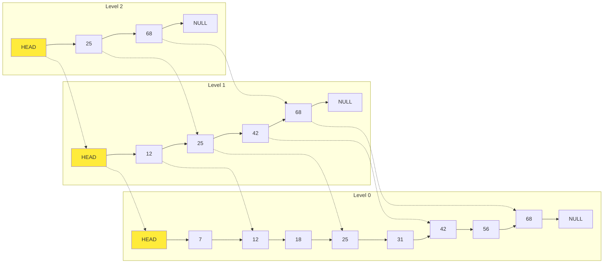
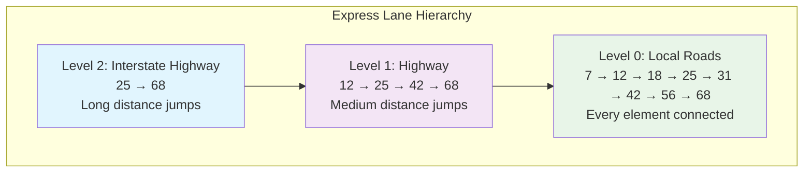
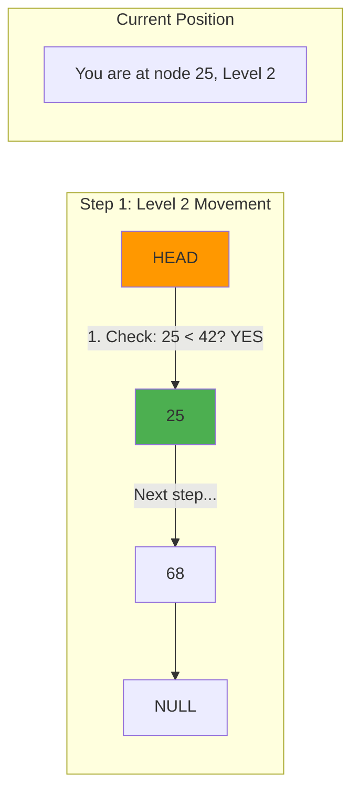
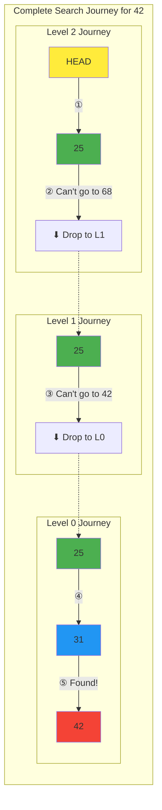
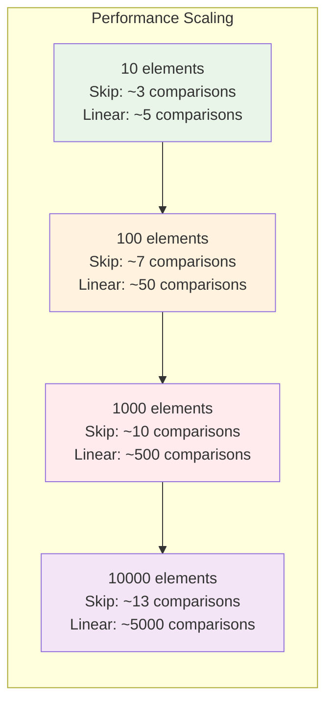

# Visualizing a Search: Following the Express Lanes

## The Setup: A Sample Skip List

Let's trace through a search operation on this skip list containing numbers 1, 7, 12, 18, 25, 31, 42, 56, 68:



We'll search for the value **42** and trace every step of the algorithm.

## Understanding the Structure

Before diving into the search, notice how this skip list is organized:



## The Search Algorithm

The skip list search follows a simple pattern:
1. **Start at the highest level** of the head node
2. **Move right** as long as the next value is less than the target  
3. **When you can't go right**, drop down one level
4. **Repeat** until you reach Level 0
5. **Check the next node** at Level 0 for your target

## Step-by-Step Search for 42

### Initial State
```
Target: 42
Current position: HEAD
Current level: 2 (highest level)

Level 2:  HEAD -------→ 25 -------→ 68 -------→ NULL
          ↑ You are here
Level 1:  HEAD ----→ 12 → 25 ----→ 42 → 68 ----→ NULL  
Level 0:  HEAD → 7 → 12 → 18 → 25 → 31 → 42 → 56 → 68 → NULL
```

### Step 1: Level 2 Traversal
**Question**: Can we move right from HEAD at Level 2?
- Next node: 25
- Is 25 < 42? **Yes!**
- **Action**: Move right to node 25



### Step 2: Continue Level 2 Traversal
**Question**: Can we move right from 25 at Level 2?
- Next node: 68
- Is 68 < 42? **No!** (68 ≥ 42)
- **Action**: Cannot move right, drop down to Level 1

```
Level 2:  HEAD -------→ 25 -------→ 68 -------→ NULL
                        ↓
Level 1:  HEAD ----→ 12 → 25 ----→ 42 → 68 ----→ NULL  
                        ↑ You are here now
Level 0:  HEAD → 7 → 12 → 18 → 25 → 31 → 42 → 56 → 68 → NULL
```

### Step 3: Level 1 Traversal
**Question**: Can we move right from 25 at Level 1?
- Next node: 42
- Is 42 < 42? **No!** (42 = 42, not strictly less)
- **Action**: Cannot move right, drop down to Level 0

```
Level 2:  HEAD -------→ 25 -------→ 68 -------→ NULL
Level 1:  HEAD ----→ 12 → 25 ----→ 42 → 68 ----→ NULL  
                        ↓
Level 0:  HEAD → 7 → 12 → 18 → 25 → 31 → 42 → 56 → 68 → NULL
                              ↑ You are here now
```

### Step 4: Level 0 Final Check
**Question**: What's the next node from 25 at Level 0?
- Next node: 31
- Is 31 < 42? **Yes!**
- **Action**: Move right to node 31

```
Level 2:  HEAD -------→ 25 -------→ 68 -------→ NULL
Level 1:  HEAD ----→ 12 → 25 ----→ 42 → 68 ----→ NULL  
Level 0:  HEAD → 7 → 12 → 18 → 25 → 31 → 42 → 56 → 68 → NULL
                                   ↑ You are here
```

### Step 5: Continue Level 0 Traversal
**Question**: Can we move right from 31 at Level 0?
- Next node: 42
- Is 42 < 42? **No!** (42 = 42)
- **Action**: Cannot move right, search is complete

### Step 6: Target Check
**Question**: Does the next node contain our target?
- Current position: 31
- Next node at Level 0: 42
- Does 42 equal our target 42? **Yes!**
- **Result**: Found!

## Visual Summary of the Search Path



**Path taken**: HEAD(L2) → 25(L2) → 25(L1) → 25(L0) → 31(L0) → Found 42!  
**Total comparisons**: 5

## Comparison with Linear Search


**Performance Comparison**:
- **Skip list**: 5 comparisons (17% fewer)
- **Linear search**: 6 comparisons

**Scaling Impact**:


## Searching for a Non-Existent Element

Let's search for **35** (which doesn't exist):

### The Search Path
```
Target: 35

Level 2:  HEAD -------→ 25 -------→ 68 -------→ NULL
           ①           ②

Level 1:  HEAD ----→ 12 → 25 ----→ 42 → 68 ----→ NULL  
                        ③

Level 0:  HEAD → 7 → 12 → 18 → 25 → 31 → 42 → 56 → 68 → NULL
                              ④    ⑤

Path: HEAD(L2) → 25(L2) → 25(L1) → 25(L0) → 31(L0)
```

### The Final Check
- Current position: 31
- Next node: 42
- Is 42 = 35? **No!**
- **Result**: Not found (would be inserted between 31 and 42)

## Interactive Visualization Algorithm

Here's how you can trace any search:

```python
def visualize_search(skip_list, target):
    current = skip_list.head
    path = []
    
    for level in range(skip_list.max_level, -1, -1):
        print(f"\n--- Level {level} ---")
        
        while (current.forward[level] and 
               current.forward[level].value < target):
            
            next_node = current.forward[level]
            print(f"Move: {current.value} → {next_node.value} (Level {level})")
            current = next_node
            path.append((current.value, level))
        
        print(f"Cannot move right at Level {level}, dropping down...")
    
    # Final check
    next_node = current.forward[0]
    if next_node and next_node.value == target:
        print(f"\n✓ Found {target}!")
        path.append((target, 0))
    else:
        print(f"\n✗ {target} not found")
        if next_node:
            print(f"Would be inserted between {current.value} and {next_node.value}")
    
    return path
```

## Key Insights from Visualization

### 1. Express Lane Benefits
Higher levels provide **long-distance shortcuts**:
- Level 2: Jumps of 25+ elements
- Level 1: Jumps of 12+ elements  
- Level 0: Single-element steps

### 2. Graceful Degradation
When express lanes end, you **gracefully drop down** to slower lanes rather than starting over.

### 3. Predictable Performance
The search always:
- Makes **at most 2 comparisons per level** (expected)
- Visits **at most log(n) levels**
- Results in **O(log n) total comparisons**

### 4. Insertion Point Discovery
Failed searches **automatically discover** where an element should be inserted—no additional work needed.

### 5. Cache-Friendly Access
The search pattern has good **spatial locality**:
- Multiple accesses to the same node (different levels)
- Sequential access at Level 0
- Predictable memory access patterns

## Building Intuition

After visualizing several searches, you'll notice:

1. **Most time is spent at Level 0** (the final approach)
2. **Higher levels quickly eliminate large regions** of the search space
3. **The algorithm naturally adapts** to the random structure
4. **Performance is consistent** regardless of the specific element distribution

This visualization demonstrates why skip lists are so effective: they provide **deterministic search performance** despite their **randomized construction**. The express lane metaphor isn't just a helpful analogy—it's exactly how the algorithm works in practice.