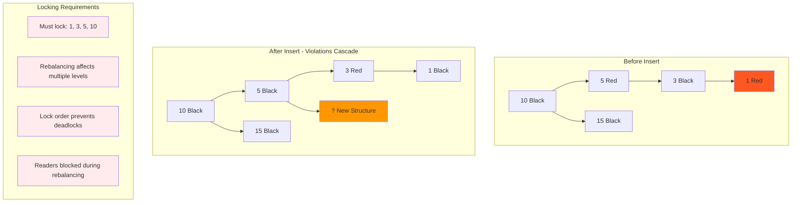
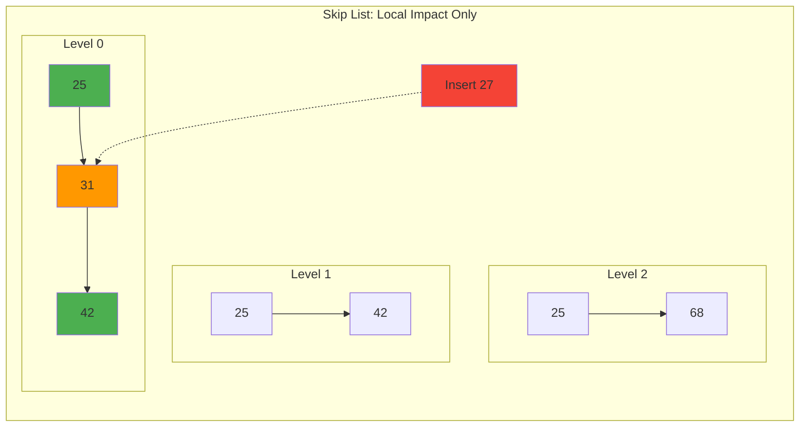
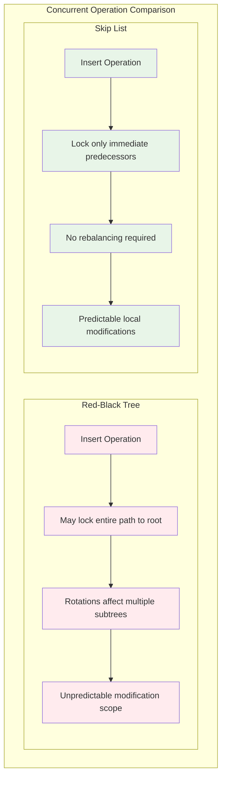

# Deep Dive: Why Skip Lists Excel in Concurrent Systems

## The Concurrency Challenge

Building fast, correct concurrent data structures is one of the hardest problems in systems programming. Traditional balanced trees (Red-Black, AVL) become **significantly more complex** when multiple threads need simultaneous access.

Skip lists shine in concurrent environments because their **probabilistic structure** and **localized modifications** make them much easier to parallelize effectively.

## The Traditional Tree Concurrency Problem

### Complex Locking Requirements

Consider inserting into a Red-Black tree with multiple threads:

```
Thread A: Insert 15
Thread B: Delete 18  
Thread C: Search for 25
Thread D: Insert 22

Red-Black Tree Challenges:
1. Rotations can affect multiple subtrees
2. Rebalancing may propagate to the root
3. Lock ordering prevents deadlocks but kills performance
4. Readers block during structural changes
```

### Lock Granularity Dilemma

**Coarse-grained locking** (entire tree):
```rust
// Simple but terrible for performance
let tree = Arc<Mutex<RedBlackTree>>;

// Only one operation at a time across entire tree
let mut tree = tree.lock().unwrap();
tree.insert(42);
```

**Fine-grained locking** (per-node):
```rust
// Complex deadlock-prone implementation
fn insert(&self, value: T) {
    // Must lock nodes in consistent order
    // Rotations require locking multiple nodes
    // Rebalancing may cascade arbitrarily far
    // Extremely difficult to get right
}
```

### The Rebalancing Cascade Problem

Red-Black tree insertion can trigger cascading rebalancing:



**Concurrency killer**: Long lock chains and unpredictable modification scope.

## Skip Lists: A Different Approach

### Localized Modifications

Skip list operations affect only **local regions**:



**Key insight**: Inserting 27 only affects the **immediate neighbors** (25 and 31), not distant parts of the structure.



Only nodes 25 and 31 need modification!
```

**Key insight**: Insertions have **bounded impact**—no cascading structural changes.

### Probabilistic Promotion Advantages

The randomized level assignment means:
- **No deterministic rebalancing** required
- **No global tree restructuring**
- **Independent node modifications**
- **Naturally distributed hotspots**

## Real-World Success: Redis

**Redis** uses skip lists for sorted sets instead of balanced trees. Here's why:

### Redis Sorted Set Operations
```redis
ZADD leaderboard 1000 "alice" 1500 "bob" 2000 "carol"
ZRANGE leaderboard 0 10    # Top 10 players
ZRANK leaderboard "alice"  # Find alice's rank
```

### Skip List Benefits in Redis

1. **Simpler Implementation**
   - ~200 lines of C code vs ~1000+ for balanced trees
   - Fewer edge cases and corner conditions
   - Easier to debug and maintain

2. **Better Concurrent Performance**
   - Redis is single-threaded, but skip lists enable future parallelization
   - Lock-free algorithms are much easier to implement
   - Better performance predictability

3. **Memory Efficiency**
   - No balancing metadata (colors, heights)
   - Simpler node structure
   - Better cache locality

## Lock-Free Skip List Implementation

Skip lists enable **lock-free concurrent algorithms** that are impractical with balanced trees:

### The Lock-Free Search
```rust
// Search never modifies structure - naturally lock-free
fn search(&self, target: i32) -> bool {
    let mut current = &self.head;
    
    for level in (0..=self.max_level).rev() {
        while let Some(next) = &current.forward[level] {
            match next.value.cmp(&target) {
                Ordering::Less => current = next,
                Ordering::Equal => return true,
                Ordering::Greater => break,
            }
        }
    }
    false
}
```

**No locks needed**: Readers never interfere with each other.

### Compare-and-Swap Insertion
```rust
use std::sync::atomic::{AtomicPtr, Ordering};

struct LockFreeNode {
    value: i32,
    forward: Vec<AtomicPtr<LockFreeNode>>,
}

fn insert(&self, value: i32) -> bool {
    // 1. Find insertion point (lock-free search)
    let update = self.find_update_path(value);
    
    // 2. Create new node with random levels
    let new_level = self.random_level();
    let new_node = Box::new(LockFreeNode::new(value, new_level));
    let new_node_ptr = Box::into_raw(new_node);
    
    // 3. Link using compare-and-swap
    for level in 0..=new_level {
        loop {
            let next = update[level].forward[level].load(Ordering::Acquire);
            unsafe {
                (*new_node_ptr).forward[level].store(next, Ordering::Relaxed);
            }
            
            // Atomic link: only succeeds if no other thread modified this pointer
            if update[level].forward[level]
                .compare_exchange_weak(
                    next, 
                    new_node_ptr, 
                    Ordering::Release, 
                    Ordering::Relaxed
                ).is_ok() {
                break; // Successfully linked at this level
            }
            // Retry if another thread modified the pointer
        }
    }
    true
}
```

**Key advantages**:
- **No locks** needed for correctness
- **Automatic retry** on conflicts
- **Non-blocking** for readers
- **Scales with cores**

## Performance Comparison: Skip Lists vs B+ Trees

### MemSQL/SingleStore Case Study

**SingleStore** (formerly MemSQL) experimented with both B+ trees and skip lists:

```
Workload: 80% reads, 20% writes, high concurrency

B+ Tree (fine-grained locking):
- Complex lock management
- Lock contention on internal nodes  
- Unpredictable latency spikes
- Difficult to debug deadlocks

Skip List (lock-free):
- Consistent sub-millisecond latency
- Linear scalability with cores
- Predictable performance
- Simpler codebase
```

**Result**: Skip lists provided **2-3x better throughput** under high concurrency.

## Why Lock-Free Skip Lists Work

### 1. Monotonic Search Paths
Search paths are **never invalidated** by concurrent modifications:
```
Thread A searching for 25 while Thread B inserts 30:
- Thread A's path remains valid
- No need to restart or acquire locks
- Insertion doesn't affect existing searches
```

### 2. Independent Level Operations
Each level can be modified independently:
```
Thread A: Modifying Level 0 pointer
Thread B: Modifying Level 2 pointer
↓
No conflict possible - different memory locations
```

### 3. Natural Retry Boundaries
Compare-and-swap failures have **bounded retry cost**:
```
CAS failure at Level k:
- Retry only affects Level k
- Other levels remain successfully linked
- Bounded work per retry
```

## Memory Ordering Considerations

Lock-free skip lists require careful attention to **memory ordering**:

### Acquisition-Release Pattern
```rust
// Writer (Insert)
new_node.next.store(current_next, Ordering::Relaxed);  // 1
current.next.store(new_node, Ordering::Release);       // 2

// Reader (Search)  
let next = current.next.load(Ordering::Acquire);       // 3
if let Some(node) = next {
    let value = node.value;  // 4 - guaranteed to see updated value
}
```

**Guarantee**: Acquire-release ensures that when a reader sees the new link (3), it also sees all writes that happened before the release (1).

### ABA Problem Prevention
Skip lists are naturally **ABA-resistant**:
```
Problem scenario:
1. Thread A reads pointer P → Node X
2. Thread B: Remove X, add Y, remove Y, add X back  
3. Thread A: CAS succeeds but X is different!

Skip list protection:
- Nodes are rarely reused immediately
- Multiple level pointers make ABA extremely unlikely
- Memory reclamation delays (epochs/hazard pointers)
```

## Practical Considerations

### When to Choose Skip Lists Over Trees

**Choose skip lists when**:
- **High read/write concurrency** required
- **Predictable latency** is important
- **Implementation simplicity** matters
- **Lock-free performance** is needed

**Choose balanced trees when**:
- **Worst-case guarantees** required
- **Memory is extremely constrained**
- **Single-threaded performance** is paramount
- **Deterministic behavior** is critical

### Production Implementation Tips

1. **Use epochs for memory reclamation**:
```rust
// Prevent ABA problems and use-after-free
struct EpochGuard { /* ... */ }

fn search_with_epoch(&self, target: i32) -> bool {
    let _guard = self.epoch.enter();
    // Safe to access nodes during this epoch
    self.search_impl(target)
}
```

2. **Tune promotion probability**:
```rust
// p=0.5: Good default balance
// p=0.25: Fewer pointers, more cache-friendly
// p=0.75: Faster search, more memory usage
const PROMOTION_PROBABILITY: f64 = 0.5;
```

3. **Implement backoff strategies**:
```rust
fn insert_with_backoff(&self, value: i32) -> bool {
    let mut backoff = 1;
    loop {
        if self.try_insert(value) {
            return true;
        }
        // Exponential backoff on contention
        thread::sleep(Duration::from_nanos(backoff));
        backoff = min(backoff * 2, 1000);
    }
}
```

## The Bottom Line

Skip lists succeed in concurrent systems because they **embrace uncertainty** rather than fighting it. Instead of maintaining perfect balance through complex protocols, they use **randomization to achieve good expected performance** with **simple, parallelizable algorithms**.

This makes them ideal for:
- **Database indexes** (Redis, MemSQL)
- **Memory allocators** (some implementations)
- **Network protocols** (some P2P systems)
- **Real-time systems** (predictable performance)

The lesson: Sometimes the **probabilistically good** solution is better than the **deterministically perfect** one, especially when concurrency is involved.