# The Core Problem: Finding Needles in Haystacks

## Why Order Matters

Imagine walking into a library where books are scattered randomly across shelves. You're looking for "The Art of Computer Programming" by Donald Knuth. Without any organizational system, you'd have to examine every single book until you find it. In the worst case, it might be the very last book you check.

This is exactly the problem unordered data presents in computer science.

## The Fundamental Challenge

**The problem:** Given a collection of data, how do we arrange it so that finding specific elements becomes efficient?

Consider these scenarios:
- A database with millions of customer records needs to find a specific customer by ID
- A search engine must locate web pages containing specific keywords
- A video game needs to render objects in the correct visual order
- A task scheduler must prioritize jobs by deadline

In each case, the raw data starts in some arbitrary order. Without systematic arrangement, searching becomes a linear scan—examining every element until we find what we're looking for.

## The Cost of Chaos

```mermaid
flowchart TD
    A["🔍 Unordered Data"] --> B["Linear Search: O(n)"]
    A --> C["❌ No Pattern Recognition"]
    A --> D["❌ Inefficient Range Queries"]
    A --> E["❌ Expensive Duplicate Detection"]
    
    F["📊 Ordered Data"] --> G["Binary Search: O(log n)"]
    F --> H["✅ Easy Pattern Recognition"]
    F --> I["✅ Fast Range Queries"]
    F --> J["✅ Simple Duplicate Detection"]
    
    style A fill:#FF6B6B
    style F fill:#4ECDC4
    style B fill:#FFE66D
    style C fill:#FFE66D
    style D fill:#FFE66D
    style E fill:#FFE66D
    style G fill:#95E1D3
    style H fill:#95E1D3
    style I fill:#95E1D3
    style J fill:#95E1D3
```



When data is unordered:
- **Search time grows linearly**: For n items, we might need to check all n items
- **Pattern recognition becomes impossible**: We can't spot trends or relationships
- **Range queries are inefficient**: Finding all items within a specific range requires checking everything
- **Duplicate detection is expensive**: We must compare each item against all others

## The Dictionary Analogy

Think of a dictionary with words arranged alphabetically versus one with words in random order:

```mermaid
flowchart LR
    subgraph "Random Order Dictionary"
        A1["zebra"]
        A2["apple"]
        A3["computer"]
        A4["banana"]
        A5["dog"]
        A6["elephant"]
        A7["..."]
        
        A1 --> A2 --> A3 --> A4 --> A5 --> A6 --> A7
        
        A8["🔍 To find 'computer':<br/>Check every word<br/>Time: O(n)"]
    end
    
    subgraph "Alphabetical Dictionary"
        B1["apple"]
        B2["banana"]
        B3["computer"]
        B4["dog"]
        B5["elephant"]
        B6["zebra"]
        
        B1 --> B2 --> B3 --> B4 --> B5 --> B6
        
        B7["🚀 To find 'computer':<br/>Jump to 'C' section<br/>Time: O(log n)"]
    end
    
    style A1 fill:#FFB6C1
    style A2 fill:#FFB6C1
    style A3 fill:#90EE90
    style A4 fill:#FFB6C1
    style A5 fill:#FFB6C1
    style A6 fill:#FFB6C1
    style A8 fill:#FFA07A
    
    style B1 fill:#87CEEB
    style B2 fill:#87CEEB
    style B3 fill:#90EE90
    style B4 fill:#87CEEB
    style B5 fill:#87CEEB
    style B6 fill:#87CEEB
    style B7 fill:#98FB98
```



**Random Order Dictionary:**
```
zebra, apple, computer, banana, dog, elephant...
```
To find "computer," you'd scan through every word until you locate it.

**Alphabetical Dictionary:**
```
apple, banana, computer, dog, elephant, zebra...
```
With alphabetical order, you can:
- Jump directly to the "C" section
- Stop searching once you pass where "computer" should be
- Use binary search to find words logarithmically faster

## The Promise of Sorting

Sorting transforms the fundamental nature of data interaction. With sorted data:
- **Search becomes logarithmic**: Instead of checking n items, we might only need to check log(n) items
- **Range queries become trivial**: All items between two values are grouped together
- **Patterns emerge**: Trends and outliers become visible
- **Algorithms become possible**: Many efficient algorithms require sorted input

Sorting isn't just about making data "neat"—it's about unlocking computational possibilities that are impossible with unordered data.

## What Makes Sorting Hard?

While the concept is simple, efficient sorting presents several challenges:

1. **The Comparison Problem**: How do we define "order" for complex data types?
2. **The Memory Problem**: Can we sort without using extra memory?
3. **The Stability Problem**: If two elements are equal, should their relative order be preserved?
4. **The Performance Problem**: How do we minimize the number of operations needed?

These challenges have led to dozens of sorting algorithms, each optimized for different scenarios and constraints.

## The Foundation for Everything Else

```mermaid
flowchart TD
    A["🎯 Sorted Data"] --> B["🔍 Binary Search<br/>O(log n) lookups"]
    A --> C["🔗 Merge Operations<br/>Efficient data combination"]
    A --> D["📊 Set Operations<br/>Union, intersection, difference"]
    A --> E["🗄️ Database Indexing<br/>Fast query processing"]
    A --> F["🗜️ Better Compression<br/>Data locality benefits"]
    
    B --> G["⚡ Fast Applications"]
    C --> G
    D --> G
    E --> G
    F --> G
    
    style A fill:#FFD700
    style B fill:#87CEEB
    style C fill:#87CEEB
    style D fill:#87CEEB
    style E fill:#87CEEB
    style F fill:#87CEEB
    style G fill:#90EE90
```



Sorting is the foundation that enables:
- **Binary search**: The gold standard for finding elements in sorted arrays
- **Merge operations**: Efficiently combining two sorted datasets
- **Set operations**: Union, intersection, and difference become straightforward
- **Database indexing**: Most database indexes rely on sorted structures
- **Compression**: Sorted data often compresses better due to locality

**The transformation principle**: Understanding sorting deeply means understanding how to transform chaos into order—and how that transformation unlocks the full potential of our data.