# The Guiding Philosophy: Compare and Swap

## The Universal Pattern

At its heart, every sorting algorithm follows the same fundamental philosophy: **compare elements and rearrange them based on the comparison result**. This simple concept—compare and swap—forms the backbone of all sorting strategies.

Think of it like organizing a deck of playing cards. You pick up two cards, compare their values, and decide which should come first. You repeat this process systematically until the entire deck is ordered.

## The Comparison Function: The Heart of Order

Every sorting operation relies on a **comparison function**—a rule that determines the relative order of any two elements.

For numbers, this is straightforward:
```
compare(a, b):
    if a < b: return -1    // a comes before b
    if a > b: return 1     // a comes after b
    if a = b: return 0     // a and b are equal
```

But comparison functions can define any ordering:
- **Alphabetical**: Sort strings lexicographically
- **Chronological**: Sort events by timestamp
- **Priority-based**: Sort tasks by importance
- **Custom criteria**: Sort people by age, then by name

## The Three Fundamental Strategies

While there are many sorting algorithms, they all follow one of three core strategies:

```mermaid
flowchart TD
    subgraph "Selection Strategy: 'Find the Next Best'"
        A1["🎯 Find minimum element"]
        A2["🔄 Place at beginning"]
        A3["🔁 Repeat for rest"]
        A1 --> A2 --> A3
    end
    
    subgraph "Exchange Strategy: 'Bubble the Best'"
        B1["🔄 Compare adjacent elements"]
        B2["↔️ Swap if out of order"]
        B3["🔁 Repeat until no swaps"]
        B1 --> B2 --> B3
    end
    
    subgraph "Insertion Strategy: 'Find the Right Place'"
        C1["📍 Take next element"]
        C2["🔍 Find correct position"]
        C3["⬅️ Insert and shift others"]
        C1 --> C2 --> C3
    end
    
    style A1 fill:#FFB6C1
    style A2 fill:#FFB6C1
    style A3 fill:#FFB6C1
    style B1 fill:#87CEEB
    style B2 fill:#87CEEB
    style B3 fill:#87CEEB
    style C1 fill:#90EE90
    style C2 fill:#90EE90
    style C3 fill:#90EE90
```



### 1. Selection Strategy: "Find the Next Best"
- **Philosophy**: Repeatedly find the smallest (or largest) remaining element
- **Mental model**: Like organizing cards by always picking the lowest card from your hand
- **Examples**: Selection Sort, Heap Sort
- **Trade-off**: Simple to understand but often inefficient

### 2. Exchange Strategy: "Bubble the Best"
- **Philosophy**: Repeatedly swap adjacent elements that are out of order
- **Mental model**: Like bubbles rising to the surface—larger elements "bubble up"
- **Examples**: Bubble Sort, Quick Sort
- **Trade-off**: Can be efficient but may require many swaps

### 3. Insertion Strategy: "Find the Right Place"
- **Philosophy**: Take each element and insert it into its correct position
- **Mental model**: Like organizing cards by inserting each new card into the right spot in your sorted hand
- **Examples**: Insertion Sort, Merge Sort
- **Trade-off**: Efficient for nearly-sorted data but may require shifting

## The Divide and Conquer Revolution

The most efficient sorting algorithms embrace a powerful philosophy: **divide and conquer**.

```mermaid
flowchart TD
    A["Original Array: 8 elements"] --> B["Divide: 2 groups of 4"]
    B --> C["Divide: 4 groups of 2"]
    C --> D["Divide: 8 groups of 1"]
    D --> E["Conquer: Groups of 1 are sorted"]
    E --> F["Combine: Merge groups of 2"]
    F --> G["Combine: Merge groups of 4"]
    G --> H["Combine: Merge final groups"]
    H --> I["Result: Sorted array"]
    
    subgraph "Performance Impact"
        J["O(n²) → O(n log n)"]
        K["1000x speedup for large data!"]
    end
    
    A -.-> J
    I -.-> K
    
    style A fill:#FFB6C1
    style I fill:#90EE90
    style J fill:#FFD700
    style K fill:#87CEEB
```



Instead of trying to sort all elements at once, break the problem down:
1. **Divide**: Split the data into smaller pieces
2. **Conquer**: Sort each piece independently
3. **Combine**: Merge the sorted pieces back together

This approach transforms sorting from an O(n²) problem to an O(n log n) problem—a dramatic improvement for large datasets.

### The Recursive Insight

Consider sorting 8 elements:
- Sorting 8 elements directly requires many comparisons
- But if you split into two groups of 4, sort each group, then merge them...
- Each group of 4 can be split into groups of 2...
- Each group of 2 can be split into groups of 1...
- Groups of 1 are already sorted!

This recursive decomposition is why algorithms like Merge Sort and Quick Sort are so efficient.

## The Stability Principle

A crucial philosophical question: If two elements are equal, should their original relative order be preserved?

**Stable sorting** preserves the relative order of equal elements:
```
Original:  [(Alice, 25), (Bob, 30), (Charlie, 25)]
Sort by age (stable):  [(Alice, 25), (Charlie, 25), (Bob, 30)]
```

**Unstable sorting** may change the relative order:
```
Sort by age (unstable):  [(Charlie, 25), (Alice, 25), (Bob, 30)]
```

**Why stability matters:**
- When sorting by multiple criteria (sort by age, then by name)
- When preserving original input order is semantically important
- When building upon previous sorting operations

## The Space vs. Time Trade-off

Sorting algorithms make a fundamental trade-off between memory usage and execution time:


**In-place sorting**:
- Uses only O(1) additional memory
- Modifies the original array
- Examples: Quick Sort, Heap Sort
- Trade-off: Memory efficient but may be slower or less stable

**Out-of-place sorting**:
- Uses O(n) additional memory
- Creates a new sorted array
- Examples: Merge Sort, Counting Sort
- Trade-off: Faster or more stable but uses more memory

## The Adaptivity Insight

Some sorting algorithms adapt to the characteristics of their input:


**Adaptive algorithms** perform better when data is already partially sorted:
- Insertion Sort: O(n) for nearly sorted data, O(n²) for random data
- Timsort: Detects runs of sorted data and merges them efficiently

**Non-adaptive algorithms** perform the same regardless of input order:
- Heap Sort: Always O(n log n), whether data is sorted or random
- Merge Sort: Consistent performance but doesn't exploit existing order

## The Philosophy in Practice

Understanding these philosophical principles helps you choose the right sorting algorithm:

- **Need guaranteed O(n log n) performance?** Choose Heap Sort or Merge Sort
- **Have limited memory?** Choose an in-place algorithm like Quick Sort
- **Data already partially sorted?** Choose an adaptive algorithm like Insertion Sort
- **Need stability?** Choose Merge Sort or stable variants
- **Sorting simple integers?** Consider non-comparison sorts like Counting Sort

The beauty of sorting lies not in memorizing algorithms, but in understanding these fundamental trade-offs and choosing the approach that best fits your constraints and requirements.

## Beyond Comparison: Alternative Philosophies

While comparison-based sorting is most common, alternative philosophies exist:

**Counting Sort**: Instead of comparing, count occurrences of each value
**Radix Sort**: Sort by individual digits or characters
**Bucket Sort**: Distribute elements into buckets, then sort each bucket

These algorithms can achieve O(n) performance under specific conditions, transcending the O(n log n) lower bound of comparison-based sorting.

The philosophy of "compare and swap" is powerful, but recognizing when to abandon it for alternative approaches is the mark of a mature programmer.