# Key Abstractions: The Building Blocks of Sorting

## The Comparison Function Abstraction

The **comparison function** is the most fundamental abstraction in sorting. It encapsulates the logic for determining order between any two elements.

### The Contract
```
compare(a, b) -> {-1, 0, 1}
```

This simple interface abstracts away the complexity of what "order" means for your specific data type. Whether you're sorting numbers, strings, dates, or complex objects, the comparison function provides a uniform interface.

### Properties of a Valid Comparison Function

A comparison function must satisfy three mathematical properties:

1. **Reflexivity**: `compare(a, a) = 0`
2. **Antisymmetry**: If `compare(a, b) < 0`, then `compare(b, a) > 0`
3. **Transitivity**: If `compare(a, b) < 0` and `compare(b, c) < 0`, then `compare(a, c) < 0`

Violating these properties can lead to undefined behavior or infinite loops in sorting algorithms.

### Custom Comparison Examples

```rust
// Sort people by age, then by name
fn compare_person(a: &Person, b: &Person) -> Ordering {
    match a.age.cmp(&b.age) {
        Ordering::Equal => a.name.cmp(&b.name),
        other => other,
    }
}

// Sort tasks by priority (high to low), then by deadline
fn compare_task(a: &Task, b: &Task) -> Ordering {
    match b.priority.cmp(&a.priority) { // Note: b.cmp(&a) for descending
        Ordering::Equal => a.deadline.cmp(&b.deadline),
        other => other,
    }
}
```

## In-Place vs. Out-of-Place Sorting

This abstraction captures how sorting algorithms manage memory.


### In-Place Sorting
**Definition**: Sorts the array using only O(1) additional memory (beyond the input array).

**Characteristics**:
- Modifies the original array
- Memory efficient
- Often faster due to cache locality
- May be less stable

**Examples**: Quick Sort, Heap Sort, Selection Sort

**Mental Model**: Rearranging books on a shelf without getting additional shelves.

### Out-of-Place Sorting
**Definition**: Uses O(n) additional memory to create a new sorted array.

**Characteristics**:
- Preserves the original array
- Uses more memory
- Often more stable
- Can be parallelized more easily

**Examples**: Merge Sort, Counting Sort, Radix Sort

**Mental Model**: Copying books to a new shelf in the correct order.

### The Trade-off
```
In-place:  Lower memory usage ↔ Potentially less stable/slower
Out-of-place: Higher memory usage ↔ More stable/parallelizable
```

## Stable vs. Unstable Sorting

This abstraction deals with how equal elements are handled.

### Stable Sorting
**Definition**: Preserves the relative order of elements that compare as equal.

**Example**:
```
Input:    [(Alice, 25), (Bob, 30), (Charlie, 25)]
Stable:   [(Alice, 25), (Charlie, 25), (Bob, 30)]
          // Alice comes before Charlie (preserved from input)
```

**Use Cases**:
- Multi-level sorting (sort by department, then by salary)
- When original order has semantic meaning
- Building stable database indexes

**Examples**: Merge Sort, Insertion Sort, Bubble Sort

### Unstable Sorting
**Definition**: May change the relative order of equal elements.

**Example**:
```
Input:    [(Alice, 25), (Bob, 30), (Charlie, 25)]
Unstable: [(Charlie, 25), (Alice, 25), (Bob, 30)]
          // Charlie might come before Alice
```

**Trade-offs**:
- Often faster or more memory-efficient
- Sufficient when only the sorting key matters
- Simpler implementation

**Examples**: Quick Sort, Heap Sort, Selection Sort

## Adaptive vs. Non-Adaptive Sorting

This abstraction captures how algorithms respond to input characteristics.

### Adaptive Sorting
**Definition**: Performance improves when input has existing order.

**Characteristics**:
- Best case: O(n) for already sorted data
- Worst case: Same as average case
- Exploits existing order in the input
- Performance varies based on input

**Example**: Insertion Sort
- Random data: O(n²)
- Nearly sorted data: O(n)
- Reverse sorted data: O(n²)

**Mental Model**: A smart organizer who recognizes when books are already mostly in order and only fixes the few out-of-place ones.

### Non-Adaptive Sorting
**Definition**: Performance is consistent regardless of input order.

**Characteristics**:
- Same performance for all inputs
- Predictable runtime
- Doesn't exploit existing order
- Often preferred for real-time systems

**Example**: Heap Sort
- Always O(n log n), whether data is sorted, random, or reverse sorted

**Mental Model**: A methodical organizer who follows the same process regardless of the initial state.

## Comparison-Based vs. Non-Comparison Sorting

This fundamental abstraction distinguishes how elements are ordered.

### Comparison-Based Sorting
**Definition**: Determines order by comparing pairs of elements.

**Characteristics**:
- Works with any data type that can be compared
- Lower bound of O(n log n) for average case
- General-purpose
- Most common approach

**Examples**: Quick Sort, Merge Sort, Heap Sort

**The Information Theory Limit**:
For n elements, there are n! possible permutations. To distinguish between them using binary comparisons requires log₂(n!) ≈ n log n comparisons.

### Non-Comparison Sorting
**Definition**: Determines order without directly comparing elements.

**Characteristics**:
- Can achieve O(n) performance
- Works only with specific data types
- Requires additional assumptions about the data
- Often uses auxiliary data structures

**Examples**:
- **Counting Sort**: For integers in a known range
- **Radix Sort**: For fixed-width data (integers, strings)
- **Bucket Sort**: For uniformly distributed data

**Mental Model**: Instead of comparing books, you sort them by placing each book directly into a labeled shelf based on its properties.

## The Divide-and-Conquer Abstraction

This meta-abstraction describes how complex sorting problems are decomposed.


### The Pattern
```
sort(array):
    if array.length <= 1:
        return array          // Base case
    
    left, right = divide(array)   // Split the problem
    sorted_left = sort(left)      // Solve subproblems
    sorted_right = sort(right)
    
    return combine(sorted_left, sorted_right)  // Merge solutions
```

### Variations
- **Merge Sort**: Split in half, merge by comparison
- **Quick Sort**: Partition around pivot, no merge needed
- **Heap Sort**: Build heap, repeatedly extract minimum

### The Recursive Insight
Each level of recursion reduces the problem size, creating a tree of subproblems. The total work across all levels determines the algorithm's complexity.

## The Partitioning Abstraction

**Definition**: Rearranging an array so that elements satisfying a condition come before those that don't.


This abstraction is central to Quick Sort and selection algorithms:

```
partition(array, condition):
    // Rearrange so all elements satisfying condition come first
    // Return the boundary index
```

**Example**: Partition around a pivot value
```
Before: [3, 7, 1, 9, 2, 8, 5]  (pivot = 5)
After:  [3, 1, 2, 5, 9, 8, 7]  (boundary at index 3)
```

## The Merge Abstraction

**Definition**: Combining two sorted sequences into one sorted sequence.

```rust
fn merge(left: &[i32], right: &[i32]) -> Vec<i32> {
    let mut result = Vec::new();
    let mut i = 0;
    let mut j = 0;
    
    while i < left.len() && j < right.len() {
        if left[i] <= right[j] {
            result.push(left[i]);
            i += 1;
        } else {
            result.push(right[j]);
            j += 1;
        }
    }
    
    // Add remaining elements
    result.extend_from_slice(&left[i..]);
    result.extend_from_slice(&right[j..]);
    
    result
}
```

**Key Properties**:
- Linear time: O(m + n) for arrays of size m and n
- Stable: Preserves relative order of equal elements
- Out-of-place: Requires additional memory

## Putting It All Together

```mermaid
flowchart TD
    A["🚀 Sorting Algorithm Design"] --> B["1. Comparison Strategy"]
    A --> C["2. Memory Usage"]
    A --> D["3. Stability Requirements"]
    A --> E["4. Adaptivity Needs"]
    A --> F["5. Core Approach"]
    A --> G["6. Decomposition Strategy"]
    
    B --> B1["How to define order?"]
    C --> C1["In-place vs out-of-place?"]
    D --> D1["Preserve equal element order?"]
    E --> E1["Exploit existing order?"]
    F --> F1["Comparison vs specialized?"]
    G --> G1["Divide-and-conquer vs iterative?"]
    
    B1 --> H["Algorithm Selection"]
    C1 --> H
    D1 --> H
    E1 --> H
    F1 --> H
    G1 --> H
    
    H --> I["✅ Optimal Performance"]
    H --> J["✅ Right Trade-offs"]
    H --> K["✅ Suitable Implementation"]
    
    style A fill:#FFD700
    style H fill:#87CEEB
    style I fill:#90EE90
    style J fill:#90EE90
    style K fill:#90EE90
```



These abstractions form a toolkit for understanding and designing sorting algorithms:

1. **Choose your comparison strategy**: How will you define order?
2. **Decide on memory usage**: In-place or out-of-place?
3. **Consider stability requirements**: Must equal elements maintain order?
4. **Evaluate adaptivity needs**: Should you exploit existing order?
5. **Select the core approach**: Comparison-based or specialized?
6. **Pick a decomposition strategy**: Divide-and-conquer or iterative?

**Understanding these abstractions allows you to**:
- **Analyze trade-offs** between different sorting algorithms
- **Choose the right algorithm** for your specific constraints
- **Design custom solutions** when standard algorithms don't fit
- **Optimize performance** by selecting the most appropriate approach

Each abstraction represents a design decision that affects performance, memory usage, stability, and implementation complexity. Mastering these concepts is the key to becoming proficient with sorting algorithms.