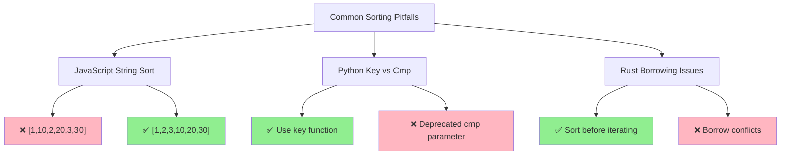

# Getting Started: Your First Sorting Operations

## Prerequisites

- Basic programming knowledge in any language
- Understanding of arrays/lists
- Familiarity with function calls

This guide provides practical examples in multiple languages to get you sorting data immediately.

## Quick Win: Sorting Numbers

Let's start with the most common sorting task—arranging numbers in ascending order.

### Python
```python
# Built-in sorted() function (creates new list)
numbers = [64, 34, 25, 12, 22, 11, 90]
sorted_numbers = sorted(numbers)
print(sorted_numbers)  # [11, 12, 22, 25, 34, 64, 90]

# In-place sorting with list.sort()
numbers = [64, 34, 25, 12, 22, 11, 90]
numbers.sort()
print(numbers)  # [11, 12, 22, 25, 34, 64, 90]

# Descending order
numbers = [64, 34, 25, 12, 22, 11, 90]
sorted_desc = sorted(numbers, reverse=True)
print(sorted_desc)  # [90, 64, 34, 25, 22, 12, 11]
```

### JavaScript
```javascript
// Built-in sort() method (modifies original array)
let numbers = [64, 34, 25, 12, 22, 11, 90];
numbers.sort((a, b) => a - b);  // Ascending
console.log(numbers);  // [11, 12, 22, 25, 34, 64, 90]

// Create new sorted array
let originalNumbers = [64, 34, 25, 12, 22, 11, 90];
let sortedNumbers = [...originalNumbers].sort((a, b) => a - b);
console.log(sortedNumbers);  // [11, 12, 22, 25, 34, 64, 90]

// Descending order
numbers.sort((a, b) => b - a);
console.log(numbers);  // [90, 64, 34, 25, 22, 12, 11]
```

### Rust
```rust
fn main() {
    // Built-in sort() method (modifies original vector)
    let mut numbers = vec![64, 34, 25, 12, 22, 11, 90];
    numbers.sort();
    println!("{:?}", numbers);  // [11, 12, 22, 25, 34, 64, 90]
    
    // Create new sorted vector
    let original_numbers = vec![64, 34, 25, 12, 22, 11, 90];
    let mut sorted_numbers = original_numbers.clone();
    sorted_numbers.sort();
    println!("{:?}", sorted_numbers);  // [11, 12, 22, 25, 34, 64, 90]
    
    // Descending order
    let mut numbers = vec![64, 34, 25, 12, 22, 11, 90];
    numbers.sort_by(|a, b| b.cmp(a));
    println!("{:?}", numbers);  // [90, 64, 34, 25, 22, 12, 11]
}
```

### Go
```go
package main

import (
    "fmt"
    "sort"
)

func main() {
    // Built-in sort for integers
    numbers := []int{64, 34, 25, 12, 22, 11, 90}
    sort.Ints(numbers)
    fmt.Println(numbers)  // [11 12 22 25 34 64 90]
    
    // Descending order
    numbers = []int{64, 34, 25, 12, 22, 11, 90}
    sort.Sort(sort.Reverse(sort.IntSlice(numbers)))
    fmt.Println(numbers)  // [90 64 34 25 22 12 11]
}
```

## Sorting Strings

Strings are sorted lexicographically (dictionary order) by default.

### Python
```python
# Sorting words
words = ["banana", "apple", "cherry", "date"]
sorted_words = sorted(words)
print(sorted_words)  # ['apple', 'banana', 'cherry', 'date']

# Case-insensitive sorting
words = ["Banana", "apple", "Cherry", "date"]
sorted_words = sorted(words, key=str.lower)
print(sorted_words)  # ['apple', 'Banana', 'Cherry', 'date']
```

### JavaScript
```javascript
// Sorting words
let words = ["banana", "apple", "cherry", "date"];
words.sort();
console.log(words);  // ['apple', 'banana', 'cherry', 'date']

// Case-insensitive sorting
words = ["Banana", "apple", "Cherry", "date"];
words.sort((a, b) => a.toLowerCase().localeCompare(b.toLowerCase()));
console.log(words);  // ['apple', 'Banana', 'Cherry', 'date']
```

### Rust
```rust
fn main() {
    // Sorting strings
    let mut words = vec!["banana", "apple", "cherry", "date"];
    words.sort();
    println!("{:?}", words);  // ["apple", "banana", "cherry", "date"]
    
    // Case-insensitive sorting
    let mut words = vec!["Banana", "apple", "Cherry", "date"];
    words.sort_by(|a, b| a.to_lowercase().cmp(&b.to_lowercase()));
    println!("{:?}", words);  // ["apple", "Banana", "Cherry", "date"]
}
```

## Sorting Objects

Real-world data often involves sorting complex objects by specific properties.

### Python
```python
# Sorting people by age
from dataclasses import dataclass

@dataclass
class Person:
    name: str
    age: int
    
people = [
    Person("Alice", 30),
    Person("Bob", 25),
    Person("Charlie", 35)
]

# Sort by age
people_by_age = sorted(people, key=lambda p: p.age)
for person in people_by_age:
    print(f"{person.name}: {person.age}")
# Bob: 25
# Alice: 30
# Charlie: 35

# Sort by multiple criteria (age, then name)
people_by_age_name = sorted(people, key=lambda p: (p.age, p.name))
```

### JavaScript
```javascript
// Sorting people by age
const people = [
    { name: "Alice", age: 30 },
    { name: "Bob", age: 25 },
    { name: "Charlie", age: 35 }
];

// Sort by age
people.sort((a, b) => a.age - b.age);
console.log(people);
// [{ name: "Bob", age: 25 }, { name: "Alice", age: 30 }, { name: "Charlie", age: 35 }]

// Sort by multiple criteria (age, then name)
people.sort((a, b) => {
    if (a.age !== b.age) {
        return a.age - b.age;
    }
    return a.name.localeCompare(b.name);
});
```

### Rust
```rust
#[derive(Debug, Clone)]
struct Person {
    name: String,
    age: u32,
}

fn main() {
    let mut people = vec![
        Person { name: "Alice".to_string(), age: 30 },
        Person { name: "Bob".to_string(), age: 25 },
        Person { name: "Charlie".to_string(), age: 35 },
    ];
    
    // Sort by age
    people.sort_by(|a, b| a.age.cmp(&b.age));
    println!("{:?}", people);
    
    // Sort by multiple criteria (age, then name)
    people.sort_by(|a, b| {
        match a.age.cmp(&b.age) {
            std::cmp::Ordering::Equal => a.name.cmp(&b.name),
            other => other,
        }
    });
}
```

## Performance Testing: Measuring Sort Speed

Let's measure how sorting performance scales with data size.

```mermaid
gantt
    title Sorting Performance by Array Size
    dateFormat X
    axisFormat %L ms
    
    section Small (1K elements)
    Built-in Sort :0, 1
    
    section Medium (10K elements)
    Built-in Sort :0, 10
    
    section Large (100K elements)
    Built-in Sort :0, 100
    
    section Very Large (1M elements)
    Built-in Sort :0, 1000
```



### Python
```python
import time
import random

def measure_sort_time(size):
    # Generate random data
    data = [random.randint(1, 1000000) for _ in range(size)]
    
    # Measure sorting time
    start_time = time.time()
    sorted(data)
    end_time = time.time()
    
    return end_time - start_time

# Test different sizes
sizes = [1000, 10000, 100000, 1000000]
for size in sizes:
    time_taken = measure_sort_time(size)
    print(f"Sorting {size:,} elements took {time_taken:.4f} seconds")
```

### JavaScript
```javascript
function measureSortTime(size) {
    // Generate random data
    const data = Array.from({ length: size }, () => Math.floor(Math.random() * 1000000));
    
    // Measure sorting time
    const startTime = performance.now();
    data.sort((a, b) => a - b);
    const endTime = performance.now();
    
    return endTime - startTime;
}

// Test different sizes
const sizes = [1000, 10000, 100000, 1000000];
sizes.forEach(size => {
    const timeTaken = measureSortTime(size);
    console.log(`Sorting ${size.toLocaleString()} elements took ${timeTaken.toFixed(4)} ms`);
});
```

## Common Pitfalls and Solutions



### JavaScript Number Sorting Gotcha
```javascript
// WRONG: This sorts numbers as strings!
let numbers = [1, 10, 2, 20, 3, 30];
numbers.sort();
console.log(numbers);  // [1, 10, 2, 20, 3, 30] - Unexpected!

// CORRECT: Provide a comparison function
numbers.sort((a, b) => a - b);
console.log(numbers);  // [1, 2, 3, 10, 20, 30] - Correct!
```

### Python Key Function vs. Comparison Function
```python
# PREFERRED: Use key function (faster)
people.sort(key=lambda p: p.age)

# DEPRECATED: Using cmp parameter (Python 2 style)
# Don't do this in modern Python
```

### Rust Borrowing Issues
```rust
// WRONG: Can't borrow as mutable while iterating
// for person in &people {
//     people.sort_by(|a, b| a.age.cmp(&b.age));  // Error!
// }

// CORRECT: Sort before iterating or use different approach
people.sort_by(|a, b| a.age.cmp(&b.age));
for person in &people {
    println!("{:?}", person);
}
```

## Next Steps

Now that you can sort basic data types and objects, you're ready to:

1. **Explore binary search** - The most important algorithm that requires sorted data
2. **Learn about sorting algorithms** - Understand how sorting actually works under the hood
3. **Optimize for your use case** - Choose the right sorting approach for your specific needs

Try these exercises:
- Sort a list of students by GPA, then by last name
- Implement a custom comparison for sorting dates
- Measure how sorting performance changes with already-sorted vs. random data

The built-in sorting functions in modern languages are highly optimized and suitable for most use cases. Understanding how to use them effectively is often more important than implementing your own sorting algorithm.