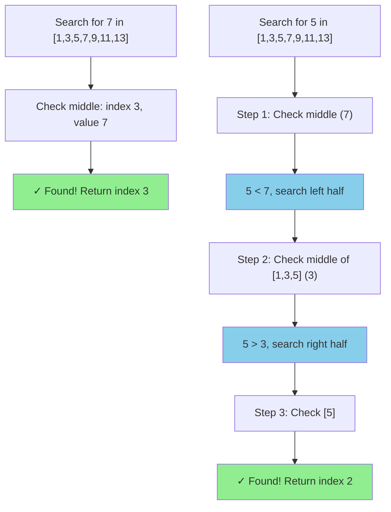
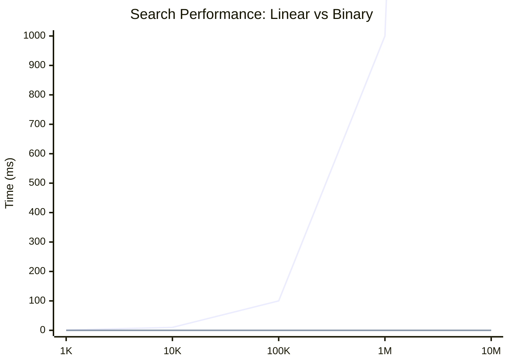
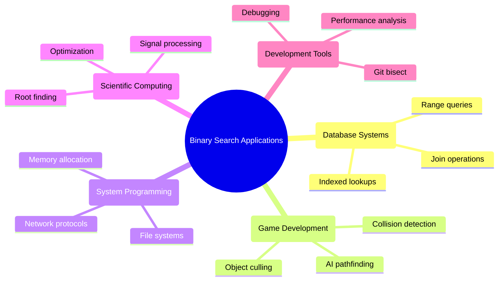

# Binary Search: The Power of Sorted Data

## Why Binary Search Matters

Once you have sorted data, you unlock one of the most elegant and efficient algorithms in computer science: binary search. While linear search examines elements one by one, binary search repeatedly halves the search space, achieving O(log n) performance.

Think of it like finding a word in a dictionary. Instead of starting from the first page, you open to the middle. If your word comes before the middle word, you know it's in the first half. If it comes after, it's in the second half. You repeat this process, halving your search space each time.

## The Binary Search Algorithm

### The Core Idea
```
1. Start with the entire sorted array
2. Check the middle element
3. If it's your target, you're done
4. If your target is smaller, search the left half
5. If your target is larger, search the right half
6. Repeat until found or search space is empty
```

### Visual Example



Searching for 7 in [1, 3, 5, 7, 9, 11, 13]:

```
Step 1: [1, 3, 5, 7, 9, 11, 13]  middle = 7  ✓ Found!
         low    mid      high
```

Searching for 5 in [1, 3, 5, 7, 9, 11, 13]:

```
Step 1: [1, 3, 5, 7, 9, 11, 13]  middle = 7  (5 < 7, go left)
         low    mid      high

Step 2: [1, 3, 5]                middle = 3  (5 > 3, go right)
         low mid high

Step 3: [5]                      middle = 5  ✓ Found!
         low/mid/high
```

## Implementation Examples

### Python
```python
def binary_search(arr, target):
    """
    Search for target in sorted array arr.
    Returns index if found, -1 if not found.
    """
    left, right = 0, len(arr) - 1
    
    while left <= right:
        mid = (left + right) // 2
        
        if arr[mid] == target:
            return mid
        elif arr[mid] < target:
            left = mid + 1  # Search right half
        else:
            right = mid - 1  # Search left half
    
    return -1  # Not found

# Example usage
numbers = [1, 3, 5, 7, 9, 11, 13, 15, 17, 19]
result = binary_search(numbers, 7)
print(f"Found 7 at index: {result}")  # Found 7 at index: 3

# Using Python's built-in bisect module
import bisect

numbers = [1, 3, 5, 7, 9, 11, 13, 15, 17, 19]
index = bisect.bisect_left(numbers, 7)
if index < len(numbers) and numbers[index] == 7:
    print(f"Found 7 at index: {index}")
else:
    print("7 not found")
```

### JavaScript
```javascript
function binarySearch(arr, target) {
    let left = 0;
    let right = arr.length - 1;
    
    while (left <= right) {
        const mid = Math.floor((left + right) / 2);
        
        if (arr[mid] === target) {
            return mid;
        } else if (arr[mid] < target) {
            left = mid + 1;  // Search right half
        } else {
            right = mid - 1;  // Search left half
        }
    }
    
    return -1;  // Not found
}

// Example usage
const numbers = [1, 3, 5, 7, 9, 11, 13, 15, 17, 19];
const result = binarySearch(numbers, 7);
console.log(`Found 7 at index: ${result}`);  // Found 7 at index: 3

// Generic version for any comparable type
function binarySearchGeneric(arr, target, compareFunc) {
    let left = 0;
    let right = arr.length - 1;
    
    while (left <= right) {
        const mid = Math.floor((left + right) / 2);
        const comparison = compareFunc(arr[mid], target);
        
        if (comparison === 0) {
            return mid;
        } else if (comparison < 0) {
            left = mid + 1;
        } else {
            right = mid - 1;
        }
    }
    
    return -1;
}
```

### Rust
```rust
fn binary_search<T: Ord>(arr: &[T], target: &T) -> Option<usize> {
    let mut left = 0;
    let mut right = arr.len();
    
    while left < right {
        let mid = left + (right - left) / 2;
        
        match arr[mid].cmp(target) {
            std::cmp::Ordering::Equal => return Some(mid),
            std::cmp::Ordering::Less => left = mid + 1,
            std::cmp::Ordering::Greater => right = mid,
        }
    }
    
    None  // Not found
}

fn main() {
    let numbers = vec![1, 3, 5, 7, 9, 11, 13, 15, 17, 19];
    
    match binary_search(&numbers, &7) {
        Some(index) => println!("Found 7 at index: {}", index),
        None => println!("7 not found"),
    }
    
    // Using Rust's built-in binary_search
    match numbers.binary_search(&7) {
        Ok(index) => println!("Found 7 at index: {}", index),
        Err(_) => println!("7 not found"),
    }
}
```

### Go
```go
package main

import (
    "fmt"
    "sort"
)

func binarySearch(arr []int, target int) int {
    left, right := 0, len(arr)-1
    
    for left <= right {
        mid := left + (right-left)/2
        
        if arr[mid] == target {
            return mid
        } else if arr[mid] < target {
            left = mid + 1
        } else {
            right = mid - 1
        }
    }
    
    return -1  // Not found
}

func main() {
    numbers := []int{1, 3, 5, 7, 9, 11, 13, 15, 17, 19}
    
    result := binarySearch(numbers, 7)
    fmt.Printf("Found 7 at index: %d\n", result)
    
    // Using Go's built-in sort.Search
    index := sort.Search(len(numbers), func(i int) bool {
        return numbers[i] >= 7
    })
    
    if index < len(numbers) && numbers[index] == 7 {
        fmt.Printf("Found 7 at index: %d\n", index)
    } else {
        fmt.Println("7 not found")
    }
}
```

## Binary Search Variants

### Finding the First Occurrence
When there are duplicate values, you might want to find the first occurrence:

```python
def binary_search_first(arr, target):
    """Find the first occurrence of target in sorted array with duplicates."""
    left, right = 0, len(arr) - 1
    result = -1
    
    while left <= right:
        mid = (left + right) // 2
        
        if arr[mid] == target:
            result = mid
            right = mid - 1  # Continue searching left for first occurrence
        elif arr[mid] < target:
            left = mid + 1
        else:
            right = mid - 1
    
    return result

# Example with duplicates
numbers = [1, 2, 2, 2, 3, 4, 5]
first_two = binary_search_first(numbers, 2)
print(f"First occurrence of 2 at index: {first_two}")  # Index: 1
```

### Finding the Last Occurrence
```python
def binary_search_last(arr, target):
    """Find the last occurrence of target in sorted array with duplicates."""
    left, right = 0, len(arr) - 1
    result = -1
    
    while left <= right:
        mid = (left + right) // 2
        
        if arr[mid] == target:
            result = mid
            left = mid + 1  # Continue searching right for last occurrence
        elif arr[mid] < target:
            left = mid + 1
        else:
            right = mid - 1
    
    return result

numbers = [1, 2, 2, 2, 3, 4, 5]
last_two = binary_search_last(numbers, 2)
print(f"Last occurrence of 2 at index: {last_two}")  # Index: 3
```

### Finding Insertion Point
```python
def binary_search_insertion_point(arr, target):
    """Find the index where target should be inserted to maintain sorted order."""
    left, right = 0, len(arr)
    
    while left < right:
        mid = (left + right) // 2
        
        if arr[mid] < target:
            left = mid + 1
        else:
            right = mid
    
    return left

numbers = [1, 3, 5, 7, 9]
insertion_point = binary_search_insertion_point(numbers, 6)
print(f"Insert 6 at index: {insertion_point}")  # Index: 3
numbers.insert(insertion_point, 6)
print(numbers)  # [1, 3, 5, 6, 7, 9]
```

## Searching Objects

Binary search works with any comparable data type:

```python
from dataclasses import dataclass

@dataclass
class Person:
    name: str
    age: int

def binary_search_person_by_age(people, target_age):
    """Search for person by age in list sorted by age."""
    left, right = 0, len(people) - 1
    
    while left <= right:
        mid = (left + right) // 2
        
        if people[mid].age == target_age:
            return mid
        elif people[mid].age < target_age:
            left = mid + 1
        else:
            right = mid - 1
    
    return -1

# Example usage
people = [
    Person("Alice", 25),
    Person("Bob", 30),
    Person("Charlie", 35),
    Person("Diana", 40)
]

# People list must be sorted by age for binary search to work!
index = binary_search_person_by_age(people, 30)
if index != -1:
    print(f"Found person: {people[index].name}")  # Found person: Bob
```

## Performance Comparison



Let's measure the performance difference between linear and binary search:

```python
import time
import random

def linear_search(arr, target):
    for i, value in enumerate(arr):
        if value == target:
            return i
    return -1

def performance_test():
    sizes = [1000, 10000, 100000, 1000000]
    
    for size in sizes:
        # Create sorted array
        arr = list(range(size))
        target = random.randint(0, size - 1)
        
        # Time linear search
        start = time.time()
        linear_search(arr, target)
        linear_time = time.time() - start
        
        # Time binary search
        start = time.time()
        binary_search(arr, target)
        binary_time = time.time() - start
        
        speedup = linear_time / binary_time if binary_time > 0 else float('inf')
        
        print(f"Size: {size:,}")
        print(f"  Linear:  {linear_time:.6f}s")
        print(f"  Binary:  {binary_time:.6f}s")
        print(f"  Speedup: {speedup:.1f}x")
        print()

performance_test()
```

## Common Pitfalls

### Off-by-One Errors
```python
# WRONG: Can cause infinite loop
def binary_search_wrong(arr, target):
    left, right = 0, len(arr) - 1
    
    while left < right:  # Should be left <= right
        mid = (left + right) // 2
        
        if arr[mid] == target:
            return mid
        elif arr[mid] < target:
            left = mid  # Should be mid + 1
        else:
            right = mid  # Should be mid - 1
    
    return -1
```

### Integer Overflow
```python
# POTENTIAL ISSUE: In languages with fixed integer sizes
mid = (left + right) // 2  # Could overflow if left + right > MAX_INT

# SAFE APPROACH:
mid = left + (right - left) // 2
```

### Unsorted Data
```python
# Binary search ONLY works on sorted data!
numbers = [5, 2, 8, 1, 9]  # Unsorted!
result = binary_search(numbers, 8)  # May return incorrect result

# Always ensure data is sorted first
numbers.sort()
result = binary_search(numbers, 8)  # Now correct
```

## Applications of Binary Search



1. **Database Indexing**: Finding records by indexed keys
2. **Game Development**: Finding objects within range
3. **Memory Management**: Finding free memory blocks
4. **Numerical Methods**: Finding roots of equations
5. **Version Control**: Finding when a bug was introduced (git bisect)

## Binary Search on Answer Spaces

Binary search isn't limited to arrays. You can use it to find answers in any monotonic space:

```python
def sqrt_binary_search(x, precision=1e-6):
    """Find square root using binary search."""
    if x < 1:
        left, right = 0, 1
    else:
        left, right = 1, x
    
    while right - left > precision:
        mid = (left + right) / 2
        square = mid * mid
        
        if square < x:
            left = mid
        else:
            right = mid
    
    return (left + right) / 2

# Example
result = sqrt_binary_search(25)
print(f"Square root of 25: {result}")  # Approximately 5.0
```

## Next Steps

Binary search demonstrates the transformative power of sorted data. A simple preprocessing step (sorting) enables logarithmic search times instead of linear ones.

Key takeaways:
- **Always verify data is sorted** before using binary search
- **Handle edge cases** carefully (empty arrays, single elements)
- **Consider variants** for different use cases (first/last occurrence, insertion point)
- **Use built-in implementations** when available—they're usually optimized and battle-tested

Try implementing:
- Binary search on a 2D sorted matrix
- Finding the peak element in an array
- Searching in a rotated sorted array
- Using binary search for optimization problems

Binary search is your reward for the work of sorting—embrace it!