# Rust Implementation: Building Sorting Algorithms from Scratch

This implementation provides complete, idiomatic Rust code for the major sorting algorithms, with a focus on performance, safety, and educational clarity.

```mermaid
flowchart LR
    subgraph "What You'll Build"
        A["🧩 Generic Framework<br/>• Trait-based design<br/>• Type safety"]
        B["🔢 O(n²) Algorithms<br/>• Bubble, Selection, Insertion<br/>• Educational clarity"]
        C["⚡ O(n log n) Algorithms<br/>• Merge, Quick, Heap<br/>• Production performance"]
        D["🚀 Specialized Sorts<br/>• Counting, Radix<br/>• Linear time complexity"]
        E["🔧 Hybrid Algorithm<br/>• Introsort<br/>• Real-world optimization"]
    end
    
    A --> F["📊 Comprehensive Benchmarks"]
    B --> F
    C --> F
    D --> F
    E --> F
    
    style A fill:#FFD700
    style B fill:#FFB6C1
    style C fill:#90EE90
    style D fill:#87CEEB
    style E fill:#DDA0DD
    style F fill:#FFA07A
```



## Project Setup

Create a new Rust project:

```bash
cargo new sorting_algorithms
cd sorting_algorithms
```

Add to `Cargo.toml`:

```toml
[package]
name = "sorting_algorithms"
version = "0.1.0"
edition = "2021"

[[bin]]
name = "main"
path = "src/main.rs"

[dev-dependencies]
criterion = "0.5"
rand = "0.8"

[[bench]]
name = "sorting_benchmark"
harness = false
```

## Core Traits and Generic Framework

```rust
// src/lib.rs
use std::cmp::Ordering;

/// Trait for sorting algorithms
pub trait Sorter {
    fn sort<T: Ord>(slice: &mut [T]);
}

/// Generic comparison-based sorting framework
pub fn sort_by<T, F>(slice: &mut [T], mut compare: F)
where
    F: FnMut(&T, &T) -> Ordering,
{
    if slice.len() <= 1 {
        return;
    }
    
    // Use insertion sort for small arrays
    if slice.len() < 10 {
        insertion_sort_by(slice, compare);
    } else {
        merge_sort_by(slice, compare);
    }
}

/// Helper function for stable sorting with custom comparator
pub fn insertion_sort_by<T, F>(slice: &mut [T], mut compare: F)
where
    F: FnMut(&T, &T) -> Ordering,
{
    for i in 1..slice.len() {
        let mut j = i;
        while j > 0 && compare(&slice[j], &slice[j - 1]) == Ordering::Less {
            slice.swap(j, j - 1);
            j -= 1;
        }
    }
}

/// Helper function for stable merge sort with custom comparator
pub fn merge_sort_by<T, F>(slice: &mut [T], mut compare: F)
where
    T: Clone,
    F: FnMut(&T, &T) -> Ordering,
{
    if slice.len() <= 1 {
        return;
    }
    
    let mid = slice.len() / 2;
    let (left, right) = slice.split_at_mut(mid);
    
    merge_sort_by(left, &mut compare);
    merge_sort_by(right, &mut compare);
    
    merge_in_place(slice, mid, &mut compare);
}

fn merge_in_place<T, F>(slice: &mut [T], mid: usize, compare: &mut F)
where
    T: Clone,
    F: FnMut(&T, &T) -> Ordering,
{
    let left = slice[..mid].to_vec();
    let right = slice[mid..].to_vec();
    
    let mut i = 0;
    let mut j = 0;
    let mut k = 0;
    
    while i < left.len() && j < right.len() {
        if compare(&left[i], &right[j]) != Ordering::Greater {
            slice[k] = left[i].clone();
            i += 1;
        } else {
            slice[k] = right[j].clone();
            j += 1;
        }
        k += 1;
    }
    
    while i < left.len() {
        slice[k] = left[i].clone();
        i += 1;
        k += 1;
    }
    
    while j < right.len() {
        slice[k] = right[j].clone();
        j += 1;
        k += 1;
    }
}
```

## O(n²) Sorting Algorithms

### Bubble Sort
```rust
// src/bubble_sort.rs
use crate::Sorter;

pub struct BubbleSort;

impl Sorter for BubbleSort {
    fn sort<T: Ord>(slice: &mut [T]) {
        if slice.len() <= 1 {
            return;
        }
        
        let mut swapped = true;
        while swapped {
            swapped = false;
            for i in 1..slice.len() {
                if slice[i - 1] > slice[i] {
                    slice.swap(i - 1, i);
                    swapped = true;
                }
            }
        }
    }
}

#[cfg(test)]
mod tests {
    use super::*;

    #[test]
    fn test_bubble_sort() {
        let mut arr = vec![64, 34, 25, 12, 22, 11, 90];
        BubbleSort::sort(&mut arr);
        assert_eq!(arr, vec![11, 12, 22, 25, 34, 64, 90]);
    }

    #[test]
    fn test_bubble_sort_empty() {
        let mut arr: Vec<i32> = vec![];
        BubbleSort::sort(&mut arr);
        assert_eq!(arr, vec![]);
    }

    #[test]
    fn test_bubble_sort_single() {
        let mut arr = vec![42];
        BubbleSort::sort(&mut arr);
        assert_eq!(arr, vec![42]);
    }
}
```

### Selection Sort
```rust
// src/selection_sort.rs
use crate::Sorter;

pub struct SelectionSort;

impl Sorter for SelectionSort {
    fn sort<T: Ord>(slice: &mut [T]) {
        let len = slice.len();
        
        for i in 0..len {
            let mut min_index = i;
            
            // Find the minimum element in the remaining unsorted array
            for j in (i + 1)..len {
                if slice[j] < slice[min_index] {
                    min_index = j;
                }
            }
            
            // Swap the found minimum element with the first element
            if min_index != i {
                slice.swap(i, min_index);
            }
        }
    }
}

#[cfg(test)]
mod tests {
    use super::*;

    #[test]
    fn test_selection_sort() {
        let mut arr = vec![64, 34, 25, 12, 22, 11, 90];
        SelectionSort::sort(&mut arr);
        assert_eq!(arr, vec![11, 12, 22, 25, 34, 64, 90]);
    }
}
```

### Insertion Sort
```rust
// src/insertion_sort.rs
use crate::Sorter;

pub struct InsertionSort;

impl Sorter for InsertionSort {
    fn sort<T: Ord>(slice: &mut [T]) {
        for i in 1..slice.len() {
            let mut j = i;
            
            // Move elements that are greater than slice[i] one position ahead
            while j > 0 && slice[j] < slice[j - 1] {
                slice.swap(j, j - 1);
                j -= 1;
            }
        }
    }
}

/// Optimized insertion sort using binary search for finding insertion point
pub struct BinaryInsertionSort;

impl Sorter for BinaryInsertionSort {
    fn sort<T: Ord>(slice: &mut [T]) {
        for i in 1..slice.len() {
            // Binary search for insertion position
            let insertion_point = slice[..i].binary_search(&slice[i])
                .unwrap_or_else(|pos| pos);
            
            // Rotate the element to its correct position
            slice[insertion_point..=i].rotate_right(1);
        }
    }
}

#[cfg(test)]
mod tests {
    use super::*;

    #[test]
    fn test_insertion_sort() {
        let mut arr = vec![64, 34, 25, 12, 22, 11, 90];
        InsertionSort::sort(&mut arr);
        assert_eq!(arr, vec![11, 12, 22, 25, 34, 64, 90]);
    }

    #[test]
    fn test_binary_insertion_sort() {
        let mut arr = vec![64, 34, 25, 12, 22, 11, 90];
        BinaryInsertionSort::sort(&mut arr);
        assert_eq!(arr, vec![11, 12, 22, 25, 34, 64, 90]);
    }
}
```

## O(n log n) Sorting Algorithms

### Merge Sort
```rust
// src/merge_sort.rs
use crate::Sorter;

pub struct MergeSort;

impl Sorter for MergeSort {
    fn sort<T: Ord>(slice: &mut [T]) 
    where
        T: Clone,
    {
        merge_sort_recursive(slice);
    }
}

fn merge_sort_recursive<T: Ord + Clone>(slice: &mut [T]) {
    if slice.len() <= 1 {
        return;
    }
    
    let mid = slice.len() / 2;
    let (left, right) = slice.split_at_mut(mid);
    
    merge_sort_recursive(left);
    merge_sort_recursive(right);
    
    merge(slice, mid);
}

fn merge<T: Ord + Clone>(slice: &mut [T], mid: usize) {
    let left = slice[..mid].to_vec();
    let right = slice[mid..].to_vec();
    
    let mut i = 0;
    let mut j = 0;
    let mut k = 0;
    
    // Merge the two sorted halves
    while i < left.len() && j < right.len() {
        if left[i] <= right[j] {
            slice[k] = left[i].clone();
            i += 1;
        } else {
            slice[k] = right[j].clone();
            j += 1;
        }
        k += 1;
    }
    
    // Copy remaining elements
    while i < left.len() {
        slice[k] = left[i].clone();
        i += 1;
        k += 1;
    }
    
    while j < right.len() {
        slice[k] = right[j].clone();
        j += 1;
        k += 1;
    }
}

/// Bottom-up merge sort (iterative version)
pub struct BottomUpMergeSort;

impl Sorter for BottomUpMergeSort {
    fn sort<T: Ord>(slice: &mut [T])
    where
        T: Clone,
    {
        let len = slice.len();
        if len <= 1 {
            return;
        }
        
        let mut size = 1;
        while size < len {
            let mut start = 0;
            while start + size < len {
                let mid = start + size;
                let end = std::cmp::min(start + 2 * size, len);
                
                merge_range(slice, start, mid, end);
                start += 2 * size;
            }
            size *= 2;
        }
    }
}

fn merge_range<T: Ord + Clone>(slice: &mut [T], start: usize, mid: usize, end: usize) {
    let left = slice[start..mid].to_vec();
    let right = slice[mid..end].to_vec();
    
    let mut i = 0;
    let mut j = 0;
    let mut k = start;
    
    while i < left.len() && j < right.len() {
        if left[i] <= right[j] {
            slice[k] = left[i].clone();
            i += 1;
        } else {
            slice[k] = right[j].clone();
            j += 1;
        }
        k += 1;
    }
    
    while i < left.len() {
        slice[k] = left[i].clone();
        i += 1;
        k += 1;
    }
    
    while j < right.len() {
        slice[k] = right[j].clone();
        j += 1;
        k += 1;
    }
}

#[cfg(test)]
mod tests {
    use super::*;

    #[test]
    fn test_merge_sort() {
        let mut arr = vec![64, 34, 25, 12, 22, 11, 90];
        MergeSort::sort(&mut arr);
        assert_eq!(arr, vec![11, 12, 22, 25, 34, 64, 90]);
    }

    #[test]
    fn test_bottom_up_merge_sort() {
        let mut arr = vec![64, 34, 25, 12, 22, 11, 90];
        BottomUpMergeSort::sort(&mut arr);
        assert_eq!(arr, vec![11, 12, 22, 25, 34, 64, 90]);
    }
}
```

### Quick Sort
```rust
// src/quick_sort.rs
use crate::Sorter;
use std::cmp::Ordering;

pub struct QuickSort;

impl Sorter for QuickSort {
    fn sort<T: Ord>(slice: &mut [T]) {
        if slice.len() <= 1 {
            return;
        }
        quick_sort_recursive(slice, 0, slice.len() - 1);
    }
}

fn quick_sort_recursive<T: Ord>(slice: &mut [T], low: usize, high: usize) {
    if low < high {
        let pivot = partition(slice, low, high);
        
        if pivot > 0 {
            quick_sort_recursive(slice, low, pivot - 1);
        }
        quick_sort_recursive(slice, pivot + 1, high);
    }
}

fn partition<T: Ord>(slice: &mut [T], low: usize, high: usize) -> usize {
    let mut i = low;
    
    for j in low..high {
        if slice[j] <= slice[high] {
            slice.swap(i, j);
            i += 1;
        }
    }
    
    slice.swap(i, high);
    i
}

/// Three-way quicksort for handling many duplicate values efficiently
pub struct ThreeWayQuickSort;

impl Sorter for ThreeWayQuickSort {
    fn sort<T: Ord>(slice: &mut [T]) {
        if slice.len() <= 1 {
            return;
        }
        three_way_quick_sort(slice, 0, slice.len() - 1);
    }
}

fn three_way_quick_sort<T: Ord>(slice: &mut [T], low: usize, high: usize) {
    if low >= high {
        return;
    }
    
    let (lt, gt) = three_way_partition(slice, low, high);
    
    if lt > 0 {
        three_way_quick_sort(slice, low, lt - 1);
    }
    if gt < slice.len() - 1 {
        three_way_quick_sort(slice, gt + 1, high);
    }
}

fn three_way_partition<T: Ord>(slice: &mut [T], low: usize, high: usize) -> (usize, usize) {
    let mut lt = low;      // slice[low..lt] < pivot
    let mut gt = high;     // slice[gt+1..high+1] > pivot
    let mut i = low + 1;   // slice[lt..i] == pivot
    
    while i <= gt {
        match slice[i].cmp(&slice[low]) {
            Ordering::Less => {
                slice.swap(lt, i);
                lt += 1;
                i += 1;
            }
            Ordering::Greater => {
                slice.swap(i, gt);
                gt -= 1;
                // Don't increment i as we need to examine the swapped element
            }
            Ordering::Equal => {
                i += 1;
            }
        }
    }
    
    (lt, gt)
}

#[cfg(test)]
mod tests {
    use super::*;

    #[test]
    fn test_quick_sort() {
        let mut arr = vec![64, 34, 25, 12, 22, 11, 90];
        QuickSort::sort(&mut arr);
        assert_eq!(arr, vec![11, 12, 22, 25, 34, 64, 90]);
    }

    #[test]
    fn test_three_way_quick_sort() {
        let mut arr = vec![3, 1, 4, 1, 5, 9, 2, 6, 5, 3, 5];
        ThreeWayQuickSort::sort(&mut arr);
        assert_eq!(arr, vec![1, 1, 2, 3, 3, 4, 5, 5, 5, 6, 9]);
    }
}
```

### Heap Sort
```rust
// src/heap_sort.rs
use crate::Sorter;

pub struct HeapSort;

impl Sorter for HeapSort {
    fn sort<T: Ord>(slice: &mut [T]) {
        let len = slice.len();
        if len <= 1 {
            return;
        }
        
        // Build max heap
        for i in (0..len / 2).rev() {
            heapify(slice, len, i);
        }
        
        // Extract elements from heap one by one
        for i in (1..len).rev() {
            slice.swap(0, i);
            heapify(slice, i, 0);
        }
    }
}

fn heapify<T: Ord>(slice: &mut [T], heap_size: usize, root: usize) {
    let mut largest = root;
    let left = 2 * root + 1;
    let right = 2 * root + 2;
    
    // Find the largest among root, left child, and right child
    if left < heap_size && slice[left] > slice[largest] {
        largest = left;
    }
    
    if right < heap_size && slice[right] > slice[largest] {
        largest = right;
    }
    
    // If largest is not root, swap and continue heapifying
    if largest != root {
        slice.swap(root, largest);
        heapify(slice, heap_size, largest);
    }
}

#[cfg(test)]
mod tests {
    use super::*;

    #[test]
    fn test_heap_sort() {
        let mut arr = vec![64, 34, 25, 12, 22, 11, 90];
        HeapSort::sort(&mut arr);
        assert_eq!(arr, vec![11, 12, 22, 25, 34, 64, 90]);
    }
}
```

## Non-Comparison Sorting Algorithms

### Counting Sort
```rust
// src/counting_sort.rs

pub struct CountingSort;

impl CountingSort {
    /// Sort slice of non-negative integers with known maximum value
    pub fn sort(slice: &mut [usize], max_value: usize) {
        if slice.is_empty() {
            return;
        }
        
        let mut count = vec![0; max_value + 1];
        
        // Count occurrences of each value
        for &value in slice.iter() {
            count[value] += 1;
        }
        
        // Reconstruct the sorted array
        let mut index = 0;
        for (value, &freq) in count.iter().enumerate() {
            for _ in 0..freq {
                slice[index] = value;
                index += 1;
            }
        }
    }
    
    /// Stable counting sort that preserves relative order of equal elements
    pub fn stable_sort(slice: &mut [usize], max_value: usize) {
        if slice.is_empty() {
            return;
        }
        
        let mut count = vec![0; max_value + 1];
        let mut output = vec![0; slice.len()];
        
        // Count occurrences
        for &value in slice.iter() {
            count[value] += 1;
        }
        
        // Convert counts to positions
        for i in 1..count.len() {
            count[i] += count[i - 1];
        }
        
        // Build output array in reverse order to maintain stability
        for &value in slice.iter().rev() {
            count[value] -= 1;
            output[count[value]] = value;
        }
        
        // Copy back to original slice
        slice.copy_from_slice(&output);
    }
}

#[cfg(test)]
mod tests {
    use super::*;

    #[test]
    fn test_counting_sort() {
        let mut arr = vec![4, 2, 2, 8, 3, 3, 1];
        CountingSort::sort(&mut arr, 8);
        assert_eq!(arr, vec![1, 2, 2, 3, 3, 4, 8]);
    }

    #[test]
    fn test_stable_counting_sort() {
        let mut arr = vec![4, 2, 2, 8, 3, 3, 1];
        CountingSort::stable_sort(&mut arr, 8);
        assert_eq!(arr, vec![1, 2, 2, 3, 3, 4, 8]);
    }
}
```

### Radix Sort
```rust
// src/radix_sort.rs

pub struct RadixSort;

impl RadixSort {
    /// Sort slice of non-negative integers using LSD (Least Significant Digit) radix sort
    pub fn sort(slice: &mut [u32]) {
        if slice.is_empty() {
            return;
        }
        
        let max_value = *slice.iter().max().unwrap();
        let mut exp = 1;
        
        while max_value / exp > 0 {
            counting_sort_by_digit(slice, exp);
            exp *= 10;
        }
    }
}

fn counting_sort_by_digit(slice: &mut [u32], exp: u32) {
    let mut output = vec![0; slice.len()];
    let mut count = [0; 10];
    
    // Count occurrences of each digit
    for &value in slice.iter() {
        let digit = ((value / exp) % 10) as usize;
        count[digit] += 1;
    }
    
    // Convert counts to positions
    for i in 1..10 {
        count[i] += count[i - 1];
    }
    
    // Build output array
    for &value in slice.iter().rev() {
        let digit = ((value / exp) % 10) as usize;
        count[digit] -= 1;
        output[count[digit]] = value;
    }
    
    // Copy back to original slice
    slice.copy_from_slice(&output);
}

#[cfg(test)]
mod tests {
    use super::*;

    #[test]
    fn test_radix_sort() {
        let mut arr = vec![170, 45, 75, 90, 2, 802, 24, 66];
        RadixSort::sort(&mut arr);
        assert_eq!(arr, vec![2, 24, 45, 66, 75, 90, 170, 802]);
    }
}
```

## Hybrid Algorithm: Introsort

```rust
// src/introsort.rs
use crate::Sorter;
use crate::insertion_sort::InsertionSort;
use crate::heap_sort::HeapSort;

/// Introspective sort: starts with quicksort, switches to heapsort when recursion depth exceeds threshold
pub struct IntroSort;

impl Sorter for IntroSort {
    fn sort<T: Ord>(slice: &mut [T]) {
        if slice.len() <= 1 {
            return;
        }
        
        let max_depth = (slice.len() as f64).log2() as usize * 2;
        introsort_recursive(slice, 0, slice.len() - 1, max_depth);
    }
}

fn introsort_recursive<T: Ord>(slice: &mut [T], low: usize, high: usize, max_depth: usize) {
    let size = high - low + 1;
    
    // Use insertion sort for small arrays
    if size <= 16 {
        insertion_sort_range(slice, low, high);
        return;
    }
    
    // Switch to heapsort if recursion depth is too deep
    if max_depth == 0 {
        heapsort_range(slice, low, high);
        return;
    }
    
    // Otherwise, use quicksort
    if low < high {
        let pivot = partition_median_of_three(slice, low, high);
        
        if pivot > 0 {
            introsort_recursive(slice, low, pivot - 1, max_depth - 1);
        }
        introsort_recursive(slice, pivot + 1, high, max_depth - 1);
    }
}

fn insertion_sort_range<T: Ord>(slice: &mut [T], low: usize, high: usize) {
    for i in (low + 1)..=high {
        let mut j = i;
        while j > low && slice[j] < slice[j - 1] {
            slice.swap(j, j - 1);
            j -= 1;
        }
    }
}

fn heapsort_range<T: Ord>(slice: &mut [T], low: usize, high: usize) {
    let range = &mut slice[low..=high];
    HeapSort::sort(range);
}

fn partition_median_of_three<T: Ord>(slice: &mut [T], low: usize, high: usize) -> usize {
    let mid = low + (high - low) / 2;
    
    // Sort low, mid, high
    if slice[mid] < slice[low] {
        slice.swap(low, mid);
    }
    if slice[high] < slice[low] {
        slice.swap(low, high);
    }
    if slice[high] < slice[mid] {
        slice.swap(mid, high);
    }
    
    // Place median at end
    slice.swap(mid, high);
    
    // Partition using median as pivot
    let mut i = low;
    for j in low..high {
        if slice[j] <= slice[high] {
            slice.swap(i, j);
            i += 1;
        }
    }
    slice.swap(i, high);
    i
}

#[cfg(test)]
mod tests {
    use super::*;

    #[test]
    fn test_introsort() {
        let mut arr = vec![64, 34, 25, 12, 22, 11, 90];
        IntroSort::sort(&mut arr);
        assert_eq!(arr, vec![11, 12, 22, 25, 34, 64, 90]);
    }
}
```

## Main Module and Benchmarks

```rust
// src/main.rs
mod lib;
mod bubble_sort;
mod selection_sort;
mod insertion_sort;
mod merge_sort;
mod quick_sort;
mod heap_sort;
mod counting_sort;
mod radix_sort;
mod introsort;

use lib::Sorter;
use std::time::Instant;
use rand::Rng;

fn main() {
    println!("Sorting Algorithm Performance Comparison");
    println!("=======================================");
    
    let sizes = vec![100, 1000, 10000];
    
    for size in sizes {
        println!("\nArray size: {}", size);
        println!("-".repeat(40));
        
        // Test different data patterns
        test_pattern("Random", generate_random_data(size));
        test_pattern("Nearly Sorted", generate_nearly_sorted_data(size));
        test_pattern("Reverse Sorted", generate_reverse_sorted_data(size));
        test_pattern("All Equal", generate_equal_data(size));
    }
}

fn test_pattern(pattern_name: &str, data: Vec<i32>) {
    println!("\n{} data:", pattern_name);
    
    macro_rules! benchmark_sort {
        ($sorter:ident, $name:expr) => {
            let mut test_data = data.clone();
            let start = Instant::now();
            $sorter::sort(&mut test_data);
            let duration = start.elapsed();
            println!("  {:<15}: {:>8.2?}", $name, duration);
            assert!(is_sorted(&test_data), "{} failed to sort correctly", $name);
        };
    }
    
    benchmark_sort!(bubble_sort::BubbleSort, "Bubble Sort");
    benchmark_sort!(selection_sort::SelectionSort, "Selection Sort");
    benchmark_sort!(insertion_sort::InsertionSort, "Insertion Sort");
    benchmark_sort!(merge_sort::MergeSort, "Merge Sort");
    benchmark_sort!(quick_sort::QuickSort, "Quick Sort");
    benchmark_sort!(heap_sort::HeapSort, "Heap Sort");
    benchmark_sort!(introsort::IntroSort, "Introsort");
    
    // Test Rust's built-in sort for comparison
    let mut test_data = data.clone();
    let start = Instant::now();
    test_data.sort();
    let duration = start.elapsed();
    println!("  {:<15}: {:>8.2?}", "Rust std::sort", duration);
}

fn generate_random_data(size: usize) -> Vec<i32> {
    let mut rng = rand::thread_rng();
    (0..size).map(|_| rng.gen_range(0..1000)).collect()
}

fn generate_nearly_sorted_data(size: usize) -> Vec<i32> {
    let mut data: Vec<i32> = (0..size as i32).collect();
    let mut rng = rand::thread_rng();
    
    // Swap 5% of elements randomly
    for _ in 0..(size / 20) {
        let i = rng.gen_range(0..size);
        let j = rng.gen_range(0..size);
        data.swap(i, j);
    }
    
    data
}

fn generate_reverse_sorted_data(size: usize) -> Vec<i32> {
    (0..size as i32).rev().collect()
}

fn generate_equal_data(size: usize) -> Vec<i32> {
    vec![42; size]
}

fn is_sorted<T: Ord>(slice: &[T]) -> bool {
    slice.windows(2).all(|w| w[0] <= w[1])
}
```

## Benchmark Suite

```rust
// benches/sorting_benchmark.rs
use criterion::{black_box, criterion_group, criterion_main, Criterion, BenchmarkId};
use sorting_algorithms::*;
use rand::Rng;

fn benchmark_sorts(c: &mut Criterion) {
    let mut group = c.benchmark_group("sorting_algorithms");
    
    for size in [100, 1000, 10000].iter() {
        let data = generate_random_data(*size);
        
        group.bench_with_input(BenchmarkId::new("merge_sort", size), size, |b, _| {
            b.iter(|| {
                let mut test_data = data.clone();
                merge_sort::MergeSort::sort(black_box(&mut test_data));
            })
        });
        
        group.bench_with_input(BenchmarkId::new("quick_sort", size), size, |b, _| {
            b.iter(|| {
                let mut test_data = data.clone();
                quick_sort::QuickSort::sort(black_box(&mut test_data));
            })
        });
        
        group.bench_with_input(BenchmarkId::new("heap_sort", size), size, |b, _| {
            b.iter(|| {
                let mut test_data = data.clone();
                heap_sort::HeapSort::sort(black_box(&mut test_data));
            })
        });
        
        group.bench_with_input(BenchmarkId::new("introsort", size), size, |b, _| {
            b.iter(|| {
                let mut test_data = data.clone();
                introsort::IntroSort::sort(black_box(&mut test_data));
            })
        });
        
        group.bench_with_input(BenchmarkId::new("std_sort", size), size, |b, _| {
            b.iter(|| {
                let mut test_data = data.clone();
                test_data.sort();
            })
        });
    }
    
    group.finish();
}

fn generate_random_data(size: usize) -> Vec<i32> {
    let mut rng = rand::thread_rng();
    (0..size).map(|_| rng.gen_range(0..1000)).collect()
}

criterion_group!(benches, benchmark_sorts);
criterion_main!(benches);
```

## Usage and Testing

Run the examples:
```bash
cargo run
```

Run tests:
```bash
cargo test
```

Run benchmarks:
```bash
cargo bench
```

## Key Features of This Implementation

```mermaid
flowchart TD
    A["🚀 Rust Sorting Library"] --> B["Type Safety"]
    A --> C["Performance"]
    A --> D["Education"]
    A --> E["Production Ready"]
    
    B --> B1["🔒 Generic traits<br/>• Works with any Ord type<br/>• Compile-time guarantees"]
    
    C --> C1["⚡ Optimized algorithms<br/>• Median-of-three pivot<br/>• Hybrid strategies"]
    
    D --> D1["📚 Clear explanations<br/>• Well-commented code<br/>• Comprehensive tests"]
    
    E --> E1["🏢 Real-world features<br/>• Introsort implementation<br/>• Benchmark suite"]
    
    style A fill:#FFD700
    style B1 fill:#87CEEB
    style C1 fill:#90EE90
    style D1 fill:#FFB6C1
    style E1 fill:#DDA0DD
```



**Core strengths**:
1. **Generic and Reusable**: All algorithms work with any `Ord` type
2. **Memory Safe**: Leverages Rust's ownership system to prevent common bugs
3. **Comprehensive Testing**: Each algorithm includes unit tests
4. **Performance Focused**: Includes optimizations like median-of-three partitioning
5. **Educational**: Clear, well-commented code that demonstrates algorithmic concepts
6. **Production Ready**: Includes hybrid algorithms used in real-world systems

**The Rust advantage**: This implementation showcases Rust's strengths in systems programming: **safety, performance, and expressiveness** - demonstrating how modern language features can make complex algorithms both fast and safe.