# The Core Problem: Finding Your Place in Space

## The Spatial Search Challenge

Imagine you're building a ride-sharing app like Uber. When a user requests a ride, you need to find all available drivers within a 2-mile radius—and you need to do it in milliseconds, not minutes. With millions of drivers constantly moving around a city, how do you efficiently answer spatial queries like:

- "Find all restaurants within 1 mile of my location"
- "Show me the 10 nearest gas stations"
- "Which delivery drivers are currently in downtown Seattle?"
- "Are there any available parking spots in this neighborhood?"

This is the fundamental challenge of **spatial indexing**: efficiently organizing and querying location-based data.

## Why Traditional Databases Fall Short

```mermaid
graph TB
    subgraph "Traditional Database Spatial Query Challenge"
        subgraph "Naive SQL Approach"
            QUERY["🔍 Find nearby drivers<br/>SELECT * FROM drivers<br/>WHERE distance(lat, lon, user_lat, user_lon) < 2km"]
        end
        
        subgraph "Database Execution Plan"
            SCAN["📊 Full Table Scan<br/>1M drivers × distance calculation<br/>= 1M expensive computations"]
            CALC["🔢 Distance Calculation per Row<br/>√((lat₁-lat₂)² + (lon₁-lon₂)²)<br/>Expensive trigonometry"]
            FILTER["🎯 Filter Results<br/>Keep only distance < 2km<br/>Might return 10-100 drivers"]
        end
        
        subgraph "Performance Impact"
            TIME["⏱️ Query Time: 5-30 seconds<br/>🔥 CPU Usage: 100%<br/>📈 I/O Load: High<br/>😫 User Experience: Timeout"]
        end
        
        QUERY --> SCAN
        SCAN --> CALC
        CALC --> FILTER
        FILTER --> TIME
        
        style QUERY fill:#ffebee
        style SCAN fill:#ffcdd2
        style CALC fill:#ffcdd2
        style FILTER fill:#ffcdd2
        style TIME fill:#d32f2f,color:#fff
    end
```



Consider a naive approach using a traditional database table:

```sql
CREATE TABLE drivers (
    id INTEGER,
    latitude DECIMAL(10,8),
    longitude DECIMAL(11,8),
    available BOOLEAN
);

-- Find drivers within 2 miles of user at (47.6062, -122.3321)
SELECT * FROM drivers 
WHERE available = true 
  AND sqrt(
    pow(latitude - 47.6062, 2) + 
    pow(longitude - -122.3321, 2)
  ) * 69 <= 2;  -- Rough miles conversion
```

**The problem:** This query requires a full table scan, calculating the distance to every single driver. With a million drivers, that's a million distance calculations for every ride request. Even with indexes on `latitude` and `longitude`, the database can't efficiently use them for range queries across two dimensions simultaneously.

## The Dimensionality Curse

Spatial data is inherently **multi-dimensional**. A point on Earth has at least two coordinates (latitude, longitude), and real applications often add more:

- **2D**: Latitude, longitude
- **3D**: Latitude, longitude, altitude (for drones, aircraft)
- **4D**: Latitude, longitude, altitude, time (for tracking moving objects)
- **Higher dimensions**: Add attributes like price range, rating, category

Traditional B-tree indexes, which work brilliantly for one-dimensional data, break down in multi-dimensional space. You can index on latitude OR longitude efficiently, but not both simultaneously.

## The Multi-Dimensional Query Challenge


Most spatial queries involve finding all points within a rectangular region:

```
Find all points within this rectangle:
    North: 47.620
    South: 47.590  
    East:  -122.320
    West:  -122.350
```

With a million points scattered across this region, how do you avoid checking every single point? The challenge is that points close in latitude might be far apart in longitude, and vice versa.

## Real-World Scale and Performance Requirements


Modern spatial applications deal with massive scale:

- **Google Maps**: Billions of businesses, roads, and landmarks
- **Uber**: Millions of drivers and riders in real-time
- **Pokémon GO**: Millions of players and game objects worldwide
- **Weather Services**: Millions of sensor readings across the globe

Performance requirements are stringent:
- **Sub-100ms response times** for mobile app queries
- **Real-time updates** as objects move
- **High query throughput** (thousands of queries per second)
- **Global distribution** across data centers

## The Hierarchical Insight

```mermaid
graph TB
    subgraph "Hierarchical Space Partitioning Strategy"
        subgraph "Geographic Hierarchy (Mental Model)"
            WORLD["🌍 World<br/>7 continents<br/>~510M km²"]
            CONTINENT["🗺️ North America<br/>23 countries<br/>~24M km²"]
            COUNTRY["🇺🇸 United States<br/>50 states<br/>~9.8M km²"]
            STATE["🏛️ Washington State<br/>39 counties<br/>~185K km²"]
            CITY["🏙️ Seattle<br/>Multiple districts<br/>~370 km²"]
            DISTRICT["🏘️ Capitol Hill<br/>Neighborhoods<br/>~5 km²"]
            
            WORLD --> CONTINENT
            CONTINENT --> COUNTRY
            COUNTRY --> STATE
            STATE --> CITY
            CITY --> DISTRICT
        end
        
        subgraph "Search Efficiency at Each Level"
            L1["🌍 Level 1: Eliminate 6/7 continents<br/>✂️ Pruned: 85% of world"]
            L2["🗺️ Level 2: Eliminate 22/23 countries<br/>✂️ Pruned: 95% of continent"]
            L3["🇺🇸 Level 3: Eliminate 49/50 states<br/>✂️ Pruned: 98% of country"]
            L4["🏛️ Level 4: Eliminate other counties<br/>✂️ Pruned: 97% of state"]
            L5["🏙️ Level 5: Focus on target district<br/>✂️ Pruned: 99.9% of city"]
            FINAL["🎯 Final: Search small area<br/>✅ Remaining: 0.1% of original space"]
        end
        
        subgraph "Exponential Pruning Effect"
            MATH["🔢 Search Space Reduction<br/>Level 1: 85% pruned (15% remains)<br/>Level 2: 15% × 5% = 0.75% remains<br/>Level 3: 0.75% × 2% = 0.015% remains<br/>Level 4: 0.015% × 3% = 0.0005% remains<br/>Level 5: 0.0005% × 10% = 0.00005% remains<br/><br/>🚀 Result: 99.99995% elimination!"]
        end
        
        WORLD -.-> L1
        CONTINENT -.-> L2
        COUNTRY -.-> L3
        STATE -.-> L4
        CITY -.-> L5
        DISTRICT -.-> FINAL
        
        FINAL --> MATH
        
        style FINAL fill:#c8e6c9
        style MATH fill:#e1f5fe
    end
```



The breakthrough insight for spatial indexing is **hierarchical space partitioning**. Just as we organize the physical world into continents → countries → states → cities → neighborhoods, we can organize coordinate space hierarchically.

Consider finding a restaurant in Seattle:
1. **Continental level**: North America (eliminates Asia, Europe, etc.)
2. **Country level**: United States (eliminates Canada, Mexico)
3. **State level**: Washington (eliminates 49 other states)
4. **City level**: Seattle (eliminates Spokane, Tacoma, etc.)
5. **Neighborhood level**: Capitol Hill (eliminates other neighborhoods)

At each level, we eliminate vast regions that don't contain our target, dramatically reducing the search space.

## The Nested Maps Analogy

Think of spatial indexing like a set of nested maps:

**World Map**: Shows only continents and major countries
**Country Map**: Shows states/provinces and major cities  
**State Map**: Shows cities, highways, and regions
**City Map**: Shows neighborhoods, streets, and landmarks
**Neighborhood Map**: Shows individual buildings and addresses

When you're looking for a local coffee shop, you don't consult a world map—you zoom in to the appropriate level of detail. Spatial indexes work the same way: they create a hierarchy of maps, each focused on a different scale of geography.

## Types of Spatial Queries

Spatial indexing must efficiently support various query types:

### Range Queries
"Find all points within this rectangular area"
```
SELECT * FROM restaurants 
WHERE latitude BETWEEN 47.590 AND 47.620
  AND longitude BETWEEN -122.350 AND -122.320
```

### Nearest Neighbor Queries  
"Find the 5 closest gas stations to my location"
```
Find 5 nearest points to (47.6062, -122.3321)
```

### Distance Queries
"Find all points within 2 miles of this location"
```
Find all points within radius 2 miles of (47.6062, -122.3321)
```

### Containment Queries
"Which delivery zone contains this address?"
```
Find polygon that contains point (47.6062, -122.3321)
```

### Intersection Queries
"Which roads cross this neighborhood boundary?"
```
Find all lines that intersect with polygon
```

## The Precision vs. Performance Trade-off

Spatial indexing involves a fundamental trade-off:

**Higher Precision**:
- More accurate distance calculations
- Finer-grained spatial divisions
- Larger index structures
- Slower query performance

**Higher Performance**:
- Approximate distance calculations
- Coarser-grained spatial divisions  
- Smaller index structures
- Faster query performance

Most applications choose **approximate solutions** that are "good enough"—finding restaurants within roughly 1 mile is usually fine, even if the actual distance is 0.9 or 1.1 miles.

## Why This Problem is Hard

Several factors make spatial indexing particularly challenging:

### 1. Non-Uniform Data Distribution
Real-world spatial data clusters unevenly. Manhattan has thousands of restaurants per square mile, while rural Montana might have one restaurant per hundred square miles. Spatial indexes must adapt to these density variations.

### 2. Dynamic Data
Points constantly move (vehicles, people, aircraft) and new points are added/removed (new businesses, closed restaurants). The index must handle real-time updates efficiently.

### 3. Multiple Query Types
Unlike simple range queries on sorted data, spatial indexes must support diverse query patterns: nearest neighbor, range queries, containment tests, and more.

### 4. Earth's Curvature
The Earth is a sphere, not a flat plane. Longitude lines converge at the poles, and the shortest distance between two points is along a great circle, not a straight line on a map projection.

### 5. Scale Variations
Queries might span continents ("flights from US to Europe") or city blocks ("restaurants on this street"). The index must work efficiently at all scales.

## The Promise of Spatial Indexing

Despite these challenges, effective spatial indexing transforms the impossible into the trivial:

- **Million-point queries** execute in milliseconds instead of seconds
- **Real-time applications** become feasible (GPS navigation, ride-sharing)
- **Complex spatial relationships** can be analyzed efficiently
- **Geographic analytics** unlock insights from location data

Spatial indexing is what makes modern location-based services possible. Without it, every GPS query would take minutes, every "find nearby" search would time out, and real-time navigation would be impossible.

The core insight is that **space has structure**, and by organizing our data to match that structure, we can make spatial queries dramatically more efficient. Instead of searching everywhere, we search smart.