# The Guiding Philosophy: Hierarchical Space Partitioning

## The Core Insight: Divide Space, Not Just Data

Traditional data structures organize information by value (sorting, hashing), but spatial indexing organizes by **location in space**. The fundamental philosophy is deceptively simple: **recursively divide space into smaller regions until each region contains a manageable number of points**.

This approach mirrors how we naturally think about geography and location, creating a hierarchy that matches human spatial reasoning.

## The Recursive Partitioning Principle

```mermaid
graph TB
    subgraph "Spatial Indexing: Recursive Divide-and-Conquer"
        subgraph "Step 1: Start with Complete Space"
            START["🌍 Complete Search Space<br/>Example: North America<br/>~24M km²<br/>Contains: 1M+ points"]
        end
        
        subgraph "Step 2: Recursive Division Strategy"
            DIV1["✂️ Division Level 1<br/>Split into 4 quadrants<br/>Each: ~6M km²<br/>Points distributed by location"]
            
            DIV2["✂️ Division Level 2<br/>Subdivide busy quadrants<br/>Each: ~1.5M km²<br/>Focus on high-density areas"]
            
            DIV3["✂️ Division Level 3<br/>Continue subdivision<br/>Each: ~375K km²<br/>Regional granularity"]
            
            STOP["⛔ Stop Condition<br/>When: <10 points per region<br/>Or: Minimum size reached<br/>Result: Manageable leaf nodes"]
        end
        
        subgraph "Resulting Tree Structure"
            TREE["🌳 Spatial Tree<br/><br/>Root: Entire space<br/>├─ Internal: Large regions<br/>│  ├─ Internal: Medium regions<br/>│  └─ Leaf: Small regions (≤10 points)<br/>└─ Internal: Other large regions<br/>   ├─ Leaf: Sparse areas (≤10 points)<br/>   └─ Internal: Dense areas (subdivided)"]
        end
        
        subgraph "Query Efficiency Principle"
            EFFICIENCY["⚡ Exponential Pruning Power<br/><br/>Level 1: Eliminate 3/4 of space (75%)<br/>Level 2: Eliminate 3/4 of remainder (93.75%)<br/>Level 3: Eliminate 3/4 of remainder (98.4%)<br/>Level 4: Eliminate 3/4 of remainder (99.6%)<br/><br/>🎯 Search only 0.4% of original space!<br/>🚀 Query time: O(log n) vs O(n)"]
        end
        
        START --> DIV1
        DIV1 --> DIV2
        DIV2 --> DIV3
        DIV3 --> STOP
        STOP --> TREE
        TREE --> EFFICIENCY
        
        style START fill:#e3f2fd
        style EFFICIENCY fill:#c8e6c9
        style TREE fill:#fff3c4
    end
```



Every spatial index follows the same core pattern:

1. **Start with the entire space** (a bounding box containing all points)
2. **Divide it into smaller regions** (halves, quarters, or other subdivisions)
3. **Distribute points among these regions** based on their coordinates
4. **Recursively subdivide regions** that contain too many points
5. **Stop when regions are small enough** (few points or minimum size reached)

This creates a **tree structure** where:
- **Root node** represents the entire space
- **Internal nodes** represent intermediate regions
- **Leaf nodes** represent final spatial regions with actual data points

## The Containment Hierarchy

Think of spatial partitioning like Russian nesting dolls (matryoshka), where each doll contains smaller dolls:

```
World (Root)
├── North America
│   ├── United States
│   │   ├── Washington State
│   │   │   ├── Seattle
│   │   │   │   ├── Capitol Hill
│   │   │   │   └── Fremont
│   │   │   └── Spokane
│   │   └── California
│   └── Canada
└── Europe
    ├── France
    └── Germany
```

Each level provides a different **resolution** of spatial information:
- **Coarse resolution**: Continents and countries
- **Medium resolution**: States and major cities  
- **Fine resolution**: Neighborhoods and individual locations

## The Bounding Box Abstraction

At the heart of spatial indexing is the **bounding box** (or bounding rectangle)—the smallest rectangle that completely contains a set of points.

```
Bounding Box for Seattle restaurants:
    North: 47.734  (northernmost restaurant)
    South: 47.481  (southernmost restaurant)
    East:  -122.224 (easternmost restaurant)
    West:  -122.459 (westernmost restaurant)
```

**Key properties of bounding boxes:**
- **Conservative bounds**: If a point isn't in the bounding box, it's definitely not in the region
- **Hierarchical**: Parent bounding boxes always contain all child bounding boxes
- **Efficient testing**: Rectangle-point and rectangle-rectangle intersections are fast
- **Composable**: Multiple bounding boxes can be combined into larger ones

## Spatial Partitioning Strategies

Different spatial indexes use different partitioning strategies, each with distinct trade-offs:

### 1. Regular Grid Partitioning

```mermaid
graph TB
    subgraph "Regular Grid Partitioning Strategy"
        subgraph "Grid Structure"
            GRID["🟦 Uniform Grid Layout<br/><br/>+---+---+---+---+<br/>| A | B | C | D |<br/>+---+---+---+---+<br/>| E | F | G | H |<br/>+---+---+---+---+<br/>| I | J | K | L |<br/>+---+---+---+---+<br/><br/>Cell Size: Fixed (e.g., 10km × 10km)"]
        end
        
        subgraph "Advantages"
            PROS["✅ Benefits<br/><br/>📊 Predictable Performance<br/>⚡ O(1) cell coordinate calculation<br/>🔢 Simple math: cell = floor(x/size)<br/>💾 Memory efficient<br/>🗺️ Easy to parallelize<br/>🎨 Simple to visualize"]
        end
        
        subgraph "Disadvantages"
            CONS["❌ Limitations<br/><br/>🏙️ Poor for clustered data<br/>Examples:<br/>  • Urban vs Rural density<br/>  • 1000 restaurants in Manhattan<br/>  • 1 restaurant in rural Montana<br/><br/>📋 Empty cells waste memory<br/>🔥 Hot spots overload single cells<br/>⚠️ No adaptation to data patterns"]
        end
        
        subgraph "Real-World Example"
            EXAMPLE["🌆 Manhattan Grid Problem<br/><br/>Cell F contains:<br/>• 5,000 restaurants<br/>• Query still scans all 5,000<br/><br/>Cell K contains:<br/>• 2 restaurants<br/>• Wastes space, underutilized<br/><br/>💡 Solution: Adaptive methods needed"]
        end
        
        GRID --> PROS
        GRID --> CONS
        CONS --> EXAMPLE
        
        style PROS fill:#c8e6c9
        style CONS fill:#ffcdd2
        style EXAMPLE fill:#fff3c4
    end
```


**Philosophy**: Divide space into uniform cells, like a chess board.

```
+---+---+---+---+
| A | B | C | D |
+---+---+---+---+
| E | F | G | H |
+---+---+---+---+
| I | J | K | L |
+---+---+---+---+
```

**Advantages**: Simple, predictable, easy to compute cell coordinates
**Disadvantages**: Poor handling of non-uniform data distribution

### 2. Recursive Binary Partitioning (KD-Tree Style)

```mermaid
graph TB
    subgraph "Recursive Binary Partitioning Strategy"
        subgraph "Partitioning Process"
            STEP1["📍 Step 1: Vertical Split<br/><br/>Original Space<br/>+-------------+<br/>|      |      |<br/>|   A  |   B  |<br/>|      |      |<br/>+-------------+<br/><br/>Split along X-axis (longitude)"]
            
            STEP2["📎 Step 2: Horizontal Splits<br/><br/>Subdivided Space<br/>+-----+-----+<br/>| A1  | B1  |<br/>+-----+-----+<br/>| A2  | B2  |<br/>+-----+-----+<br/><br/>Split along Y-axis (latitude)"]
            
            STEP3["🔄 Step 3: Alternating Pattern<br/><br/>Continue alternating:<br/>Level 1: X-split (vertical)<br/>Level 2: Y-split (horizontal)<br/>Level 3: X-split (vertical)<br/>Level 4: Y-split (horizontal)<br/>...<br/><br/>Creates balanced binary tree"]
        end
        
        subgraph "Tree Structure Result"
            TREE["🌳 Resulting Tree<br/><br/>       Root(X-split)<br/>      /            \<br/>   A(Y-split)    B(Y-split)<br/>   /      \       /      \<br/> A1     A2     B1     B2<br/><br/>Each node splits different dimension<br/>Guarantees logarithmic depth"]
        end
        
        subgraph "Advantages & Trade-offs"
            PROS["✅ Advantages<br/><br/>🎯 Balanced tree structure<br/>📈 Adapts to data distribution<br/>⚡ O(log n) guaranteed depth<br/>💾 Memory efficient<br/>🔄 Handles updates well"]
            
            CONS["⚠️ Limitations<br/><br/>📇 Axis-aligned splits only<br/>📍 May not match natural clusters<br/>Example: Diagonal highway<br/>gets split artificially<br/><br/>🔢 More complex than grid<br/>🔍 Range queries span multiple nodes"]
        end
        
        STEP1 --> STEP2
        STEP2 --> STEP3
        STEP3 --> TREE
        TREE --> PROS
        TREE --> CONS
        
        style STEP1 fill:#e3f2fd
        style STEP2 fill:#e3f2fd
        style STEP3 fill:#e3f2fd
        style PROS fill:#c8e6c9
        style CONS fill:#fff3c4
    end
```


**Philosophy**: Repeatedly split space in half, alternating between dimensions.

```
Level 1: Split vertically   |    Level 2: Split horizontally
        +-----+-----+              +-----+-----+
        |  A  |  B  |              | A1|A2| B1|
        |     |     |              +---+---+---|
        |     |     |              | A3|A4| B2|
        +-----+-----+              +-----+-----+
```

**Advantages**: Balanced tree structure, adapts to data distribution
**Disadvantages**: Axis-aligned splits may not match natural data clustering

### 3. Quadtree Partitioning

```mermaid
graph TB
    subgraph "Quadtree Partitioning Strategy"
        subgraph "Subdivision Process"
            ORIGINAL["🗺️ Original Space<br/><br/>+-------------+<br/>|             |<br/>|   •••••••   |<br/>|   •••••••   |<br/>|   •••••••   |<br/>+-------------+<br/><br/>Too many points in one area"]
            
            SUBDIVIDE["✂️ Quadrant Subdivision<br/><br/>+-----+-----+<br/>| NW  | NE  |<br/>|     | ••• |<br/>+-----+-----+<br/>| SW  | SE  |<br/>| ••• | ••• |<br/>+-----+-----+<br/><br/>Split into 4 equal quadrants"]
            
            RECURSIVE["🔄 Recursive Subdivision<br/><br/>+---+---+---+<br/>|NW |NE |   |<br/>+---+---+ NE|<br/>|SW |SE |   |<br/>+---+---+---+<br/>| SW    | SE|<br/>+-------+---+<br/><br/>Continue subdividing dense areas"]
        end
        
        subgraph "Tree Structure"
            TREE["🌳 Quadtree Structure<br/><br/>      Root<br/>    /  |  |  \<br/>  NW  NE  SW  SE<br/>      |       |<br/>   NW NE    NW NE<br/>   SW SE    SW SE<br/><br/>Each internal node has 4 children<br/>Leaf nodes contain actual points"]
        end
        
        subgraph "Key Properties"
            PROPS["💯 Quadtree Properties<br/><br/>🎯 Natural 2D structure<br/>📈 Adapts to point clustering<br/>⚡ Good spatial locality<br/>🗺️ Intuitive geographic mapping<br/><br/>📊 Branching Factor: Always 4<br/>💾 Memory: 4 pointers per node<br/>⏱️ Query Time: O(log n) average"]
        end
        
        subgraph "Best Use Cases"
            USES["🎯 Ideal For<br/><br/>🗺️ Geographic applications<br/>🎮 2D game engines (collision detection)<br/>📷 Image processing (region queries)<br/>📍 GPS/mapping applications<br/>🏙️ Urban planning tools<br/><br/>⚠️ Avoid When<br/>📊 Data is uniformly distributed<br/>🔢 Need exact nearest neighbor<br/>💾 Memory is extremely constrained"]
        end
        
        ORIGINAL --> SUBDIVIDE
        SUBDIVIDE --> RECURSIVE
        RECURSIVE --> TREE
        TREE --> PROPS
        PROPS --> USES
        
        style ORIGINAL fill:#ffebee
        style SUBDIVIDE fill:#fff3c4
        style RECURSIVE fill:#e8f5e8
        style TREE fill:#e3f2fd
        style PROPS fill:#c8e6c9
        style USES fill:#f3e5f5
    end
```


**Philosophy**: Recursively divide 2D space into four quadrants.

```
Original space          After subdivision
+-------------+         +-----+-----+
|             |         | NW  | NE  |
|      •••    |   →     |     | ••  |
|   •••••••   |         +-----+-----+
|      •••    |         | SW  | SE  |
+-------------+         |  •••| ••• |
                        +-----+-----+
```

**Advantages**: Natural 2D structure, good for point clustering
**Disadvantages**: Fixed branching factor, can create deep trees

### 4. Adaptive Partitioning
**Philosophy**: Choose split lines based on actual data distribution.

```
Dense cluster here        Sparse area
+---+     •••••           +-------+
| A | ••• •••••••         |   C   |
+---+ ••• •••••••         |       |
| B |     •••••           |       |
+---+                     +-------+
```

**Advantages**: Optimal adaptation to data patterns
**Disadvantages**: More complex algorithms, harder to predict performance

## The Query Efficiency Philosophy

Spatial indexes optimize for **pruning the search space** as quickly as possible. The core insight is that most spatial queries follow an **80/20 rule**: 80% of the performance gain comes from eliminating 80% of the search space early.

### The Pruning Process

Consider searching for points near Seattle in a North America spatial index:

1. **Start at root**: North America bounding box
2. **Check children**: Does the query region intersect with US? Canada? Mexico?
3. **Prune irrelevant branches**: Mexico doesn't intersect, skip entire Mexico subtree
4. **Recurse into relevant branches**: Continue with US and Canada
5. **Repeat at each level**: State → City → Neighborhood

**Key insight**: Each pruning step eliminates exponentially more data points as you go deeper in the tree.

### Query Types and Traversal Patterns

Different query types require different tree traversal strategies:

**Range Query** (find all points in rectangle):
- Traverse nodes whose bounding boxes intersect the query rectangle
- Prune nodes that don't intersect
- Check all points in intersecting leaf nodes

**Nearest Neighbor Query** (find closest point):
- Use best-first search with priority queue
- Prioritize nodes by minimum possible distance to query point
- Prune nodes whose minimum distance exceeds current best distance

**Distance Query** (find all points within radius):
- Similar to range query, but with circular region
- Use circle-rectangle intersection tests

## The Update Philosophy: Balancing Efficiency and Accuracy

```mermaid
graph TB
    subgraph "Dynamic Spatial Index Update Strategies"
        subgraph "Real-Time Update Challenges"
            CHALLENGE["📱 Dynamic Data Reality<br/><br/>🚗 Moving Objects:<br/>  • 5M Uber drivers updating every 4s<br/>  • 100M+ smartphone GPS updates<br/>  • Real-time traffic data<br/><br/>🏒 Appearing/Disappearing:<br/>  • New restaurants opening<br/>  • Temporary events (food trucks)<br/>  • Seasonal businesses<br/><br/>⚡ Performance Impact:<br/>  • Index restructuring cost<br/>  • Query performance during updates<br/>  • Memory fragmentation"]
        end
        
        subgraph "Update Strategy 1: Immediate Updates"
            IMMEDIATE["⚡ Immediate Update Strategy<br/><br/>🔄 Process: Update index immediately<br/>✅ Pros:<br/>  • Perfect data accuracy<br/>  • No staleness<br/>  • Simple to understand<br/><br/>❌ Cons:<br/>  • Expensive tree restructuring<br/>  • Poor performance for high-frequency updates<br/>  • Can cause query slowdowns<br/>  • Lock contention in concurrent systems"]
        end
        
        subgraph "Update Strategy 2: Batch Updates"
            BATCH["📦 Batch Update Strategy<br/><br/>🔄 Process: Collect updates, process in batches<br/>✅ Pros:<br/>  • Higher throughput<br/>  • Amortized restructuring cost<br/>  • Better cache utilization<br/>  • Reduced lock contention<br/><br/>❌ Cons:<br/>  • Temporary data staleness<br/>  • Delayed visibility of changes<br/>  • Memory overhead for update buffer<br/>  • Complexity in handling duplicates"]
        end
        
        subgraph "Update Strategy 3: Lazy Rebuilding"
            LAZY["😴 Lazy Rebuilding Strategy<br/><br/>🔄 Process: Mark dirty, rebuild when needed<br/>✅ Pros:<br/>  • Minimal update overhead<br/>  • Rebuilds only when beneficial<br/>  • Natural load balancing<br/>  • Good for read-heavy workloads<br/><br/>❌ Cons:<br/>  • Unpredictable query performance<br/>  • Complex dirty region tracking<br/>  • May accumulate inefficiencies<br/>  • Difficult to tune rebuild triggers"]
        end
        
        subgraph "Staleness vs Performance Trade-off"
            TRADEOFF["⚖️ Application-Specific Balance<br/><br/>🚑 Emergency Services:<br/>  • Staleness: <5 seconds acceptable<br/>  • Updates: Immediate required<br/>  • Cost: High infrastructure justified<br/><br/>🚕 Taxi/Rideshare:<br/>  • Staleness: 30 seconds acceptable<br/>  • Updates: Batch every 10 seconds<br/>  • Cost: Balanced approach<br/><br/>🗺️ Social Media Check-ins:<br/>  • Staleness: 5 minutes acceptable<br/>  • Updates: Large batches<br/>  • Cost: Optimize for scale<br/><br/>📊 Analytics/BI:<br/>  • Staleness: Hours acceptable<br/>  • Updates: Nightly rebuilds<br/>  • Cost: Optimize for storage"]
        end
        
        CHALLENGE --> IMMEDIATE
        CHALLENGE --> BATCH
        CHALLENGE --> LAZY
        
        IMMEDIATE --> TRADEOFF
        BATCH --> TRADEOFF
        LAZY --> TRADEOFF
        
        style CHALLENGE fill:#fff3c4
        style IMMEDIATE fill:#ffcdd2
        style BATCH fill:#e1f5fe
        style LAZY fill:#f3e5f5
        style TRADEOFF fill:#c8e6c9
    end
```



Spatial indexes must handle dynamic data where points constantly move, appear, and disappear. The challenge is maintaining index efficiency while processing updates.

### Update Strategies

**Immediate Updates**:
- Update index structure immediately when points move
- Maintains perfect accuracy
- Can be expensive for high-frequency updates

**Batch Updates**:
- Collect multiple updates and process them together
- Better throughput for bulk operations
- Temporary accuracy trade-offs

**Lazy Updates**:
- Mark nodes as "dirty" instead of immediately restructuring
- Rebuild affected subtrees when query performance degrades
- Balances update cost with query performance

### The Staleness Trade-off

Real-time applications must balance **data freshness** with **query performance**:

- **Taxi dispatching**: Slightly stale driver locations (30 seconds) are acceptable
- **Air traffic control**: Sub-second updates are critical for safety
- **Social media check-ins**: Minutes of staleness are fine

## The Scalability Philosophy

Spatial indexes must gracefully handle growth in both **data size** and **query load**.

### Horizontal Scaling Strategies

**Geographic Sharding**:
```
Shard 1: US West Coast
Shard 2: US East Coast  
Shard 3: Europe
Shard 4: Asia
```

**Load-Based Sharding**:
```
Hot Shard: High-density urban areas
Warm Shard: Suburban areas
Cold Shard: Rural areas
```

**Hierarchical Distribution**:
```
Global Index: Country-level routing
Regional Indexes: State/province-level detail
Local Indexes: City-level precision
```

## The Approximation Philosophy

Many spatial applications embrace **"good enough" solutions** that trade perfect accuracy for dramatic performance improvements.

### Approximate Distance Calculations

Instead of expensive square root calculations:
```python
# Exact distance (expensive)
distance = sqrt((x2-x1)² + (y2-y1)²)

# Approximate distance (fast)  
distance = abs(x2-x1) + abs(y2-y1)  # Manhattan distance
distance = max(abs(x2-x1), abs(y2-y1))  # Chebyshev distance
```

### Hierarchical Level-of-Detail

Show different detail levels based on zoom level:
- **Continent view**: Show only major cities
- **Country view**: Show all cities and major roads
- **State view**: Show neighborhoods and local roads
- **City view**: Show individual buildings and addresses

## The Error Tolerance Philosophy

Spatial applications typically tolerate small errors in exchange for major performance gains:

- **"Within 1 mile"** queries might return results 0.8-1.2 miles away
- **"Nearest neighbor"** might return the 2nd or 3rd nearest point
- **Real-time tracking** might show positions with 30-second delays

This tolerance enables **aggressive optimizations** that would be impossible with strict accuracy requirements.

## Design Principles for Spatial Indexes

1. **Minimize disk I/O**: Cluster spatially nearby data on the same disk pages
2. **Exploit locality**: Points close in space should be close in the index structure  
3. **Balance the tree**: Avoid degenerate structures that reduce to linear search
4. **Minimize overlap**: Reduce the number of nodes that must be searched for any query
5. **Adapt to data**: Let the index structure reflect the actual distribution of spatial data

## The Philosophy in Practice

Understanding these philosophical principles helps you:

- **Choose the right spatial index** for your specific use case and data patterns
- **Tune performance parameters** like node size, split strategies, and update policies
- **Design efficient query algorithms** that exploit the hierarchical structure
- **Handle edge cases** like boundary conditions and extremely sparse/dense regions
- **Scale your system** as data volume and query load increase

The beauty of spatial indexing lies in its **recursive elegance**: the same simple principle—divide space hierarchically—solves problems ranging from GPS navigation to astronomical catalogs to molecular modeling. By thinking spatially and recursively, we transform intractable geographic problems into manageable hierarchical searches.