# Key Abstractions: Building Blocks of Spatial Indexing

## The Bounding Box: The Fundamental Container

```mermaid
graph TB
    subgraph "Bounding Box: The Foundation of Spatial Indexing"
        subgraph "Mathematical Definition"
            DEFINITION["📊 Bounding Box Mathematics<br/><br/>Given points: P₁(x₁,y₁), P₂(x₂,y₂), ..., Pₙ(xₙ,yₙ)<br/><br/>BoundingBox = {<br/>  min_x = min(x₁, x₂, ..., xₙ)<br/>  max_x = max(x₁, x₂, ..., xₙ)<br/>  min_y = min(y₁, y₂, ..., yₙ)<br/>  max_y = max(y₁, y₂, ..., yₙ)<br/>}<br/><br/>📎 Result: Axis-aligned rectangle"]
        end
        
        subgraph "Visual Example"
            VISUAL["🗺️ Seattle Restaurants Example<br/><br/>      max_y = 47.734 (North)<br/>         ┌─────────────┐<br/>         │  •    •    •    │<br/>min_x    │     •  •       │    max_x<br/>-122.459 │  •       •    │   -122.224<br/>         │    •   •  •   │<br/>         └─────────────┘<br/>      min_y = 47.481 (South)<br/><br/>• = Restaurant locations<br/>■ = Bounding box containing all"]
        end
        
        subgraph "Core Operations"
            OPS["⚙️ Essential Operations<br/><br/>🔍 Point Containment:<br/>  contains(point) = <br/>    point.x ∈ [min_x, max_x] AND<br/>    point.y ∈ [min_y, max_y]<br/><br/>🔗 Box Intersection:<br/>  intersects(other) = NOT (<br/>    max_x < other.min_x OR<br/>    min_x > other.max_x OR<br/>    max_y < other.min_y OR<br/>    min_y > other.max_y)<br/><br/>🤝 Box Union:<br/>  union(other) = BoundingBox(<br/>    min(min_x, other.min_x),<br/>    max(max_x, other.max_x),<br/>    min(min_y, other.min_y),<br/>    max(max_y, other.max_y))"]
        end
        
        subgraph "The Conservative Property"
            CONSERVATIVE["🔒 Conservative Bounds Guarantee<br/><br/>✅ If point is IN bounding box:<br/>    → Point MIGHT be in the region<br/>    → Must check actual region<br/><br/>❌ If point is NOT in bounding box:<br/>    → Point is DEFINITELY NOT in region<br/>    → Can skip entire subtree<br/><br/>🎯 This enables aggressive pruning:<br/>  • 95% of searches eliminated early<br/>  • O(log n) search complexity<br/>  • Massive performance gains"]
        end
        
        DEFINITION --> VISUAL
        VISUAL --> OPS
        OPS --> CONSERVATIVE
        
        style DEFINITION fill:#e3f2fd
        style VISUAL fill:#fff3c4
        style OPS fill:#e8f5e8
        style CONSERVATIVE fill:#c8e6c9
    end
```



The **bounding box** (or bounding rectangle) is the most fundamental abstraction in spatial indexing. It represents the smallest axis-aligned rectangle that completely contains a set of spatial objects.

### Mathematical Definition
```
BoundingBox = {
    min_x: minimum x-coordinate of all contained points
    max_x: maximum x-coordinate of all contained points  
    min_y: minimum y-coordinate of all contained points
    max_y: maximum y-coordinate of all contained points
}
```

### Key Operations

**Point Containment Test**:
```python
def contains_point(bbox, point):
    return (bbox.min_x <= point.x <= bbox.max_x and 
            bbox.min_y <= point.y <= bbox.max_y)
```

**Bounding Box Intersection**:
```python
def intersects(bbox1, bbox2):
    return not (bbox1.max_x < bbox2.min_x or bbox1.min_x > bbox2.max_x or
                bbox1.max_y < bbox2.min_y or bbox1.min_y > bbox2.max_y)
```

**Union (Expansion)**:
```python
def union(bbox1, bbox2):
    return BoundingBox(
        min_x=min(bbox1.min_x, bbox2.min_x),
        max_x=max(bbox1.max_x, bbox2.max_x),
        min_y=min(bbox1.min_y, bbox2.min_y),
        max_y=max(bbox1.max_y, bbox2.max_y)
    )
```

### Why Bounding Boxes Matter

Bounding boxes provide **efficient filtering**: if a query region doesn't intersect with a node's bounding box, we can safely skip that entire subtree without examining any of its contents.

**The Conservative Property**: If a point is not within the bounding box, it's guaranteed not to be within the actual region. This allows aggressive pruning during search operations.

## The Spatial Tree: Hierarchical Space Organization

```mermaid
graph TB
    subgraph "Spatial Tree Architecture"
        subgraph "Tree Structure Properties"
            PROPS["🌳 Spatial Tree Properties<br/><br/>📎 Hierarchical Containment:<br/>  • Child bounding box ⊆ Parent bounding box<br/>  • No child extends beyond parent<br/>  • Recursive property holds at all levels<br/><br/>📊 Complete Coverage:<br/>  • Union of children = Parent coverage<br/>  • No gaps in spatial coverage<br/>  • May have overlapping children (R-trees)<br/><br/>💾 Data Storage:<br/>  • Internal nodes: Only bounding boxes<br/>  • Leaf nodes: Actual spatial objects<br/>  • Progressive refinement of space"]
        end
        
        subgraph "Example Tree Structure"
            TREE["🗺️ Spatial Tree Example<br/><br/>            Root: North America<br/>           bbox: [-180,-90,180,90]<br/>          /        |        \<br/>     USA             Canada        Mexico<br/>bbox:[-125,25,    bbox:[-141,42,   bbox:[-117,14,<br/>     -66,49]        -52,84]        -86,33]<br/>    /    \<br/>West      East<br/>Coast     Coast<br/><br/>Leaf nodes contain actual POIs<br/>Internal nodes contain spatial regions"]
        end
        
        subgraph "Query Traversal Process"
            TRAVERSAL["🔍 Query: Find POIs near Seattle<br/><br/>1️⃣ Start at Root (North America)<br/>   ✅ Query region intersects? YES<br/>   → Explore children<br/><br/>2️⃣ Check USA node<br/>   ✅ Seattle in USA bounds? YES<br/>   → Explore USA children<br/><br/>3️⃣ Check Canada node<br/>   ❌ Seattle in Canada bounds? NO<br/>   ✂️ Prune entire Canada subtree<br/><br/>4️⃣ Check Mexico node<br/>   ❌ Seattle in Mexico bounds? NO<br/>   ✂️ Prune entire Mexico subtree<br/><br/>5️⃣ Continue in USA: West Coast<br/>   ✅ Seattle on West Coast? YES<br/>   → Explore leaf nodes, find POIs<br/><br/>🎯 Result: Examined <5% of tree"]
        end
        
        subgraph "Performance Characteristics"
            PERFORMANCE["⚡ Tree Performance Analysis<br/><br/>📈 Time Complexity:<br/>  • Insertion: O(log n) average<br/>  • Range Query: O(log n + k)<br/>  • Point Location: O(log n)<br/>  • k = number of results<br/><br/>💾 Space Complexity:<br/>  • Storage: O(n) for n objects<br/>  • Tree overhead: O(n) internal nodes<br/>  • Each node: ~100 bytes (bounding box + pointers)<br/><br/>🔥 Cache Performance:<br/>  • Spatial locality preserved<br/>  • Related data clustered together<br/>  • Fewer memory accesses per query"]
        end
        
        PROPS --> TREE
        TREE --> TRAVERSAL
        TRAVERSAL --> PERFORMANCE
        
        style PROPS fill:#e3f2fd
        style TREE fill:#fff3c4
        style TRAVERSAL fill:#e8f5e8
        style PERFORMANCE fill:#c8e6c9
    end
```



Spatial indexes are fundamentally **tree data structures** where each node represents a region of space and contains a bounding box.

### Node Abstraction
```python
class SpatialNode:
    bounding_box: BoundingBox
    parent: Optional[SpatialNode]
    children: List[SpatialNode]
    points: List[Point]  # Only in leaf nodes
    
    def is_leaf(self) -> bool:
        return len(self.children) == 0
    
    def is_root(self) -> bool:
        return self.parent is None
```

### Tree Properties

**Hierarchical Containment**: Every child node's bounding box is completely contained within its parent's bounding box.

**Complete Coverage**: The union of all child bounding boxes covers the parent's bounding box (though they may overlap).

**Leaf Data**: Actual spatial objects (points, polygons) are stored only in leaf nodes.

## The Quadtree Abstraction: Recursive 2D Partitioning

A **quadtree** recursively divides 2D space into four quadrants, creating a natural tree structure for 2D spatial data.

### Quadrant Organization
```
Northwest (NW) | Northeast (NE)
---------------+---------------
Southwest (SW) | Southeast (SE)
```

### Node Structure
```python
class QuadTreeNode:
    center: Point           # Subdivision center point
    half_width: float      # Half the width of this node's region
    half_height: float     # Half the height of this node's region
    
    # Four children (None if leaf)
    northwest: Optional[QuadTreeNode]
    northeast: Optional[QuadTreeNode] 
    southwest: Optional[QuadTreeNode]
    southeast: Optional[QuadTreeNode]
    
    points: List[Point]    # Data points in this node
    capacity: int          # Max points before subdivision
```

### Quadrant Selection
```python
def get_quadrant(self, point: Point) -> str:
    if point.x <= self.center.x:
        if point.y <= self.center.y:
            return "southwest"
        else:
            return "northwest"
    else:
        if point.y <= self.center.y:
            return "southeast"  
        else:
            return "northeast"
```

### Subdivision Logic
When a node exceeds its capacity, it subdivides:
1. Create four child quadrants
2. Redistribute existing points among children
3. Clear the parent's point list (points now live in children)

## The R-tree Abstraction: Flexible Rectangle Organization

The **R-tree** is a more flexible spatial index that can handle arbitrary rectangular regions, not just regular subdivisions.

### Node Structure
```python
class RTreeNode:
    bounding_box: BoundingBox
    entries: List[RTreeEntry]
    max_entries: int
    min_entries: int
    
    def is_leaf(self) -> bool:
        return all(isinstance(e, DataEntry) for e in self.entries)

class RTreeEntry:
    bounding_box: BoundingBox

class InternalEntry(RTreeEntry):
    child_node: RTreeNode

class DataEntry(RTreeEntry):
    data: Any  # The actual spatial object
```

### Key Properties

**Balanced Tree**: All leaf nodes are at the same depth
**Minimum Fill**: Each node (except root) contains at least `min_entries` entries
**Maximum Capacity**: No node contains more than `max_entries` entries
**Minimal Bounding Boxes**: Each internal node's bounding box is the minimal box containing all its children

## The Geohash Abstraction: Space-Filling Curves

```mermaid
graph TB
    subgraph "Geohash: 2D Space to 1D String Mapping"
        subgraph "Bit Interleaving Process"
            PROCESS["🔢 Geohash Encoding Algorithm<br/><br/>Input: Seattle (47.6062°N, -122.3321°W)<br/><br/>🔄 Step 1: Normalize coordinates<br/>  Latitude: (47.6062 + 90) / 180 = 0.764479<br/>  Longitude: (-122.3321 + 180) / 360 = 0.160466<br/><br/>✂️ Step 2: Binary subdivision<br/>  Range [0,1] → [0,0.5] or [0.5,1]<br/>  Extract bit: 0 if left half, 1 if right half<br/><br/>🔀 Step 3: Interleave bits<br/>  Even positions: Longitude bits<br/>  Odd positions: Latitude bits<br/>  Result: 0101100010...<br/><br/>🔤 Step 4: Convert to base-32<br/>  Group 5 bits → base-32 character<br/>  Final: c23nb62w20st..."]
        end
        
        subgraph "Visual Bit Extraction"
            VISUAL["🗺️ Longitude Bit Extraction<br/><br/>Range [0, 1], value = 0.160466<br/><br/>Step 1: [0, 1] mid=0.5<br/>        0.160466 < 0.5 → bit=0, range=[0, 0.5]<br/><br/>Step 2: [0, 0.5] mid=0.25<br/>        0.160466 < 0.25 → bit=0, range=[0, 0.25]<br/><br/>Step 3: [0, 0.25] mid=0.125<br/>        0.160466 > 0.125 → bit=1, range=[0.125, 0.25]<br/><br/>Step 4: [0.125, 0.25] mid=0.1875<br/>        0.160466 < 0.1875 → bit=0, range=[0.125, 0.1875]<br/><br/>Longitude bits: 0010...<br/>Latitude bits (parallel): 1100...<br/>Interleaved: 01101000..."]
        end
        
        subgraph "Proximity Preservation Magic"
            PROXIMITY["✨ Spatial Proximity → String Similarity<br/><br/>🌆 Seattle locations:<br/>  Downtown:     c23nb62w20st<br/>  Capitol Hill: c23nb62w20sv<br/>  Fremont:      c23nb62w20sx<br/>  Common prefix: 'c23nb62w20s' (11 chars)<br/>  → All within ~150m of each other<br/><br/>🌇 Portland vs Seattle:<br/>  Seattle:      c23nb62w20st<br/>  Portland:     c20p2qg0m3tj<br/>  Common prefix: 'c2' (2 chars)<br/>  → Same Pacific Northwest region<br/><br/>🔑 Key Insight:<br/>  Longer common prefix = Closer spatial proximity<br/>  → Can use string operations for spatial queries!"]
        end
        
        subgraph "Database Integration Power"
            DATABASE["💾 Database Integration Benefits<br/><br/>🗺️ Traditional B-Tree Indexes:<br/>  CREATE INDEX idx_geohash ON locations(geohash_6);<br/>  ✅ Use existing database infrastructure<br/>  ✅ No custom spatial extensions needed<br/><br/>🔍 Proximity Queries as String Ops:<br/>  -- Find nearby locations<br/>  SELECT * FROM locations<br/>  WHERE geohash_6 LIKE 'c23nb6%'<br/>  ✅ Leverage string prefix matching<br/>  ✅ Extremely fast with indexes<br/><br/>📈 Scalability:<br/>  • Horizontal sharding by geohash prefix<br/>  • Consistent hashing for load balancing<br/>  • Simple replication and caching<br/>  • Works with any database system"]
        end
        
        PROCESS --> VISUAL
        VISUAL --> PROXIMITY
        PROXIMITY --> DATABASE
        
        style PROCESS fill:#e3f2fd
        style VISUAL fill:#fff3c4
        style PROXIMITY fill:#e8f5e8
        style DATABASE fill:#c8e6c9
    end
```



**Geohash** provides a fundamentally different approach: it maps 2D coordinates to 1D strings, enabling the use of traditional string-based data structures.

### Encoding Process

1. **Interleave bits** from longitude and latitude
2. **Encode as base-32 string** for human readability

```python
def geohash_encode(lat: float, lon: float, precision: int = 12) -> str:
    lat_range = [-90.0, 90.0]
    lon_range = [-180.0, 180.0]
    bits = []
    
    for _ in range(precision * 5):  # 5 bits per base-32 character
        # Alternate between longitude and latitude
        if len(bits) % 2 == 0:  # Even positions: longitude
            mid = (lon_range[0] + lon_range[1]) / 2
            if lon >= mid:
                bits.append(1)
                lon_range[0] = mid
            else:
                bits.append(0)
                lon_range[1] = mid
        else:  # Odd positions: latitude
            mid = (lat_range[0] + lat_range[1]) / 2
            if lat >= mid:
                bits.append(1)
                lat_range[0] = mid
            else:
                bits.append(0)
                lat_range[1] = mid
    
    return encode_base32(bits)
```

### Key Properties

**Proximity Preservation**: Points with longer common prefixes are generally closer in space
**Hierarchical Resolution**: Longer geohashes represent smaller areas
**String Operations**: Can use standard string comparison and prefix matching

### Example Geohashes
```
Seattle, WA:     c23nb62w20sth
Portland, OR:    c20p2qg0m3tjh  
San Francisco:   9q8yy1yd8hd3h

Common prefix 'c2' indicates Pacific Northwest region
```

## The Distance Metric Abstraction

Spatial indexing requires **distance functions** to measure proximity between spatial objects.

### Euclidean Distance (True Distance)
```python
def euclidean_distance(p1: Point, p2: Point) -> float:
    return math.sqrt((p1.x - p2.x)**2 + (p1.y - p2.y)**2)
```

**Pros**: Geometrically accurate
**Cons**: Expensive square root calculation

### Manhattan Distance (City Block)
```python  
def manhattan_distance(p1: Point, p2: Point) -> float:
    return abs(p1.x - p2.x) + abs(p1.y - p2.y)
```

**Pros**: Fast computation, no square root
**Cons**: Less accurate for "as the crow flies" distances

### Haversine Distance (Great Circle)
For geographic coordinates on Earth's surface:
```python
def haversine_distance(lat1: float, lon1: float, lat2: float, lon2: float) -> float:
    R = 6371  # Earth's radius in kilometers
    
    dlat = math.radians(lat2 - lat1)
    dlon = math.radians(lon2 - lon1)
    
    a = (math.sin(dlat/2)**2 + 
         math.cos(math.radians(lat1)) * math.cos(math.radians(lat2)) * 
         math.sin(dlon/2)**2)
    
    c = 2 * math.atan2(math.sqrt(a), math.sqrt(1-a))
    return R * c
```

**Pros**: Accurate for Earth's curved surface
**Cons**: Expensive trigonometric calculations

## The Query Abstraction: Spatial Search Operations

Spatial indexes support several fundamental query types, each with distinct algorithms and performance characteristics.

### Range Query
**Definition**: Find all points within a rectangular region
```python
class RangeQuery:
    query_box: BoundingBox
    
    def matches(self, point: Point) -> bool:
        return self.query_box.contains(point)
```

**Algorithm**: Traverse nodes whose bounding boxes intersect the query box

### Nearest Neighbor Query
**Definition**: Find the k closest points to a query point
```python
class NearestNeighborQuery:
    query_point: Point
    k: int  # Number of neighbors to find
    distance_function: Callable[[Point, Point], float]
```

**Algorithm**: Best-first search using a priority queue ordered by minimum possible distance

### Distance Query (Circular Range)
**Definition**: Find all points within a specified distance of a query point
```python
class DistanceQuery:
    query_point: Point
    max_distance: float
    distance_function: Callable[[Point, Point], float]
    
    def matches(self, point: Point) -> bool:
        return self.distance_function(self.query_point, point) <= self.max_distance
```

**Algorithm**: Similar to range query, but uses circle-rectangle intersection tests

## The Spatial Hash Abstraction: Grid-Based Indexing

```mermaid
graph TB
    subgraph "Spatial Hash Grid: Uniform Cell-Based Indexing"
        subgraph "Grid Structure"
            GRID["🟦 Uniform Grid Layout<br/><br/>+-------+-------+-------+<br/>| (0,2) | (1,2) | (2,2) |<br/>+-------+-------+-------+<br/>| (0,1) | (1,1) | (2,1) |<br/>+-------+-------+-------+<br/>| (0,0) | (1,0) | (2,0) |<br/>+-------+-------+-------+<br/><br/>Cell Size: 100m × 100m<br/>Hash Key: (cell_x, cell_y)<br/>Value: List[SpatialObject]"]
        end
        
        subgraph "Cell Coordinate Calculation"
            CALC["📱 Fast Cell Lookup<br/><br/>Point: (237.5, 156.3)<br/>Cell Size: 100.0<br/><br/>cell_x = floor(237.5 / 100.0) = 2<br/>cell_y = floor(156.3 / 100.0) = 1<br/>Cell ID: (2, 1)<br/><br/>⚡ Complexity: O(1)<br/>🚀 No tree traversal needed<br/>📊 Predictable performance<br/><br/>Hash Table Access:<br/>HashMap[(2,1)] → [obj1, obj7, obj23]"]
        end
        
        subgraph "Range Query Strategy"
            RANGE["🔍 Range Query Algorithm<br/><br/>Query: Rectangle(150, 150, 350, 350)<br/>Cell Size: 100<br/><br/>Min cells needed:<br/>  min_x = floor(150/100) = 1<br/>  max_x = floor(350/100) = 3<br/>  min_y = floor(150/100) = 1<br/>  max_y = floor(350/100) = 3<br/><br/>Cells to check: [(1,1), (1,2), (1,3),<br/>                 (2,1), (2,2), (2,3),<br/>                 (3,1), (3,2), (3,3)]<br/><br/>✅ Only 9 cells vs potentially millions<br/>⚡ Each cell lookup: O(1)<br/>📊 Total time: O(cells + results)"]
        end
        
        subgraph "Performance Analysis"
            PERFORMANCE["📈 Spatial Hash Performance<br/><br/>✅ Advantages:<br/>  • O(1) insertion and point queries<br/>  • Simple implementation<br/>  • Predictable memory usage<br/>  • Cache-friendly access patterns<br/>  • Easy to parallelize<br/>  • Works well with uniform data<br/><br/>⚠️ Challenges:<br/>  • Poor performance with clustered data<br/>  • Fixed cell size hard to optimize<br/>  • Empty cells waste memory<br/>  • Hot spots can overload cells<br/>  • No adaptation to data distribution<br/><br/>🎯 Best for:<br/>  • Uniform spatial distributions<br/>  • Known query patterns<br/>  • Simple implementation requirements"]
        end
        
        subgraph "Load Balancing Strategies"
            BALANCE["⚖️ Handling Data Skew<br/><br/>🏙️ Problem: Manhattan Effect<br/>  Cell (42, 15): 10,000 restaurants<br/>  Cell (42, 16): 2 restaurants<br/>  → Uneven load distribution<br/><br/>💡 Solution 1: Adaptive Cell Size<br/>  • Smaller cells in dense areas<br/>  • Larger cells in sparse areas<br/>  • Multi-level grid hierarchy<br/><br/>💡 Solution 2: Cell Subdivision<br/>  • Split overloaded cells dynamically<br/>  • Use sub-grid for hot spots<br/>  • Maintain O(1) access where possible<br/><br/>💡 Solution 3: Hybrid Approach<br/>  • Grid for uniform areas<br/>  • Tree structures for clusters<br/>  • Best of both worlds"]
        end
        
        GRID --> CALC
        CALC --> RANGE
        RANGE --> PERFORMANCE
        PERFORMANCE --> BALANCE
        
        style GRID fill:#e3f2fd
        style CALC fill:#fff3c4
        style RANGE fill:#e8f5e8
        style PERFORMANCE fill:#c8e6c9
        style BALANCE fill:#f3e5f5
    end
```



**Spatial hashing** divides space into a regular grid and assigns each cell a hash value.

### Grid Cell Calculation
```python
class SpatialHash:
    cell_size: float
    
    def get_cell_coordinates(self, point: Point) -> Tuple[int, int]:
        cell_x = int(point.x // self.cell_size)
        cell_y = int(point.y // self.cell_size)
        return (cell_x, cell_y)
    
    def get_cell_hash(self, point: Point) -> int:
        cell_x, cell_y = self.get_cell_coordinates(point)
        return hash((cell_x, cell_y))
```

### Multi-Cell Queries
For range queries, calculate all cells that intersect the query region:
```python
def get_intersecting_cells(self, query_box: BoundingBox) -> List[Tuple[int, int]]:
    min_cell_x = int(query_box.min_x // self.cell_size)
    max_cell_x = int(query_box.max_x // self.cell_size)
    min_cell_y = int(query_box.min_y // self.cell_size)
    max_cell_y = int(query_box.max_y // self.cell_size)
    
    cells = []
    for x in range(min_cell_x, max_cell_x + 1):
        for y in range(min_cell_y, max_cell_y + 1):
            cells.append((x, y))
    
    return cells
```

## The Level-of-Detail Abstraction

**Level-of-Detail (LOD)** manages the trade-off between accuracy and performance by showing different amounts of detail based on the scale of the query.

### LOD Levels
```python
class LevelOfDetail:
    zoom_level: int
    point_threshold: int    # Max points to show at this level
    simplification_factor: float  # Geometric simplification
    
    def should_show_point(self, point: Point, query_box: BoundingBox) -> bool:
        # Show fewer points when zoomed out
        if self.zoom_level < 5:  # Very zoomed out
            return point.importance > 0.8  # Only show important points
        elif self.zoom_level < 10:  # Medium zoom
            return point.importance > 0.5
        else:  # Zoomed in
            return True  # Show all points
```

### Hierarchical Data Thinning
```python
def get_representative_points(self, points: List[Point], max_points: int) -> List[Point]:
    if len(points) <= max_points:
        return points
    
    # Use clustering or importance sampling to select representative points
    return select_most_important(points, max_points)
```

## The Coordinate System Abstraction

Spatial indexing must handle different **coordinate systems** and **projections**.

### Coordinate System Types

**Geographic Coordinates** (Latitude/Longitude):
- Range: Latitude [-90, 90], Longitude [-180, 180]
- Units: Degrees
- Challenges: Non-uniform spacing, wraparound at international date line

**Projected Coordinates** (X/Y in meters):
- Range: Varies by projection
- Units: Linear (meters, feet)
- Advantages: Uniform spacing, simpler distance calculations

**Tile Coordinates** (Zoom/X/Y):
- Used by mapping systems like Google Maps
- Hierarchical pyramid structure
- Each zoom level doubles resolution

### Coordinate Transformations
```python
class CoordinateTransform:
    def geographic_to_projected(self, lat: float, lon: float) -> Tuple[float, float]:
        # Convert lat/lon to projected coordinates (e.g., Web Mercator)
        pass
    
    def projected_to_geographic(self, x: float, y: float) -> Tuple[float, float]:
        # Convert projected coordinates back to lat/lon
        pass
```

## Putting It All Together

These abstractions work together to create efficient spatial indexes:

1. **Bounding boxes** provide efficient filtering and containment tests
2. **Spatial trees** organize space hierarchically for logarithmic search
3. **Distance metrics** enable proximity-based queries
4. **Query abstractions** define the operations the index must support
5. **Coordinate systems** handle the complexities of real-world geography

Understanding these building blocks allows you to:
- **Choose appropriate data structures** for your spatial data patterns
- **Optimize query performance** by exploiting spatial locality
- **Handle edge cases** like boundary conditions and coordinate system issues
- **Scale your system** as data volume and query complexity increase

Each abstraction represents a design choice with specific trade-offs. Mastering these concepts is key to building efficient spatial applications.