# Using a Quadtree: Visual Guide to Spatial Partitioning

## What is a Quadtree?

A **quadtree** is a tree data structure that recursively subdivides 2D space into four quadrants. Think of it like repeatedly folding a map in half, first vertically, then horizontally, creating smaller and smaller regions until each region contains a manageable number of points.

This guide provides a visual, step-by-step walkthrough of how quadtrees work and how to implement them effectively.

## Visual Construction: Building a Quadtree

```mermaid
graph TB
    subgraph "Quadtree Construction: Step-by-Step Visualization"
        subgraph "Step 1: Initial Setup"
            INIT["📎 Initial Empty Quadtree<br/><br/>Boundary: (0,0) to (800,600)<br/>Capacity: 4 points maximum<br/>Current points: 0<br/><br/>+-------------------+<br/>|                   |<br/>|    Empty Space    |<br/>|   Capacity: 4     |<br/>|                   |<br/>+-------------------+"]
        end
        
        subgraph "Step 2: Add First Points"
            FIRST["📍 Add Points 1-4<br/><br/>Points added:<br/>• (100,100) Restaurant A<br/>• (200,150) Restaurant B<br/>• (150,200) Restaurant C<br/>• (250,180) Restaurant D<br/><br/>+-------------------+<br/>|                   |<br/>|   •   •           |<br/>|     •   •         |<br/>|                   |<br/>+-------------------+<br/><br/>Status: At capacity (4/4)<br/>Structure: Single leaf node"]
        end
        
        subgraph "Step 3: Trigger Subdivision"
            SUBDIVIDE["✂️ Add 5th Point → Subdivision<br/><br/>New point: (120,120) Restaurant E<br/>Exceeds capacity! Must subdivide.<br/><br/>+-------+-------+<br/>|  NW   |  NE   |<br/>|  •••  |   •   |<br/>|   •   |       |<br/>+-------+-------+<br/>|  SW   |  SE   |<br/>|       |       |<br/>+-------+-------+<br/><br/>NW: 4 points, NE: 1 point<br/>SW: 0 points, SE: 0 points"]
        end
        
        subgraph "Step 4: Recursive Subdivision"
            RECURSIVE["🔄 NW Quadrant Subdivides<br/><br/>NW exceeds capacity, subdivides again:<br/><br/>+---+---+-------+<br/>|NW |NE |       |<br/>|•••|   |   •   |<br/>|   |   |       |<br/>+---+---+       |<br/>|SW |SE |  NE   |<br/>| • |   |       |<br/>+---+---+-------+<br/>|       |       |<br/>|  SW   |  SE   |<br/>+-------+-------+<br/><br/>Tree depth: 2 levels<br/>Adaptive to data density"]
        end
        
        subgraph "Final Tree Structure"
            TREE["🌳 Resulting Quadtree<br/><br/>                Root<br/>               /  |  \  \<br/>             NW   NE  SW  SE<br/>            /|\|
           / | \ |
          NW NE SW SE<br/>          (3)(0)(1)(0)<br/><br/>Leaf nodes contain points<br/>Internal nodes define regions<br/>Adaptive depth based on density"]
        end
        
        INIT --> FIRST
        FIRST --> SUBDIVIDE
        SUBDIVIDE --> RECURSIVE
        RECURSIVE --> TREE
        
        style INIT fill:#e3f2fd
        style FIRST fill:#fff3c4
        style SUBDIVIDE fill:#ffeb3b,color:#000
        style RECURSIVE fill:#e8f5e8
        style TREE fill:#c8e6c9
    end
```



Let's build a quadtree by adding points one by one and watching how the structure evolves.

### Initial Setup

We start with an empty quadtree covering a region from (0,0) to (800,600):

```
+-------------------+
|                   |
|    Empty Space    |
|   Capacity: 4     |
|                   |
+-------------------+
(0,0)           (800,600)
```

### Adding the First Points

Add points: (100,100), (200,150), (150,200), (250,180)

```
+-------------------+
|                   |
|   •   •           |
|     •   •         |
|                   |
|                   |
+-------------------+

Points: 4/4 (at capacity)
Node type: Leaf
```

All points fit in the root node. No subdivision needed yet.

### Triggering First Subdivision

Add one more point: (120,120)

Since we now have 5 points (exceeding capacity of 4), the quadtree subdivides:

```
+-------+-------+
|  NW   |  NE   |
|  •••  |   •   |
|   •   |       |
+-------+-------+
|  SW   |  SE   |
|       |       |
|       |       |
+-------+-------+

Northwest: 4 points [(100,100), (200,150), (150,200), (120,120)]
Northeast: 1 point [(250,180)]
Southwest: 0 points
Southeast: 0 points
```

### Further Subdivision

The Northwest quadrant now has 4 points and is at capacity. Adding another point in that region will cause it to subdivide:

Add point: (110,110)

```
+---+---+-------+
|NW |NE |       |
|•••|   |   •   |
|   |   |       |
+---+---+       |
|SW |SE |  NE   |
| • |   |       |
+---+---+-------+
|       |       |
|  SW   |  SE   |
|       |       |
+-------+-------+

Root level:
├─ NW (subdivided)
│  ├─ NW: 3 points
│  ├─ NE: 0 points  
│  ├─ SW: 1 point
│  └─ SE: 0 points
├─ NE: 1 point
├─ SW: 0 points
└─ SE: 0 points
```

### Tree Structure

The resulting tree structure looks like:

```
                Root
               /  |  \  \
             NW   NE  SW  SE
            /|\|
           /||||\
         NW NE SW SE
```

## Implementation: Building a Quadtree

### Basic Node Structure

```python
from dataclasses import dataclass
from typing import List, Optional, Tuple
import matplotlib.pyplot as plt
import matplotlib.patches as patches

@dataclass
class Point:
    x: float
    y: float
    data: any = None  # Optional payload

@dataclass  
class Rectangle:
    x: float      # Bottom-left x
    y: float      # Bottom-left y  
    width: float
    height: float
    
    def contains(self, point: Point) -> bool:
        return (self.x <= point.x <= self.x + self.width and
                self.y <= point.y <= self.y + self.height)
    
    def intersects(self, other: 'Rectangle') -> bool:
        return not (self.x + self.width < other.x or
                   other.x + other.width < self.x or
                   self.y + self.height < other.y or
                   other.y + other.height < self.y)

class QuadTreeNode:
    def __init__(self, boundary: Rectangle, capacity: int = 4):
        self.boundary = boundary
        self.capacity = capacity
        self.points: List[Point] = []
        self.divided = False
        
        # Four children (created on subdivision)
        self.northwest: Optional[QuadTreeNode] = None
        self.northeast: Optional[QuadTreeNode] = None
        self.southwest: Optional[QuadTreeNode] = None
        self.southeast: Optional[QuadTreeNode] = None
```

### Insertion Algorithm

```python
    def insert(self, point: Point) -> bool:
        # Point must be within this node's boundary
        if not self.boundary.contains(point):
            return False
        
        # If there's room and no subdivisions, add point here
        if len(self.points) < self.capacity and not self.divided:
            self.points.append(point)
            return True
        
        # If not subdivided yet, subdivide now
        if not self.divided:
            self.subdivide()
        
        # Try to insert into appropriate child
        return (self.northwest.insert(point) or
                self.northeast.insert(point) or
                self.southwest.insert(point) or
                self.southeast.insert(point))
    
    def subdivide(self):
        x = self.boundary.x
        y = self.boundary.y
        w = self.boundary.width / 2
        h = self.boundary.height / 2
        
        # Create four child quadrants
        self.northwest = QuadTreeNode(Rectangle(x, y + h, w, h), self.capacity)
        self.northeast = QuadTreeNode(Rectangle(x + w, y + h, w, h), self.capacity)
        self.southwest = QuadTreeNode(Rectangle(x, y, w, h), self.capacity)
        self.southeast = QuadTreeNode(Rectangle(x + w, y, w, h), self.capacity)
        
        # Redistribute existing points to children
        for point in self.points:
            (self.northwest.insert(point) or
             self.northeast.insert(point) or
             self.southwest.insert(point) or
             self.southeast.insert(point))
        
        # Clear points from parent (they're now in children)
        self.points.clear()
        self.divided = True
```

### Range Query Implementation

```mermaid
graph TB
    subgraph "Quadtree Range Query Algorithm"
        subgraph "Query Setup"
            SETUP["🔍 Range Query Setup<br/><br/>Query Rectangle: (90,90) to (250,250)<br/>Goal: Find all restaurants in this area<br/><br/>+-------+-------+<br/>| NW  [Q|uery]  |<br/>| ••• [R|ect] •|<br/>|   • [a|nge]  |<br/>+-------+-------+<br/>|  SW [ | ]  SE |<br/>|     [ | ]     |<br/>+-------+-------+<br/><br/>Red box = Query rectangle<br/>Need to check intersecting quadrants"]
        end
        
        subgraph "Step 1: Root Node Check"
            ROOT["🌳 Check Root Node<br/><br/>Root boundary: (0,0) to (800,600)<br/>Query boundary: (90,90) to (250,250)<br/><br/>Intersection test:<br/>✅ Query intersects root boundary<br/>→ Continue to children<br/><br/>if NOT intersect:<br/>  return empty (prune entire subtree)"]
        end
        
        subgraph "Step 2: Check Each Quadrant"
            QUADRANTS["📎 Check All 4 Quadrants<br/><br/>NW (0,300) to (400,600):<br/>✅ Intersects query → Recurse into NW<br/><br/>NE (400,300) to (800,600):<br/>❌ No intersection → Skip entire NE subtree<br/><br/>SW (0,0) to (400,300):<br/>✅ Intersects query → Recurse into SW<br/><br/>SE (400,0) to (800,300):<br/>❌ No intersection → Skip entire SE subtree<br/><br/>Result: Only check 2/4 quadrants"]
        end
        
        subgraph "Step 3: Leaf Node Processing"
            LEAVES["🍃 Process Leaf Nodes<br/><br/>For each intersecting leaf:<br/>1. Get all points in leaf node<br/>2. Test each point individually<br/>3. Keep points inside query rectangle<br/><br/>NW leaf contains: [(100,100), (120,120), (110,110)]<br/>Point-in-rectangle test:<br/>✅ (100,100): 90≤100≤250, 90≤100≤250 ✓<br/>✅ (120,120): 90≤120≤250, 90≤120≤250 ✓<br/>✅ (110,110): 90≤110≤250, 90≤110≤250 ✓<br/><br/>All 3 points match!"]
        end
        
        subgraph "Performance Analysis"
            PERFORMANCE["⚡ Query Performance<br/><br/>🔥 Nodes Examined:<n/>  • Root: 1 node<br/>  • Level 1: 2/4 quadrants (50% pruned)<br/>  • Level 2: Only subdivided NW<br/>  • Total: ~5 nodes vs 1000+ points<br/><br/>🎯 Pruning Effectiveness:<br/>  • Eliminated 2/4 major quadrants<br/>  • Skipped sparse areas automatically<br/>  • Focused on dense regions only<br/><br/>⏱️ Time Complexity: O(log n + k)<br/>  • log n: Tree traversal<br/>  • k: Number of results<br/>  • Massive improvement over O(n) scan"]
        end
        
        SETUP --> ROOT
        ROOT --> QUADRANTS
        QUADRANTS --> LEAVES
        LEAVES --> PERFORMANCE
        
        style SETUP fill:#fff3c4
        style ROOT fill:#e3f2fd
        style QUADRANTS fill:#e8f5e8
        style LEAVES fill:#f3e5f5
        style PERFORMANCE fill:#c8e6c9
    end
```



```python
    def query_range(self, range_rect: Rectangle) -> List[Point]:
        """Find all points within a rectangular range."""
        found_points = []
        
        # If range doesn't intersect this node's boundary, return empty
        if not self.boundary.intersects(range_rect):
            return found_points
        
        # Check points in this node (if it's a leaf)
        for point in self.points:
            if range_rect.contains(point):
                found_points.append(point)
        
        # If subdivided, check all children
        if self.divided:
            found_points.extend(self.northwest.query_range(range_rect))
            found_points.extend(self.northeast.query_range(range_rect))
            found_points.extend(self.southwest.query_range(range_rect))
            found_points.extend(self.southeast.query_range(range_rect))
        
        return found_points
```

### Visualization

```python
    def draw(self, ax, depth=0, max_depth=None):
        """Draw the quadtree structure and points."""
        
        # Don't draw deeper than max_depth (if specified)
        if max_depth is not None and depth > max_depth:
            return
        
        # Draw boundary rectangle
        rect = patches.Rectangle(
            (self.boundary.x, self.boundary.y),
            self.boundary.width, 
            self.boundary.height,
            linewidth=1, 
            edgecolor='black',
            facecolor='none'
        )
        ax.add_patch(rect)
        
        # Draw points in this node
        if self.points:
            x_coords = [p.x for p in self.points]
            y_coords = [p.y for p in self.points]
            ax.plot(x_coords, y_coords, 'ro', markersize=4)
        
        # Recursively draw children
        if self.divided:
            self.northwest.draw(ax, depth + 1, max_depth)
            self.northeast.draw(ax, depth + 1, max_depth)
            self.southwest.draw(ax, depth + 1, max_depth)
            self.southeast.draw(ax, depth + 1, max_depth)

class QuadTree:
    def __init__(self, boundary: Rectangle, capacity: int = 4):
        self.root = QuadTreeNode(boundary, capacity)
    
    def insert(self, point: Point) -> bool:
        return self.root.insert(point)
    
    def query_range(self, range_rect: Rectangle) -> List[Point]:
        return self.root.query_range(range_rect)
    
    def visualize(self, title="QuadTree", figsize=(10, 8)):
        fig, ax = plt.subplots(figsize=figsize)
        
        # Draw the quadtree
        self.root.draw(ax)
        
        # Set up the plot
        ax.set_xlim(self.root.boundary.x, 
                   self.root.boundary.x + self.root.boundary.width)
        ax.set_ylim(self.root.boundary.y,
                   self.root.boundary.y + self.root.boundary.height)
        ax.set_aspect('equal')
        ax.set_title(title)
        ax.grid(True, alpha=0.3)
        
        plt.show()
```

## Example Usage

### Building and Visualizing a Quadtree

```python
# Create a quadtree covering area from (0,0) to (800,600)
boundary = Rectangle(0, 0, 800, 600)
qtree = QuadTree(boundary, capacity=4)

# Add some sample points
sample_points = [
    Point(100, 100, "Restaurant A"),
    Point(200, 150, "Restaurant B"), 
    Point(150, 200, "Restaurant C"),
    Point(250, 180, "Restaurant D"),
    Point(120, 120, "Restaurant E"),
    Point(110, 110, "Restaurant F"),
    Point(300, 300, "Restaurant G"),
    Point(400, 450, "Restaurant H"),
    Point(500, 200, "Restaurant I"),
    Point(600, 400, "Restaurant J"),
]

# Insert all points
for point in sample_points:
    qtree.insert(point)
    print(f"Inserted {point.data} at ({point.x}, {point.y})")

# Visualize the result
qtree.visualize("QuadTree with Restaurants")
```

### Performing Range Queries

```python
# Find all restaurants in a specific area
search_area = Rectangle(90, 90, 160, 160)  # Area around (90,90) to (250,250)

print("\nSearching for restaurants in area (90,90) to (250,250):")
found_restaurants = qtree.query_range(search_area)

for restaurant in found_restaurants:
    print(f"Found: {restaurant.data} at ({restaurant.x}, {restaurant.y})")

# Visualize the search
fig, ax = plt.subplots(figsize=(10, 8))

# Draw quadtree
qtree.root.draw(ax)

# Highlight search area
search_rect = patches.Rectangle(
    (search_area.x, search_area.y),
    search_area.width,
    search_area.height,
    linewidth=2,
    edgecolor='red',
    facecolor='red',
    alpha=0.3
)
ax.add_patch(search_rect)

# Highlight found points
if found_restaurants:
    found_x = [p.x for p in found_restaurants]
    found_y = [p.y for p in found_restaurants]
    ax.plot(found_x, found_y, 'go', markersize=8, label='Found')

ax.set_xlim(0, 800)
ax.set_ylim(0, 600)
ax.set_aspect('equal')
ax.set_title('Range Query on QuadTree')
ax.legend()
ax.grid(True, alpha=0.3)
plt.show()
```

## Performance Analysis

```mermaid
graph TB
    subgraph "Quadtree Performance Characteristics"
        subgraph "Time Complexity Analysis"
            TIME["⏱️ Time Complexity<br/><br/>📝 Insertion: O(log n) average<br/>  • Traverse tree to find leaf: O(log n)<br/>  • Insert point: O(1)<br/>  • Potential subdivision: O(capacity)<br/>  • Worst case (linear tree): O(n)<br/><br/>🔍 Range Query: O(log n + k)<br/>  • Tree traversal: O(log n)<br/>  • Result collection: O(k)<br/>  • k = number of results found<br/>  • Independent of total data size!<br/><br/>🎯 Point Location: O(log n)<br/>  • Single path from root to leaf<br/>  • Deterministic based on coordinates<br/>  • No backtracking needed"]
        end
        
        subgraph "Space Complexity Analysis"
            SPACE["💾 Space Complexity<br/><br/>📊 Storage Requirements:<br/>  • Points: O(n) for n spatial objects<br/>  • Tree nodes: O(n) internal nodes<br/>  • Each node: ~64 bytes (boundary + pointers)<br/>  • Total overhead: ~64n bytes<br/><br/>🗺️ Memory Layout:<br/>  • Spatial locality preserved<br/>  • Related points clustered in same nodes<br/>  • Cache-friendly access patterns<br/>  • Tree fits in memory for most applications<br/><br/>📈 Memory Growth:<br/>  • Linear with data size<br/>  • Predictable memory usage<br/>  • No memory explosions"]
        end
        
        subgraph "Performance vs Data Distribution"
            DISTRIBUTION["📉 Data Distribution Impact<br/><br/>✅ Well-Distributed Data:<br/>  • Balanced tree structure<br/>  • Consistent O(log n) performance<br/>  • Even subdivision across space<br/>  • Optimal query times<br/><br/>⚠️ Clustered Data:<br/>  • Unbalanced tree (deep in clusters)<br/>  • Performance degrades to O(n) in worst case<br/>  • Hot spots create deep subtrees<br/>  • Example: All points in one corner<br/><br/>💡 Mitigation Strategies:<br/>  • Choose appropriate capacity (4-16)<br/>  • Monitor tree depth<br/>  • Consider alternative structures for clusters<br/>  • Use hybrid approaches"]
        end
        
        subgraph "Comparison with Alternatives"
            COMPARISON["⚖️ vs Other Spatial Indexes<br/><br/>🆚 vs Linear Scan:<br/>  • QuadTree: O(log n + k)<br/>  • Linear: O(n)<br/>  • Speedup: 100-1000x for large datasets<br/><br/>🆚 vs R-Tree:<br/>  • QuadTree: Simpler, faster insertion<br/>  • R-Tree: Better for complex geometries<br/>  • QuadTree: Natural for point data<br/><br/>🆚 vs Spatial Hash:<br/>  • QuadTree: Adapts to data distribution<br/>  • Hash: O(1) point queries, fixed grid<br/>  • QuadTree: Better for range queries<br/><br/>🆚 vs Geohash:<br/>  • QuadTree: True 2D optimization<br/>  • Geohash: Database-friendly, approximate<br/>  • QuadTree: Better spatial locality"]
        end
        
        TIME --> SPACE
        SPACE --> DISTRIBUTION
        DISTRIBUTION --> COMPARISON
        
        style TIME fill:#e3f2fd
        style SPACE fill:#fff3c4
        style DISTRIBUTION fill:#e8f5e8
        style COMPARISON fill:#c8e6c9
    end
```



### Time Complexity

**Insertion**: O(log n) average case, O(n) worst case (degenerate tree)
**Range Query**: O(log n + k) where k is the number of results
**Point Location**: O(log n) average case

### Space Complexity

**Storage**: O(n) for n points
**Tree Overhead**: O(n) for internal nodes

### When Quadtrees Excel

✅ **Well-distributed point data**  
✅ **Frequent range queries**  
✅ **2D spatial applications**  
✅ **Real-time insertions/deletions**  

### When to Choose Alternatives

❌ **Highly clustered data** (creates deep, unbalanced trees)  
❌ **1D or high-dimensional data**  
❌ **Primarily nearest-neighbor queries** (R-trees may be better)  
❌ **Static data with bulk loading** (bulk-loading algorithms may be better)

## Advanced Features

### Nearest Neighbor Search

```python
def find_nearest(self, query_point: Point, best_distance: float = float('inf')) -> Tuple[Point, float]:
    """Find the nearest point to query_point."""
    best_point = None
    
    # Calculate distance from query point to this node's boundary
    min_dist_to_boundary = self._min_distance_to_boundary(query_point)
    
    # If boundary is farther than current best, skip this subtree
    if min_dist_to_boundary >= best_distance:
        return best_point, best_distance
    
    # Check points in this node
    for point in self.points:
        dist = self._distance(query_point, point)
        if dist < best_distance:
            best_distance = dist
            best_point = point
    
    # Check children, starting with closest
    if self.divided:
        children = [self.northwest, self.northeast, self.southwest, self.southeast]
        # Sort children by distance to query point
        children.sort(key=lambda child: child._min_distance_to_boundary(query_point))
        
        for child in children:
            child_point, child_distance = child.find_nearest(query_point, best_distance)
            if child_distance < best_distance:
                best_distance = child_distance
                best_point = child_point
    
    return best_point, best_distance

def _distance(self, p1: Point, p2: Point) -> float:
    """Calculate Euclidean distance between two points."""
    return ((p1.x - p2.x) ** 2 + (p1.y - p2.y) ** 2) ** 0.5

def _min_distance_to_boundary(self, point: Point) -> float:
    """Calculate minimum distance from point to rectangle boundary."""
    dx = max(self.boundary.x - point.x, 0, point.x - (self.boundary.x + self.boundary.width))
    dy = max(self.boundary.y - point.y, 0, point.y - (self.boundary.y + self.boundary.height))
    return (dx ** 2 + dy ** 2) ** 0.5
```

### Dynamic Point Removal

```python
def remove(self, point: Point) -> bool:
    """Remove a point from the quadtree."""
    if not self.boundary.contains(point):
        return False
    
    # Try to remove from this node's points
    if point in self.points:
        self.points.remove(point)
        return True
    
    # Try to remove from children
    if self.divided:
        return (self.northwest.remove(point) or
                self.northeast.remove(point) or
                self.southwest.remove(point) or
                self.southeast.remove(point))
    
    return False
```

## Real-World Applications

### Game Development
```python
# Collision detection in a 2D game
game_boundary = Rectangle(0, 0, 1920, 1080)
game_objects = QuadTree(game_boundary, capacity=8)

# Add game entities
for entity in all_game_entities:
    game_objects.insert(Point(entity.x, entity.y, entity))

# Check for collisions around a player
player_area = Rectangle(player.x - 50, player.y - 50, 100, 100)
nearby_objects = game_objects.query_range(player_area)
```

### Geographic Information Systems (GIS)
```python
# Find all points of interest near a location
city_boundary = Rectangle(-122.5, 47.4, 0.8, 0.4)  # Seattle area
poi_index = QuadTree(city_boundary, capacity=10)

# Index restaurants, gas stations, etc.
for poi in points_of_interest:
    poi_index.insert(Point(poi.longitude, poi.latitude, poi))

# Find POIs near user location
user_location = Point(-122.3321, 47.6062)  # Downtown Seattle
nearby_pois = poi_index.query_range(
    Rectangle(user_location.x - 0.01, user_location.y - 0.01, 0.02, 0.02)
)
```

## Tips for Effective Quadtree Usage

1. **Choose appropriate capacity**: 4-16 points per leaf node typically works well
2. **Handle edge cases**: Points exactly on boundaries need consistent handling
3. **Consider data distribution**: Highly clustered data may create deep trees
4. **Use appropriate coordinate systems**: Ensure uniform spatial distribution
5. **Monitor tree depth**: Very deep trees indicate poor data distribution or wrong parameters

Quadtrees provide an intuitive and effective solution for many 2D spatial indexing problems. Their recursive structure naturally matches how we think about geographic space, making them both powerful and understandable.