# Geohashing for Proximity Searches: Turning 2D Space into 1D Magic

## The Elegant Solution to a Complex Problem

Geohashing represents one of the most elegant solutions in computer science: transforming complex 2D spatial proximity searches into simple 1D string operations. By cleverly encoding latitude and longitude coordinates into hierarchical strings, geohashing enables you to use standard database indexes, string sorting, and prefix matching to solve spatial problems.

The magic lies in a fundamental property: **strings with longer common prefixes represent locations that are closer together in space**.

## The Core Algorithm: Bit Interleaving

```mermaid
graph TB
    subgraph "Geohash Bit Interleaving Algorithm"
        subgraph "Input Coordinates"
            INPUT["📍 Input: Seattle Coordinates<br/><br/>Latitude: 47.6062°N<br/>Longitude: -122.3321°W<br/><br/>🎯 Goal: Convert to hierarchical string<br/>that preserves spatial proximity"]
        end
        
        subgraph "Step 1: Normalization"
            NORMALIZE["🔄 Normalize to [0,1] Range<br/><br/>Latitude transformation:<n/>  Range: [-90, 90] → [0, 1]<br/>  Formula: (lat + 90) / 180<br/>  Result: (47.6062 + 90) / 180 = 0.764479<br/><br/>Longitude transformation:<br/>  Range: [-180, 180] → [0, 1]<br/>  Formula: (lon + 180) / 360<br/>  Result: (-122.3321 + 180) / 360 = 0.160466<br/><br/>✅ Both coordinates now in [0,1]"]
        end
        
        subgraph "Step 2: Binary Subdivision"
            BINARY["✂️ Recursive Binary Subdivision<br/><br/>For each coordinate, repeatedly:<br/>1. Split current range in half<br/>2. Determine which half contains value<br/>3. Extract bit: 0=left half, 1=right half<br/>4. Update range to chosen half<br/>5. Repeat for desired precision<br/><br/>Longitude (0.160466):<br/>  [0,1] mid=0.5 → 0.160466 < 0.5 → bit=0, range=[0,0.5]<br/>  [0,0.5] mid=0.25 → 0.160466 < 0.25 → bit=0, range=[0,0.25]<br/>  [0,0.25] mid=0.125 → 0.160466 > 0.125 → bit=1, range=[0.125,0.25]<br/>  [0.125,0.25] mid=0.1875 → 0.160466 < 0.1875 → bit=0, range=[0.125,0.1875]<br/>  ...<br/>  Longitude bits: 0010..."]
        end
        
        subgraph "Step 3: Bit Interleaving"
            INTERLEAVE["🔀 Bit Interleaving Process<br/><br/>Alternate between longitude and latitude bits:<br/><br/>Position:  0 1 2 3 4 5 6 7 8 9 ...<br/>Source:    L L L L L L L L L L ...<br/>           │ │ │ │ │ │ │ │ │ │<br/>Bits:      0 1 0 1 1 0 0 0 1 0 ...<br/><br/>L = Longitude bit, L = Latitude bit<br/><br/>Longitude:  0 0 1 0 1 ...<br/>Latitude:   1 1 0 0 0 ...<br/>Interleaved: 01 01 10 00 10 ...<br/>            = 0101100010...<br/><br/>💡 This preserves 2D proximity in 1D sequence!"]
        end
        
        subgraph "Step 4: Base-32 Encoding"
            BASE32["🔤 Convert to Base-32 String<br/><br/>Group bits into 5-bit chunks:<n/>  01011 00010 01... <br/><br/>Convert each chunk to base-32:<br/>  Base-32 alphabet: 0123456789bcdefghjkmnpqrstuvwxyz<br/>  01011 (binary) = 11 (decimal) = 'c' (base-32)<br/>  00010 (binary) = 2 (decimal) = '2' (base-32)<br/>  ...<br/><br/>Final geohash: c23nb62w20st...<br/><br/>✨ Result: Human-readable string that preserves<br/>spatial relationships through prefix matching!"]
        end
        
        INPUT --> NORMALIZE
        NORMALIZE --> BINARY
        BINARY --> INTERLEAVE
        INTERLEAVE --> BASE32
        
        style INPUT fill:#e3f2fd
        style NORMALIZE fill:#fff3c4
        style BINARY fill:#ffeb3b,color:#000
        style INTERLEAVE fill:#e8f5e8
        style BASE32 fill:#c8e6c9
    end
```



Geohashing works by alternately encoding bits from longitude and latitude coordinates, creating a single binary string that preserves spatial locality.

### Step-by-Step Encoding Process

Let's encode the coordinates for Seattle: `(47.6062°N, -122.3321°W)`

**Step 1: Normalize to [0,1] ranges**
```
Latitude range: [-90, 90] → [0, 1]
Longitude range: [-180, 180] → [0, 1]

Normalized latitude: (47.6062 + 90) / 180 = 0.764479
Normalized longitude: (-122.3321 + 180) / 360 = 0.160466
```

**Step 2: Binary subdivision (bit extraction)**

For each coordinate, repeatedly subdivide the range and extract a bit:

**Longitude (even bit positions):**
```
Range [0, 1], value = 0.160466
Mid = 0.5, value < mid → bit = 0, new range [0, 0.5]

Range [0, 0.5], value = 0.160466  
Mid = 0.25, value < mid → bit = 0, new range [0, 0.25]

Range [0, 0.25], value = 0.160466
Mid = 0.125, value > mid → bit = 1, new range [0.125, 0.25]

Range [0.125, 0.25], value = 0.160466
Mid = 0.1875, value < mid → bit = 0, new range [0.125, 0.1875]

Range [0.125, 0.1875], value = 0.160466
Mid = 0.15625, value > mid → bit = 1, new range [0.15625, 0.1875]

Longitude bits: 00101...
```

**Latitude (odd bit positions):**
```
Range [0, 1], value = 0.764479
Mid = 0.5, value > mid → bit = 1, new range [0.5, 1]

Range [0.5, 1], value = 0.764479
Mid = 0.75, value > mid → bit = 1, new range [0.75, 1]

Range [0.75, 1], value = 0.764479
Mid = 0.875, value < mid → bit = 0, new range [0.75, 0.875]

Range [0.75, 0.875], value = 0.764479
Mid = 0.8125, value < mid → bit = 0, new range [0.75, 0.8125]

Range [0.75, 0.8125], value = 0.764479
Mid = 0.78125, value < mid → bit = 0, new range [0.75, 0.78125]

Latitude bits: 11000...
```

**Step 3: Interleave the bits**
```
Position: 0 1 2 3 4 5 6 7 8 9 ...
Bit:      0 1 0 1 1 0 0 0 1 0 ...
Source:   L L L L L L L L L L
          │ │ │ │ │ │ │ │ │ │
          L=Longitude, L=Latitude

Interleaved: 0101100010...
```

**Step 4: Convert to base-32 string**
```
Group into 5-bit chunks: 01011 00010 ...
Convert to base-32: c 2 ...

Final geohash: c23nb62w20st...
```

## Implementation: Building a Geohash System

### Core Encoding Function

```python
class Geohash:
    BASE32 = "0123456789bcdefghjkmnpqrstuvwxyz"
    BASE32_DICT = {char: idx for idx, char in enumerate(BASE32)}
    
    @staticmethod
    def encode(latitude: float, longitude: float, precision: int = 12) -> str:
        """Encode latitude/longitude to geohash string."""
        lat_range = [-90.0, 90.0]
        lon_range = [-180.0, 180.0]
        
        bits = []
        bit_count = 0
        even_bit = True  # Start with longitude (even positions)
        
        while len(bits) < precision * 5:  # 5 bits per base-32 character
            if even_bit:  # Longitude
                mid = (lon_range[0] + lon_range[1]) / 2
                if longitude >= mid:
                    bits.append(1)
                    lon_range[0] = mid
                else:
                    bits.append(0)
                    lon_range[1] = mid
            else:  # Latitude
                mid = (lat_range[0] + lat_range[1]) / 2
                if latitude >= mid:
                    bits.append(1)
                    lat_range[0] = mid
                else:
                    bits.append(0)
                    lat_range[1] = mid
            
            even_bit = not even_bit
        
        # Convert bits to base-32 string
        geohash = ""
        for i in range(0, len(bits), 5):
            chunk = bits[i:i+5]
            while len(chunk) < 5:
                chunk.append(0)  # Pad with zeros
            
            # Convert 5-bit chunk to base-32 character
            value = sum(bit * (2 ** (4-idx)) for idx, bit in enumerate(chunk))
            geohash += Geohash.BASE32[value]
        
        return geohash
```

### Decoding Function

```python
    @staticmethod
    def decode(geohash: str) -> tuple[float, float, float, float]:
        """Decode geohash to latitude/longitude bounding box."""
        lat_range = [-90.0, 90.0]
        lon_range = [-180.0, 180.0]
        
        even_bit = True
        
        for char in geohash:
            if char not in Geohash.BASE32_DICT:
                raise ValueError(f"Invalid geohash character: {char}")
            
            # Convert base-32 character to 5-bit binary
            value = Geohash.BASE32_DICT[char]
            bits = [(value >> (4-i)) & 1 for i in range(5)]
            
            for bit in bits:
                if even_bit:  # Longitude
                    mid = (lon_range[0] + lon_range[1]) / 2
                    if bit:
                        lon_range[0] = mid
                    else:
                        lon_range[1] = mid
                else:  # Latitude
                    mid = (lat_range[0] + lat_range[1]) / 2
                    if bit:
                        lat_range[0] = mid
                    else:
                        lat_range[1] = mid
                
                even_bit = not even_bit
        
        # Return center point and bounding box
        lat_center = (lat_range[0] + lat_range[1]) / 2
        lon_center = (lon_range[0] + lon_range[1]) / 2
        lat_error = (lat_range[1] - lat_range[0]) / 2
        lon_error = (lon_range[1] - lon_range[0]) / 2
        
        return lat_center, lon_center, lat_error, lon_error
```

### Neighbor Finding

```python
    @staticmethod
    def neighbors(geohash: str) -> dict[str, str]:
        """Find all 8 neighboring geohash cells."""
        lat, lon, lat_err, lon_err = Geohash.decode(geohash)
        precision = len(geohash)
        
        neighbors = {}
        
        # Calculate neighboring coordinates
        offsets = {
            'north': (lat + 2*lat_err, lon),
            'south': (lat - 2*lat_err, lon),
            'east': (lat, lon + 2*lon_err),
            'west': (lat, lon - 2*lon_err),
            'northeast': (lat + 2*lat_err, lon + 2*lon_err),
            'northwest': (lat + 2*lat_err, lon - 2*lon_err),
            'southeast': (lat - 2*lat_err, lon + 2*lon_err),
            'southwest': (lat - 2*lat_err, lon - 2*lon_err),
        }
        
        for direction, (new_lat, new_lon) in offsets.items():
            # Handle edge cases (wraparound)
            if new_lat > 90: new_lat = 90
            if new_lat < -90: new_lat = -90
            if new_lon > 180: new_lon -= 360
            if new_lon < -180: new_lon += 360
            
            neighbors[direction] = Geohash.encode(new_lat, new_lon, precision)
        
        return neighbors
```

## The Proximity Search Magic

```mermaid
graph TB
    subgraph "Geohash Proximity Search Strategy"
        subgraph "Core Insight: Prefix = Proximity"
            INSIGHT["✨ The Geohash Magic<br/><br/>🗺️ Spatial proximity ↔ String similarity<br/><br/>Nearby Seattle locations:<br/>• Pike Place Market: c23nb62w20st<br/>• Seattle Center:     c23nb62w20sv<br/>• Capitol Hill:       c23nb62w20sx<br/><br/>Common prefix: 'c23nb62w20s' (11 characters)<br/>→ All within ~150 meters!<br/><br/>Distant comparison:<br/>• Seattle:   c23nb62w20st<br/>• Portland:  c20p2qg0m3tj<br/><br/>Common prefix: 'c2' (2 characters)<br/>→ Same region (Pacific Northwest)"]
        end
        
        subgraph "Precision vs Area Relationship"
            PRECISION["🔍 Geohash Precision Levels<br/><br/>Precision 1: ~5,000 km (continent level)<br/>  'c' = Pacific Northwest region<br/><br/>Precision 2: ~1,250 km (country level)<br/>  'c2' = Washington/Oregon area<br/><br/>Precision 3: ~156 km (state level)<br/>  'c23' = Puget Sound region<br/><br/>Precision 4: ~39 km (city level)<br/>  'c23n' = Seattle metropolitan area<br/><br/>Precision 5: ~4.9 km (district level)<br/>  'c23nb' = Downtown Seattle<br/><br/>Precision 6: ~1.2 km (neighborhood)<br/>  'c23nb6' = Specific Seattle neighborhood<br/><br/>Precision 7: ~150 m (block level)<br/>  'c23nb62' = City block<br/><br/>Precision 8: ~37 m (building level)<br/>  'c23nb62w' = Individual building"]
        end
        
        subgraph "Multi-Level Search Strategy"
            SEARCH["🔎 Multi-Level Proximity Search<br/><br/>🎯 Strategy: Use appropriate precision for radius<br/><br/>Search radius 5km:<n/>  → Use precision 5 (4.9km cells)<br/>  → Search target cell + 8 neighbors<br/>  → Total area: ~45km²<br/><br/>Search radius 500m:<br/>  → Use precision 6 (1.2km cells)<br/>  → Search target cell + neighbors<br/>  → Total area: ~10km²<br/><br/>Search radius 50m:<br/>  → Use precision 7 (150m cells)<br/>  → Search target cell only might suffice<br/>  → Total area: ~0.02km²<br/><br/>🚀 Automatic scale adaptation!"]
        end
        
        subgraph "Neighbor Cell Algorithm"
            NEIGHBORS["🧠 8-Neighbor Search Pattern<br/><br/>For target cell 'c23nb6':<br/><br/>+-------+-------+-------+<br/>|  NW   |   N   |  NE   |<br/>|c23nb7 |c23nb5 |c23nbc |<br/>+-------+-------+-------+<br/>|   W   |Target |   E   |<br/>|c23nb4 |c23nb6 |c23nbd |<br/>+-------+-------+-------+<br/>|  SW   |   S   |  SE   |<br/>|c23nb1 |c23nb3 |c23nb9 |<br/>+-------+-------+-------+<br/><br/>Algorithm:<br/>1. Decode target geohash to lat/lon bounds<br/>2. Calculate center point<br/>3. Compute 8 neighboring center points<br/>4. Encode each neighbor to geohash<br/>5. Search all 9 cells (target + 8 neighbors)<br/><br/>🔍 Total cells searched: 9<br/>🚀 vs millions in naive approach!"]
        end
        
        INSIGHT --> PRECISION
        PRECISION --> SEARCH
        SEARCH --> NEIGHBORS
        
        style INSIGHT fill:#e1f5fe
        style PRECISION fill:#fff3c4
        style SEARCH fill:#e8f5e8
        style NEIGHBORS fill:#c8e6c9
    end
```



The power of geohashing becomes apparent when performing proximity searches. Instead of complex geometric calculations, you can use simple string operations.

### Basic Proximity Search

```python
def proximity_search_basic(target_geohash: str, precision: int = 6) -> list[str]:
    """Find geohash cells near target using prefix matching."""
    # Truncate to desired precision
    prefix = target_geohash[:precision]
    
    # Get neighboring cells
    neighbors = Geohash.neighbors(prefix)
    
    # Include target cell and all neighbors
    search_cells = [prefix] + list(neighbors.values())
    
    return search_cells

# Example usage
seattle_geohash = "c23nb62w20st"
nearby_cells = proximity_search_basic(seattle_geohash, precision=6)
print(f"Search cells: {nearby_cells}")
# Output: ['c23nb6', 'c23nb7', 'c23nb4', 'c23nc1', 'c23nb5', 'c23nc4', 'c23nc0', 'c23nc5', 'c23nc1']
```

### Multi-Level Proximity Search

```python
def proximity_search_multilevel(target_lat: float, target_lon: float, 
                              radius_km: float) -> list[str]:
    """Find all geohash cells within radius using multiple precision levels."""
    
    # Determine appropriate precision based on radius
    precision = Geohash.precision_for_radius(radius_km)
    
    target_geohash = Geohash.encode(target_lat, target_lon, precision)
    
    # Start with immediate neighbors
    search_cells = set()
    search_cells.add(target_geohash[:precision])
    
    # Add neighbors at current precision
    neighbors = Geohash.neighbors(target_geohash[:precision])
    search_cells.update(neighbors.values())
    
    # For larger radii, include neighbors of neighbors
    if radius_km > Geohash.cell_size_km(precision):
        for neighbor in list(search_cells):
            second_level = Geohash.neighbors(neighbor)
            search_cells.update(second_level.values())
    
    return list(search_cells)

def precision_for_radius(radius_km: float) -> int:
    """Determine geohash precision needed for given radius."""
    # Approximate cell sizes at different precisions
    precision_sizes = {
        1: 5000,    # ~5000km
        2: 1250,    # ~1250km  
        3: 156,     # ~156km
        4: 39,      # ~39km
        5: 4.9,     # ~5km
        6: 1.2,     # ~1.2km
        7: 0.15,    # ~150m
        8: 0.037,   # ~37m
        9: 0.0046,  # ~4.6m
    }
    
    for precision, size_km in sorted(precision_sizes.items()):
        if size_km <= radius_km * 2:  # Use 2x for good coverage
            return precision
    
    return 9  # Maximum precision
```

## Database Integration: Making It Practical

```mermaid
graph TB
    subgraph "Production Geohash Database Architecture"
        subgraph "Schema Design Strategy"
            SCHEMA["💾 Multi-Precision Schema Design<br/><br/>CREATE TABLE locations (<br/>  id SERIAL PRIMARY KEY,<br/>  name VARCHAR(255),<br/>  latitude DECIMAL(10, 8),<br/>  longitude DECIMAL(11, 8),<br/>  geohash_4 CHAR(4),  -- City level<br/>  geohash_5 CHAR(5),  -- District level<br/>  geohash_6 CHAR(6),  -- Neighborhood level<br/>  geohash_7 CHAR(7),  -- Block level<br/>  created_at TIMESTAMP DEFAULT NOW()<br/>);<br/><br/>📊 Why multiple precisions?<br/>• Different query scales need different precision<br/>• Faster lookups with appropriate granularity<br/>• Index optimization for common queries"]
        end
        
        subgraph "Index Strategy"
            INDEXES["📇 Strategic Index Creation<br/><br/>-- Primary indexes for different scales<br/>CREATE INDEX idx_locations_geohash_5 ON locations(geohash_5);<br/>CREATE INDEX idx_locations_geohash_6 ON locations(geohash_6);<br/>CREATE INDEX idx_locations_geohash_7 ON locations(geohash_7);<br/><br/>-- Composite indexes for filtered queries<br/>CREATE INDEX idx_geo_type ON locations(geohash_6, location_type);<br/>CREATE INDEX idx_geo_active ON locations(geohash_5, is_active) WHERE is_active;<br/><br/>🚀 Benefits:<br/>• Sub-millisecond geohash lookups<br/>• Efficient range scans on prefixes<br/>• Database query planner optimization<br/>• Horizontal scaling via geohash sharding"]
        end
        
        subgraph "Query Optimization Patterns"
            QUERIES["🔍 Optimized Query Patterns<br/><br/>🎯 Basic Proximity Query:<br/>SELECT name, latitude, longitude<br/>FROM locations<br/>WHERE geohash_6 IN ('c23nb6', 'c23nb5', 'c23nb7', ...)<br/>  AND ST_DWithin(point, query_point, 1000)<br/>-- Geohash for coarse filtering, PostGIS for exact distance<br/><br/>🎯 Multi-Scale Query:<br/>SELECT name, geohash_precision(radius) as precision<br/>FROM locations<br/>WHERE (<br/>  CASE WHEN $radius > 5000 THEN geohash_4 = $target_hash_4<br/>       WHEN $radius > 1000 THEN geohash_5 = $target_hash_5<br/>       ELSE geohash_6 = $target_hash_6<br/>  END<br/>)<br/>-- Automatic precision selection based on search radius<br/><br/>🎯 Hot Spot Query:<br/>SELECT geohash_5, COUNT(*) as density<br/>FROM locations<br/>WHERE created_at > NOW() - INTERVAL '1 hour'<br/>GROUP BY geohash_5<br/>ORDER BY density DESC<br/>-- Real-time density analysis"]
        end
        
        subgraph "Scaling Strategies"
            SCALING["🚀 Production Scaling Techniques<br/><br/>🗺️ Geographic Sharding:<br/>  • Shard 1: geohash LIKE 'c%' (West Coast USA)<br/>  • Shard 2: geohash LIKE 'd%' (East Coast USA)<br/>  • Shard 3: geohash LIKE 'u%' (Europe)<br/>  • Automatic routing by geohash prefix<br/><br/>📊 Load-Based Sharding:<br/>  • Hot geohashes: Dedicated high-performance shards<br/>  • Cold geohashes: Shared cost-optimized shards<br/>  • Dynamic rebalancing based on query patterns<br/><br/>🗺️ Caching Strategy:<br/>  • Redis: geohash → location list mapping<br/>  • TTL based on data volatility<br/>  • Cache warming for popular areas<br/>  • Hierarchical cache invalidation<br/><br/>🔄 Replication:<br/>  • Read replicas by geographic region<br/>  • Geohash-aware replica routing<br/>  • Local replicas for low-latency access"]
        end
        
        SCHEMA --> INDEXES
        INDEXES --> QUERIES
        QUERIES --> SCALING
        
        style SCHEMA fill:#e3f2fd
        style INDEXES fill:#fff3c4
        style QUERIES fill:#e8f5e8
        style SCALING fill:#c8e6c9
    end
```



The real power of geohashing emerges when integrated with traditional databases.

### Database Schema Design

```sql
CREATE TABLE locations (
    id SERIAL PRIMARY KEY,
    name VARCHAR(255),
    latitude DECIMAL(10, 8),
    longitude DECIMAL(11, 8),
    geohash_1 CHAR(1),
    geohash_2 CHAR(2), 
    geohash_3 CHAR(3),
    geohash_4 CHAR(4),
    geohash_5 CHAR(5),
    geohash_6 CHAR(6),
    geohash_7 CHAR(7),
    geohash_8 CHAR(8),
    created_at TIMESTAMP DEFAULT NOW()
);

-- Create indexes on geohash columns for fast prefix searches
CREATE INDEX idx_locations_geohash_5 ON locations(geohash_5);
CREATE INDEX idx_locations_geohash_6 ON locations(geohash_6);
CREATE INDEX idx_locations_geohash_7 ON locations(geohash_7);
```

### Proximity Queries with SQL

```python
class GeospatialDatabase:
    def __init__(self, connection):
        self.conn = connection
    
    def insert_location(self, name: str, latitude: float, longitude: float):
        """Insert location with pre-computed geohash values."""
        geohash_full = Geohash.encode(latitude, longitude, 8)
        
        query = """
        INSERT INTO locations (name, latitude, longitude, 
                             geohash_1, geohash_2, geohash_3, geohash_4,
                             geohash_5, geohash_6, geohash_7, geohash_8)
        VALUES (%s, %s, %s, %s, %s, %s, %s, %s, %s, %s, %s)
        """
        
        values = [
            name, latitude, longitude,
            geohash_full[:1], geohash_full[:2], geohash_full[:3], geohash_full[:4],
            geohash_full[:5], geohash_full[:6], geohash_full[:7], geohash_full[:8]
        ]
        
        cursor = self.conn.cursor()
        cursor.execute(query, values)
        self.conn.commit()
    
    def find_nearby(self, latitude: float, longitude: float, 
                   radius_km: float, limit: int = 100) -> list:
        """Find nearby locations using geohash prefix search."""
        
        # Determine appropriate precision
        precision = min(6, max(4, 8 - int(math.log10(radius_km))))
        
        # Get search cells
        search_cells = proximity_search_multilevel(latitude, longitude, radius_km)
        
        # Build SQL query with geohash prefix search
        geohash_column = f"geohash_{precision}"
        placeholders = ','.join(['%s'] * len(search_cells))
        
        query = f"""
        SELECT id, name, latitude, longitude,
               ST_Distance_Sphere(
                   POINT(longitude, latitude),
                   POINT(%s, %s)
               ) / 1000 as distance_km
        FROM locations 
        WHERE {geohash_column} IN ({placeholders})
        HAVING distance_km <= %s
        ORDER BY distance_km
        LIMIT %s
        """
        
        values = [longitude, latitude] + search_cells + [radius_km, limit]
        
        cursor = self.conn.cursor()
        cursor.execute(query, values)
        return cursor.fetchall()
```

### Real-Time Updates and Caching

```python
import redis
import json

class GeohashCache:
    def __init__(self, redis_client):
        self.redis = redis_client
        self.default_precision = 6
    
    def add_location(self, location_id: str, latitude: float, longitude: float, 
                    metadata: dict = None):
        """Add location to geohash-based cache."""
        geohash = Geohash.encode(latitude, longitude, self.default_precision)
        
        location_data = {
            'id': location_id,
            'lat': latitude,
            'lon': longitude,
            'metadata': metadata or {}
        }
        
        # Store in multiple precision levels for flexible querying
        for precision in range(4, 8):
            prefix = geohash[:precision]
            key = f"geo:{precision}:{prefix}"
            self.redis.sadd(key, json.dumps(location_data))
            self.redis.expire(key, 3600)  # 1 hour TTL
    
    def find_nearby_cached(self, latitude: float, longitude: float, 
                          precision: int = 6) -> list:
        """Find nearby locations from cache."""
        geohash = Geohash.encode(latitude, longitude, precision)
        search_cells = [geohash[:precision]]
        
        # Add neighboring cells
        neighbors = Geohash.neighbors(geohash[:precision])
        search_cells.extend(neighbors.values())
        
        # Fetch from cache
        all_locations = []
        for cell in search_cells:
            key = f"geo:{precision}:{cell}"
            locations = self.redis.smembers(key)
            for location_json in locations:
                location = json.loads(location_json.decode())
                all_locations.append(location)
        
        return all_locations
```

## Performance Analysis and Optimization

### Precision vs Performance Trade-offs

```python
def analyze_geohash_performance():
    """Analyze relationship between precision and search performance."""
    
    precisions = range(1, 9)
    
    for precision in precisions:
        # Calculate approximate cell size
        lat_bits = precision * 5 // 2
        lon_bits = precision * 5 - lat_bits
        
        lat_error = 90.0 / (2 ** lat_bits)
        lon_error = 180.0 / (2 ** lon_bits)
        
        # Approximate cell dimensions at equator
        cell_height_km = lat_error * 111  # ~111 km per degree latitude
        cell_width_km = lon_error * 111 * math.cos(math.radians(45))  # 45° latitude
        
        cell_area_km2 = cell_height_km * cell_width_km
        
        print(f"Precision {precision}:")
        print(f"  Cell size: {cell_height_km:.1f} × {cell_width_km:.1f} km")
        print(f"  Cell area: {cell_area_km2:.1f} km²")
        print(f"  Total cells globally: ~{(510_000_000 / cell_area_km2):,.0f}")
        print()

# Example output:
# Precision 5:
#   Cell size: 2.8 × 5.6 km  
#   Cell area: 15.7 km²
#   Total cells globally: ~32,484,076
```

### Advanced Optimization Techniques

```python
class OptimizedGeohashIndex:
    def __init__(self):
        self.data = {}
        self.precision_levels = [4, 5, 6, 7]  # Multiple precision levels
    
    def insert(self, point_id: str, latitude: float, longitude: float, data: dict):
        """Insert point at multiple precision levels."""
        for precision in self.precision_levels:
            geohash = Geohash.encode(latitude, longitude, precision)
            
            if geohash not in self.data:
                self.data[geohash] = []
            
            self.data[geohash].append({
                'id': point_id,
                'lat': latitude,
                'lon': longitude,
                'data': data
            })
    
    def adaptive_search(self, latitude: float, longitude: float, 
                       radius_km: float) -> list:
        """Use appropriate precision level based on search radius."""
        
        # Choose precision based on radius
        if radius_km > 50:
            precision = 4
        elif radius_km > 10:
            precision = 5
        elif radius_km > 2:
            precision = 6
        else:
            precision = 7
        
        # Get search area
        target_geohash = Geohash.encode(latitude, longitude, precision)
        search_cells = [target_geohash]
        
        # Add neighbors based on radius
        neighbors = Geohash.neighbors(target_geohash)
        search_cells.extend(neighbors.values())
        
        # For large radii, include second-level neighbors
        if radius_km > Geohash.cell_size_km(precision):
            second_level = []
            for cell in list(search_cells):
                second_neighbors = Geohash.neighbors(cell)
                second_level.extend(second_neighbors.values())
            search_cells.extend(second_level)
        
        # Collect results
        results = []
        for cell in search_cells:
            if cell in self.data:
                for point in self.data[cell]:
                    # Calculate actual distance
                    distance = self.haversine_distance(
                        latitude, longitude, 
                        point['lat'], point['lon']
                    )
                    
                    if distance <= radius_km:
                        point['distance'] = distance
                        results.append(point)
        
        return sorted(results, key=lambda x: x['distance'])
```

## Real-World Applications

### Ride-Sharing Driver Matching

```python
class RideShareMatcher:
    def __init__(self, cache_client):
        self.cache = GeohashCache(cache_client)
        self.driver_precision = 7  # ~150m precision
    
    def update_driver_location(self, driver_id: str, latitude: float, longitude: float):
        """Update driver location in real-time."""
        self.cache.add_location(
            driver_id, 
            latitude, 
            longitude,
            metadata={'type': 'driver', 'updated': time.time()}
        )
    
    def find_nearby_drivers(self, rider_lat: float, rider_lon: float, 
                           max_distance_km: float = 5) -> list:
        """Find available drivers near rider."""
        # Use geohash for initial filtering
        candidates = self.cache.find_nearby_cached(
            rider_lat, rider_lon, 
            precision=self.driver_precision
        )
        
        # Filter by actual distance and availability
        available_drivers = []
        for driver in candidates:
            if driver['metadata'].get('type') != 'driver':
                continue
                
            distance = self.haversine_distance(
                rider_lat, rider_lon,
                driver['lat'], driver['lon']
            )
            
            if distance <= max_distance_km:
                available_drivers.append({
                    'driver_id': driver['id'],
                    'distance': distance,
                    'lat': driver['lat'],
                    'lon': driver['lon']
                })
        
        return sorted(available_drivers, key=lambda x: x['distance'])
```

### Social Media Location Tagging

```python
class LocationTagger:
    def __init__(self, db_connection):
        self.db = GeospatialDatabase(db_connection)
        self.poi_cache = {}
    
    def suggest_locations(self, latitude: float, longitude: float) -> list:
        """Suggest nearby points of interest for tagging."""
        
        # Use geohash for fast lookup
        nearby_pois = self.db.find_nearby(latitude, longitude, radius_km=0.5)
        
        # Rank by relevance (distance + popularity)
        suggestions = []
        for poi in nearby_pois:
            relevance_score = (
                (1.0 / (poi['distance_km'] + 0.1)) +  # Distance factor
                poi.get('popularity_score', 0)         # Popularity factor
            )
            
            suggestions.append({
                'name': poi['name'],
                'distance': poi['distance_km'],
                'relevance': relevance_score
            })
        
        return sorted(suggestions, key=lambda x: x['relevance'], reverse=True)
```

## Limitations and Edge Cases

```mermaid
graph TB
    subgraph "Geohash Limitations and Mitigation Strategies"
        subgraph "The Boundary Problem"
            BOUNDARY["🚧 Geohash Boundary Issues<br/><br/>📍 Problem: Nearby points, different cells<br/><br/>Example: Seattle waterfront<br/>• Point A: (47.6062, -122.3321) → c23nb62w20st<br/>• Point B: (47.6063, -122.3321) → c23nb62w20sv<br/><br/>Distance: ~11 meters apart<br/>Common prefix: 'c23nb62w20s' (11 chars)<br/><br/>🎉 Actually pretty good!<br/><br/>Worse case: Cell boundary crossing<br/>• Point A: (47.6000, -122.3000) → c23nb62w<br/>• Point B: (47.6001, -122.3000) → c23nb63p<br/><br/>Distance: ~11 meters apart<br/>Common prefix: 'c23nb6' (6 chars only)<br/>Lost 2 characters of precision!"]
        end
        
        subgraph "Polar Distortion"
            POLAR["🌍 Polar Region Distortion<br/><br/>🗺️ Problem: Longitude lines converge at poles<br/><br/>At different latitudes:<br/>Equator (0°): 1° longitude = 111 km<br/>Seattle (47°): 1° longitude = 76 km<br/>Anchorage (61°): 1° longitude = 54 km<br/>Arctic (85°): 1° longitude = 10 km<br/><br/>📉 Impact on geohash cells:<br/>• Cells become progressively narrower<br/>• Same geohash precision = different areas<br/>• Geohash 'c23nb6' covers more longitude near poles<br/><br/>⚠️ Consequences:<br/>• Uneven density distribution<br/>• Query radius estimation errors<br/>• Poor performance near poles"]
        end
        
        subgraph "Mitigation Strategies"
            MITIGATION["💡 Addressing Geohash Limitations<br/><br/>🔄 Boundary Problem Solutions:<br/>1. Neighbor Search: Always check 8 neighboring cells<br/>2. Buffer Expansion: Search slightly larger radius<br/>3. Multi-precision: Use coarser precision for edge cases<br/>4. Hybrid Approach: Geohash + exact distance calculation<br/><br/>🌍 Polar Distortion Solutions:<br/>1. Latitude-adjusted precision selection<br/>2. Use projected coordinate systems (UTM)<br/>3. Custom geohash variants (S2 Geometry)<br/>4. Avoid polar regions if possible<br/><br/>🔢 General Best Practices:<br/>1. Always verify with exact distance calculation<br/>2. Monitor query performance by region<br/>3. Use geohash for coarse filtering only<br/>4. Implement fallback mechanisms<br/>5. Test thoroughly at cell boundaries"]
        end
        
        subgraph "Real-World Edge Cases"
            EDGE_CASES["⚠️ Production Edge Cases<br/><br/>🌊 International Date Line:<br/>• Longitude wraps from 180° to -180°<br/>• Nearby points get very different geohashes<br/>• Solution: Special handling for longitude wraparound<br/><br/>🏢 Urban Canyons:<br/>• GPS accuracy poor in dense cities<br/>• Points jump between geohash cells<br/>• Solution: Smoothing and validation<br/><br/>🚜 High-Speed Movement:<br/>• Vehicles cross many geohash cells quickly<br/>• Outdated location data<br/>• Solution: Predictive caching, larger search radius<br/><br/>📱 Mobile Network Issues:<br/>• Delayed location updates<br/>• Batch updates arrive out of order<br/>• Solution: Timestamp-based processing, buffering<br/><br/>🌋 Different Coordinate Systems:<br/>• WGS84 vs NAD83 vs local projections<br/>• Small but significant differences<br/>• Solution: Standardize on WGS84, conversion layers"]
        end
        
        BOUNDARY --> MITIGATION
        POLAR --> MITIGATION
        MITIGATION --> EDGE_CASES
        
        style BOUNDARY fill:#ffcdd2
        style POLAR fill:#ffcdd2
        style MITIGATION fill:#c8e6c9
        style EDGE_CASES fill:#fff3c4
    end
```



### Boundary Problems

Geohashing has inherent limitations at cell boundaries:

```python
def demonstrate_boundary_issue():
    """Show how nearby points can have very different geohashes."""
    
    # Two points very close together but on opposite sides of cell boundary
    point1 = (47.6062, -122.3321)  # Seattle center
    point2 = (47.6063, -122.3321)  # 100 meters north
    
    hash1 = Geohash.encode(point1[0], point1[1], 6)
    hash2 = Geohash.encode(point2[0], point2[1], 6)
    
    print(f"Point 1: {point1} → {hash1}")
    print(f"Point 2: {point2} → {hash2}")
    print(f"Common prefix length: {len(common_prefix(hash1, hash2))}")
    
    # Actual distance vs geohash similarity
    distance = haversine_distance(point1[0], point1[1], point2[0], point2[1])
    print(f"Actual distance: {distance*1000:.1f} meters")

def common_prefix(s1: str, s2: str) -> str:
    """Find common prefix of two strings."""
    i = 0
    while i < len(s1) and i < len(s2) and s1[i] == s2[i]:
        i += 1
    return s1[:i]
```

### Polar Region Distortion

Near the poles, longitude lines converge, causing geohash cells to become increasingly distorted:

```python
def analyze_polar_distortion():
    """Analyze geohash cell distortion near poles."""
    
    latitudes = [0, 30, 60, 85, 89]  # Equator to near pole
    precision = 6
    
    for lat in latitudes:
        hash_center = Geohash.encode(lat, 0, precision)
        hash_east = Geohash.encode(lat, 1, precision)  # 1 degree east
        
        # Calculate actual distance
        distance = haversine_distance(lat, 0, lat, 1)
        
        print(f"Latitude {lat}°:")
        print(f"  1° longitude = {distance:.1f} km")
        print(f"  Geohash: {hash_center}")
        print()
```

## Best Practices and Guidelines

### Choosing the Right Precision

```python
def precision_guidelines():
    """Guidelines for choosing geohash precision."""
    
    use_cases = {
        3: "Country/state level aggregation",
        4: "City-level searches", 
        5: "Neighborhood searches (2-5 km radius)",
        6: "Street-level searches (100m-1km radius)",
        7: "Building-level searches (10-100m radius)",
        8: "Room-level precision (1-10m radius)",
        9: "Sub-meter precision (experimental)"
    }
    
    for precision, use_case in use_cases.items():
        print(f"Precision {precision}: {use_case}")
```

### Performance Optimization Tips

1. **Pre-compute multiple precisions** for flexible querying
2. **Use appropriate indexes** on geohash columns in databases  
3. **Cache frequently accessed cells** in memory
4. **Consider hybrid approaches** combining geohash with other spatial indexes
5. **Monitor cell distribution** to detect hotspots and load balance

### Error Handling and Edge Cases

```python
def robust_geohash_encode(latitude: float, longitude: float, precision: int = 6) -> str:
    """Robust geohash encoding with error handling."""
    
    # Validate inputs
    if not (-90 <= latitude <= 90):
        raise ValueError(f"Invalid latitude: {latitude}")
    
    if not (-180 <= longitude <= 180):
        # Handle longitude wraparound
        longitude = ((longitude + 180) % 360) - 180
    
    if not (1 <= precision <= 12):
        precision = max(1, min(12, precision))
    
    return Geohash.encode(latitude, longitude, precision)
```

Geohashing transforms the complex problem of spatial proximity into elegant string operations. While it has limitations, its simplicity and database-friendliness make it an excellent choice for many location-based applications. The key insight—that spatial proximity can be preserved in hierarchical string encoding—opens up a world of possibilities for efficient spatial indexing using traditional database tools.