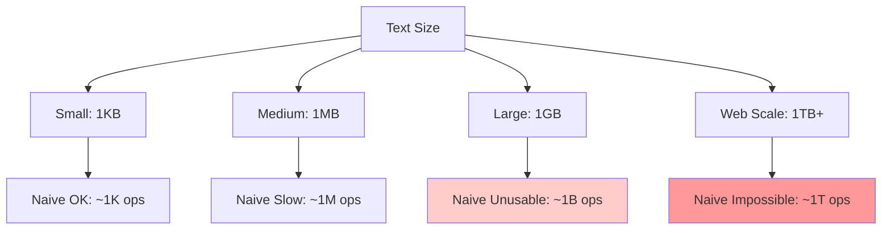
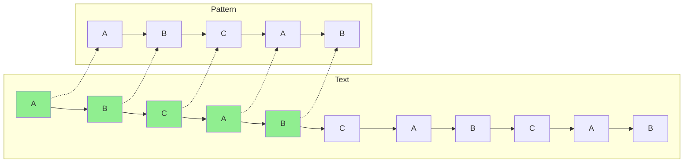
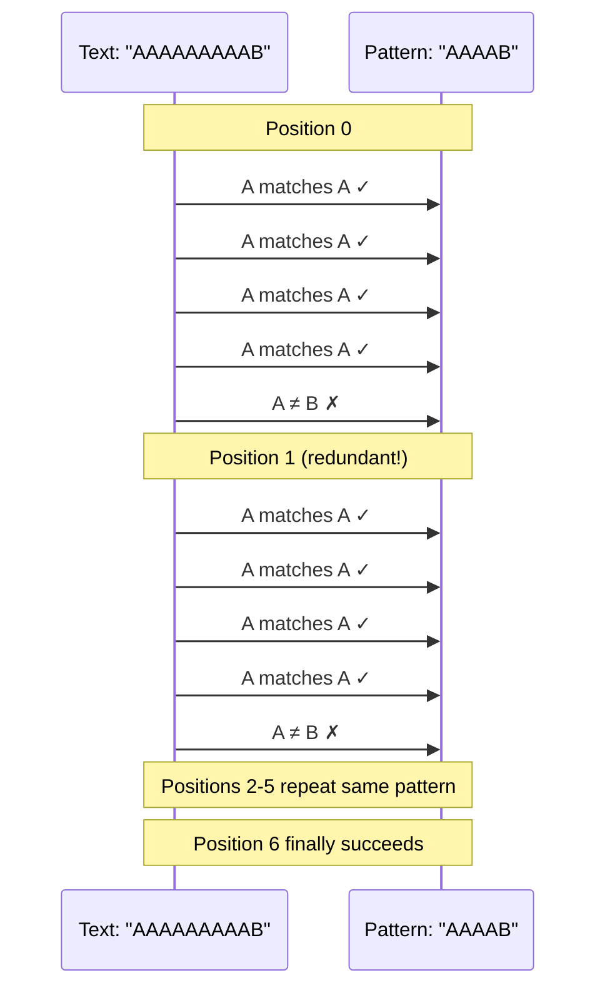

# The Core Problem: Finding Needles in Haystacks

## What Are We Really Trying to Do?

Imagine you're reading a book and need to find every occurrence of the word "pattern." You could start at the beginning and check every position: does "pattern" start here? What about here? This is string matching—the fundamental problem of finding all occurrences of a pattern within a text.

At its core, string matching is about **search efficiency**. The naive approach requires checking every position in the text, which takes O(nm) time where n is the text length and m is the pattern length. For a 1000-character text and 10-character pattern, that's potentially 10,000 character comparisons.

## The Scale of the Problem



## Why This Problem Matters

String matching is the invisible foundation of modern computing:

### Search Engines
- **Google**: Processes 8.5 billion searches daily
- **Challenge**: Finding keywords in 130 trillion web pages
- **Impact**: Millisecond delays cost billions in revenue

### Text Editors & IDEs
- **VS Code**: Syntax highlighting in real-time
- **Challenge**: Pattern matching while typing
- **Impact**: Developer productivity depends on responsiveness

### Bioinformatics
- **DNA Analysis**: Finding genetic sequences in 3.2 billion base pairs
- **Challenge**: Matching patterns in biological data
- **Impact**: Medical discoveries and drug development

### Network Security
- **Intrusion Detection**: Scanning network traffic for threats
- **Challenge**: Real-time pattern matching at gigabit speeds
- **Impact**: Protecting against cyber attacks

### Compilers
- **Lexical Analysis**: Recognizing keywords and operators
- **Challenge**: Parsing millions of lines of code
- **Impact**: Build time and developer experience

## The Fundamental Challenge

The challenge isn't just finding patterns—it's finding them **efficiently**. Consider searching for "ABCAB" in "ABCABCABCAB":



When we find a mismatch, the naive approach starts over from the next position. But what if we could use information about what we've already matched to skip ahead intelligently?

## The Redundancy Problem Visualized



## The Computational Complexity Problem

The naive string matching algorithm has a worst-case time complexity of O(nm). This becomes prohibitive for large texts or when searching for multiple patterns. The problem is **redundant work**—we're re-examining characters we've already seen.

```mermaid
graph TD
    A[Naive Algorithm] --> B[O(nm) complexity]
    B --> C[10KB text + 10 char pattern]
    C --> D[~100,000 operations]
    
    E[Efficient Algorithm] --> F[O(n + m) complexity]
    F --> G[10KB text + 10 char pattern]
    G --> H[~10,000 operations]
    
    I[Real-world Impact] --> J[1GB file search]
    J --> K[Naive: ~100B operations]
    J --> L[Efficient: ~1B operations]
    
    style A fill:#ffcccc
    style E fill:#ccffcc
    style K fill:#ffcccc
    style L fill:#ccffcc
```

Consider searching for "AAAAB" in "AAAAAAAAAB":
- Position 0: A A A A ≠ B (4 matches, then mismatch)
- Position 1: A A A A ≠ B (4 matches, then mismatch)
- Position 2: A A A A ≠ B (4 matches, then mismatch)
- And so on...

Each attempt processes the same characters repeatedly. This is the inefficiency that sophisticated string matching algorithms solve.

## The Pattern Structure Insight

The breakthrough comes from recognizing that **patterns have internal structure**:

```mermaid
graph TD
    A[Pattern: "ABCAB"] --> B[Prefix: "AB"]
    A --> C[Suffix: "AB"]
    B --> D[Self-similarity detected!]
    C --> D
    
    E[Pattern: "ABCDEF"] --> F[No self-similarity]
    F --> G[Different optimization strategy]
    
    style D fill:#90EE90
    style F fill:#FFE4B5
```

When we fail to match "ABCAB" after matching "ABCA", we notice that:
- We've already seen "AB" at the beginning
- "AB" also appears at the end of our partial match
- We can skip ahead instead of starting over

## What We Need to Solve

1. **Eliminate redundant comparisons**: Don't re-examine characters we've already processed
2. **Preprocess the pattern**: Extract information that helps us skip ahead on mismatches
3. **Maintain linear time complexity**: Achieve O(n + m) performance regardless of pattern structure
4. **Handle multiple patterns**: Scale to searching for many patterns simultaneously

The solution lies in **preprocessing the pattern** to create a "failure function" that tells us how far we can safely skip when a mismatch occurs. This transforms string matching from a brute-force problem into an elegant example of using structural information to eliminate redundant work.

## The Performance Breakthrough

```mermaid
graph LR
    A[Naive Approach] --> B[Check every position]
    B --> C[O(nm) complexity]
    C --> D[Unusable for large texts]
    
    E[Smart Approach] --> F[Analyze pattern structure]
    F --> G[Skip impossible positions]
    G --> H[O(n + m) complexity]
    H --> I[Scales to any size]
    
    style A fill:#ffcccc
    style D fill:#ffcccc
    style E fill:#ccffcc
    style I fill:#ccffcc
```

## The Real-World Impact

Efficient string matching isn't just an academic exercise. The difference between O(nm) and O(n + m) complexity can mean:

- **Google Search**: Returning results in milliseconds vs. minutes
- **VS Code**: Smooth syntax highlighting vs. frozen editor
- **Antivirus**: Real-time protection vs. system slowdown
- **DNA Analysis**: Discoveries in hours vs. months

The core insight is that **patterns have structure**, and by analyzing this structure beforehand, we can search much more efficiently than the naive approach suggests. This is the foundation of modern string matching algorithms.