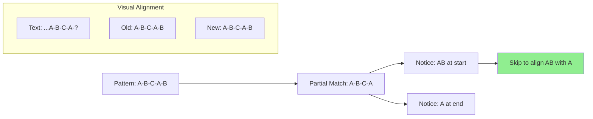
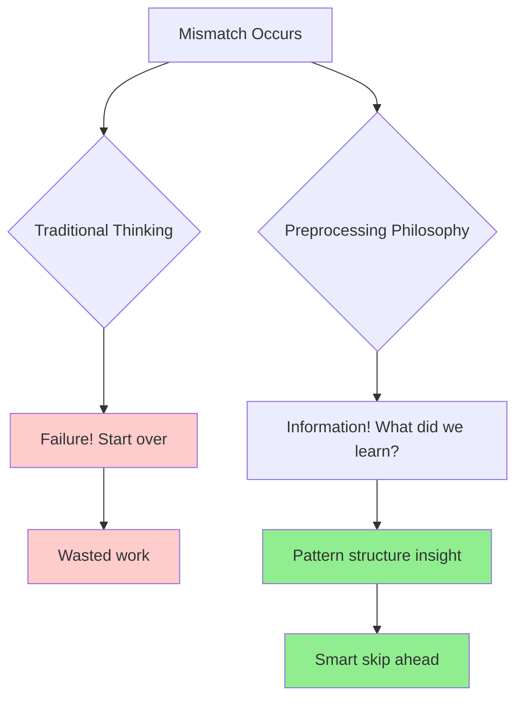
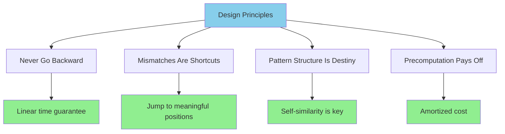
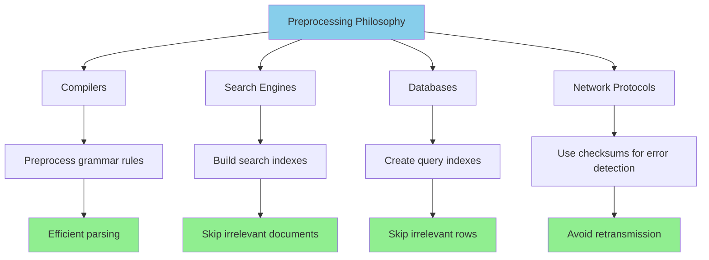
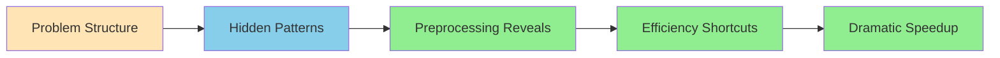
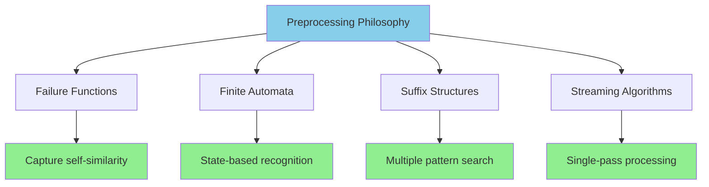

# The Guiding Philosophy: Preprocessing for Efficiency

## The Central Insight

The philosophy behind efficient string matching is simple yet profound: **preprocess the pattern to skip unnecessary comparisons**. Instead of blindly checking every position, we analyze the pattern's structure to determine where we can safely resume searching after a mismatch.

This represents a fundamental shift from reactive to proactive computation—rather than discovering redundancy during the search, we eliminate it beforehand.

## The Trade-off: Space for Time

Efficient string matching algorithms follow a classic computer science trade-off:

```mermaid
graph TD
    A[Preprocessing Phase] --> B[Analyze Pattern Structure]
    B --> C[Build Failure Function]
    C --> D[O(m) time, O(m) space]
    
    E[Search Phase] --> F[Use Preprocessed Info]
    F --> G[Skip Unnecessary Comparisons]
    G --> H[O(n) time, guaranteed]
    
    I[Amortization] --> J[Multiple Searches]
    J --> K[Preprocessing Cost ÷ Search Count]
    K --> L[Approaches Zero]
    
    style A fill:#FFE4B5
    style E fill:#90EE90
    style I fill:#87CEEB
```

For the Knuth-Morris-Pratt (KMP) algorithm, this means:
- **Preprocessing**: O(m) time to build the failure function
- **Space**: O(m) additional storage for the failure array
- **Search**: O(n) time regardless of pattern complexity

## The Philosophy in Action

Consider searching for "ABCAB" in text. The naive approach treats each character independently:

```mermaid
graph TD
    subgraph "Naive Approach"
        A1[Position 0] --> A2[Check A-B-C-A-B]
        A2 --> A3[Mismatch?]
        A3 --> A4[Move to Position 1]
        A4 --> A5[Check A-B-C-A-B again]
        A5 --> A6[Repeat...]
    end
    
    subgraph "Preprocessing Philosophy"
        B1[Analyze Pattern: ABCAB] --> B2[Find Self-similarity]
        B2 --> B3[AB appears at start and end]
        B3 --> B4[Create Skip Table]
        B4 --> B5[Use during search]
    end
    
    style A3 fill:#ffcccc
    style B2 fill:#90EE90
```



The preprocessing philosophy asks: "What can we learn about 'ABCAB' that helps us search faster?"

**Key insight**: If we match "ABCA" but fail on the final 'B', we don't need to start over. The prefix "AB" appears again within our partial match, so we can align with that instead of starting from scratch.

## The Self-Similarity Discovery



## The Mental Model: Failure as Information

Traditional thinking treats mismatches as failures. The preprocessing philosophy reframes them as **information about where to continue**:



When we fail to match at position i, we don't ask "where do I start over?" but "what did I just learn about the pattern's structure?"

This mental model transforms string matching from a series of independent attempts into a continuous learning process.

## Design Principles



### 1. Never Go Backward
Once we've examined a character in the text, we never need to examine it again. This ensures linear time complexity.

### 2. Mismatches Are Shortcuts
A mismatch doesn't mean starting over—it means jumping to the next meaningful position based on pattern structure.

### 3. Pattern Structure Is Destiny
The efficiency of our search depends entirely on how well we understand the pattern's internal structure, particularly its self-similarity.

### 4. Precomputation Pays Off
For patterns used multiple times (like search engines or syntax highlighting), the preprocessing cost is amortized across many searches.

## The Philosophical Contrast

```mermaid
graph TD
    subgraph "Naive Approach"
        A1[Position Independent] --> A2[Start Over on Mismatch]
        A2 --> A3[O(nm) Complexity]
        A3 --> A4[Reactive Strategy]
    end
    
    subgraph "Preprocessing Philosophy"
        B1[Positions Connected] --> B2[Skip on Mismatch]
        B2 --> B3[O(n + m) Complexity]
        B3 --> B4[Proactive Strategy]
    end
    
    style A3 fill:#ffcccc
    style B3 fill:#90EE90
```

| Naive Approach | Preprocessing Philosophy |
|----------------|-------------------------|
| Each position is independent | Positions are connected by pattern structure |
| Mismatches are failures | Mismatches are information |
| O(nm) because of redundancy | O(n + m) by eliminating redundancy |
| Reactive to mismatches | Proactive about where to continue |

## Real-World Application of the Philosophy

This philosophy extends beyond string matching:



- **Compilers** preprocess grammar rules to parse efficiently
- **Search engines** build indexes to avoid scanning entire documents
- **Databases** create indexes to skip irrelevant rows
- **Network protocols** use checksums to detect errors without retransmission

## The Deeper Lesson

The preprocessing philosophy teaches us that **problem structure often contains the solution**:



By spending time understanding the problem's inherent patterns, we can often achieve dramatic efficiency gains.

In string matching, this means recognizing that patterns aren't just arbitrary sequences of characters—they're structures with internal relationships that we can exploit for faster searching.

## The Algorithmic Implications

This philosophy leads directly to:



1. **Failure functions** that capture pattern self-similarity
2. **Finite automata** that model pattern recognition as state transitions
3. **Suffix structures** that enable multiple pattern searches
4. **Streaming algorithms** that process text in a single pass

## The Transformation

The key insight is that **preprocessing transforms the problem space**:

```mermaid
graph LR
    A[Raw Problem] --> B[Character-by-character search]
    B --> C[O(nm) complexity]
    
    D[Preprocessed Problem] --> E[Structure-guided navigation]
    E --> F[O(n + m) complexity]
    
    G[Transformation] --> H[Analyze pattern structure]
    H --> I[Build guidance system]
    I --> J[Navigate efficiently]
    
    style A fill:#ffcccc
    style C fill:#ffcccc
    style D fill:#90EE90
    style F fill:#90EE90
    style G fill:#87CEEB
```

Instead of searching text character by character, we're navigating a preprocessed structure that guides us to the next meaningful position.

This is the intellectual foundation that makes linear-time string matching not just possible, but inevitable.