# Key Abstractions: The Building Blocks of Efficient Search

## The Pattern: More Than Just a String

In efficient string matching, a **pattern** isn't just a sequence of characters—it's a structure with internal relationships:

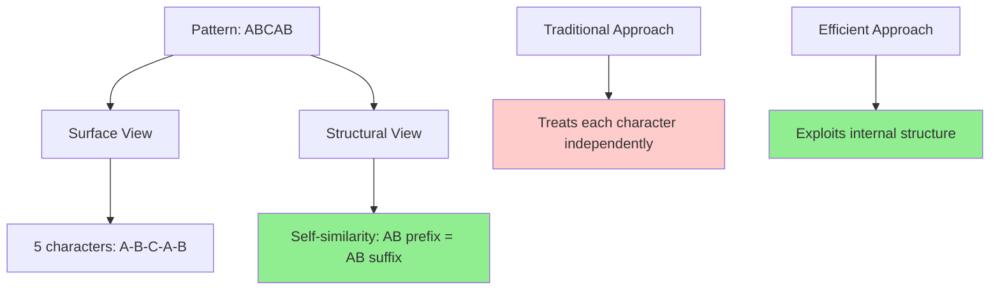

Think of it like a fingerprint: the uniqueness comes not from individual characters but from how they relate to each other.

For the pattern "ABCAB":
- Characters: A, B, C, A, B
- Structure: The prefix "AB" appears again at the end
- This self-similarity is what makes efficient searching possible

## The Text: A Stream of Possibilities

The **text** is our search space, but we don't treat it as a random sequence:

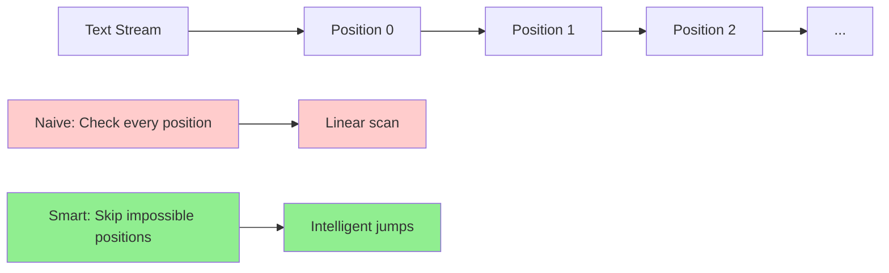

Instead, we view it as a stream where each position is a potential match starting point. The key insight is that we can move through this stream intelligently, skipping positions that can't possibly match based on what we've already seen.

## The Failure Function: The Heart of Efficiency

The **failure function** (or **prefix function**) is the most important abstraction in string matching. It answers the question: "If I fail to match at position i in the pattern, where should I try next?"

### The Analogy: Reading a Book

Imagine you're looking for the word "banana" in a book. You start reading "ban..." and then see "d" instead of "a". The naive approach would start over from the next position. But you're smart—you remember that "ban" doesn't appear within itself, so you can skip ahead.

But what if you were searching for "bababa"? If you read "babab" and then see "c" instead of "a", you notice that "bab" appears within your partial match. You can align with that instead of starting over.

### The Mathematical Definition

For a pattern P of length m, the failure function f(i) is defined as:
- f(i) = length of the longest proper prefix of P[0...i] that is also a suffix of P[0...i]

This sounds complex, but it's just capturing pattern self-similarity.

For "ABCAB":
- f(0) = 0 (single character has no proper prefix)
- f(1) = 0 ("AB" has no self-similarity)
- f(2) = 0 ("ABC" has no self-similarity)
- f(3) = 1 ("ABCA" - the prefix "A" matches the suffix "A")
- f(4) = 2 ("ABCAB" - the prefix "AB" matches the suffix "AB")

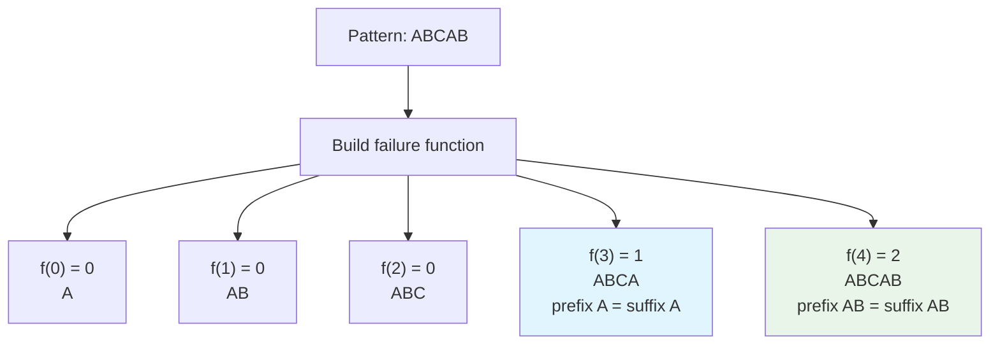

### Visualizing Self-Similarity

The failure function captures the pattern's **self-similarity** - where parts of the pattern repeat within itself:

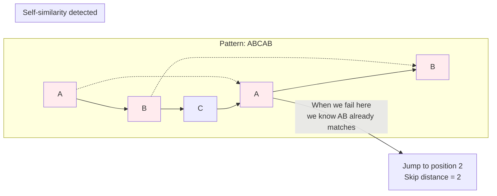

## The State Machine Perspective

We can think of pattern matching as a **finite automaton** where:
- Each state represents how many characters we've successfully matched
- Transitions represent successful character matches
- Failure transitions (using the failure function) represent what to do on mismatches

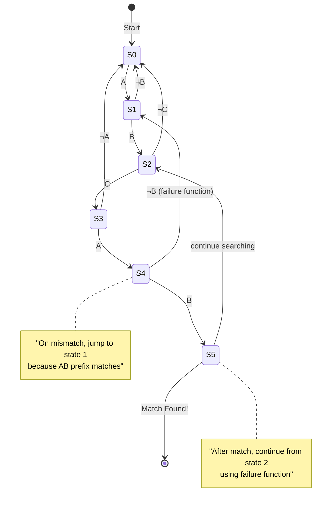

### The Smart Transitions

The key insight is in the **failure transitions**. When we mismatch, we don't go back to the start - we jump to the right state based on what we've already matched:

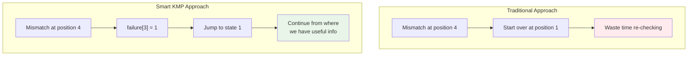

## The Skip Distance: Jumping Forward

The **skip distance** is how far we can jump forward when we encounter a mismatch. This is calculated using the failure function:

```
skip_distance = matched_length - failure_function[matched_length - 1]
```

This abstraction transforms string matching from a character-by-character crawl into intelligent leaps through the text.

### Skip Distance Visualization

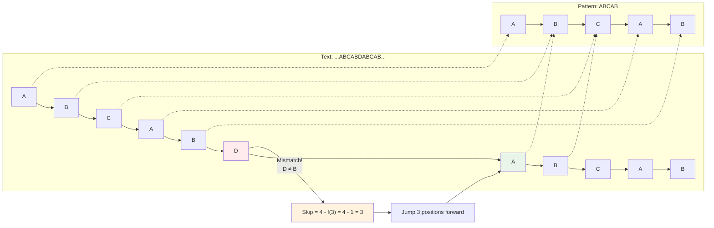

### Why This Works: The Mathematical Insight

The skip distance works because of a profound mathematical property:

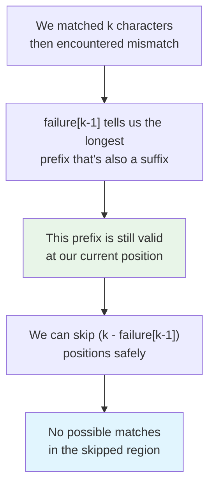

## The Preprocessing Phase vs. Search Phase

Efficient string matching separates into two distinct phases:

### Preprocessing Phase
- **Input**: The pattern P
- **Output**: The failure function array
- **Time**: O(m) where m is pattern length
- **Purpose**: Analyze pattern structure to enable efficient searching

### Search Phase
- **Input**: The text T and preprocessed pattern information
- **Output**: All match positions
- **Time**: O(n) where n is text length
- **Purpose**: Use preprocessed information to search efficiently

## The Amortization Principle

The preprocessing cost is **amortized** across multiple searches. If you're searching for the same pattern in multiple texts (like a search engine), the preprocessing cost becomes negligible.

### Amortization Visualization

```mermaid
gantt
    title Cost Amortization Over Multiple Searches
    dateFormat X
    axisFormat %s
    
    section Single Search
    Preprocessing    :active, prep1, 0, 1
    Search          :search1, after prep1, 3
    
    section Multiple Searches
    Preprocessing    :active, prep2, 0, 1
    Search 1        :search2, after prep2, 3
    Search 2        :search3, after search2, 3
    Search 3        :search4, after search3, 3
    Search 4        :search5, after search4, 3
    Search 5        :search6, after search5, 3
```

**Key Insight**: The O(m) preprocessing cost becomes O(m/k) per search when searching k different texts, making it effectively free for applications like search engines or text editors.

## Real-World Abstractions

### The Editor's Find Function
When you press Ctrl+F in a text editor, the editor:
1. Preprocesses your search pattern
2. Maintains state as you type additional characters
3. Jumps efficiently through the document

### The Compiler's Lexer
Programming language compilers use similar abstractions to:
1. Recognize keywords and operators
2. Skip through whitespace efficiently
3. Handle complex token patterns

### The Network Scanner
Security tools use these abstractions to:
1. Preprocess malicious patterns
2. Scan network traffic in real-time
3. Detect multiple threats simultaneously

## The Mental Model: Pattern as a Guide

The key abstraction is thinking of the pattern not as a target, but as a **guide** that tells us how to navigate the text efficiently. The pattern's structure becomes a roadmap for efficient searching.

When we preprocess a pattern, we're essentially asking: "What shortcuts does this pattern's structure allow?" The failure function captures these shortcuts in a form that can be used during the search.

## The Efficiency Transformation

These abstractions transform string matching from:
- **Brute force**: Check every position independently
- **Smart search**: Use pattern structure to skip impossible positions

The result is a algorithm that's both elegant and efficient, turning a potentially quadratic problem into a linear one through the power of abstraction and preprocessing.

### The Complexity Transformation

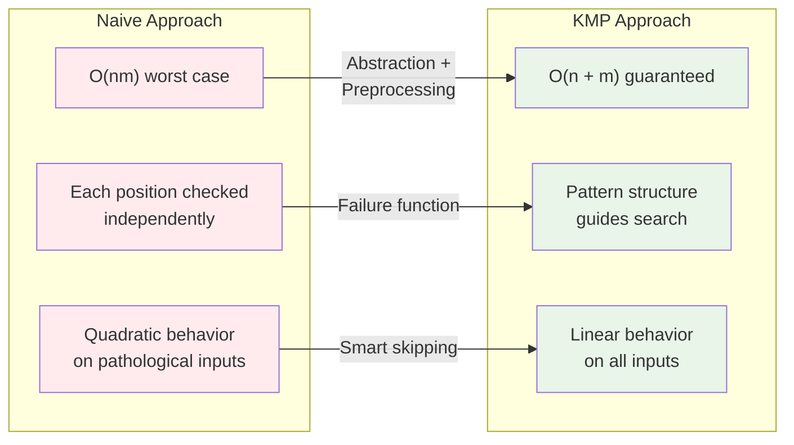

### Real-World Impact

This efficiency transformation has profound implications:

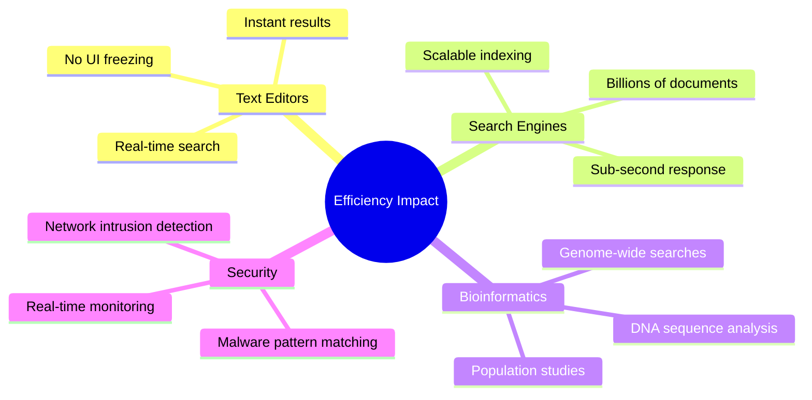

## The Philosophical Insight

The key abstractions reveal a deeper truth about algorithm design: **structure is information**. By analyzing the pattern's internal structure during preprocessing, we extract information that guides the search process. This transforms string matching from a brute-force exploration into an informed navigation.

The failure function isn't just a technical detail - it's a **compressed representation** of the pattern's self-similarity, enabling us to make intelligent decisions during the search. This principle applies broadly in computer science: preprocessing to extract structure often leads to more efficient algorithms.