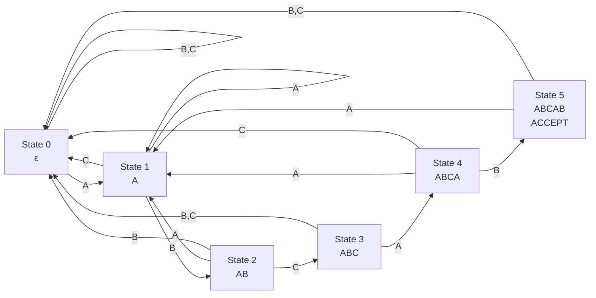
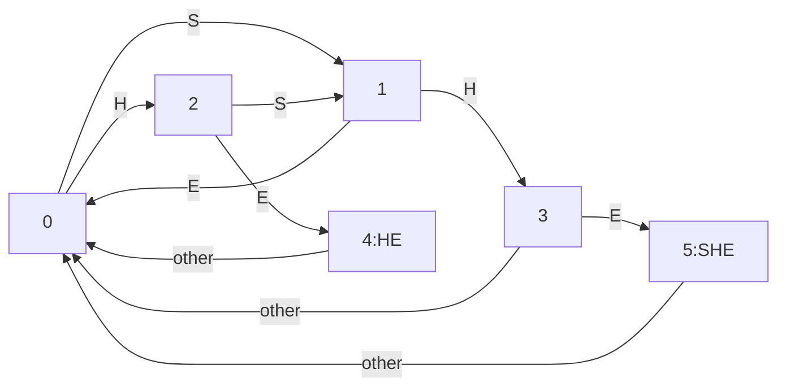

# The Finite Automata Approach: String Matching as State Machines

## Reframing the Problem

The finite automata approach to string matching represents a profound shift in perspective. Instead of thinking about characters and positions, we think about **states** and **transitions**. Each state represents how much of the pattern we've successfully matched, and transitions represent the next character we encounter.

This isn't just a different implementation—it's a different way of understanding what string matching fundamentally is.

## The Mental Model: A Recognition Machine

Imagine building a machine that recognizes the pattern "ABCAB". This machine has states representing partial matches:

- **State 0**: Haven't matched anything yet
- **State 1**: Matched "A"
- **State 2**: Matched "AB"
- **State 3**: Matched "ABC"
- **State 4**: Matched "ABCA"
- **State 5**: Matched "ABCAB" (accepting state)

The machine processes one character at a time, transitioning between states based on what it sees.

## Constructing the Automaton

### The States

For a pattern P of length m, we create m+1 states:
- State 0: Empty match (start state)
- State i (1 ≤ i ≤ m): Matched first i characters of P
- State m: Full match (accepting state)

### The Transitions

From each state, we need to define where to go for every possible input character:

1. **Success transitions**: If we're in state i and see P[i], go to state i+1
2. **Failure transitions**: If we're in state i and see any other character, go to the appropriate state based on the longest prefix-suffix match

## Building the Automaton for "ABCAB"



## The Transition Function

The transition function δ(state, character) tells us which state to move to:

```python
def build_transition_table(pattern):
    m = len(pattern)
    alphabet = set(pattern)  # Can be expanded to full alphabet
    
    # Initialize transition table
    delta = {}
    
    for state in range(m + 1):
        for char in alphabet:
            delta[(state, char)] = compute_next_state(pattern, state, char)
    
    return delta

def compute_next_state(pattern, state, char):
    """Compute the next state given current state and input character"""
    if state < len(pattern) and pattern[state] == char:
        return state + 1
    
    # Find the longest prefix of pattern that is also a suffix of pattern[0:state] + char
    for i in range(state, 0, -1):
        if pattern[0:i] == (pattern[0:state] + char)[-i:]:
            return i
    
    return 0
```

## The Equivalence to KMP

The finite automaton approach is mathematically equivalent to KMP, but provides different insights:

| KMP Perspective | Automaton Perspective |
|----------------|----------------------|
| Failure function | Transition function |
| Skip on mismatch | State transition |
| Pattern matching | String recognition |
| Preprocessing | Automaton construction |

## Advantages of the Automaton View

### 1. Conceptual Clarity
The automaton makes the algorithm's behavior explicit. Each state represents a specific partial match, making it easier to understand and debug.

### 2. Multiple Pattern Matching
Automata can be easily extended to match multiple patterns simultaneously using techniques like the Aho-Corasick algorithm.

### 3. Streaming Processing
The automaton naturally handles streaming input—you don't need to store the entire text in memory.

### 4. Hardware Implementation
Finite automata can be implemented directly in hardware, making them suitable for high-speed network processing.

## The Aho-Corasick Extension

The real power of the automaton approach becomes apparent when matching multiple patterns. The Aho-Corasick algorithm builds a single automaton that can match many patterns simultaneously.

Consider matching both "SHE" and "HE" in the text "USHERS":



This single automaton can detect both patterns in one pass through the text.

## Implementation: The Automaton Runner

```python
def automaton_search(text, pattern):
    """Search using finite automaton approach"""
    
    # Build transition table
    delta = build_transition_table(pattern)
    m = len(pattern)
    
    state = 0
    matches = []
    
    for i, char in enumerate(text):
        # Transition to next state
        if (state, char) in delta:
            state = delta[(state, char)]
        else:
            state = 0  # Go to start state for unrecognized characters
        
        # Check if we've reached accepting state
        if state == m:
            matches.append(i - m + 1)
            # Continue searching (don't reset to 0)
            # Use failure function to determine next state
            state = get_failure_state(pattern, state)
    
    return matches

def get_failure_state(pattern, state):
    """Equivalent to failure function in KMP"""
    # This is where the automaton and KMP converge
    # We need to find the longest prefix-suffix match
    failure = build_failure_function(pattern)
    return failure[state - 1]
```

## Time and Space Complexity

- **Construction**: O(m³|Σ|) naive, O(m|Σ|) optimized
- **Search**: O(n) exactly—each character causes exactly one transition
- **Space**: O(m|Σ|) for the transition table

Where |Σ| is the size of the alphabet.

## Mental Model: The Pattern as a Language

The automaton approach views the pattern as defining a **language**—the set of all strings that contain the pattern as a substring. The automaton is a recognizer for this language.

This perspective connects string matching to:
- **Compiler design**: Lexical analysis uses similar automata
- **Regular expressions**: Pattern matching is recognizing regular languages
- **Network protocols**: Protocol state machines work similarly

## Real-World Applications

### Network Intrusion Detection
Systems like Snort use automata to match multiple attack signatures simultaneously in network traffic.

### DNA Sequence Analysis
Bioinformatics tools use automata to find multiple gene sequences in DNA strings.

### Text Processing
Search engines and text editors use automata-based approaches for complex pattern matching.

## The Deep Insight

The finite automaton approach reveals that string matching is fundamentally about **state management**. We're not just comparing characters—we're maintaining a precise understanding of our progress toward a match.

This insight generalizes to many other algorithms:
- **Parsing**: Tracking syntactic structure
- **Compression**: Maintaining dictionary state
- **Cryptography**: Managing cipher state

The automaton view transforms string matching from a character-processing problem into a state-machine problem, opening up new possibilities for optimization and generalization.

## The Theoretical Foundation

The automaton approach provides the theoretical foundation for understanding why string matching can be done in linear time. The key insight is that we can precompute all possible states and transitions, allowing us to process each character in constant time.

This connects string matching to the broader theory of formal languages and automata, showing that efficient string matching is not just a clever trick, but a fundamental property of how finite automata recognize regular languages.