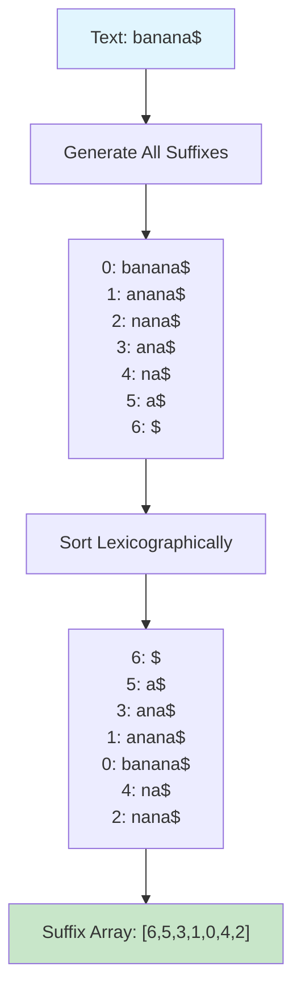

# The Core Problem: Finding Patterns in Text at Scale

## The String Search Challenge

Imagine you're building the next Google, and you need to search through billions of web pages for specific phrases. Or you're developing a DNA analysis tool that must find genetic patterns in sequences containing millions of base pairs. At the heart of these challenges lies a fundamental problem: **how do you efficiently find all occurrences of a pattern within a large text?**

The naive approach—scanning through the text character by character—becomes prohibitively slow when dealing with massive datasets. This is where suffix arrays shine, providing a elegant solution that transforms an O(nm) problem into an O(m log n) search operation.

```mermaid
graph TB
    A[Large Text Database] --> B{Search Strategy?}
    B -->|Naive Scan| C[O(nm) per query]
    B -->|Suffix Array| D[O(m log n) per query]
    
    C --> E[Impractical for<br/>large datasets]
    D --> F[Scalable solution]
    
    style C fill:#ffcccc
    style D fill:#ccffcc
    style E fill:#ffcccc
    style F fill:#ccffcc
```

## Why Simple String Searching Falls Short

Consider searching for the pattern "ATCG" in a DNA sequence:

```
Text: GATCGATCGATCGCGATCG...
Pattern: ATCG
```

### The Naive Approach
```python
def naive_search(text, pattern):
    positions = []
    for i in range(len(text) - len(pattern) + 1):
        if text[i:i+len(pattern)] == pattern:
            positions.append(i)
    return positions
```

**Time Complexity**: O(nm) where n is text length, m is pattern length
**Space Complexity**: O(1)

For a single search, this might be acceptable. But what happens when you need to:
- Search for thousands of different patterns in the same text?
- Find patterns with wildcards or variations?
- Support complex queries like "find all overlapping patterns"?

The naive approach becomes impractical. Each search requires scanning the entire text again.

## The Preprocessing Insight

The key insight is **preprocessing**: instead of repeatedly scanning the text for different patterns, we can preprocess the text once to enable fast searches for any pattern.

Think of it like creating an index for a book. You spend time upfront organizing all the information, but then finding any topic becomes lightning-fast.

## Traditional Solutions and Their Limitations

### Suffix Trees: Powerful but Memory-Hungry
Suffix trees solve the pattern matching problem elegantly:
- **Search time**: O(m) for pattern of length m
- **Space complexity**: O(n) but with a large constant factor (20-50 bytes per character)
- **Construction time**: O(n) with complex algorithms

```
For "banana":
         root
        /    \
    "a"      "banana"
   /   \        |
"na"  "naNA"   ε
 |      |
"na"   "na"
 |      |
 ε      ε
```

**The problem**: Suffix trees are memory-intensive. A 1GB text file might require 20-50GB of RAM for its suffix tree. This makes them impractical for large-scale applications.

### Hash Tables: Fast but Limited
Hash-based approaches can achieve O(1) average search time but have significant drawbacks:
- **Space overhead**: Often 2-4x the original text size
- **Poor worst-case performance**: O(n) when hash collisions occur
- **Limited pattern matching**: Difficult to support range queries or pattern variations

## The Suffix Array Solution

Suffix arrays provide the perfect middle ground:
- **Search time**: O(m log n) for pattern of length m
- **Space complexity**: O(n) with a small constant factor (4-8 bytes per character)
- **Construction time**: O(n log n) with straightforward algorithms
- **Versatility**: Supports complex pattern matching operations

### What is a Suffix Array?

A suffix array is simply **an array of integers that represent the starting positions of all suffixes of a text, sorted in lexicographical order**.

For the text "banana$" (where $ is a sentinel character):



The suffix array [6, 5, 3, 1, 0, 4, 2] tells us the order of suffixes when sorted alphabetically.

**Key insight**: This simple array of positions contains all the information needed to perform lightning-fast pattern searches!

## Why Suffix Arrays Are Game-Changers

### 1. **Memory Efficiency**
Unlike suffix trees with their complex node structures and pointers, suffix arrays store only integers. For a text of n characters:
- **Suffix tree**: ~40n bytes
- **Suffix array**: ~4n bytes (10x smaller!)

### 2. **Cache-Friendly**
Arrays have excellent spatial locality compared to tree structures. When searching, you access consecutive memory locations, making efficient use of CPU caches.

### 3. **Simple Implementation**
No complex tree rotations or balancing operations. The core operations are array indexing and binary search—concepts every programmer understands.

### 4. **Versatile Pattern Matching**
Once built, a suffix array enables:
- **Exact pattern matching**: O(m log n)
- **Range queries**: Find all patterns in a lexicographical range
- **Longest common substring**: Between any two suffixes
- **Pattern counting**: How many times does a pattern occur?

## Real-World Applications

### Bioinformatics
DNA and protein sequence analysis requires finding patterns in sequences millions of characters long. Suffix arrays enable:
- **Gene finding**: Locate specific DNA patterns
- **Sequence alignment**: Compare multiple genetic sequences
- **Motif discovery**: Find repeated patterns across sequences

### Text Processing
- **Full-text search engines**: Index web pages for fast keyword searches
- **Plagiarism detection**: Find common text patterns between documents
- **Data compression**: Identify repeated substrings for compression algorithms

### String Algorithms Research
Suffix arrays serve as building blocks for advanced string algorithms:
- **Burrows-Wheeler Transform**: Used in data compression
- **Longest Common Substring**: Find similarities between texts
- **Suffix array construction**: Itself an active area of research

## The Trade-off Landscape

Suffix arrays represent a sweet spot in the trade-off between time, space, and implementation complexity:

```
Method          | Search Time | Space    | Implementation
----------------|-------------|----------|---------------
Naive           | O(nm)       | O(1)     | Trivial
Suffix Tree     | O(m)        | O(n) *40 | Complex
Suffix Array    | O(m log n)  | O(n) *4  | Moderate
Hash Table      | O(m) avg    | O(n) *8  | Moderate
```

## Looking Ahead: The Construction Challenge

While suffix arrays offer excellent search performance and reasonable space usage, there's one significant challenge: **how do you build them efficiently?**

The naive approach of generating all suffixes, sorting them, and extracting positions takes O(n² log n) time—too slow for large texts. The fascinating world of linear-time suffix array construction algorithms (like SA-IS, DC3) represents some of the most elegant algorithmic engineering in computer science.

But before diving into those complexities, let's first understand the fundamental principles that make suffix arrays work. The beauty lies not just in the final data structure, but in the simple yet powerful idea of **turning string searching into array searching**.

## The Core Insight

The revolutionary insight of suffix arrays is transforming the problem of "finding patterns in strings" into "finding ranges in sorted arrays." This transformation unlocks the power of binary search and brings the full toolkit of array-based algorithms to bear on string problems.

When you understand this fundamental shift in perspective, you'll see why suffix arrays have become indispensable tools in the modern programmer's arsenal for text processing at scale.