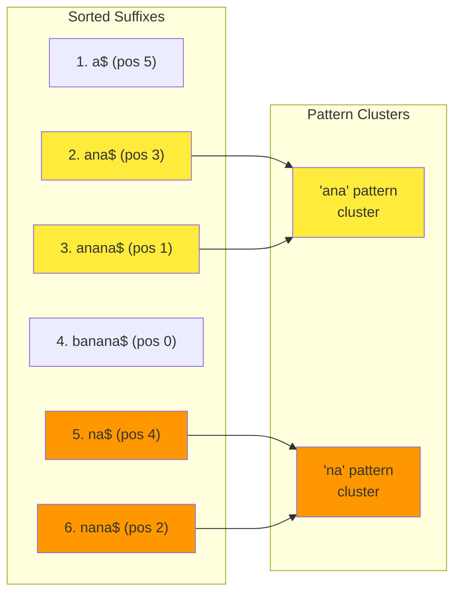
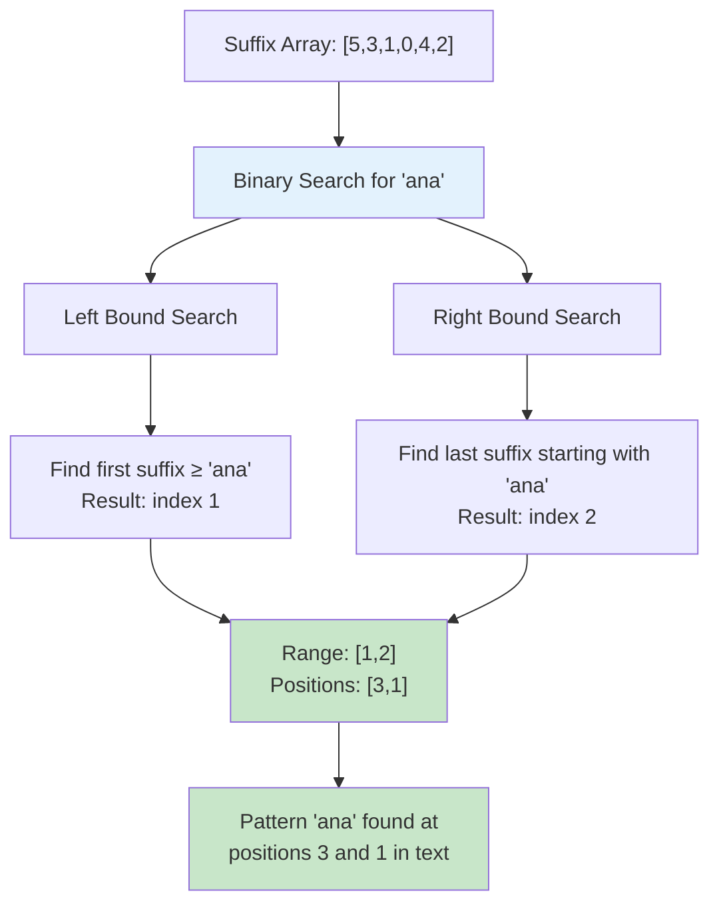

# The Guiding Philosophy: Sort Once, Search Forever

## The Central Insight: Lexicographical Order is Power

The fundamental philosophy behind suffix arrays is elegantly simple: **if we sort all possible suffixes of a text once, we can find any pattern efficiently using binary search**. This transforms the problem from "scanning text for patterns" to "finding ranges in a sorted array."

Think of it like organizing a massive library. Instead of searching shelf by shelf every time someone asks for a book, you create a comprehensive catalog sorted alphabetically. Finding any book then becomes a simple lookup operation.

## The Sorting Philosophy

### Why Suffixes?
A **suffix** is simply a substring that extends from some position to the end of the text. For the text "banana":

```
Position 0: "banana"  (suffix starting at position 0)
Position 1: "anana"   (suffix starting at position 1)  
Position 2: "nana"    (suffix starting at position 2)
Position 3: "ana"     (suffix starting at position 3)
Position 4: "na"      (suffix starting at position 4)
Position 5: "a"       (suffix starting at position 5)
```

**Key insight**: Every substring of the text is a prefix of some suffix. So if we want to find the pattern "ana", we look for suffixes that start with "ana".

### The Power of Lexicographical Ordering

When we sort suffixes alphabetically (lexicographically), patterns cluster together:



Notice how all suffixes starting with "ana" are grouped together in positions 2-3 of the sorted list. This clustering is what makes binary search possible.

**The magic**: Lexicographical ordering naturally creates **pattern ranges** in the sorted suffix array!

## From Strings to Integers: The Array Abstraction

Instead of storing the actual suffix strings (which would be memory-intensive), we store only their **starting positions**:

```
Suffix Array: [5, 3, 1, 0, 4, 2]
               |  |  |  |  |  |
               a  ana anana banana na nana
```

This array of integers represents the sorted order of suffixes without storing the suffixes themselves. The original text serves as our reference for reconstructing any suffix when needed.

## The Binary Search Philosophy

Once we have sorted positions, finding a pattern becomes a standard binary search problem:

### Finding the Pattern Range
To find pattern "ana" in our suffix array:

1. **Find the leftmost position** where a suffix could start with "ana"
2. **Find the rightmost position** where a suffix could start with "ana"  
3. **All positions in between** represent occurrences of the pattern



**The beauty**: Pattern search becomes **range finding** in a sorted array!

### The Beauty of Range Queries

This approach naturally supports various types of queries:

**Exact Match**: Find all occurrences of "ana"
**Prefix Match**: Find all words starting with "ban"  
**Range Queries**: Find all strings between "apple" and "banana"
**Count Queries**: How many times does "ana" appear?

All of these reduce to finding ranges in the sorted suffix array.

## The Preprocessing Philosophy: Pay Once, Query Forever

The suffix array philosophy embraces **preprocessing overhead** for **query efficiency**:

### Construction Phase (One-time Cost)
```
Input:  "banana"
Step 1: Generate all suffixes
Step 2: Sort suffixes lexicographically  
Step 3: Extract starting positions
Output: Suffix Array [5, 3, 1, 0, 4, 2]
```

**Time**: O(n log n) to O(n) depending on algorithm
**Space**: O(n) for the suffix array

### Query Phase (Repeated Benefit)
```
For any pattern P of length m:
Step 1: Binary search for leftmost occurrence  
Step 2: Binary search for rightmost occurrence
Step 3: Report all positions in range
```

**Time**: O(m log n) per query
**Space**: O(1) additional space

## The Comparison Philosophy: Lexicographical Order

Understanding how suffixes are compared is crucial to understanding suffix arrays.

### Character-by-Character Comparison
```python
def compare_suffixes(text, pos1, pos2):
    i, j = pos1, pos2
    while i < len(text) and j < len(text):
        if text[i] < text[j]:
            return -1  # suffix at pos1 comes first
        elif text[i] > text[j]:
            return 1   # suffix at pos2 comes first
        i += 1
        j += 1
    
    # One suffix is a prefix of the other
    if i == len(text):
        return -1  # shorter suffix comes first
    else:
        return 1
```

### Example Comparison
```
Comparing suffixes of "banana":
"ana" vs "anana":
- 'a' == 'a': continue
- 'n' == 'n': continue  
- 'a' == 'a': continue
- "ana" ends, "anana" continues
- Shorter suffix "ana" comes first
```

## The Sentinel Philosophy: Boundary Handling

Most suffix array implementations append a sentinel character (often '$' or '\0') that is lexicographically smaller than all other characters:

```
Text: "banana$"
Suffixes:
0: "banana$"
1: "anana$"  
2: "nana$"
3: "ana$"
4: "na$"
5: "a$"
6: "$"
```

**Benefits of the sentinel**:
1. **Ensures deterministic ordering**: All suffixes have different lengths
2. **Simplifies comparisons**: No need for special end-of-string logic
3. **Enables linear-time algorithms**: Some construction algorithms require it

## The Space-Time Philosophy: Intelligent Trade-offs

Suffix arrays embody a philosophy of intelligent trade-offs:

### Compared to Naive Search
- **Space**: O(n) vs O(1) — We use more space
- **Time**: O(m log n) vs O(nm) — We save dramatically on time
- **Preprocessing**: O(n log n) vs O(1) — We invest in preprocessing

### Compared to Suffix Trees
- **Space**: O(n) vs O(n) — Same complexity, much better constants
- **Time**: O(m log n) vs O(m) — Slightly slower queries
- **Implementation**: Simple vs Complex — Much easier to implement

### The Sweet Spot
Suffix arrays hit the "sweet spot" for most practical applications:
- **Good enough performance** for search queries
- **Reasonable memory usage** even for large texts
- **Simple enough** to implement correctly
- **Flexible enough** to support various query types

## The Incremental Philosophy: Build on Simple Concepts

The beauty of suffix arrays lies in how they build on fundamental concepts every programmer knows:

1. **Arrays**: Simple, cache-friendly data structure
2. **Sorting**: Well-understood problem with many efficient algorithms
3. **Binary Search**: Logarithmic search in sorted data
4. **String Comparison**: Lexicographical ordering

No exotic data structures or complex pointer manipulations. Just these simple concepts combined in a powerful way.

## The Extensibility Philosophy: Beyond Basic Search

Once you have a suffix array, you unlock a universe of advanced string algorithms:

### Enhanced Data Structures
- **LCP Array**: Longest Common Prefix between adjacent suffixes
- **BWT**: Burrows-Wheeler Transform for compression
- **Range Trees**: For 2D pattern matching

### Advanced Queries
- **Approximate Matching**: Find patterns with errors
- **Weighted Patterns**: Search with character preferences
- **Streaming Search**: Process text as it arrives

### Applications
- **Data Compression**: Find repeated substrings efficiently
- **Bioinformatics**: Analyze DNA/protein sequences
- **Information Retrieval**: Build search engines

## The Philosophy in Practice: Design Principles

When implementing suffix arrays, the philosophy translates to concrete design principles:

### 1. **Simplicity First**
Start with the O(n² log n) naive construction algorithm. Optimize only when needed.

### 2. **Memory Efficiency**  
Store only essential information. The suffix array itself plus the original text.

### 3. **Query Flexibility**
Design your interface to support various query types, not just exact matching.

### 4. **Incremental Complexity**
Build advanced features (LCP arrays, enhanced searches) on top of the basic suffix array.

### 5. **Practical Performance**
Focus on real-world performance, not just asymptotic complexity. Cache-friendly access patterns matter.

## The Zen of Suffix Arrays

At its core, the suffix array philosophy embodies a zen-like simplicity:

**"Sort all suffixes once, and the text reveals all its patterns through binary search."**

This simple idea—that sorting creates order, and order enables efficient search—is profound in its implications. It transforms one of the most fundamental problems in computer science (pattern matching) into a solved problem using the most fundamental tools in computer science (arrays and binary search).

The result is a data structure that is simultaneously:
- **Theoretically sound** (optimal space, near-optimal time)
- **Practically efficient** (cache-friendly, simple operations)
- **Conceptually elegant** (builds on familiar primitives)
- **Broadly applicable** (enables advanced string algorithms)

This philosophy of "elegant simplicity that scales" is what makes suffix arrays not just a clever algorithm, but a fundamental tool in the modern programmer's toolkit.